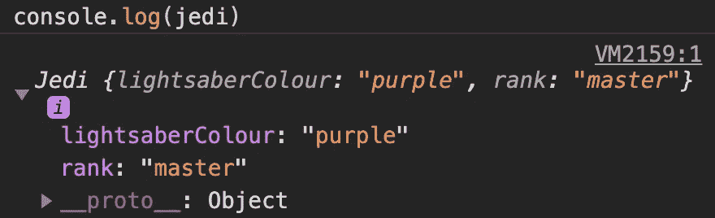

# JS 中的绑定解释

> 原文：<https://medium.com/codex/binding-in-js-explained-4a2481a0b01a?source=collection_archive---------3----------------------->

## [法典](http://medium.com/codex)


在我的上一篇关于原型链的文章中，我非常简要地提到了`this`关键词和绑定——现在是时候给予我们充分的关注了。

这是 JavaScript 中比较令人困惑的领域之一，所以请确保您的思考帽就在附近，坐下来让我们开始吧。

为了真正理解`this`的行为，我们需要注意 4 个**绑定规则**。

作为一个快速概述，以下是它们的升序排列(从低到高):

*   默认绑定
*   隐式结合
*   显式绑定
*   新绑定

现在，对于主菜🥗…

# 默认绑定

当其他绑定规则都不适用时，默认绑定基本上是包罗万象的——当我们查看其他规则时，这将更容易识别。

使用默认绑定，`this`被绑定到全局对象。举以下例子:

当我们调用`sayHello`时，你可能会惊讶地看到`'hello there'`被打印出来。

我甚至不感到抱歉

实际情况是这样的:

1.  我们声明函数`sayHello`，它只是记录`this.hello`
2.  我们将字符串“hello there”赋给全局范围内的`hello`变量
3.  当我们调用`sayHello()`时，`this`被绑定到全局对象，因为它是全局范围内的一个普通的旧函数调用，所以没有其他绑定规则适用。因为我们已经在全局对象上定义了`hello`变量，`this.hello`解析了它。

现在，你可能会想，如果我们删除`this`并简单地记录`hello`变量，由于你可能已经熟悉的词法范围的规则，你可能会期待‘hello there！’待印刷。

这让我想到了非常重要的一点:

**词法范围和绑定上下文完全不相关！**

为了演示，让我们稍微修改一下第一个例子:

如果词法范围的规则适用于`this`，您可能会期望`this.response`等于`'general kenobi!’`。然而，因为它们是完全不同的概念`this.response`实际上是未定义的。

这是一个非常基本的例子，大多数 IDE 和文本编辑器都足够聪明，可以突出显示出`response`变量没有被使用，但是你已经明白了。

这也是确切的原因，在 Node.js 中复制这种行为略有不同！

假设这段代码保存在`index.js`中，并且您使用`node index.js`运行它——由于 node 的内部原因，文件的顶层范围并不像您预期的那样是全局的。`index.js`被节点包装，节点将全局范围移动到更高的级别，在文件之外——所以`this`仍然绑定到全局对象，但是`hello`没有在全局对象上设置。这就是为什么我们需要在示例中的`global`对象上显式设置`hello`。

为简单起见，本文中的后续示例将假设它们正在浏览器中运行。

## “随它去吧

现在我已经把甲壳虫乐队印在了你的脑海里，这让我想到了一个旁注:

如果我们在浏览器中尝试同样的例子，在 ES6 中用关键字`let`替换`var`，我们会得到`undefined`。摘自 MDN 的这篇文章解释了原因:

> 就像`[const](https://developer.mozilla.org/en-US/docs/Web/JavaScript/Reference/Statements/const#description)`一样，`let`在全局声明时*不会*创建`[window](https://developer.mozilla.org/en-US/docs/Web/API/Window)`对象的属性(在最顶层的作用域中)。

## 严格模式

通过将`'use strict'`作为代码中的第一条语句，JavaScript 代码可以在严格模式下运行。

让我们修改前面的示例，使用严格模式来演示不同之处:

将它粘贴到浏览器的开发工具中，您会得到以下错误:

```
VM149:4 Uncaught TypeError: Cannot read property 'hello' of undefined
    at demoDefaultScope (<anonymous>:4:22)
    at <anonymous>:9:1
```

在严格模式下，`this`不会被强制成为一个对象，因此当我们这次尝试记录`this.hello`时，`this`就是`undefined`导致了上面的错误。

# 隐式结合

当从对象的上下文中调用函数时，`this`被设置为对象。

在这个例子中，我们使用对象文字符号来声明`obj`，它具有属性`sayHello: sayHello()`和`hello: ‘hello there'`。

当我们调用`obj.sayHello()`时，`this`被绑定到`obj`，因此`sayHello()`能够解析到`obj`中定义的`hello`属性。

使用隐式绑定时要小心，因为如果绑定丢失，`this`将默认为默认绑定:

当我们将`obj.sayHello`赋给变量`yoink`时，`yoink`只是简单地引用了`sayHello`函数，`obj`根本不涉及。因此`this`将按照默认绑定规则默认为全局范围。

# 显式绑定

`call`、`apply`和`bind`函数存在于函数原型中，这意味着默认情况下您声明的每个函数都可以访问这些函数。

`Call`和`apply`非常相似，允许你调用带有`this`的函数。`call`和`apply`唯一的区别是`call`要求参数单独传递，而`apply`将它们作为一个数组。

在这个例子中，我们修改`sayHello`来打印传入的`firstName`和`lastName`以及`this.hello`的值。如果`console.log`中的字符串看起来有点陌生，那是因为它使用了 ES6 中引入的模板文字。

在`sayHello.call`和`sayHello.apply`中，我们在`this`设置为`obj`的情况下调用 sayHello，我们可以从输出中看到`this.hello`成功解析为`obj.hello`。

## 绑定()

`bind`函数用于返回一个新函数，其中`this`绑定到所提供的值。

这种行为被称为**硬绑定**，因为每次我们调用从`bind`返回的函数时，它总是被我们作为参数传递给`bind`的`this`调用。

在这个例子中，`sayHello.bind(obj)`返回一个与`sayHello`实现相同的新函数，其中`this`被绑定到`obj`。所以当我们调用`boundFunction(firstName, lastName)`时，我们得到预期的输出，因为`this`被设置为`obj`。

## 正在使用 bind()

关于`bind`另一个有趣的地方是它支持 currying。

Currying 是函数`f(a, b)`到`f(a)(b)`的转换。当你想避免用相同的初始参数重复调用一个函数时，它特别有用。

让我们修改我们的示例，使用带有 curry 的`bind`:

稍微重构了一下`sayHello()`函数，以便先传入`lastName`。

`sayHello.bind(obj, lastName)`返回一个带有绑定到对象的`this`的新函数`boundFunction`，它也部分应用带有值`'Skywalker'`的参数`lastName`。

这很方便，因为我们现在可以继续调用绑定函数，而不必重复第一个参数`Skywalker`。

# 新绑定

最后也是最重要的是新的绑定规则，它是绑定中优先级最高的**。**

在 JavaScript 中，用`new`关键字调用的函数被称为构造函数，它仍然是一个普通的函数——但是它的行为被`new`关键字修改了。

当我们用关键字`new`调用一个函数并将其分配给一个新对象`obj`时，被调用的函数使用新对象`obj`作为`this`绑定。

例如:

当我们调用`let jedi = new Jedi('purple', 'master')`时，新对象`jedi`首先被创建并被`Jedi`函数用作`this`绑定。所以`Jedi`函数中的`this.lightsaber`和`this.rank`指的是`jedi`对象。

我们可以在记录`jedi`时看到这种情况:



您可能已经注意到`Jedi`也出现在日志中。这是因为`jedi`原型上的构造函数属性指向构造它的函数，在本例中是`Jedi`函数。

# 箭头函数不按规则运行

如果没有众所周知的扳手，软件工程会是什么样子呢🔧

从 ES6 开始，箭头函数成为了一件事情，当涉及到`this`的绑定时，箭头函数使用相同的`this`值作为它们的封闭范围。

为了演示这一点，我将隐式绑定一节中的示例修改为:

在`sayHello()`中，我们定义了一个分配给`sayHelloAgain`的箭头函数，令人惊讶的是，它记录了`this.hello`。我还声明了`hello`变量，只是为了表明它没有被使用。

调用`sayHelloAgain`时，输出与`this`完全相同，是包围作用域`sayHello`的箭头函数的值。

如果您还在阅读，恭喜您坚持住了——这是 JavaScript 最令人困惑的方面之一！

希望这篇文章对你有帮助，我没有像迪士尼那样毁了你的星球大战😬

如果你有问题，或者如果我错过了你认为重要的东西，请留下你的评论——我很高兴收到你的来信。