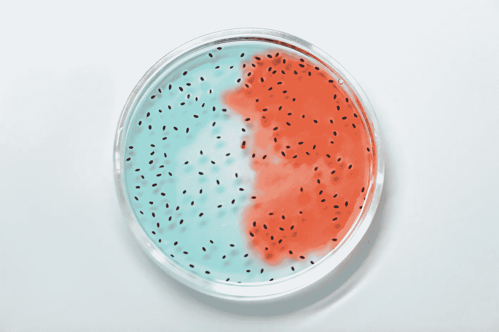

# 生物技术和基因改造

> 原文：<https://medium.com/codex/bio-tech-and-genetic-modification-c82822c2f9dd?source=collection_archive---------17----------------------->

## 未来和技术

## 流程、阶段和优势

照片由[爱德华·詹纳](https://www.pexels.com/photo/glass-blur-bubble-health-4033022/)拍摄

# 基因修饰

转基因是利用生物技术改变植物的基因构成。生物技术是利用生物过程和有机体开发产品和服务的科学。基因改造是一种…