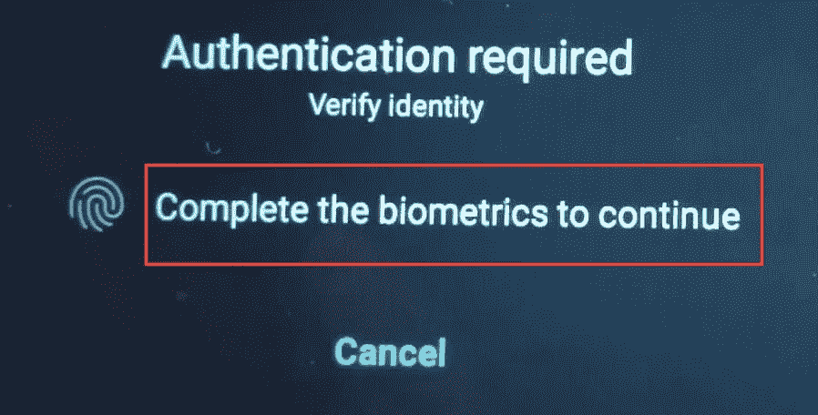
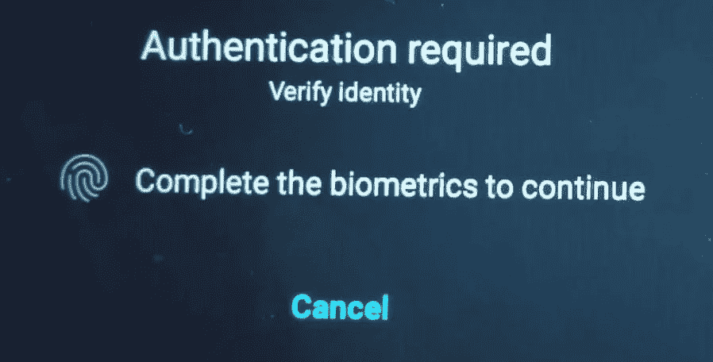
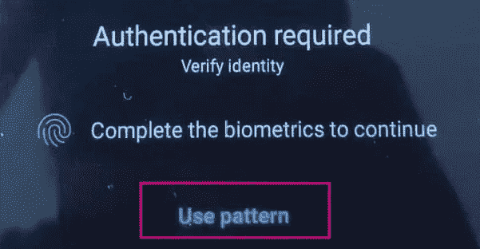

# flutter 中的生物识别登录

> 原文：<https://medium.com/codex/biometric-login-in-flutter-5a6c7c6466ad?source=collection_archive---------3----------------------->

在本文中，我们将讨论如何在 flutter 应用程序中实现像 TOUCH ID 或 PIN 这样的生物认证。

为了得到我们想要的输出，我们将使用一个名为[***local _ auth***](https://pub.dev/packages/local_auth)***的包。*** 该软件包为我们提供了在本地、设备上执行用户身份验证的方法。在这个包的帮助下，我们将在我们的 Flutter 应用程序中实现生物认证。

# **什么是生物认证？**

生物测定验证是通过评估一个或多个有区别的生物特征，例如面部特征、声音识别、指纹等，可以唯一地识别一个人的任何手段。

# 让我们开始吧

我们的应用程序将由两个屏幕组成，一个是**登录屏幕**，另一个是**成功屏幕**。在登录屏幕中，我们将对用户进行身份验证，只有当身份验证成功时，才能看到成功屏幕。

## **local_auth** 包概述

***local_auth*** 包提供的一些主要特性有:

*   检查设备的兼容性
*   列出支持的生物识别类型
*   使用生物识别或 PIN 进行身份验证

让我们进一步讨论这些特性

## **检查设备的兼容性**

我们可以测试手机是否支持生物认证。为了实现这个特性，我们将使用包 ***local_auth 提供的***is devices supported***方法。***

```
//initialize the LocalAuthentication plugin
final LocalAuthentication auth = LocalAuthentication();//check if the device supports the biometric authentication
bool isBioSupported=await auth.isDeviceSupported();
```

**is devices supported**是一个异步方法，它返回一个 **bool，**定义用户设备上是否支持生物认证。

## 列出支持的生物识别类型

***local_auth*** 插件提供的***getAvailableBiometrics***方法可用于检索用户设备支持的生物特征类型列表。

```
List<BiometricType> availableBiometrics = await auth.getAvailableBiometrics();
```

***local _ auth****包*支持的生物特征类型有:

*   生物计量学类型
*   生物计量学.指纹
*   生物计量学.弱
*   生物计量学。strong

## 使用生物识别或 PIN 进行身份验证

我们有 ***authenticate*** 方法提供了 **local_auth** 插件，以便使用生物特征或 PIN 来认证用户。

```
bool isAuthenticated=auth.authenticate(
localizedReason: 'Complete the biometrics to continue',
options: const AuthenticationOptions(
biometricOnly: true,
useErrorDialogs: false,
stickyAuth: true,
),)
```

方法 ***认证*** 具有 ***选项*** 参数，用于更改一些特定设置。这个 ***选项*** 参数取 ***认证选项*** 取一些重要的参数。

## 字符串本地化原因

它用于显示消息，同时提示他们进行身份验证。

注意:突出显示的消息是本地化的原因



## 布尔生物计量学

它可以是**真或假。**

当设置为真时，**非生物特征**本地认证(如 PIN 和密码)被禁用。



当设置为 false 时，**“使用图案”或**“**使用图钉**”选项可见，如下图所示。



## 布尔使用错误对话框

当此参数设置为 true 时，插件会检查设备上是否存在用户指纹记录。如果没有注册指纹，插件将尝试引导用户创建一个。

## stickyAuth

正常情况下，当应用最小化或移动到后台时，身份验证过程终止。如果 stickyAuth 设置为 true，当应用程序重新成为焦点时，身份验证过程将继续。

## 实施生物识别登录

首先，我们需要在**publibsec . YAML**文件中添加 **local_auth** 包。

```
local_auth: ^2.1.0
```

然后，我们首先检查设备是否支持生物识别登录。如果它受支持，我们限制用户只能使用生物识别登录，并在成功认证后，我们授予用户访问成功屏幕。

为此，创建一个名为[***authservice . dart***](https://github.com/nbnD/biometric_login/blob/master/lib/authservice.dart)***的新文件。*** 在这个文件里面粘贴代码。

在上面的代码中，我们创建了一个名为 **AuthService** 的类，并定义了一个方法 **authenticateUser。**该方法处理所有的认证逻辑，并返回一个**布尔值**，表示生物认证是否成功。

现在，在**登录页面**中，我们必须在点击按钮时调用**认证用户**方法，如下图所示。

```
InkWell(onTap: () async {bool isAuthenticated = await AuthService.authenticateUser();
if (isAuthenticated) {
// ignore: use_build_context_synchronously
Navigator.push(context,
   MaterialPageRoute(builder: (context) =>const  SuccessScreen()),
);
} else {// ignore: use_build_context_synchronouslyScaffoldMessenger.of(context).showSnackBar(const SnackBar(content: Text('Authentication failed.'),),);}
},child: Center( child: Container(
height: 60,
width: MediaQuery.of(context).size.width ,
decoration: BoxDecoration(border: Border.all(color: Colors.blueAccent, width: 2.5)),
child: Row(mainAxisAlignment: MainAxisAlignment.center,
children: const [
Icon(Icons.fingerprint,color: Colors.blueAccent,),
Text("Login with BioMetrics",style: TextStyle(color: Colors.blueAccent),
)
],
)), ),
),
```

根据上面的代码片段，如果身份验证成功，我们将导航到 successful 屏幕，否则我们将显示带有失败消息的 SnackBar。

完整登录页面代码

## **成功屏幕代码**

**主镖**

## 应用权限设置

**对于安卓系统**

在 **AndroidManifest.xml 文件中，**我们必须添加 **USE_FINGERPRINT** 权限。AndroidManifest.xml 文件位于***Android/src/main:***

```
<manifest>  
    <uses-permission          android:name="android.permission.USE_FINGERPRINT"/>
<application></application></manifest>
```

然后，更新`MainActivity.kt`文件，用`FlutterFragmentActivity`代替`FlutterActivity`:

```
import androidx.annotation.NonNull;
import io.flutter.embedding.android.FlutterActivity
import io.flutter.embedding.android.FlutterFragmentActivity
import io.flutter.plugins.GeneratedPluginRegistrant
import io.flutter.embedding.engine.FlutterEngineclass MainActivity: FlutterFragmentActivity() {override fun configureFlutterEngine(@NonNull flutterEngine:FlutterEngine) {GeneratedPluginRegistrant.registerWith(flutterEngine)}
}
```

# 适用于 iOS

为了让 FaceID 在 iOS 上工作，在`Info.plist`文件中添加下面一行。这定义了一条消息，告诉用户为什么应用程序正在寻求许可以通过 Face ID 认证。

```
<key>NSFaceIDUsageDescription</key>
<string>Why is my app authenticating using face id?</string>
```

# 让我们连接起来

我们可以成为朋友。在[脸书](https://www.facebook.com/nabin.dhakal.714/)、 [Linkedin](https://www.linkedin.com/in/nabindhakal/) 、 [Github](https://github.com/nbnD) 、 [Youtube](https://www.youtube.com/channel/UCW6oYt_3QSl7J2HSHNqwXWw) 、 [BuyMeACoffee](https://www.buymeacoffee.com/nabindhakal) 、 [Instagram](https://www.instagram.com/nbn_d_/) 上查找。

访问:[颤振连接](https://flutterjunction.com/)

**投稿:** [BuyMeACoffee](https://www.buymeacoffee.com/nabindhakal)

# 结论

希望这篇文章对你有所帮助，让你学到新的东西。我在这篇文章中使用了一些对你们中的一些人来说可能是新的东西。

如果你学到了新的东西或者想提出一些建议，请在评论中告诉我。

如果你喜欢这篇文章，请点击👏图标，它为向大家提供新事物提供了动力。

也请关注令人兴奋的文章和项目的更新。

通过分享学习在学习过程中产生巨大的影响，并使社区越来越大。

分享是吸引其他爱好者的磁石。

因此，让我们迈出一小步，让我们的学习社区变得更大。

与你的朋友分享这篇文章，或者如果你喜欢这篇文章，就在推特上发表。

# 在以下时间吃饱:

[](https://github.com/nbnD/biometric_login) [## GitHub-nbnD/生物识别 _ 登录

### 一个新的颤振项目。这个项目是颤振应用的起点。一些帮助您入门的资源…

github.com](https://github.com/nbnD/biometric_login) 

感谢您的阅读！！！