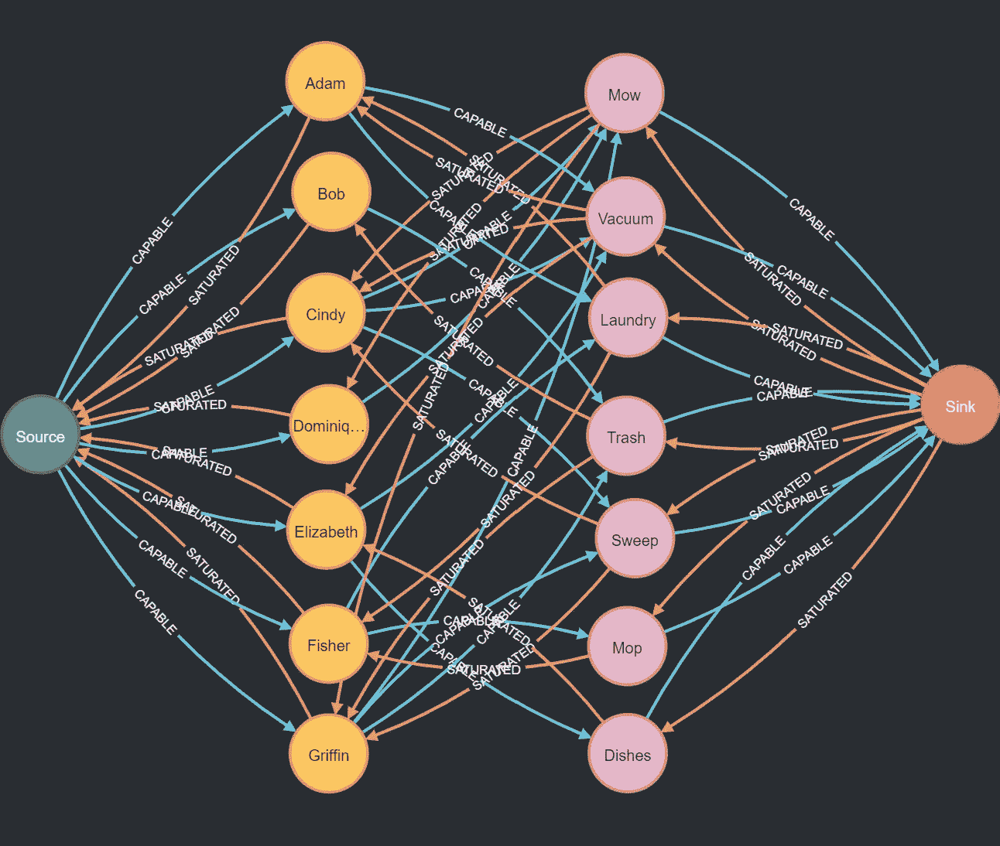

# 用 Neo4j 进行二分匹配

> 原文：<https://medium.com/codex/bipartite-matching-with-neo4j-12293577fb82?source=collection_archive---------6----------------------->

## 最大化你的孩子能完成多少家务

**图 1** 一个二分图转换成一个流网络

在我的上一篇文章:[用 Neo4j](https://levelup.gitconnected.com/solving-maximum-flow-problems-with-neo4j-ea227f8b798) 解决最大流问题中，我展示了如何使用 Ford-Fulkerson 算法找到网络的最大流。但是这对任何人有什么用呢？在本文中，我将展示一个寻找最大流的真实用例:最大二部匹配。