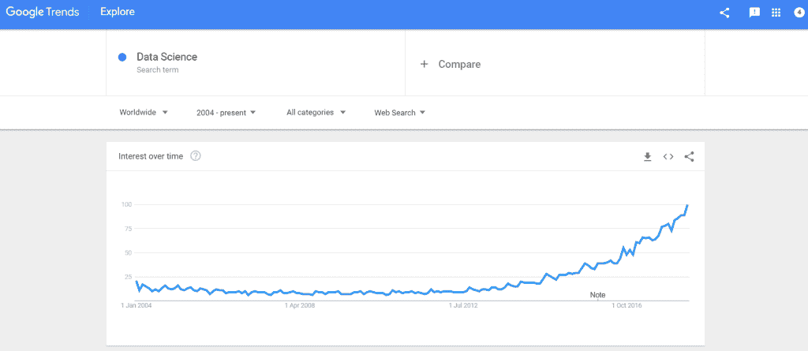
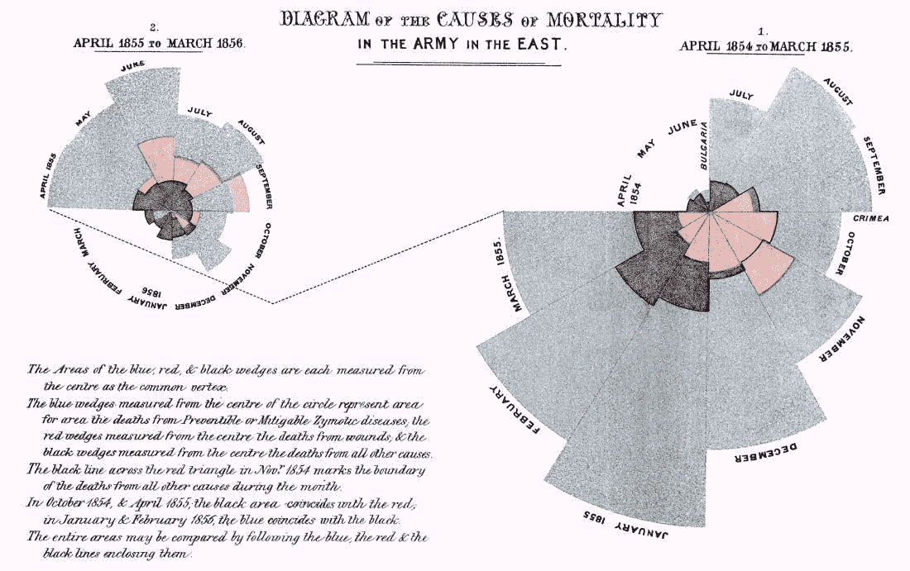
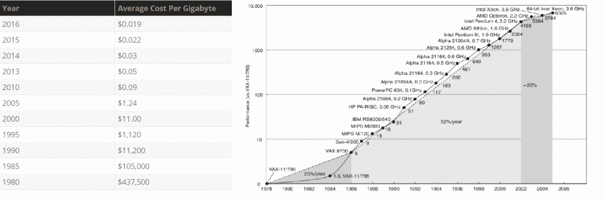
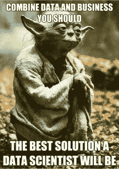

# 数据科学家的诞生

> 原文：<https://medium.com/codex/birth-of-the-data-scientist-22b2e14313af?source=collection_archive---------17----------------------->

你最近经常听到“机器学习”和“数据科学”这两个词吗？如果你在 IT 行业，那么你一定参加过一个电话会议，开发者会大胆地说“我们正在使用机器学习来自动化/预测…”。根据谷歌趋势，人们对该领域的兴趣一直在上升，但这是为什么呢？数据并不是什么新东西，根据数据建立模型和进行推断在很大程度上属于统计学的范畴，这种事情从 18 世纪 50 年代就已经存在了。

描绘对数据科学领域兴趣上升的趋势[【1】](https://trends.google.com/trends/explore?date=all&q=Data%20Science)

例如，佛罗伦萨·南丁格尔(是的，“灯之女神”也是一位天才的统计学家)关于卫生条件及其对 19 世纪 50 年代士兵高死亡率的贡献的美丽见解。

这幅图描绘了士兵的死亡，黑色——原因不明，红色——伤口，蓝色——可预防的疾病。可以看出，她出色地阐述了卫生标准的必要性，并说服了一个委员会，但该委员会的报告大多淹没在书面报告中[【2】](https://en.wikipedia.org/wiki/Florence_Nightingale#/media/File:Nightingale-mortality.jpg)

那么，如果数据驱动的决策自 18 世纪 50 年代以来就已经存在，那么为什么我们普通大众直到现在才感受到并看到它的影响呢？这很大程度上是因为技术的发展。这些年来，存储变得越来越便宜，处理速度也提高到了任何想知道“发生了什么”的人都可以知道的程度。在过去的 10 年中，任何人，从想知道用户访问网站时都在看什么的网站开发者，到想知道人群密度最高的地方的城市规划者，到想知道植被如何受到人类活动影响的环境学家，都能够经济地感知、收集、存储和处理数据，以获得洞察力。

左边的图像显示存储成本快速下降[【3】](https://www.statisticbrain.com/average-cost-of-hard-drive-storage/)，右边的图像显示穆雷斯定律[【4】](http://www.cs.columbia.edu/~sedwards/classes/2012/3827-spring/advanced-arch-2011.pdf)，表明这些年来性能一直在快速提高

但是，谁能从这些数量庞大且难以管理的数据中找到意义呢？统计学家在学术环境中研究原始数据集。他们被如此大量的数据、缺失值、不准确的数据点以及现实场景中的实时需求所淹没。此外，统计学家必须建立能够为普通用户提供解决方案的系统，这意味着他们必须依赖软件开发商。开发人员开始负责获取和清理数据，然后将统计模型转换成在现实世界的约束下工作的代码。这样的往复很快导致一群人在这两方面都发展了一套技能——可以编码的统计学家和可以建立假设的开发人员，可以设计和开发逻辑的人，可以操纵数据并从中获得洞察力的人。Dhanurjay Patil (前美国首席数据科学家)和他的团队很快发现有必要尝试给这些人贴上标签，这导致了现在被称为“21 世纪最性感的工作”的角色——数据科学家。

如果你想看到更多这样的内容，请留下一些掌声(没有上限😁).

如果你正在寻找免费的一对一指导，请在 Medium 和 [LinkedIn](https://www.linkedin.com/in/karunt/) 上关注我，并在 LinkedIn 上留言。