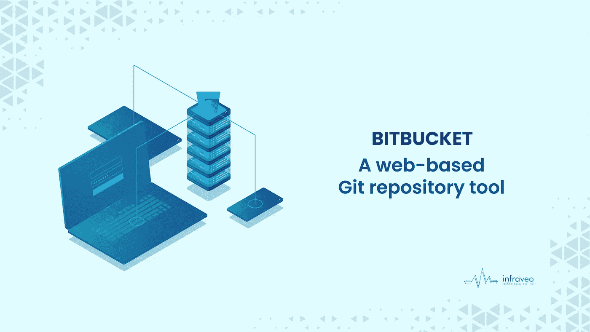

# Bitbucket 代码审查:一个基于 web 的 git 存储库工具

> 原文：<https://medium.com/codex/bitbucket-code-review-a-web-based-git-repository-tool-1dabc8c04cd5?source=collection_archive---------17----------------------->

# 什么是比特桶？

Bitbucket 是一个源代码管理工具，允许软件开发人员在项目上进行协作。它用于管理源代码、构建和监控代码库的健康状况，等等。Bitbucket 任何人都可以免费使用；程序员、设计师和项目经理都可以使用它。

[**代码评审**](https://www.infraveo.com/blog/bitbucket-code-review/) 是软件开发过程的重要组成部分。它们也是开发周期中最容易被忽视的部分之一。当您没有适当的代码评审过程时，很难知道您的变更是否对项目的目标和目的有积极的贡献——或者没有！

## Bitbucket 为其用户支持以下功能:

1.  Bitbucket 是一个基于 web 的 Git 存储库托管服务，主要关注用户访问控制。它提供了 Git 的所有分布式版本控制和源代码管理(SCM)功能，并添加了自己的特性。
2.  Bitbucket 用 Python 编写，部署到 Heroku 和 Google App Engine 等流行的云计算环境中，为 OSX、Windows 和 Linux 提供图形用户界面(GUI)，还为 Linux 和 Windows 用户提供命令行客户端。
3.  它可以自托管，但需要自己的服务器硬件，这需要由 Bitbucket 开发团队进行配置。
4.  Bitbucket 是领先的 Git 和 Mercurial 代码管理解决方案，受到超过 600，000 名开发人员的信任，可以管理超过 1，400 万个存储库。

## 以协作为核心构建更好的软件

> 代码评审是同行代码评审的过程。代码评审通过以下方式帮助您提高软件质量:
> 
> 识别和解决代码库中的问题
> 
> 为新的或更改的功能及其对现有功能的影响提供上下文
> 
> 代码审查也很重要，因为它们使人们能够比单独做每件事更有效地一起工作。

# 比特桶缺点

1.  Bitbucket 是一个很好的私人回购平台，但它有其局限性。首先，它不是免费的，你必须为团队中的每个额外成员付费。第二，BitBucket API 不是用户友好的，因此很难构建一个自动化的工具。
2.  Bitbucket 有一个很棒的团队功能，你可以雇佣和解雇人。这允许你根据需要扩大或缩小你的团队，但是不允许你在雇佣了更多的人之后再增加他们。
3.  Bitbucket 最大的缺点是，它不提供在私有存储库中搜索或浏览文件的方法。您必须首先启动存储库，然后在本地搜索文件。这比使用 GitHub 花费的时间更长，因为没有用于此目的的内置功能。
4.  如果你正在寻找一个允许你构建和管理私有存储库的工具，那么 BitBucket 可能适合你。然而，如果你的目标仅仅是在公共网站上与他人分享代码，那么我推荐使用 GitHub。"

# 结论

Bitbucket 是存放代码的好地方。它不仅简单而且免费，如果你需要的话，还有大量的社区用户。另外，如果你也想帮助别人，有很多机会！我们希望这对您有所帮助。