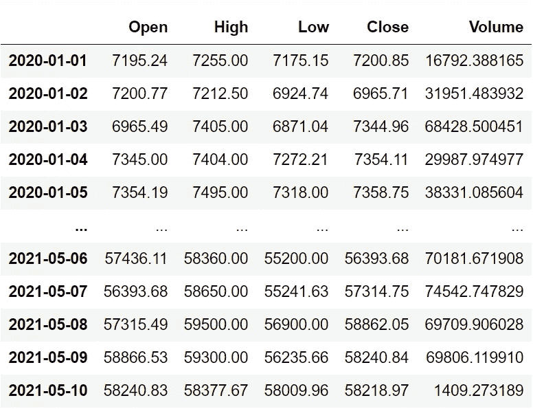
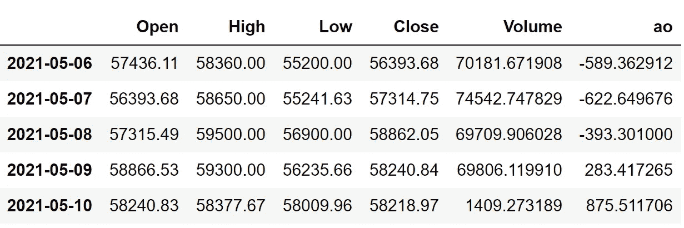
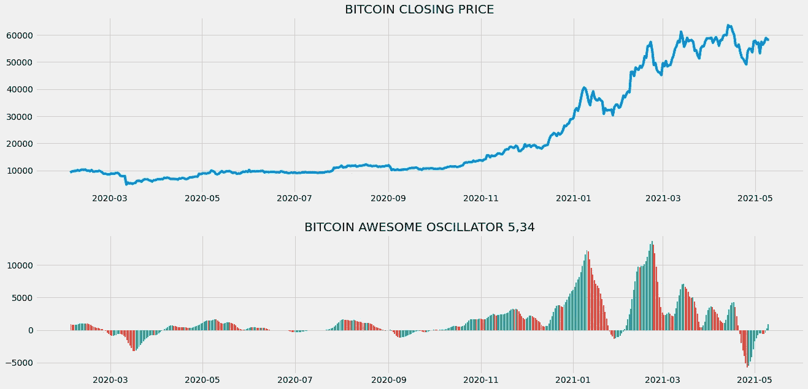
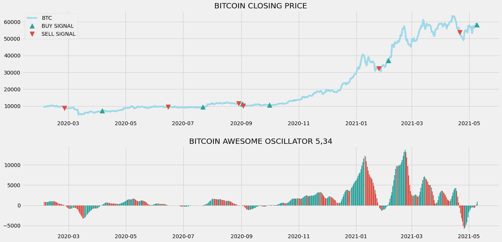
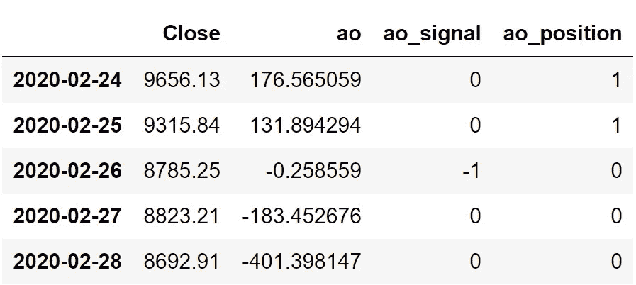

# 使用 Python 中的 Awesome 振荡器实现比特币交易自动化

> 原文：<https://medium.com/codex/bitcoin-trade-automation-with-awesome-oscillator-in-python-51f2c52c5b25?source=collection_archive---------5----------------------->

## 实施并回溯测试基于 AO 的强大交易策略，以便用 python 进行比特币交易


[图片由西尔维亚·布玛儿·杨拍摄](https://www.behance.net/gallery/58382501/Bloomberg-BusinessweekBitcoin-explainer?tracking_source=search_projects_recommended%7Cbitcoin)

最近几天，围绕比特币或加密货币的炒作只增不减，从未出现势头下降。虽然比特币正在达到创纪录的高度，但许多投机者认为这只是另一个泡沫，随时可能破裂。此外，在分析比特币突然涨价背后的原因时，人类的心态和贪婪似乎起了至关重要的作用。考虑到这些事实，我们可以说比特币市场是最不稳定、风险最大的交易市场之一。幸运的是，在算法交易的帮助下，我们可以通过自动化交易来安全地应对这个动荡的市场。在本文中，我们将使用一个名为 Awesome Oscillator (AO)的强大技术指标，并基于它创建一个交易策略，以使用 python 进行自动比特币交易。

在继续之前，如果你想在没有任何代码的情况下回溯测试你的交易策略，有一个解决方案。这是[回测区](https://www.backtestzone.com/)。这是一个平台，可以免费对不同类型的可交易资产的任意数量的交易策略进行回溯测试，无需编码。点击这里的链接，你可以马上使用这个工具:【https://www.backtestzone.com/ 

# 超棒振荡器(AO)

Awesome 振荡器(AO)是一个领先的技术指标，用于识别市场趋势或衡量市场动力。Awesome 振荡器以直方图的形式绘制，当前棒线高于前一棒线时显示绿色棒线，类似地，当前棒线低于前一棒线时显示红色棒线。作为一个振荡器，Awesome 振荡器的值在零线上下波动。

要了解 AO 是如何计算的，有必要了解简单移动平均线(SMA)的一些知识。SMA 不过是特定时期的平均价格。Awesome 振荡器的计算方法是从 5 周期简单移动平均线中减去 34 周期简单移动平均线。SMAs 不是根据股票的收盘价计算的，而是根据中间价计算的。计算 Awesome 振荡器的方法可表示如下:

```
**AO = SMA 5 OF MEDIAN PRICE - SMA 34 OF MEDIAN PRICE**
```

现在我们已经了解了什么是超棒的振荡器。让我们对我们的交易策略建立一些直觉。

**关于我们的交易策略:**基于 AO 的交易策略有很多种，但在本文中，我们将探讨一种叫做零线交叉的基本策略。当 AO 从下面穿越到零线上面时，我们的交易策略产生买入信号。当 AO 从零线上方穿过时，显示卖出信号。Ou 交易策略可以表示如下:

```
**IF PREVIOUS AO < 0 AND CURRENT AO > 0 => BUY SIGNAL
IF PREVIOUS AO > 0 AND CURRENT AO < 0 => SELL SIGNAL** 
```

现在我们已经了解了 AO 的含义以及如何用它来建立交易策略。让我们使用 Python 来实现我们自己的基于 AO 的交易策略，并对其进行回溯测试，看看它在现实市场中的表现如何。

**在继续之前，免责声明:本文的唯一目的是教育人们，必须被视为一个信息，而不是投资建议等。**

# Python 实现

编码部分分为以下几个步骤:

```
**1\. Importing Packages
2\. Extracting Data from Alpha Vantage
3\. Awesome Oscillator Calculation
4\. AO Plot
5\. Creating the Trading Strategy
6\. Plotting the Trading Signals
7\. Creating our Position
8\. Backtesting**
```

我们将按照上面列表中提到的顺序，系好安全带，跟随每一个即将到来的编码部分。

## 步骤 1:导入包

将所需的包导入 python 环境是一个不可跳过的步骤。主要的包是处理数据的 Pandas，处理数组和复杂函数的 NumPy，用于绘图的 Matplotlib，以及进行 API 调用的请求。二级包是数学函数的 Math 和字体定制的 Termcolor(可选)。

**Python 实现:**

```
import pandas as pd
import requests
import numpy as np
import matplotlib.pyplot as plt
from math import floor
from termcolor import colored as cl

plt.rcParams['figure.figsize'] = (20, 10)
plt.style.use('fivethirtyeight')
```

既然我们已经将所有基本的包导入到 python 环境中。让我们继续用 Alpha Vantage 强大的 crypto API 提取比特币的历史数据。

## 步骤 2:从 Alpha Vantage 中提取数据

在这一步中，我们将使用 Alpha Vantage 提供的 API 端点来提取比特币的历史数据。在此之前，关于 Alpha Vantage 的一个说明:Alpha Vantage 提供免费的股票 API，用户可以通过这些 API 访问各种数据，如实时更新，以及股票、货币和加密货币的历史数据。确保你在 Alpha Vantage 上有一个帐户，只有这样，你才能访问你的秘密 API 密匙(使用 API 提取数据的一个关键元素)。

**Python 实现:**

```
def get_crypto_price(symbol, exchange, start_date = None):
    api_key = open(r'api_key.txt')
    api_url = f'https://www.alphavantage.co/query?function=DIGITAL_CURRENCY_DAILY&symbol={symbol}&market={exchange}&apikey={api_key}'
    raw_df = requests.get(api_url).json()
    df = pd.DataFrame(raw_df['Time Series (Digital Currency Daily)']).T
    df = df.rename(columns = {'1a. open (USD)': 'Open', '2a. high (USD)': 'High', '3a. low (USD)': 'Low', '4a. close (USD)': 'Close', '5\. volume': 'Volume'})
    for i in df.columns:
        df[i] = df[i].astype(float)
    df.index = pd.to_datetime(df.index)
    df = df.iloc[::-1].drop(['1b. open (USD)', '2b. high (USD)', '3b. low (USD)', '4b. close (USD)', '6\. market cap (USD)'], axis = 1)
    if start_date:
        df = df[df.index >= start_date]
    return df

btc = get_crypto_price(symbol = 'BTC', exchange = 'USD', start_date = '2020-01-01')
btc
```

**输出:**



作者图片

**代码解释:**我们做的第一件事是定义一个名为“get_historical_data”的函数，它将加密的符号(' symbol ')、加密交换(' exchange ')作为必需参数，将历史数据的开始日期(' start_date ')作为可选参数。在函数内部，我们定义了 API 键和 URL，并将它们存储到各自的变量中。接下来，我们使用“get”函数提取 JSON 格式的历史数据，并将其存储到“raw_df”变量中。在对原始 JSON 数据进行清理和格式化之后，我们将以干净的 Pandas 数据帧的形式返回它。最后，我们正在调用创建的函数，从 2020 年开始以美元作为交换拉取比特币的历史数据，并将其存储到' btc '变量中。

## 步骤 3:出色的振荡器计算

在这一步，我们将按照之前讨论的公式计算 Awesome 振荡器的值。

**Python 实现:**

```
def sma(price, period):
    sma = price.rolling(period).mean()
    return sma

def ao(price, period1, period2):
    median = price.rolling(2).median()
    short = sma(median, period1)
    long = sma(median, period2)
    ao = short - long
    ao_df = pd.DataFrame(ao).rename(columns = {'Close':'ao'})
    return ao_df

btc['ao'] = ao(btc['Close'], 5, 34)
btc = btc.dropna()
btc.tail()
```

**输出:**



作者图片

**代码解释:**该代码可分为两部分:SMA 计算和 AO 计算。在第一部分中，我们定义了一个名为“sma”的函数，它将加密价格(“price”)和周期数(“period”)作为参数。在函数内部，我们使用 Pandas 包提供的“滚动”函数来计算给定周期数的 SMA。我们将计算出的值存储到“sma”变量中并返回它。

在第二部分中，我们定义了另一个名为“ao”的函数，它将加密价格(“price”)、短长度 SMA(“period 1”)和长长度 SMA(“period 2”)作为参数。在函数中，我们首先使用 Pandas 软件包提供的“滚动”和“中值”函数计算给定加密价格的中值。接下来，我们定义两个名为“short”和“long”的变量来存储使用我们之前创建的函数计算的短长度和长长度 SMA。为了计算 Awesome 振荡器的值，我们从短长度 SMA 中减去长长度 SMA，并将其存储到“ao”变量中。然后，我们将“ao”变量转换为 dataframe 并返回它。最后，我们调用函数来存储比特币的 AO 值。

## 步骤 4:出色的振荡器图

在这一步中，我们将绘制出计算出来的比特币令人敬畏的振荡器值，以更好地理解它。这一部分的主要目的不是在编码部分，而是观察情节，以获得对 Awesome 振荡器的坚实理解。

**Python 实现:**

```
ax1 = plt.subplot2grid((10,1), (0,0), rowspan = 5, colspan = 1)
ax2 = plt.subplot2grid((10,1), (6,0), rowspan = 4, colspan = 1)
ax1.plot(btc['Close'])
ax1.set_title('BITCOIN CLOSING PRICE')
for i in range(len(btc)):
    if btc['ao'][i-1] > btc['ao'][i]:
        ax2.bar(btc.index[i], btc['ao'][i], color = '#f44336')
    else:
        ax2.bar(btc.index[i], btc['ao'][i], color = '#26a69a')
ax2.set_title('BITCOIN AWESOME OSCILLATOR 5,34')
plt.show()
```

**输出:**



上面的图表分为两个面板:上面的面板代表比特币的收盘价，下面的面板以直方图的形式绘制了 AO 值。如您所见，每当当前棒线大于前一棒线时，图表上会绘制绿色棒线，每当当前棒线小于前一棒线时，图表上会绘制红色棒线。

市场动能:通过观察柱状图的长度，可以很容易地确定市场的动能。你可以在上面的图表中看到，在最初的十个月中，比特币的价格波动不是很大，你也可以看到 AO 柱状图的柱线很小，表明市场的势头很差。另一方面，过去几个月对比特币来说相当不错，你可以看到 AO 柱状图的柱线更大，显示了更大的市场动力。

**市场趋势:**就像市场的动量可以很容易地用 AO 的柱状图来识别一样，它也有助于了解标记的趋势，是下跌还是上涨。当 Awesome 振荡指标的值大于零线时，市场被认为处于上升趋势，同样，当 Awesome 振荡指标的值小于零线时，市场处于下降趋势。

## 步骤 5:创建交易策略

在这一步，我们将在 python 中实现讨论过的 Awesome 振荡器交易策略。

**Python 实现:**

```
def implement_ao_crossover(price, ao):
    buy_price = []
    sell_price = []
    ao_signal = []
    signal = 0

    for i in range(len(ao)):
        if ao[i] > 0 and ao[i-1] < 0:
            if signal != 1:
                buy_price.append(price[i])
                sell_price.append(np.nan)
                signal = 1
                ao_signal.append(signal)
            else:
                buy_price.append(np.nan)
                sell_price.append(np.nan)
                ao_signal.append(0)
        elif ao[i] < 0 and ao[i-1] > 0:
            if signal != -1:
                buy_price.append(np.nan)
                sell_price.append(price[i])
                signal = -1
                ao_signal.append(signal)
            else:
                buy_price.append(np.nan)
                sell_price.append(np.nan)
                ao_signal.append(0)
        else:
            buy_price.append(np.nan)
            sell_price.append(np.nan)
            ao_signal.append(0)
    return buy_price, sell_price, ao_signal

buy_price, sell_price, ao_signal = implement_ao_crossover(btc['Close'], btc['ao'])
```

**代码解释:**首先，我们定义一个名为‘implement _ ao _ strategy’的函数，它将股票价格(‘price’)和 AO 值(‘AO’)作为参数。

在该函数中，我们创建了三个空列表(buy_price、sell_price 和 ao_signal ),在创建交易策略时，将在这些列表中追加值。

之后，我们通过 for 循环实施交易策略。在 for 循环内部，我们传递某些条件，如果条件得到满足，相应的值将被追加到空列表中。如果购买股票的条件得到满足，买入价将被追加到“buy_price”列表中，信号值将被追加为 1，表示购买股票。类似地，如果卖出股票的条件得到满足，卖价将被追加到“sell_price”列表中，信号值将被追加为-1，表示卖出股票。

最后，我们返回附加了值的列表。然后，我们调用创建的函数并将值存储到各自的变量中。除非我们画出这些值，否则这个列表没有任何意义。所以，让我们画出创建的交易列表的值。

## 步骤 6:绘制交易信号

在这一步，我们将绘制已创建的交易列表，以使它们有意义。

**Python 实现:**

```
ax1 = plt.subplot2grid((10,1), (0,0), rowspan = 5, colspan = 1)
ax2 = plt.subplot2grid((10,1), (6,0), rowspan = 4, colspan = 1)
ax1.plot(btc['Close'], label = 'BTC', color = 'skyblue')
ax1.plot(btc.index, buy_price, marker = '^', markersize = 12, color = '#26a69a', linewidth = 0, label = 'BUY SIGNAL')
ax1.plot(btc.index, sell_price, marker = 'v', markersize = 12, color = '#f44336', linewidth = 0, label = 'SELL SIGNAL')
ax1.legend()
ax1.set_title('BITCOIN CLOSING PRICE')
for i in range(len(btc)):
    if btc['ao'][i-1] > btc['ao'][i]:
        ax2.bar(btc.index[i], btc['ao'][i], color = '#f44336')
    else:
        ax2.bar(btc.index[i], btc['ao'][i], color = '#26a69a')
ax2.set_title('BITCOIN AWESOME OSCILLATOR 5,34')
plt.show()
```

**输出:**



作者图片

**代码解释:**我们正在绘制出色的振荡指标值，以及交易策略产生的买入和卖出信号。我们可以观察到，每当牛逼的振荡指标从零线以下到零线以上，图表中就会出现绿色的买入信号。类似地，每当 Awesome 振荡指标从零线上方到下方时，图表中就会出现红色的卖出信号。

## 步骤 7:创建我们的职位

在这一步中，我们将创建一个列表，如果我们持有股票，该列表将指示 1；如果我们不拥有或持有股票，该列表将指示 0。

**Python 实现:**

```
position = []
for i in range(len(ao_signal)):
    if ao_signal[i] > 1:
        position.append(0)
    else:
        position.append(1)

for i in range(len(btc['Close'])):
    if ao_signal[i] == 1:
        position[i] = 1
    elif ao_signal[i] == -1:
        position[i] = 0
    else:
        position[i] = position[i-1]

ao = btc['ao']
close_price = btc['Close']
ao_signal = pd.DataFrame(ao_signal).rename(columns = {0:'ao_signal'}).set_index(btc.index)
position = pd.DataFrame(position).rename(columns = {0:'ao_position'}).set_index(btc.index)

frames = [close_price, ao, ao_signal, position]
strategy = pd.concat(frames, join = 'inner', axis = 1)

strategy
```

**输出:**



作者图片

**代码解释:**首先，我们创建一个名为‘position’的空列表。我们传递两个 for 循环，一个是为“位置”列表生成值，以匹配“信号”列表的长度。另一个 for 循环是我们用来生成实际位置值的循环。在第二个 for 循环中，我们对“signal”列表的值进行迭代，而“position”列表的值被附加到满足哪个条件上。如果我们持有股票，头寸的价值仍为 1；如果我们卖出或不持有股票，头寸的价值仍为 0。最后，我们正在进行一些数据操作，将所有创建的列表合并到一个数据帧中。

从显示的输出中，我们可以看到，在前两行中，我们在股票中的位置保持为 1(因为 AO 信号没有任何变化)，但是当 AO 信号代表卖出信号(-1)时，我们的位置突然变为 0。我们的头寸将保持为 0，直到交易信号发生一些变化。现在是时候实现一些回溯测试过程了！

## 步骤 8:回溯测试

在继续之前，有必要知道什么是回溯测试。回溯测试是查看我们的交易策略在给定股票数据上表现如何的过程。在我们的案例中，我们将针对比特币股票数据实施 AO 交易策略的回溯测试流程。

**Python 实现:**

```
btc_ret = pd.DataFrame(np.diff(btc['Close'])).rename(columns = {0:'returns'})
ao_strategy_ret = []

for i in range(len(btc_ret)):
    returns = btc_ret['returns'][i]*strategy['ao_position'][i]
    ao_strategy_ret.append(returns)

ao_strategy_ret_df = pd.DataFrame(ao_strategy_ret).rename(columns = {0:'ao_returns'})
investment_value = 200000
number_of_stocks = floor(investment_value/btc['Close'][-1])
ao_investment_ret = []

for i in range(len(ao_strategy_ret_df['ao_returns'])):
    returns = number_of_stocks*ao_strategy_ret_df['ao_returns'][i]
    ao_investment_ret.append(returns)

ao_investment_ret_df = pd.DataFrame(ao_investment_ret).rename(columns = {0:'investment_returns'})
total_investment_ret = round(sum(ao_investment_ret_df['investment_returns']), 2)
profit_percentage = round((total_investment_ret/investment_value)*100, 2)
print(cl('Profit gained from the AO strategy by investing $200k in BTC : {}'.format(total_investment_ret), attrs = ['bold']))
print(cl('Profit percentage of the AO strategy : {}%'.format(profit_percentage), attrs = ['bold']))
```

**输出:**

```
**Profit gained from the AO strategy by investing $200k in BTC : 122545.53**
**Profit percentage of the AO strategy : 61.27%**
```

**代码解释:**首先，我们使用 NumPy 包提供的“diff”函数计算脸书股票的回报率，并将其作为数据帧存储到“btc_ret”变量中。接下来，我们将传递一个 for 循环来迭代' btc_ret '变量的值，以计算我们从 AO 交易策略中获得的回报，这些回报值将被追加到' btc_strategy_ret '列表中。接下来，我们将“ao_strategy_ret”列表转换为数据帧，并将其存储到“ao_strategy_ret_df”变量中。

接下来是回溯测试过程。我们将通过投资 20 万美元到我们的交易策略中来回测我们的策略。首先，我们将投资金额存储到“投资值”变量中。之后，我们正在计算使用投资金额可以购买的比特币数量。你可以注意到，我使用了 Math 软件包提供的“下限”函数，因为当投资金额除以比特币的收盘价时，它会输出一个十进制数。密码的数目应该是整数，而不是小数。使用“底数”函数，我们可以去掉小数。请记住,“floor”函数比“round”函数要复杂得多。然后，我们传递一个 for 循环来寻找投资回报，随后是一些数据操作任务。

最后，我们打印了我们通过投资 20 万到我们的交易策略中得到的总回报，显示我们在一年中获得了大约 12 万美元的利润，利润率为 61.27%。那还不错！其实很棒！

# 其他 AO 策略

正如我之前提到的，有许多其他基于 Awesome 振荡器的交易策略，现在我们将探索一些 AO 策略，除了我们已经实现的。

*   **碟中谍策略:**这个策略是我的最爱之一，很容易实现。当 Awesome 振荡器在零线以上时，这个策略揭示了买入信号，AO 柱状图有两个连续的红色柱，其中第二个红色柱小于第一个红色柱，柱状图的第三个柱是绿色的。同样，当 Awesome 振荡指标低于零线时，策略显示卖出信号，AO 柱状图有两个连续的绿色柱，其中第二个绿色柱小于第一个绿色柱，柱状图的第三个柱是红色的。该策略可以表示如下:

```
1.IF **AO > 0** AND **First red AO bar > Second red AO bar** AND **Third bar = Green** --> **BUY THE STOCK**2\. IF **AO < 0** AND **First green AO bar > Second green AO bar** AND **Third bar = Red** --> **SELL THE STOCK**
```

*   **双峰策略:**像飞碟策略一样，这种交易策略是一种强有力的策略，当可怕的振荡指标在零线以下时，会显示出买入信号，在零线以下形成两个动量峰，其中第二个峰高于第一个峰，第二个峰低点后的柱状图为绿色。当 Awesome 振荡器在零线以上时，该策略显示卖出信号，在零线以上形成两个动量峰，其中第二个峰低于第一个峰，第二个峰高之后的直方图为红色。双峰策略可以表示如下:

```
1\. IF **AO < 0** AND **Second momentum peak > First momentum peak** AND **Histogram after second peak low = Green** -- > **BUY THE STOCK**2\. IF **AO > 0** AND **Second momentum peak < First momentum peak** AND **Histogram after second peak high = Red** -- > **SELL THE STOCK**
```

还有其他几种策略也可以实现，但是这两种和我们用 python 实现的一种是标准的基于 AO 的策略。熟悉这些之后，你就可以开始创建自己的定制振荡器策略，并在现实市场中实施。

# 最后的想法！

在这篇文章中，我们几乎涵盖了 Awesome Oscillator 的所有内容，但改进的可能性很多。你可以调整交易策略，用机器学习模型选择正确的密码，等等，但是，在进行算法交易时，一定要确保你的风险水平不会超出一定范围。当我们作为人类交易密码时，我们有一定的认知技能和直觉来识别我们的交易是否风险太大。然而，我们创造的交易机器人只是执行我们的交易策略的程序，而没有任何情绪来处理涉及风险因素的情况。

在进行算法交易时，处理风险的一种方法是计算每笔交易的风险水平，忽略风险水平超过特定界限的交易。我们还没有实现这一步，但这并不意味着它不重要。你可以尝试在程序中增加一个步骤，用一些基本的数学和编程来计算风险的大小，这样你就可以在现实市场中交易了。

就是这样！希望你能从这篇文章中学到一些新的有用的东西。如果您忘记了遵循任何编码部分，不要担心。我在文章末尾提供了完整的源代码。

## 完整代码:

```
import pandas as pd
import requests
import numpy as np
import matplotlib.pyplot as plt
from math import floor
from termcolor import colored as cl

plt.rcParams['figure.figsize'] = (20, 10)
plt.style.use('fivethirtyeight')

def get_crypto_price(symbol, exchange, start_date = None):
    api_key = open(r'api_key.txt')
    api_url = f'https://www.alphavantage.co/query?function=DIGITAL_CURRENCY_DAILY&symbol={symbol}&market={exchange}&apikey={api_key}'
    raw_df = requests.get(api_url).json()
    df = pd.DataFrame(raw_df['Time Series (Digital Currency Daily)']).T
    df = df.rename(columns = {'1a. open (USD)': 'Open', '2a. high (USD)': 'High', '3a. low (USD)': 'Low', '4a. close (USD)': 'Close', '5\. volume': 'Volume'})
    for i in df.columns:
        df[i] = df[i].astype(float)
    df.index = pd.to_datetime(df.index)
    df = df.iloc[::-1].drop(['1b. open (USD)', '2b. high (USD)', '3b. low (USD)', '4b. close (USD)', '6\. market cap (USD)'], axis = 1)
    if start_date:
        df = df[df.index >= start_date]
    return df

btc = get_crypto_price(symbol = 'BTC', exchange = 'USD', start_date = '2020-01-01')
print(btc)

def sma(price, period):
    sma = price.rolling(period).mean()
    return sma

def ao(price, period1, period2):
    median = price.rolling(2).median()
    short = sma(median, period1)
    long = sma(median, period2)
    ao = short - long
    ao_df = pd.DataFrame(ao).rename(columns = {'Close':'ao'})
    return ao_df

btc['ao'] = ao(btc['Close'], 5, 34)
btc = btc.dropna()
print(btc.tail())

ax1 = plt.subplot2grid((10,1), (0,0), rowspan = 5, colspan = 1)
ax2 = plt.subplot2grid((10,1), (6,0), rowspan = 4, colspan = 1)
ax1.plot(btc['Close'])
ax1.set_title('BITCOIN CLOSING PRICE')
for i in range(len(btc)):
    if btc['ao'][i-1] > btc['ao'][i]:
        ax2.bar(btc.index[i], btc['ao'][i], color = '#f44336')
    else:
        ax2.bar(btc.index[i], btc['ao'][i], color = '#26a69a')
ax2.set_title('BITCOIN AWESOME OSCILLATOR 5,34')
plt.show()

def implement_ao_crossover(price, ao):
    buy_price = []
    sell_price = []
    ao_signal = []
    signal = 0

    for i in range(len(ao)):
        if ao[i] > 0 and ao[i-1] < 0:
            if signal != 1:
                buy_price.append(price[i])
                sell_price.append(np.nan)
                signal = 1
                ao_signal.append(signal)
            else:
                buy_price.append(np.nan)
                sell_price.append(np.nan)
                ao_signal.append(0)
        elif ao[i] < 0 and ao[i-1] > 0:
            if signal != -1:
                buy_price.append(np.nan)
                sell_price.append(price[i])
                signal = -1
                ao_signal.append(signal)
            else:
                buy_price.append(np.nan)
                sell_price.append(np.nan)
                ao_signal.append(0)
        else:
            buy_price.append(np.nan)
            sell_price.append(np.nan)
            ao_signal.append(0)
    return buy_price, sell_price, ao_signal

buy_price, sell_price, ao_signal = implement_ao_crossover(btc['Close'], btc['ao'])

ax1 = plt.subplot2grid((10,1), (0,0), rowspan = 5, colspan = 1)
ax2 = plt.subplot2grid((10,1), (6,0), rowspan = 4, colspan = 1)
ax1.plot(btc['Close'], label = 'BTC', color = 'skyblue')
ax1.plot(btc.index, buy_price, marker = '^', markersize = 12, color = '#26a69a', linewidth = 0, label = 'BUY SIGNAL')
ax1.plot(btc.index, sell_price, marker = 'v', markersize = 12, color = '#f44336', linewidth = 0, label = 'SELL SIGNAL')
ax1.legend()
ax1.set_title('BITCOIN CLOSING PRICE')
for i in range(len(btc)):
    if btc['ao'][i-1] > btc['ao'][i]:
        ax2.bar(btc.index[i], btc['ao'][i], color = '#f44336')
    else:
        ax2.bar(btc.index[i], btc['ao'][i], color = '#26a69a')
ax2.set_title('BITCOIN AWESOME OSCILLATOR 5,34')
plt.show()

position = []
for i in range(len(ao_signal)):
    if ao_signal[i] > 1:
        position.append(0)
    else:
        position.append(1)

for i in range(len(btc['Close'])):
    if ao_signal[i] == 1:
        position[i] = 1
    elif ao_signal[i] == -1:
        position[i] = 0
    else:
        position[i] = position[i-1]

ao = btc['ao']
close_price = btc['Close']
ao_signal = pd.DataFrame(ao_signal).rename(columns = {0:'ao_signal'}).set_index(btc.index)
position = pd.DataFrame(position).rename(columns = {0:'ao_position'}).set_index(btc.index)

frames = [close_price, ao, ao_signal, position]
strategy = pd.concat(frames, join = 'inner', axis = 1)

print(strategy)
print(strategy[20:25])

btc_ret = pd.DataFrame(np.diff(btc['Close'])).rename(columns = {0:'returns'})
ao_strategy_ret = []

for i in range(len(btc_ret)):
    returns = btc_ret['returns'][i]*strategy['ao_position'][i]
    ao_strategy_ret.append(returns)

ao_strategy_ret_df = pd.DataFrame(ao_strategy_ret).rename(columns = {0:'ao_returns'})
investment_value = 200000
number_of_stocks = floor(investment_value/btc['Close'][-1])
ao_investment_ret = []

for i in range(len(ao_strategy_ret_df['ao_returns'])):
    returns = number_of_stocks*ao_strategy_ret_df['ao_returns'][i]
    ao_investment_ret.append(returns)

ao_investment_ret_df = pd.DataFrame(ao_investment_ret).rename(columns = {0:'investment_returns'})
total_investment_ret = round(sum(ao_investment_ret_df['investment_returns']), 2)
profit_percentage = round((total_investment_ret/investment_value)*100, 2)
print(cl('Profit gained from the AO strategy by investing $200k in BTC : {}'.format(total_investment_ret), attrs = ['bold']))
print(cl('Profit percentage of the AO strategy : {}%'.format(profit_percentage), attrs = ['bold']))
```