# 用 NCBI 的弹性冲击波在云上爆炸

> 原文：<https://medium.com/codex/blast-on-the-cloud-with-ncbis-elasticblast-3b35b29afde7?source=collection_archive---------4----------------------->

## 在 AWS 上使用 ElasticBLAST、SNS 和 DataBrew 构建分析管道


[田宽](https://unsplash.com/@realaxer?utm_source=medium&utm_medium=referral)在 [Unsplash](https://unsplash.com?utm_source=medium&utm_medium=referral) 上拍照

> 信息程序来来去去，但爆炸留下来了。

BLAST 是基本局部比对搜索工具的缩写，是生物信息学家的搜索引擎。Google 将文本字符串作为查询并返回相关网页，而 BLAST 接受 DNA 或蛋白质序列作为查询并返回来自数据库的类似序列，例如来自国家生物技术信息中心(NCBI)的非冗余核苷酸数据库和非冗余蛋白质数据库。

BLAST 是所有生物信息学家的面包和黄油。Altschul 于 1990 年发表，截至本文撰写时，其论文已被引用 92993 次。对于每个生物学家来说，这个常青的软件可能是他或她学习的第一个生物信息学工具。自从它出现以来，已经开发了许多其他的序列搜索工具，例如 HMMER、RAPSearch、DIAMOND 和 MMseqs，但是没有一个能够取代广受欢迎的 BLAST。就像“谷歌”一样，BLAST 也变成了动词。

BLAST 可以在本地运行。虽然程序本身很小，但数据库却不小。例如，来自 NCBI 的格式化核苷酸数据库大于 130 GB。当它运行时，它是 I/O、CPU 和内存密集型的。因此，我们更有可能在一些超级计算机集群上看到 BLAST，而不是在我们的台式机上。

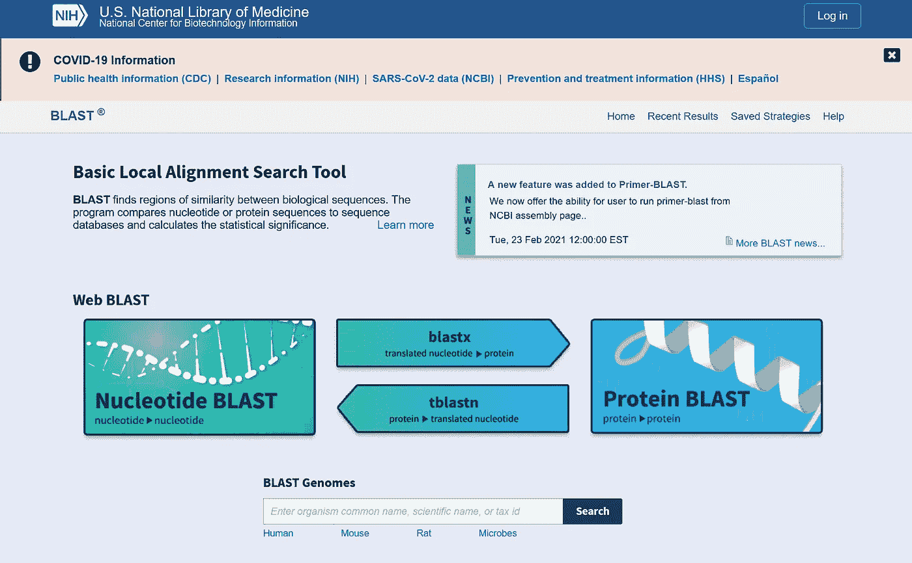

图一。NCBI 的在线爆炸页面。截图来自[https://blast.ncbi.nlm.nih.gov/Blast.cgi](https://blast.ncbi.nlm.nih.gov/Blast.cgi)。图片作者。

或者，生物学家也可以在网上进行 BLAST 搜索。最受欢迎的是托管在 NCBI 的网站上(图 1。).尽管 web BLAST 非常方便，但它也有很多局限性。首先，它对处理时间设置了限制[，从而间接限制了输入序列的数量。其次，您只能查询他们预定义的数据库。第三，您的搜索受制于 NCBI 定义的设置，如并行度、输出格式等。最后，你基本上是在和世界各地的生物学家竞争 NCBI 的资源。所以搜索有时会很长。](https://www.ncbi.nlm.nih.gov/guide/howto/submit-mult-seq-blast/)

第三个选择是云。云计算使超级计算机大众化。我们现在可以高效地在云上运行 BLAST，并使用我们的用户设置，两全其美。在云上运行 BLAST 的方法有很多种。在我之前的文章“[用 AWS 批处理](https://aws.plainenglish.io/parallel-blast-against-cazy-with-aws-batch-8239a45d8116)对 CAZy 进行并行 BLAST”中，我使用 AWS 批处理上的 Docker 对我的自定义数据库 CAZy 进行无服务器 BLAST。还可以提供 EC2 实例来安装和运行 BLAST。

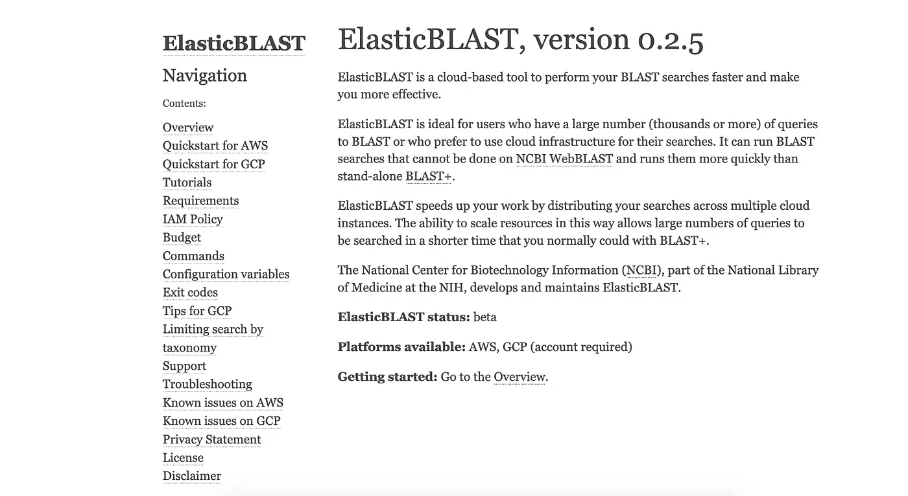

图二。ElasticBLAST 的网页。https://blast.ncbi.nlm.nih.gov/doc/elastic-blast/index.html[。图片作者。](https://blast.ncbi.nlm.nih.gov/doc/elastic-blast/index.html)

然后来自 NCBI 的 Ravinder Pannu Eskandary 好心的告诉我，NCBI 也在研发一款云端爆破: [**ElasticBLAST**](https://blast.ncbi.nlm.nih.gov/doc/elastic-blast/) 。她和她的团队也友好地让我测试软件的最新版本。ElasticBLAST 目前处于测试阶段，在 [AWS](https://blast.ncbi.nlm.nih.gov/doc/elastic-blast/quickstart-aws.html#quickstart-aws) 和 [GCP](https://blast.ncbi.nlm.nih.gov/doc/elastic-blast/quickstart-gcp.html#quickstart-gcp) 上运行。这两个平台上的命令本质上是相同的。您也可以按照他们的说明自己测试软件。

[](https://blast.ncbi.nlm.nih.gov/doc/elastic-blast/overview.html#overview) [## 弹性塑料

### 基本局部比对搜索工具(BLAST)寻找序列之间的局部相似区域。该程序比较…

blast.ncbi.nlm.nih.gov](https://blast.ncbi.nlm.nih.gov/doc/elastic-blast/overview.html#overview) 

这是一场全新的比赛。正如我的 BLAST 文章所展示的，一个本土云爆炸的建立需要大量的点击或者一个巨大的地形。现在，如果 NCBI 介入并接管 BLAST 设置，我们这些用户就可以专注于我们最擅长的领域:生物学。这也意味着现在整个工作流程，从通过 ElasticBLAST 的序列上传到结果分析，完全是云原生的(图 3)。如果你愿意，没有数据会离开云。云也是可扩展的。事实上，它鼓励更多的并发性，因为并行和顺序执行的成本是相同的。小型研究小组或生物学爱好者现在可以在没有自己的超级计算机的情况下进行资源饥渴的生物信息学分析。

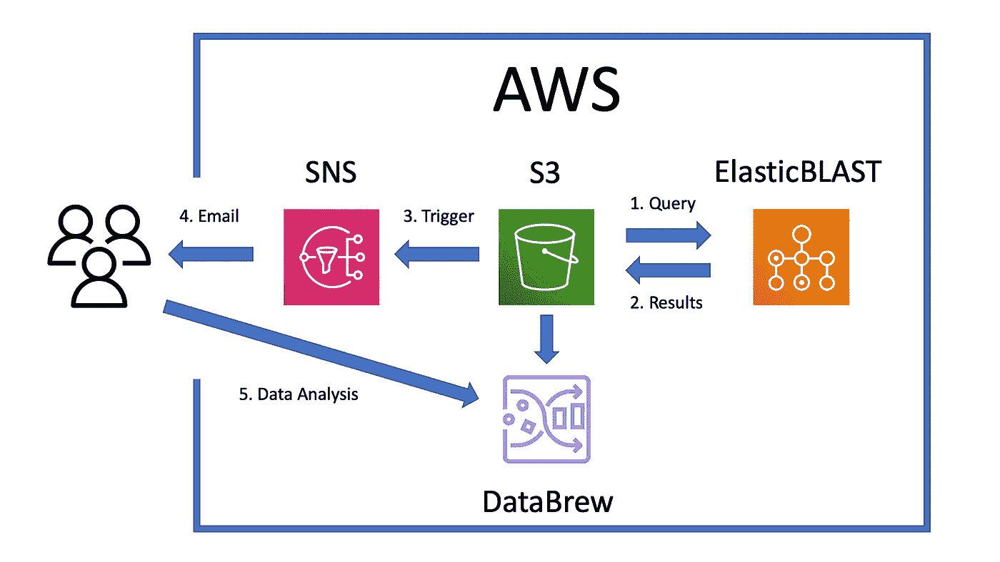

图 3。这个项目的架构。图片作者。

目前，NCBI 团队正专注于软件的可用性、可伸缩性和性能。作为一个受鼓励的用户，我想在 ElasticBLAST 之上建立一个管道。在本文中，我将设置一个 SNS 电子邮件通知，带您完成 ElasticBLAST 示例运行，然后使用 DataBrew 对结果进行可视化分析。本教程在 AWS 上运行。

# 1.设置带有 SNS 电子邮件通知的 S3 存储桶

在运行 ElasticBLAST 之前，我们需要创建一个 S3 桶来存放传入的结果。稍后很难使用`status`子命令来监控作业状态，因为它依赖于一个实时的 CloudShell 会话，并且会话可能会在作业完成之前超时。作为一种变通方法，我们最好在桶中设置电子邮件通知。这样，当工作完成时，我们将收到来自 AWS 的电子邮件。

我们需要**在 S3 桶**之前先 **创建一个 SNS 话题。登录你的 AWS 控制台，前往社交网站。创建一个`Standard`话题`blast-output-topic`。**

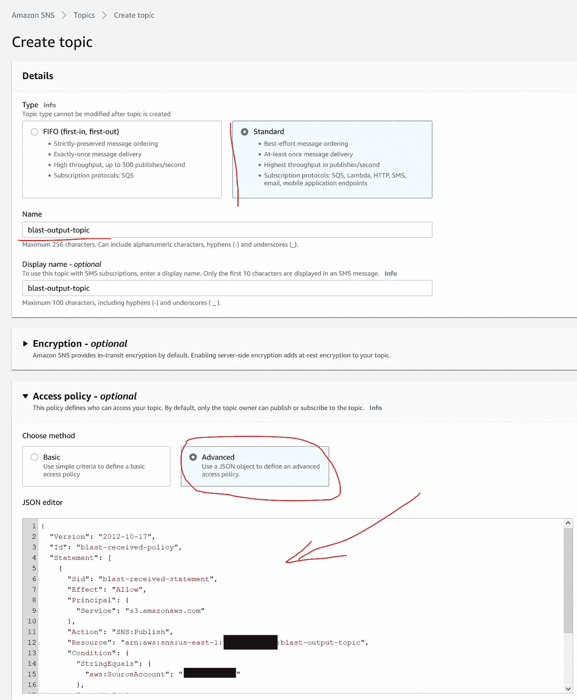

图 4。S3 文件定稿的 SNS 设置。图片作者。

我们还需要修改`access policy`来允许未来的 S3 存储桶调用 SNS。在下面的模板中填写您的**未来**桶名和您的账户 ID(您用户名下拉菜单中`My Account`旁边的 12 位 ID ),并将内容粘贴到`JSON editor`字段中。

之后，使用`Email`协议创建一个订阅。填写您的电子邮件地址作为终点。点击`Create subscription`按钮。

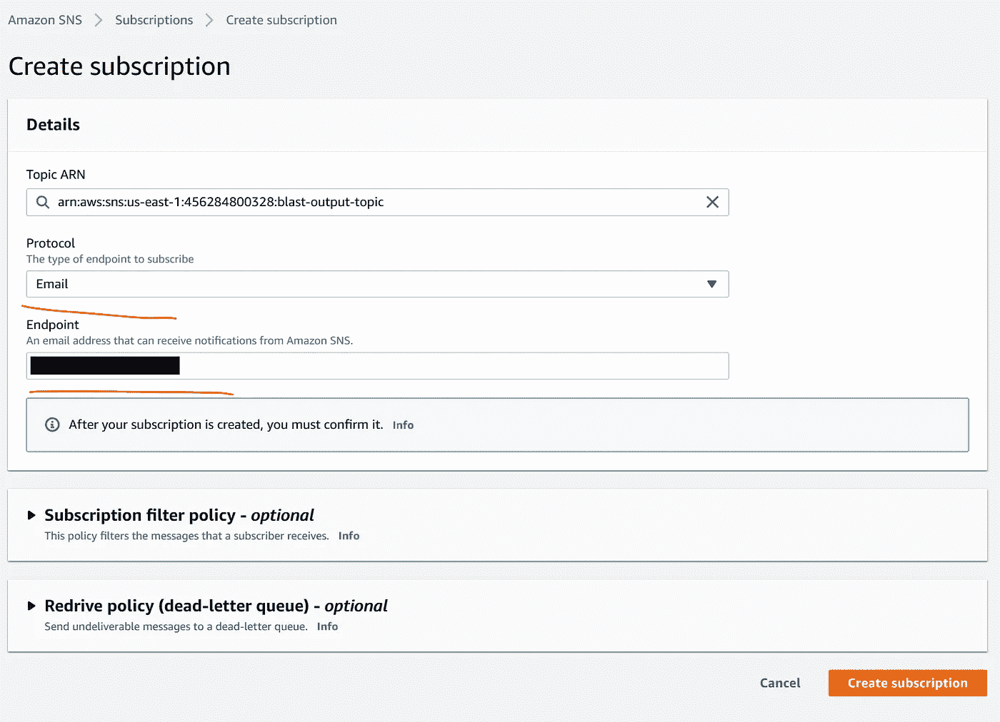

图 5。为主题创建订阅。图片作者。

然后，AWS 将向您发送一封电子邮件，您需要通过单击其链接来确认订阅。

现在，前往 S3，使用您之前在策略中填写的名称创建一个 bucket。我的是`eblast-result-sixing`。选择`us-east-1`区域。之后，点击进入新 bucket 的`Properties`选项卡，找到`Event notifications`部分并创建一个名为`result received`的事件通知。在`Prefix`中写`results/`，在`Suffix`中写`.gz`，因为 ElasticBLAST 会将结果写入。gz 格式保存在`results`文件夹中。启用`Event types`中的`All object create events`。在`Destination`中选择`SNS topic`，在下拉菜单中选择`blast-output-topic`。

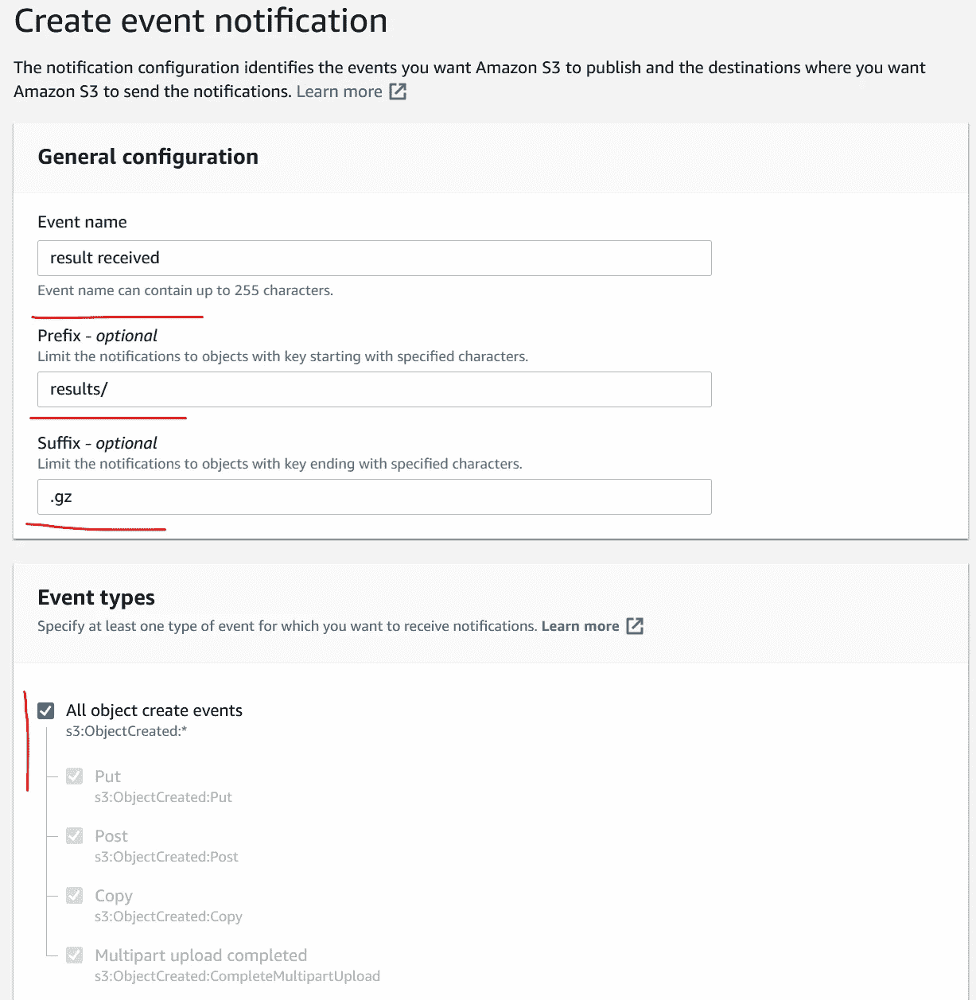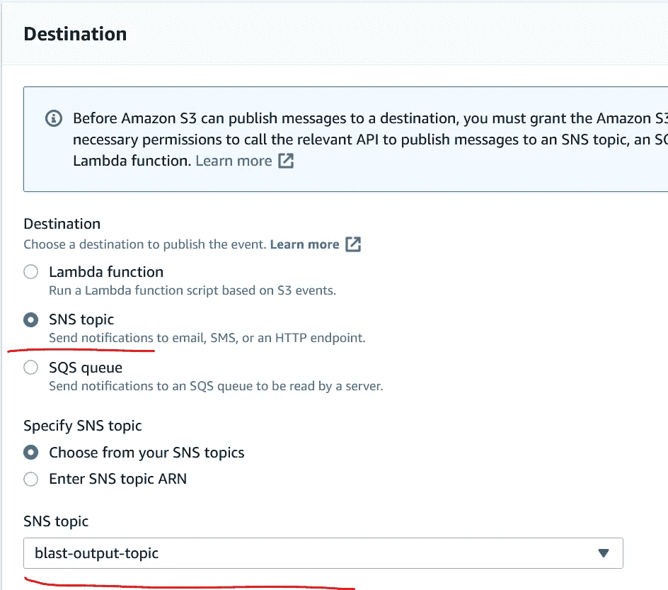

图 6。事件通知设置。图片作者。

您现在可以通过创建一个文件夹`results`并在其中上传一个. gz 文件来测试设置。如果你收到主题名为的邮件，恭喜你！

# 2.在 CloudShell 中运行 ElasticBLAST

现在是时候运行 ElasticBLAST 本身了。打开一个 CloudShell 会话。在撰写本文时，版本是 0.2.5。NCBI 官方快速入门中缺少一个命令`pip install wheel`。因此，执行以下命令来下载并验证二进制文件`elastic-blast`:

如果您可以看到版本号和帮助消息，则您的安装是成功的。接下来，我们需要编写一个配置文件。调整下面模板中的内容，用`vi`或`cat`粘贴到一个名为`BDQA.ini`的文件中(如果需要帮助，请在此处阅读[或在此处](https://www.dummies.com/web-design-development/web-hosting/how-to-edit-files-with-vi/)[阅读](https://www.linux.com/training-tutorials/using-cat-text-editor/))。然后，在当前目录中应该有一个文件:`BDQA.ini`。

这个配置文件指示 ElasticBLAST 从 NCBI 为我们准备的`s3://elasticblast-test/queries/`桶中查询`BDQA01.1.fsa_aa`文件中的序列。这是一种与海洋微生物相关的病毒宏基因组。该作业将在 10 个节点上运行，结果将被写入您的 S3 存储桶中的`results/[RunName]`文件夹。我将`-outfmt`设置为`6`，因为这种格式比 NCBI 文档中的`7`更容易处理。参考数据库是 refseq_protein。如需更多数据库，请阅读以下链接:

[](https://github.com/ncbi/blast_plus_docs#blast-databases) [## NCBI/爆炸 _ 加 _ 文件

### 该存储库包含 Docker 映像中 NCBI BLAST+命令行应用程序的文档。我们会…

github.com](https://github.com/ncbi/blast_plus_docs#blast-databases) 

您也可以制作并上传自己的数据库:

 [## 弹性塑料

### 使用 spot 实例和可抢占节点运行 ElasticBLAST。这可能会降低成本，但会延长运行时间。"…

blast.ncbi.nlm.nih.gov](https://blast.ncbi.nlm.nih.gov/doc/elastic-blast/configuration.html#elb-db) 

您可以启用自动关机功能:

 [## 弹性塑料

### 此功能使 ElasticBLAST 能够监控其状态，并在出现故障或…时关闭云资源

blast.ncbi.nlm.nih.gov](https://blast.ncbi.nlm.nih.gov/doc/elastic-blast/janitor.html#janitor) 

现在执行这个命令开始 ElasticBLAST 运行:

等待命令完成。您可以通过以下方式监控状态:

在输出中，您可以看到 ElasticBLAST 将输入分成 11 个部分。一旦所有 11 个都在`Succeeded`行，任务就完成了。

但是正如我之前所说的，很难抓住一个实时的 CloudShell 会话，看着它变干。因为我们已经设置了 SNS 通知，所以我们可以关闭 CloudShell，转而查看我们的电子邮件。一旦你收到 11 封邮件，你就知道整个工作完成了。

在我们继续之前，我们应该清理云资源，以避免 AWS 的意外账单。

# 3.在 DataBrew 中分析结果

如果示例运行成功，您应该在 S3 存储区的`results/[RunName]`文件夹中看到 11 个 batch_*.out.gz 文件。我们可以立即用 DataBrew 直观地分析这些输出。

首先，前往 AWS Glue DataBrew。创建一个项目`BDQA`。然后选择`New dataset`，命名为`BDQABlastOutput`。用您的 ElasticBLAST 输出位置调整以下字符串，并将其放在`Enter your source from S3`下。

```
s3://[YourBucketName]/results/[RunName]/<[^/]+>.out.gz
```

`<[^/]+>.out.gz`部分指示 DataBrew 搜索所有扩展名为. out.gz 的文件。

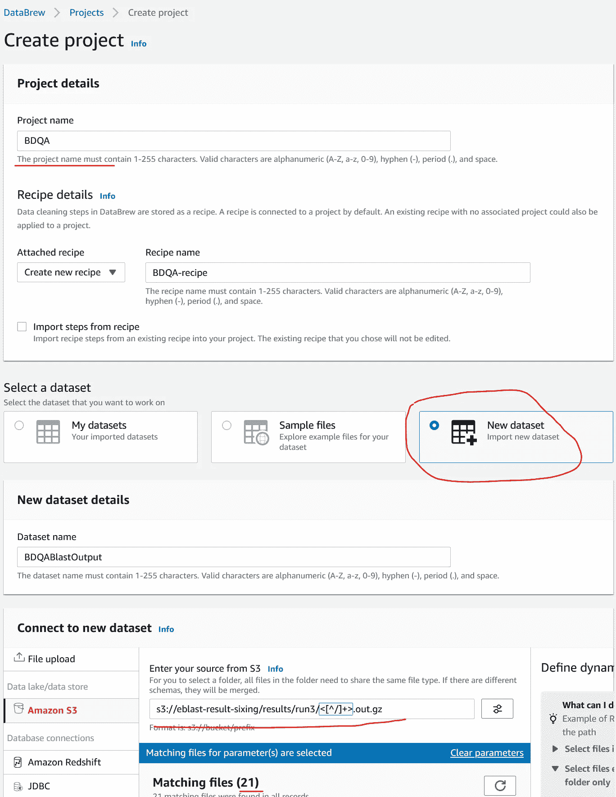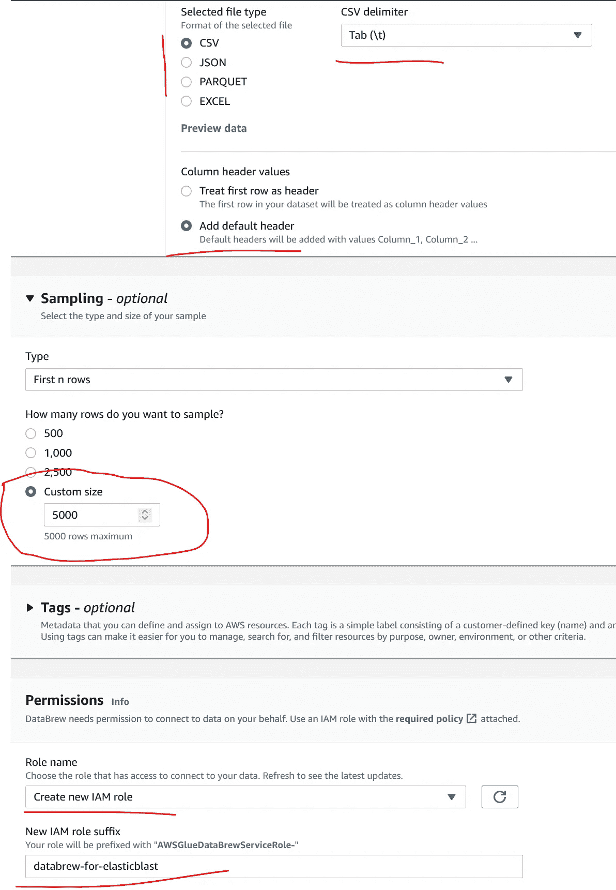

图 7。数据 Brew 设置。图片作者。

选择`Selected file type`下的`CSV`和`Tab (\t)`作为分隔符。另外，选择`Add default header`是因为 BLAST 的 outfmt 6 没有表头。将`Sampling`大小调整为 5000，虽然我检查了只有 3796 行结果(你的结果可能会有所不同)。最后，创建一个后缀为`databrew-for-elasticblast`的新 IAM 角色。点击`Create project`。

之后，DataBrew 会将数据加载到一个包含列统计信息的电子表格中。点击`SCHEMA`并按照正确的顺序用这些值修改列名:

```
qaccver, saccver, pident, length, mismatch, gapopen, qstart, qend, sstart, send, evalue, bitscore, sskingdoms, ssciname
```

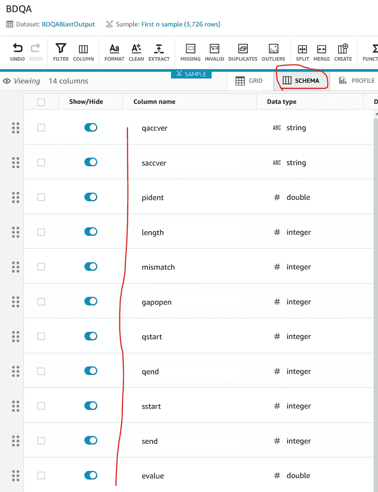

图 8。DataBrew 中的模式编辑。图片作者。

现在，当你点击`GRID`时，你会看到最精彩的结果。它显示总共有 3796 次爆炸命中。

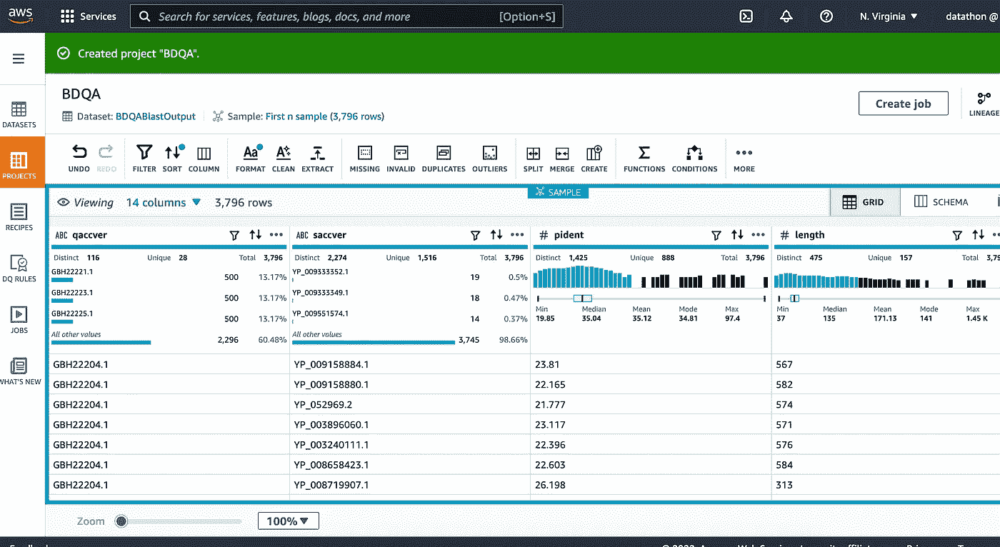

图 9。弹力纤维形成数据纤维。图片作者。

仔细检查后，很明显每个查询`qaccver`可以有多个命中。我们可以通过点击`qaccver`旁边的`…`并选择`Remove duplicate values`并点击右侧面板上的`Apply`来移除重复值。这样，我们只检查每个查询的顶部命中。

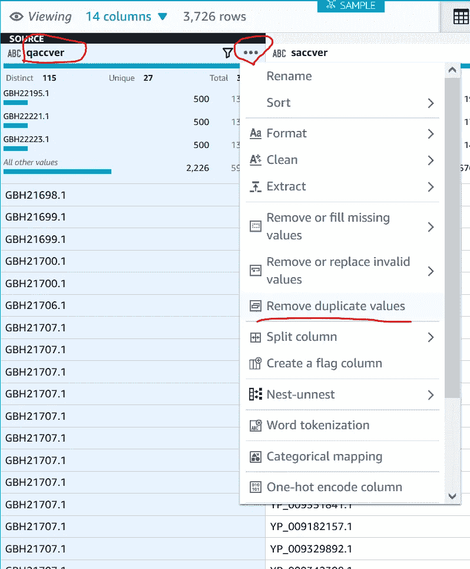

图 10。删除 DataBrew 中的重复值。图片作者。

去复制后，揭示了在 548 个输入序列中，只有 116 个蛋白质命中。

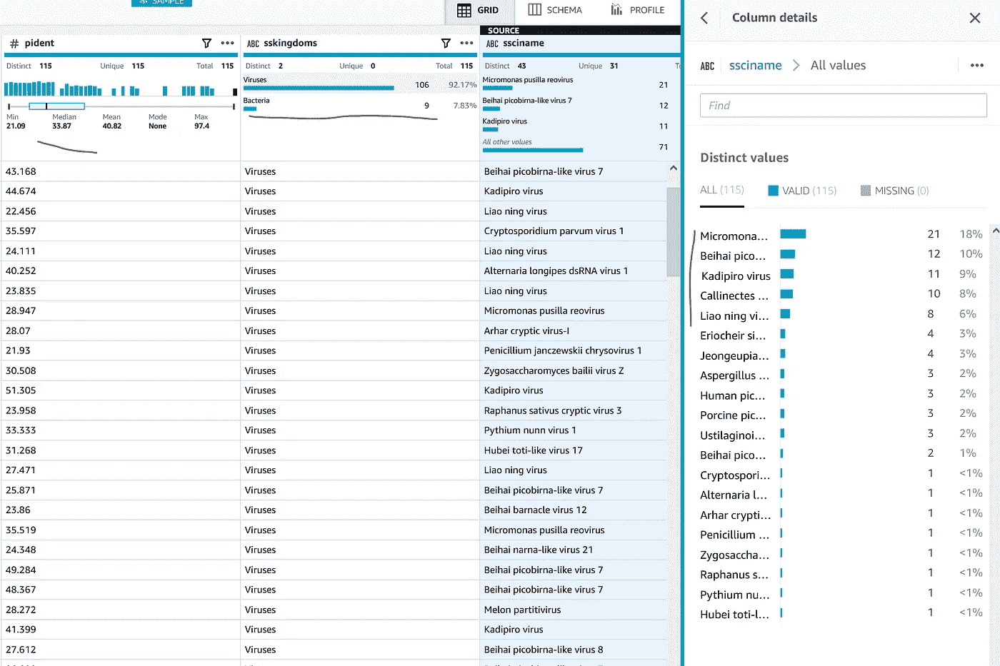

图 11。在数据库中，ElasticBLAST 结果的百分比同一性、主题界和主题学名。图片作者。

现在我们可以看到这 116 个蛋白质的百分比同一性(pident)不是很高。中位数仅为 33.83%。这表明这些病毒序列相当新颖。其中九个是细菌的热门。所以样本可能有细菌污染。微小单胞菌呼肠孤病毒、乌桕呼肠孤病毒、辽宁病毒位列五大打击生物。它们都与海洋栖息地有关。微小单胞菌呼肠孤病毒是从海洋原生生物*微小单胞菌*中分离出来的，而无齿海蟹呼肠孤病毒是青蟹的病原。据[张*等人*。](https://virologyj.biomedcentral.com/articles/10.1186/s12985-020-01382-2)、廖宁病毒首先出现在澳洲的南太平洋地区，然后传播到 mainland China。相反，卡迪皮罗病毒是从蚊子中分离出来的。

# 结论

ElasticBLAST 是我们云原生生物信息工作流程的一大补充。只需一个网络浏览器，我们就可以在云中爆炸序列、清理结果并可视化结果，而无需下载、配置超级计算机或与同事争夺计算机资源。它具有可扩展性和成本效益。

开始时，ElasticBLAST 需要加快基础设施的建设并转移数据库。一旦它变热，爆炸就开始了。因此，对于小型查询数据集，初始运行可能比 web BLAST 需要更长的时间。但是随后的运行不再需要准备，因此完成得更快。因此，查询数据集越大，速度就越快。

与网络爆炸不同，这次是用户买单。但是成本很低。NCBI 数据库的启用不产生费用。用户支付剩余的云服务费用。在 AWS 上，ElasticBLAST 调用`m5.8xlarge`实例。每一个都有 32 个 vCPUs，每小时按需收费 1.536 美元。此外，SNS 的前 1000 封邮件是免费的。每个 DataBrew 互动环节时长 30 分钟，费用 1 美元。但是，前 40 个互动会话对首次用户是免费的。

本文中的工作流只是一个开始。您可以设置另一个 SNS 来触发 AWS Glue crawler。爬虫从 BLAST 结果中创建一个数据目录，然后您可以使用 Athena 查询它。您也可以触发一个 Lambda 函数来创建一个[克朗图](https://github.com/marbl/Krona/wiki)来可视化结果。

今天就用 ElasticBLAST 为你的生物信息学研究增压，请告诉我你的体验。

感谢来自 NCBI 的 Ravinder Pannu Eskandary、Tom Madden 和 Christiam Camacho 给我这个机会。

[](https://dgg32.medium.com/membership) [## 加入媒介与我的介绍链接-黄思兴

### 作为一个媒体会员，你的会员费的一部分会给你阅读的作家，你可以完全接触到每一个故事…

dgg32.medium.com](https://dgg32.medium.com/membership)