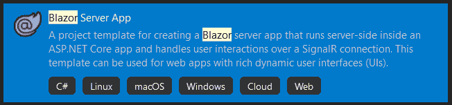
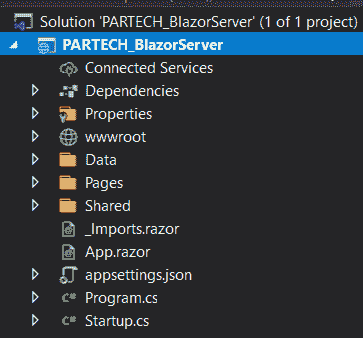
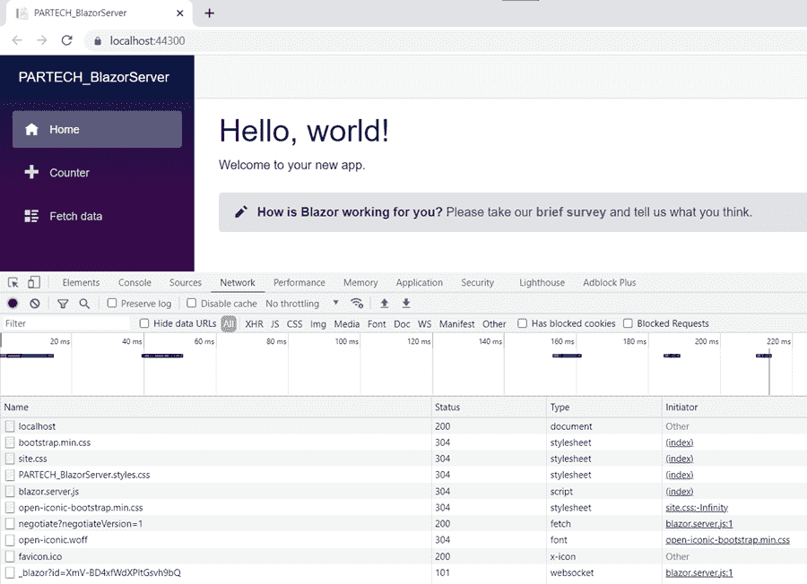
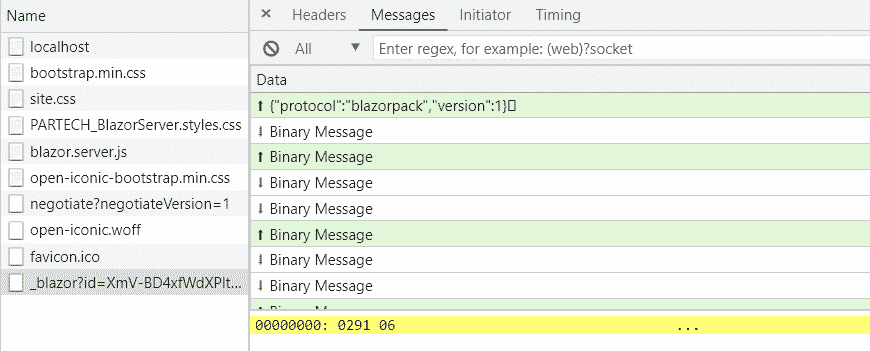
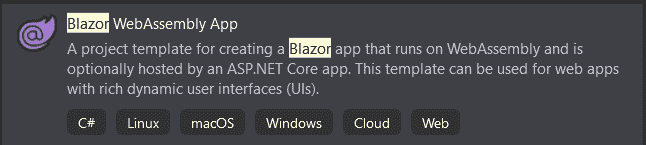
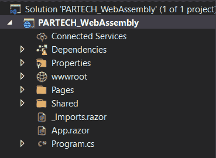
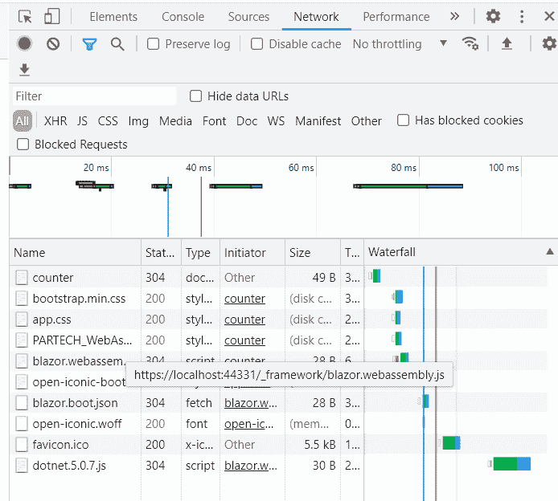
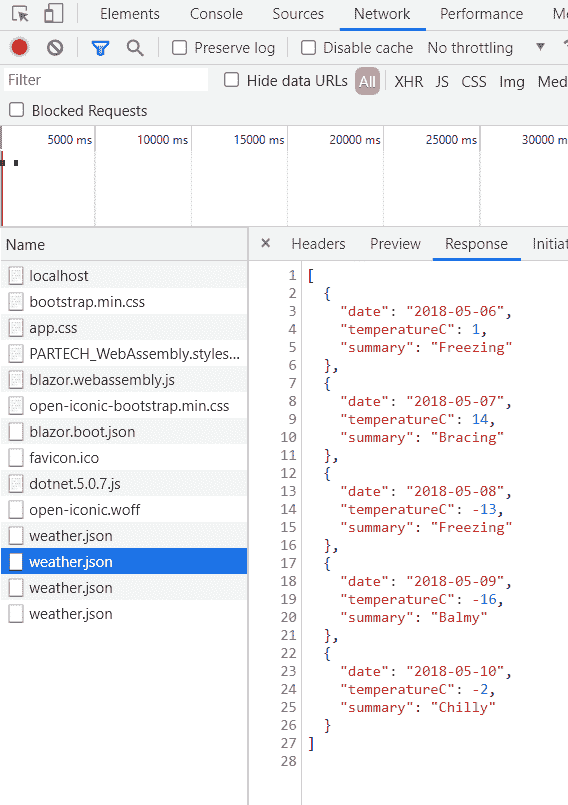

# Blazor 服务器与 Blazor Web 程序集

> 原文：<https://medium.com/codex/blazor-server-vs-blazor-web-assembly-866a44bfebc?source=collection_archive---------1----------------------->

在 web 开发中，JavaScript 在实现客户端功能方面起着关键作用。它通过修改浏览器的文档对象模型(DOM)来工作。这反过来又节省了大量的后端调用。结果—您可以毫不费力地构建功能。

最近，开发了基于 JavaScript 的 UI 框架的高级版本(Angular、Vue、React 等等)。这些 UI 框架使用类型脚本(JavaScript 的超集，有助于大型应用程序的开发)。

为了更好地实现客户端功能，需要学习 Javascript。然而，基于 UI 框架，一个人需要学习的 JavaScript 版本也不同。为了减少对 JavaScript 的依赖，微软发布了最新的 web 框架 Blazor。

它帮助开发人员通过 Blazor web 框架实现相同的 JavaScript 功能。在本帖中，让我们详细了解 Blazor 及其托管模型。

**目录**

1.  布拉索是什么？
2.  什么是 Blazor 服务器？
3.  Blazor 服务器的优缺点
4.  Blazor Web 程序集的利与弊
5.  实现 Blazor 服务器
6.  实现 Blazor Web 程序集
7.  结论

# 布拉索是什么？

Blazor 是微软公司的一个开源 web 框架。它于 2018 年发布。它允许开发人员使用 C#和。Net 库，而不是客户端的 JavaScript。它有助于在浏览器中运行应用程序，并且可以通过两种技术托管，即。web 程序集和 web 服务器。

# 什么是 Blazor 服务器？

Blazor Server 是一种托管技术，它是与。网芯 3.0 版本。它使用 ASP.Net 核心应用程序，这有助于集成服务器端功能。

与此同时，客户端页面是使用 Razor 组件创建的。在运行应用程序时，使用 SignalR(ASP 的开源库)在浏览器和服务器端之间建立连接。用于向客户端 web 应用程序发送异步通知的基于. Net 的应用程序)。

然后，服务器将有效负载发送给客户机，客户机更新页面。它还支持服务器和客户端之间的双向通信。

# Blazor 服务器的优缺点

以下是使用 Blazor 服务器的一些优势

*   由于用户不需要下载应用程序库，因此应用程序的加载和渲染速度很快。
*   后端代码被隔离，因为 C#文件没有被发送到客户端。
*   它也支持和工作在旧版本的浏览器中。

以下是使用 Blazor 服务器的一些缺点-

*   当页面从服务器发送到客户端时，只要网络不稳定，离线支持就会成为问题。
*   随着应用程序为每个连接创建新的 WebSockets，可伸缩性将是一个挑战，因为消耗的内存量将是巨大的。

# 什么是 Blazor web assembly？

Blazor Web Assembly (WASM)于 2020 年 5 月发布。它的工作方式非常类似于单页应用程序(SPA)框架(Angular，React，Vue..).在这里，C#和 Razor 组件被编译为。Net 程序集，然后下载并在浏览器端(客户端)运行。

一旦应用程序下载到客户端并开始运行，这里就不需要 SignalR 来维护服务器和客户端之间的连接。服务器端的功能不能与这个应用程序集成，它需要一个 Web API 来通信和交换所需的数据。

# Blazor Web 程序集的利与弊

以下是使用 Blazor Web Assembly 的一些好处

*   初始加载后，UI 对用户请求的反应更快(除了外部 API 调用)，因为网站的全部内容都是在客户端下载的。
*   由于应用程序是在客户端下载的，因此在出现网络问题时可以提供离线支持。

使用 Blazor Web Assembly 的唯一缺点是应用程序的初始加载时间很长。

# 实现 Blazor 服务器

打开 Visual Studio 2019，选择“创建新项目”并查找 Blazor Server。

选择项目并为解决方案提供一个有效的名称，然后选择您所选择的框架。创建项目后，文件夹结构如下所示。

现在，这就是如何创建一个标准的基于 Blazor 服务器的应用程序。要了解服务器和客户端之间的数据通信，请从浏览器打开开发者工具，转到网络选项卡并重新加载页面。

如果您注意到，在 SignalR 通信中会出现 blazor.server.js 和服务器样式。信号通信有助于二进制格式的数据通信。网页上的每个按钮点击都会在 SignalR communication 下的 messages 选项卡中添加额外的网络调用，这表明页面正在被请求并从服务器端获取。

# 实现 Blazor Web 程序集

打开 Visual Studio 2019，选择新建项目，寻找 Blazor Web assembly App。

并重复上一节中的步骤 2。

为了理解 Blazor Web Assembly 的工作原理，让我们运行应用程序并从浏览器的开发工具中打开 networks 选项卡。

如果您注意到，blazor.webassembly.js 文件将与 dotnet.version.js 文件一起出现。这表明 web 程序集已加载。

一旦在选项卡之间切换，服务器和客户端之间就不会发生通信(不像 Blazor 服务器通过 SignalR)。相反，只会以 JSON 格式获取所需的数据。

转到获取数据选项卡，一个网络电话与天气。将立即添加 JSON 文件。在这里，数据被存储在一个 JSON 文件中，这个文件被直接拉取。

# 结论

Blazor 的两种托管方式各有利弊。如果您有不能公开的敏感代码，请使用 Blazor 服务器。另一方面，如果你想服务于一个大的客户群，就去找 Blazor web assembly。

*原载于*[*https://www . partech . nl*](https://www.partech.nl/nl/publicaties/2021/07/blazor-server-vs-blazor-web-assembly)*。*