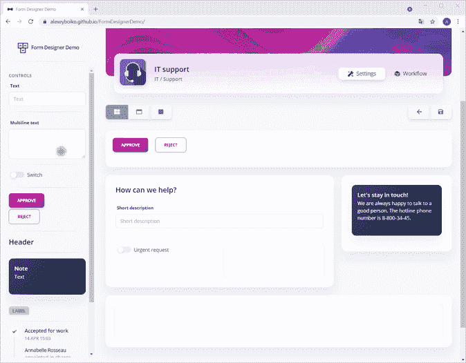

# Blazor WebAssembly:基于 JSON 配置的组件动态创建

> 原文：<https://medium.com/codex/blazor-webassembly-dynamic-creation-of-components-based-on-json-configuration-d1df664e5e19?source=collection_archive---------3----------------------->

该注释描述了一种使用 ASP.NET 核心 6.0 [DynamicComponent](https://docs.microsoft.com/en-us/aspnet/core/blazor/components/dynamiccomponent?view=aspnetcore-6.0) (目前处于预览状态)通过 JSON 配置向页面动态添加组件的方法。

组件的动态创建可用于表单生成器:

*   表单由 JSON 配置；
*   表单元素(或组件)不限于预定义的集合。可以添加新的组件。也可以从其他 dll 库中加载新的组件。

看一个表单生成器的原型: [Blazor WebAssembly 表单生成器演示](https://alexeyboiko.github.io/FormDesignerDemo/)。



用 Blazor WebAssembly 构建的可视化表单生成器

# 带有事件数字按钮的组件示例

带有参数和事件的组件示例:

```
<button type="button" [@onclick](http://twitter.com/onclick)=Click>[@Num](http://twitter.com/Num)</button>[@code](http://twitter.com/code) {
    [Parameter]
    public int Num { get; set; } [Parameter]
    public EventCallback<int> OnClick { get; set; } async Task Click() 
        => await OnClick.InvokeAsync(Num);
}
```

*清单 1。NumButton 组件。*

数字按钮标准，非动态，用法:

```
<NumButton Num=10 OnClick=Click />[@code](http://twitter.com/code) {  
    async Task Click(int count)
        => await JsRuntime.InvokeVoidAsync("alert", count);
}
```

*清单 2。数字按钮用法。*

# 用事件处理程序动态创建组件

NumButton 可以用 DynamicComponent 创建:

```
<DynamicComponent Type=ComponentType
                  Parameters=ComponentParameters />[@code](http://twitter.com/code) {
    Type ComponentType;
    Dictionary<string, object> ComponentParameters; protected override void OnInitialized() {
        ComponentType = typeof(NumButton);
        ComponentParameters = new Dictionary<string, object> {
            { "Num", 10}
        };
    } async Task Click(int count)
        => await JsRuntime.InvokeVoidAsync("alert", count);
}
```

*清单 3。正在使用 DynamicComponent 创建 NumButton。未设置 OnClick 处理程序。*

没什么复杂的，这在[动态组件文档](https://docs.microsoft.com/en-us/aspnet/core/blazor/components/dynamiccomponent)中有详细说明。但是文档没有描述如何订阅触发动态创建的组件的事件。在示例中，这是“OnClick”事件。

使用 EventCallback。工厂创建事件处理程序:

```
<DynamicComponent Type=ComponentType
                  Parameters=ComponentParameters />[@code](http://twitter.com/code) {
    Type ComponentType;
    Dictionary<string, object> ComponentParameters; protected override void OnInitialized() {
        ComponentType = typeof(NumButton);
        ComponentParameters = new Dictionary<string, object> {
            { "Num", 10}, // event subscription
            { "OnClick",
               EventCallback.Factory.Create<int>(this, Click)}
        };
    } async Task Click(int count)
        => await JsRuntime.InvokeVoidAsync("alert", count);
}
```

*清单 4。使用 OnClick 处理程序创建带有 DynamicComponent 的 NumButton。*

# 基于 JSON 配置的组件动态创建

JSON 配置如下所示:

```
{
    "TypeName": "FormDesignerDemo.Components.NumButton",
    "Parameters": {
        "Num": {
            "TypeName": "System.Int32",
            "Value": 10
        }
    }
}
```

*清单 5。NumButton 的 JSON 配置。*

在这个例子中,“Num”参数是原始类型“System”。Int32”。参数不必是基本的，任何可序列化的类型都可以使用。

以下类符合这种 JSON 格式:

```
class ComponentDto {
    public string TypeName { get; set; }
    public Dictionary<string, ParameterValueDto> Parameters
                                                  { get; set; }
}class ParameterValueDto {
    public string TypeName { get; set; }
    public object Value { get; set; }
}
```

*清单 6。描述可序列化为 JSON 的动态组件的数据传输对象类。*

最有可能的是，在一个真实的项目中，您不需要手动处理 JSON。在您的 Blazor 应用程序中，使用以下代码自动反序列化:

```
await Http.GetFromJsonAsync<ComponentDto>(...)
```

让我们创建一个动态组件的描述:

```
class ComponentDescription {
    public Type ComponentType { get; set; }
    public Dictionary<string, object> Parameters { get; set; }
}
```

*清单 7。动态组件的描述。*

和 DTO 到组件描述转换助手:

```
static class ComponentDtoToComponent {
    public static ComponentDescription ToComponent(
        this ComponentDto dto) { return new ComponentDescription {
            ComponentType = Type.GetType(dto.TypeName),
            Parameters = dto.Parameters?.ToDictionary(
                pp => pp.Key,
                pp => pp.Value != null
                    ? JsonSerializer.Deserialize(
                        ((JsonElement)pp.Value.Value).GetRawText(), 
                        Type.GetType(pp.Value.TypeName))
                    : null)
                ?? new Dictionary<string, object>()
        };
    }
}
```

清单 8。DTO 到组件描述转换帮助程序。

完整代码:

```
<DynamicComponent Type=Comp.ComponentType
                  Parameters=Comp.Parameters />[@code](http://twitter.com/code) {
    ComponentDescription Comp; protected override void OnInitialized() {
        Comp = JsonSerializer.Deserialize<ComponentDto>(@"
            {
                ""TypeName"":
                     ""FormDesignerDemo.Components.NumButton"",
                ""Parameters"": {
                    ""Num"": {
                        ""TypeName"": ""System.Int32"",
                        ""Value"": 10
                    }
                }
            }")
        .ToComponent(); Comp.Parameters.Add("OnClick", 
            EventCallback.Factory.Create<int>(this, Click));
    } async Task Click(int count)
        => await JsRuntime.InvokeVoidAsync("alert", count);
}
```

*清单 9。基于 JSON 配置和设置事件处理程序的组件动态创建。*