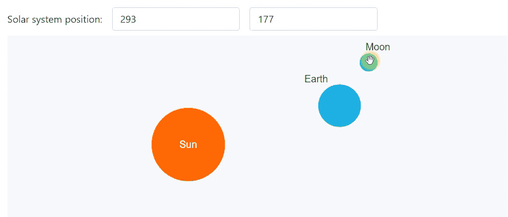
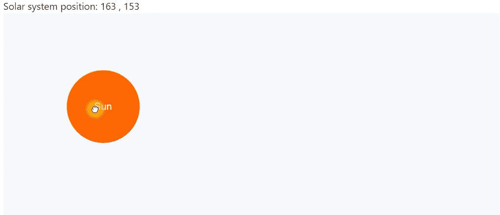
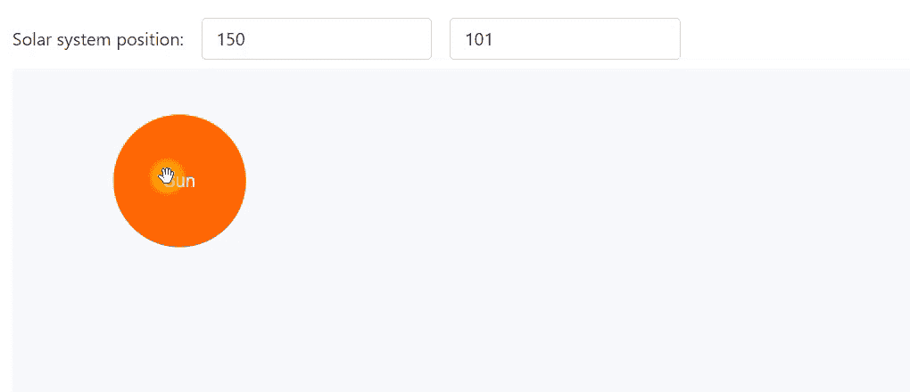
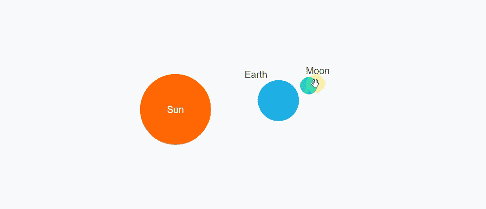

# Blazor Webassembly SVG 拖放

> 原文：<https://medium.com/codex/blazor-webassembly-svg-drag-and-drop-e680769ac682?source=collection_archive---------1----------------------->

[试玩](https://alexeyboiko.github.io/BlazorDraggableDemo/) | [GitHub](https://github.com/AlexeyBoiko/BlazorDraggableDemo)



Blazor Webassembly SVG 拖放演示。可拖动组件支持嵌套可拖动、双向绑定、无参数绑定的初始化

本文描述了一种实现 SVG 对象拖放的方法。在此过程中，考虑了 Blazor 的以下开发要点:

*   模板化组件。模板化组件的内容可以在父组件中设置；
*   将事件从父组件传递到子组件(父->子)；
*   组件内部重新布线组件输入参数问题([参数被覆盖问题](https://docs.microsoft.com/en-us/aspnet/core/blazor/components/?view=aspnetcore-5.0#overwritten-parameters-1))；
*   父组件和子组件之间的双向绑定。那些。子组件的输入参数可以修改父组件和子组件；
*   如何与 Blazor 一起使用 stopPropagation？

# 我们最终会得到什么

结果是一个 Blazor 组件——可拖动的。使用示例:

```
[@inject](http://twitter.com/inject) MouseService mouseSrv;<svg ae jd" href="http://www.w3.org/2000/svg" rel="noopener ugc nofollow" target="_blank">http://www.w3.org/2000/svg"
  [@onmousemove](http://twitter.com/onmousemove)=@(e => mouseSrv.FireMove(this, e))
  [@onmouseup](http://twitter.com/onmouseup)=@(e => mouseSrv.FireUp(this, e))>> <Draggable X=250 Y=150>
    <circle r="60" fill="#ff6600" />
    <text text-anchor="middle"
      alignment-baseline="central" style="fill:#fff;">Sun</text>
  </Draggable>
</svg>
```

*清单 1。使用可拖动组件*

可拖动的连同它的内容将被拖动。

x 和 Y 参数支持双向绑定:

```
[@inject](http://twitter.com/inject) MouseService mouseSrv;<svg ae jd" href="http://www.w3.org/2000/svg" rel="noopener ugc nofollow" target="_blank">http://www.w3.org/2000/svg"
  [@onmousemove](http://twitter.com/onmousemove)=@(e => mouseSrv.FireMove(this, e)) 
  [@onmouseup](http://twitter.com/onmouseup)=@(e => mouseSrv.FireUp(this, e))>> <Draggable [@bind](http://twitter.com/bind)-X=X [@bind](http://twitter.com/bind)-Y=Y>
    <circle r="60" fill="#ff6600" />
      <text text-anchor="middle"
        alignment-baseline="central" style="fill:#fff;">Sun</text>
  </Draggable>
</svg>[@code](http://twitter.com/code) {
    double X = 250;
    double Y = 150;
}
```

*清单 2。使用双向绑定 X、Y 的可拖动工具*

如果你只是需要一个现成的解决方案，你不需要阅读这篇文章——直接阅读文章最后的“如何在你的项目中使用可拖动组件”。

# 主要思想

使用 g 分组元素并“转换”到 SVG 对象的位置很方便:

```
<svg style="width:500px; height:300px"
  ae jd" href="http://www.w3.org/2000/svg" rel="noopener ugc nofollow" target="_blank">http://www.w3.org/2000/svg"> <g transform="translate(250, 150)">
    <circle r="60" fill="#ff6600" />
      <text text-anchor="middle"
        alignment-baseline="central" style="fill:#fff;">Sun</text>
  </g></svg>
```

*清单 3。使用 translate 定位一组 SVG 对象*


图一。使用 translate 定位一组 SVG 对象

要“拖动”，需要订阅鼠标移动事件并更改“翻译”值。

# 模板化组件可拖动

清单 1 展示了 Draggable 组件的使用。Draggable 是一个模板化的组件，它包装了<g>中的内容:</g>

```
<g transform="translate([@x](http://twitter.com/x), [@y](http://twitter.com/y))">
  [@ChildContent](http://twitter.com/ChildContent)
</g>[@code](http://twitter.com/code) {
  [Parameter] public RenderFragment? ChildContent { get; set; }double x = 250;
  double y = 150;
}
```

*清单 4。模板化组件可拖动包装<g>中的内容*

当 x，y 改变时，<g>的位置会随着内容而改变。</g>

要拖动(正确更改 x，y)，需要以下事件:

1.  用户开始拖动时的事件。
    它是< g >元素上的“onmousedown”。注意< g >不是一个矩形，< g >的边框遵循嵌套对象的轮廓。那些。对于清单 3，onmousedown 将只在圆圈内触发，这正是我们所需要的。
2.  按下鼠标时光标移动的事件。
    思考< g >元素上的“onmousemove”？不会。在快速移动的情况下，鼠标超出了< g >的界限,“onmousemove”停止工作。因此，“onmousemove”需要订阅整个< svg >并且事件必须转发给 Draggable。
3.  用户完成拖动(抬起)鼠标时的事件。
    <g>上的“onmouseup”也不合适，原因相同:快速移动时，鼠标超出< g >的界限，“onmouseup”不起作用。原来“onmouseup”需要订阅整个< svg >。

# 将事件从父组件传递到子组件(父->子)

事实证明，我们需要一种方法来订阅父<svg>的“onmousemove”和“onmouseup”事件。这可以通过使用单例服务来实现:</svg>

```
// inject IMouseService into subscribers
public interface IMouseService {
  event EventHandler<MouseEventArgs>? OnMove;
  event EventHandler<MouseEventArgs>? OnUp;
}// use MouseService to fire events
public class MouseService : IMouseService {
  public event EventHandler<MouseEventArgs>? OnMove;
  public event EventHandler<MouseEventArgs>? OnUp; public void FireMove(object obj, MouseEventArgs evt) 
    => OnMove?.Invoke(obj, evt);
  public void FireUp(object obj, MouseEventArgs evt)
    => OnUp?.Invoke(obj, evt);
}
```

*清单 5。在需要订阅事件的组件中使用 IMouseService。使用触发事件的鼠标服务*

MouseService 需要注册为 singleotn，以便所有组件接收一个服务实例:

```
builder.Services
  .AddSingleton<MouseService>()
  .AddSingleton<IMouseService>(ff 
    => ff.GetRequiredService<MouseService>());
```

*清单 6。MouseService 注册为 singleton*

现在可以使用 MouseService 了。

订阅<svg>事件并激活鼠标服务事件:</svg>

```
[@inject](http://twitter.com/inject) MouseService mouseSrv;<svg style="width:500px; height:300px" 
  ae jd" href="http://www.w3.org/2000/svg" rel="noopener ugc nofollow" target="_blank">http://www.w3.org/2000/svg"
  [@onmousemove](http://twitter.com/onmousemove)=@(e => mouseSrv.FireMove(this, e)) 
  [@onmouseup](http://twitter.com/onmouseup)=@(e => mouseSrv.FireUp(this, e))>> <Draggable>
    <circle r="60" fill="#ff6600" />
      <text text-anchor="middle"
        alignment-baseline="central" style="fill:#fff;">Sun</text>
  </Draggable></svg>
```

*清单 7。向全局单体服务*触发<SVG>“onmousemove”和“onmouseup”事件

订阅 Draggable 内部的<svg>事件:</svg>

```
[@inject](http://twitter.com/inject) IMouseService mouseSrv;

<g transform="translate([@x](http://twitter.com/x), [@y](http://twitter.com/y))" [@onmousedown](http://twitter.com/onmousedown)=OnDown>
  [@ChildContent](http://twitter.com/ChildContent)
</g>[@code](http://twitter.com/code) {
  [Parameter] public RenderFragment? ChildContent { get; set; } double x = 250;
  double y = 150; protected override void OnInitialized() { mouseSrv.OnMove += OnMove;
    mouseSrv.OnUp += OnUp; base.OnInitialized();
  } void OnDown(MouseEventArgs e) {...}
  void OnMove(object? _, MouseEventArgs e) {... x=... y=...}
  void OnUp(object? _, MouseEventArgs e) {...} public void Dispose() {
    mouseSrv.OnMove -= OnMove;
    mouseSrv.OnUp -= OnUp;
  }
}
```

*清单 8。可拖动组件。订阅鼠标服务事件和< g >元素*的“onmousedown”

注意 Dispose 方法:您需要取消订阅。

现在 Draggable 内部有了所有必要的事件:

*   OnDown —拖动开始事件，
*   OnMove —改变鼠标位置，
*   OnUp —拖动结束事件。

我们可以实现拖放算法:

1.  在“OnDown”上，设置“鼠标按下”标志并记住光标位置；
2.  在“OnMove”上，如果“鼠标被按下”:
    -计算新旧光标位置之间的差值；
    -记住当前光标位置；
    -改变 x，y-添加到当前增量值。
    光标的具体坐标不重要，增量才重要。

为了简洁起见，这里不包括算法的代码——看看 GitHub。

# 输入参数重写问题

现在 Draggable 已经在工作了，但是没有办法设置起始位置——即设置参数 x，y。

如果我们将内部的 x，y 字段作为输入参数(清单 9)，那么我们可以设置开始位置(清单 10)，但是拖放将停止工作。

```
...
[@code](http://twitter.com/code) {
  …
  [Parameter]  double x { get; set; };
  [Parameter]  double y { get; set; };
  …
  void OnMove(object? _, MouseEventArgs e) {... x=... y=...}
```

*清单 9。可拖动组件。私有 x，y 作为公共输入参数。在组件内部，x，y 被更新(在 OnMove 方法中)。不是一个可行的选择。*

```
<Draggable x=250 y=150>
  ...
</Draggable>
```

*清单 10。在父组件*中设置可拖动的输入参数

由于参数被覆盖的问题，拖放停止工作。那些。覆盖组件内部的输入参数。会发生以下情况:

*   可拖动更新 x，y
*   这将导致组件被重新呈现
*   重新渲染导致输入参数重置，即 x，y 再次变为 250，150。

由此得出一般规则:最好避免更新组件内部的输入参数——这会导致意外的行为。

我们可以如下解决问题:

*   让内部字段 x，y 保持原样—不要将它们作为输入参数，
*   为参数创建单独的属性，
*   在初始化时设置内部字段 x，y 的初始值

```
...
[@code](http://twitter.com/code) {
  ...
  double x;
  double y; [Parameter]  double X { get; set; }
  [Parameter]  double Y { get; set; } protected override void OnInitialized() {
    x = X;
    y = Y;
    ...
  }
  …
  void OnMove(object? _, MouseEventArgs e) {... x=... y=...}
```

*清单 11。可拖动组件。x、y 字段在初始化*时初始化

这种解决方案的缺点是在初始化后更新输入参数不会有任何影响:我们不能从父组件改变对象的位置。此外，这个缺点将被修复。

# 父组件和子组件之间的双向绑定

## Child -> Parent binding:参数在组件内部被更新，父组件被通知这个变化

子->父绑定是通过添加 EventCallback 类型的“XChanged”、“YChanged”输入参数来完成的。命名规则:“{参数名称}已更改”。

```
...
[@code](http://twitter.com/code) {
  ..
  double x;
  double y; [Parameter] double X { get; set; }
  [Parameter] public EventCallback<double> XChanged { get; set; } [Parameter] double Y { get; set; }
  [Parameter] public EventCallback<double> YChanged { get; set; }
  ...
  void OnMove(object? _, MouseEventArgs e)  {
    ...
    x=... y=...
    XChanged.InvokeAsync(x);
    XChanged.InvokeAsync(xy;
  }
```

*清单 12。可拖动组件。x，Y 参数与子>父绑定*

现在我们可以跟踪父组件中的 X，Y 变化:

```
Solar system position: [@X](http://twitter.com/X) , [@Y](http://twitter.com/Y)
<svg>
  <Draggable [@bind](http://twitter.com/bind)-X=X [@bind](http://twitter.com/bind)-Y=Y>
  ...
  </Draggable>
</svg>[@code](http://twitter.com/code) {
  double X = 250;
  double Y = 150;
}
```

*清单 13。使用具有 X，Y 绑定的可拖动*



图 2。子组件更改输入参数，父组件订阅这些更改

## 父->子绑定:父组件更新子组件的参数

现在，父对象可以跟踪可拖动位置的变化，可以设置初始位置，但不能在初始化后更改位置。

子组件“开箱即用”接收对输入参数的更改:每当父组件发生更改时，就会调用 setters X，Y。整个问题是如何处理这些事件，并避免覆盖输入参数的问题(见上文)。

可拖动以支持两种选项:

*   设置初始位置而不跟踪变化，
*   跟踪更改，以及从父组件更改位置的能力。

```
setting the starting position without tracking changes
<Draggable X=250 Y=150>
...
</Draggable> tracking changes
<Draggable [@bind](http://twitter.com/bind)-X=X [@bind](http://twitter.com/bind)-Y=Y>
...
</Draggable>
```

*清单 14。可拖动的两个用例:有和没有变更跟踪*

代码变得难看。

```
...
double? x;
[Parameter]
public double X { 
  get { return x ?? 0; }
  set { if (!x.HasValue || (!isDown & XChanged.HasDelegate)) {
    x = value; } } 
}
[Parameter] public EventCallback<double> XChanged { get; set; }
...
protected override void OnInitialized() {
  mouseSrv.OnMove += OnMove;
  mouseSrv.OnUp += OnUp;
  base.OnInitialized();
}bool isDown;void OnDown(MouseEventArgs e) {... isDown = true; }
void OnMove(object? _, MouseEventArgs e) {... }
void OnUp(object? _, MouseEventArgs e) {isDown = false; }
```

*清单 15。可拖动组件。x、Y 输入参数可从父组件*中更改

算法:

*   如果初始化(！x.HasValue) —设置 x 的初始值，
*   如果用户当前正在移动组件(isDown)，我们忽略输入参数 X 的设置
*   如果组件当前没有被用户移动，并且输入参数被绑定到父属性(XChanged。HasDelegate) —更新 x。

y 也一样。



图 3。双向装订

# 可拖动的内部可拖动的内部可拖动的。停止向布拉索传播

当然我们应该试着把 Draggable 变成 Draggable。

```
<Draggable [@bind](http://twitter.com/bind)-X=X [@bind](http://twitter.com/bind)-Y=Y>
  <circle r="60" fill="#ff6600" />
  <text text-anchor="middle"
    alignment-baseline="central" style="fill:#fff;">Sun</text> <Draggable X=173 Y=-15>
    <circle r="35" fill="#1aaee5" stroke="#fff" />
    <Draggable X=-57 Y=-38>
      <text>Earth</text>
    </Draggable> <Draggable X=51 Y=-25>
      <circle r="15" fill="#04dcd2" stroke="#fff" />
      <Draggable X=-5 Y=-20>
        <text>Moon</text>
      </Draggable>
    </Draggable>
  </Draggable></Draggable>
```

*清单 16。可拖动内部可拖动*



图 4。可拖动内部不停止传播

不错，但无法使用。如果我们拖动嵌套的可拖动对象，外部的也开始拖动。

HTML 鼠标事件如“onmousedown”是自下而上浮动的。那些。首先为内部元素触发“onmousedown ”,然后为父元素触发。

在 Draggable 中，拖动开始事件是“onmousedown”。如果我们不允许事件冒泡到父组件，那么只有嵌套的组件会被拖动。

```
<g transform="translate([@x](http://twitter.com/x), [@y](http://twitter.com/y))" cursor=[@cursor](http://twitter.com/cursor) [@onmousedown](http://twitter.com/onmousedown)=OnDown 
  [@onmousedown](http://twitter.com/onmousedown):stopPropagation="true">
  [@ChildContent](http://twitter.com/ChildContent)
</g>
```

*清单 17。可拖动组件。防止“onmousedown”事件冒泡*

现在我们可以画出太阳系:

*   月球绕着地球转，所以它和地球同时拖动。
*   地球绕着太阳转，所以地球和月亮和太阳同时拖动。


图 4。可拖动支持嵌套可拖动、双向绑定、无参数绑定的初始化

# 如何在项目中使用可拖动组件

1.  创建 MouseService —清单 5
2.  在 Program.cs 中注册 MouseService 清单 6
3.  从 GitHub 创建可拖动组件
4.  订阅 SVG 事件 onmousemove 和 onmouseup，并触发 MouseService 事件——清单 1

# 链接

[https://docs . Microsoft . com/en-us/aspnet/core/blazor/components/？view = aspnetcore-5.0 # overwritten-parameters-1](https://docs.microsoft.com/en-us/aspnet/core/blazor/components/?view=aspnetcore-5.0#overwritten-parameters-1)

[https://docs . Microsoft . com/en-us/aspnet/core/blazor/components/data-binding？view = aspnetcore-3.1 #父子绑定组件参数](https://docs.microsoft.com/en-us/aspnet/core/blazor/components/data-binding?view=aspnetcore-3.1#parent-to-child-binding-with-component-parameters)

[https://chrissainty . com/3-ways-to-communication-between-components-in-blazor/](https://chrissainty.com/3-ways-to-communicate-between-components-in-blazor/)

[https://visual studio magazine . com/articles/2020/01/27/suppressing-events-blazor . aspx](https://visualstudiomagazine.com/articles/2020/01/27/suppressing-events-blazor.aspx)