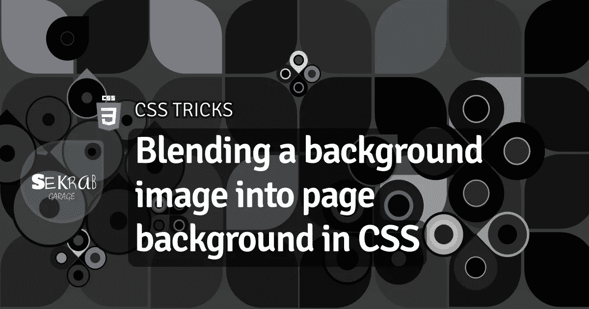
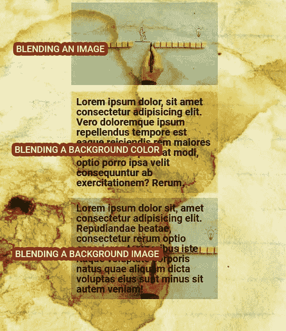

# 在 CSS 中将背景图像混合到页面背景中

> 原文：<https://medium.com/codex/blending-a-background-image-into-page-background-in-css-9872e1eeacaa?source=collection_archive---------2----------------------->

## CSS 技巧



谷歌一下，很有可能，你也遇到过这种情况，在将一张图片融入页面背景图片时遇到了麻烦。给出的大多数混合例子，混合一个层图像与局部背景颜色，或层本身的图像，忽略任何透明度。它不会融入页面背景。此外，很有可能，您遇到了令人反感的解决方案:绝对定位一个伪元素。今天，我尝试了一些方法，并与你分享唯一有效的方法。

解决方案的密码笔:

# 最初的 HTML

让我们从生成三种不同效果的基本 HTML 开始:混合前景图像、混合背景颜色和混合背景图像。

```
<div class="main">
	<div class="image-blend">
	  <!--Blending an image-->
		
	</div>
	<div class="text-blend">
	  <!--Blending the background color-->
		Lorem ipsum dolor, sit amet consectetur adipisicing elit. Vero doloremque ipsum repellendus tempore est
		eaque reiciendis rem maiores quos minima placeat modi, optio porro ipsa velit consequuntur ab
		exercitationem? Rerum.
	</div>
	<div class="bg-image-blend">
	  <!--Blending the background image-->
		Lorem ipsum dolor sit, amet consectetur adipisicing elit. Repudiandae beatae, consectetur rerum optio
		asperiores temporibus iste itaque voluptate corporis natus quae aliquam dicta voluptas eius sunt minus
		sit autem veniam!
	</div>
</div>
```

给定特别高对比度的背景，结果如下:



# 混合前景图像

这是最简单的部分，因为图像是一个实际的元素，我们所要做的就是添加`mix-blend-mode`

```
.image-blend  img {
  /*add blend mode directly*/
  mix-blend-mode: multiply;   
}
```

# 混合背景色

越来越难了。最初的诱惑是创建一个普通层，用背景色，然后添加`backdrop-filter`，或`background-blend-mode`。**聂越作品**。看起来他们都把图层作为一个独立的元素来处理，而忽略了页面背景。尝试使用 url 进行 SVG 过滤，也失败了，它将图层混合到自己的本地背景中。最后，解决方案，就像大家在网上说的那样，是用背景色创建一个**伪元素，并应用`mix-blend-mode`。**

```
.text-blend {
  /*make the container relative*/
  position: relative;
}
.text-blend:before {
  /*add background to a pseudo element as absolutely positioned layer*/
  content: "";
  display: block; position: absolute;
  top: 0;
  left: 0;
  right: 0;
  bottom: 0;

  /*add bg color, to reduce effect, reduce opacity*/
  background-color: rgb(125 120 17 / 39%);
  /*then simply add blend*/
  mix-blend-mode: color-burn;  
}
```

一个小小的改进是将文本放在另一个容器中，并使其相对，这样，里面的文本肯定在混合模式之上。

```
<div class="text-blend">
  <!--Blending the background color-->
  <div>
 Lorem ipsum dolor, sit amet consectetur adipisicing elit. Vero doloremque ipsum repellendus tempore est
 eaque reiciendis rem maiores quos minima placeat modi, optio porro ipsa velit consequuntur ab
 exercitationem? Rerum.
 </div>
</div>
```

CSS:

```
.text-blend div {
  /*make the container relative to be above blending layer*/
  position: relative;
}
```

# 混合背景图像

无法用传统方法混合简单的背景颜色，意味着混合背景图像自然会失败，所以我们应用了伪元素的相同技术。但是伪元素不能包含图像，我们用**绝对定位 HTML 图像元素**。容器包含两个元素，一个是文本，另一个是图像。文本在 z 轴上的位置必须更高，以免受到混合效果的影响。

在 HTML 中:

```
<div class="bg-image-blend">
  <!--add image element-->
  
  <!--and text wrapper-->
  <div>
  	Lorem ipsum dolor sit, amet consectetur adipisicing elit. Repudiandae beatae, consectetur rerum optio
  	asperiores temporibus iste itaque voluptate corporis natus quae aliquam dicta voluptas eius sunt minus
  	sit autem veniam!
  </div>
</div>
```

在 CSS 中:

```
.bg-image-blend {
  /*container relative*/
  position: relative;
}
.bg-image-blend div {
  /*text container*/
  /*make it relative to increase its zindex*/
  position: relative;  
}
.bg-image-blend img {
  /* add image as absolutely positioned layer*/
  position: absolute;
  top: 0;
  left: 0;
  width: 100%;
  height: 100%;	
  /*make it cover the whole background*/
  object-fit: cover;

  /*make it blend*/
  mix-blend-mode: multiply;
  /*add extra filters for extra cool effects*/
  /*filter: sepia(1) saturate(0);*/
}
```

# 结论？

我们还需要 PhotoShop。有时候！

# 资源

*   [代码打开](https://codepen.io/ayyashayyash/pen/abqKjRB)
*   [MDN CSS 混合模式](https://developer.mozilla.org/en-US/docs/Web/CSS/mix-blend-mode)
*   [MDN CSS 背景混合模式](https://developer.mozilla.org/en-US/docs/Web/CSS/background-blend-mode)
*   [MDN CSS 过滤器](https://developer.mozilla.org/en-US/docs/Web/CSS/filter)
*   [MDN CSS 背景-滤镜](https://developer.mozilla.org/en-US/docs/Web/CSS/backdrop-filter)

[](https://garage.sekrab.com/posts/blending-a-background-image-into-page-background-in-css) [## 将背景图片混合到页面背景中

### 谷歌一下，很有可能，你也遇到过这种情况，在将一张图片融入页面背景时遇到了麻烦…

garage.sekrab.com](https://garage.sekrab.com/posts/blending-a-background-image-into-page-background-in-css)