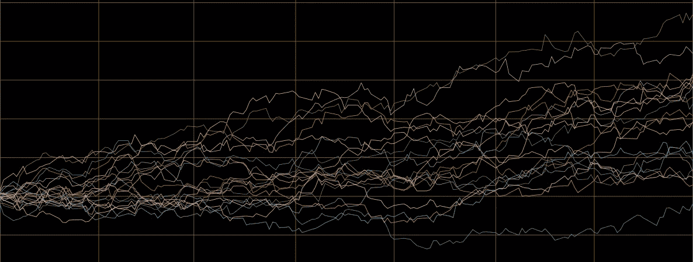

# 投资组合构建的混合信号

> 原文：<https://medium.com/codex/blending-signals-for-portfolio-construction-5d4708290952?source=collection_archive---------7----------------------->

## 投资组合多样化的好处

(图片由作者提供)

信号组合在很多领域都很重要，在投资组合构建中也很重要，让我们来找出原因。

## 我应该融入吗？

> 不一定

假设我有一个投资组合(1)，偶数日回报率为 1%，奇数日回报率为 0.5%: