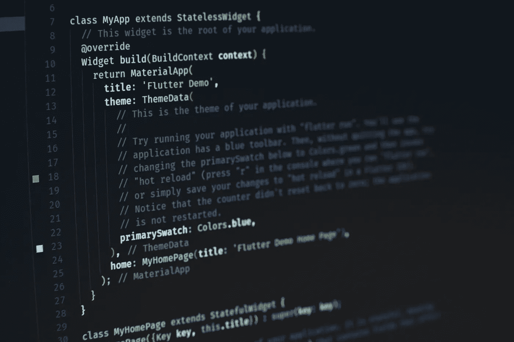
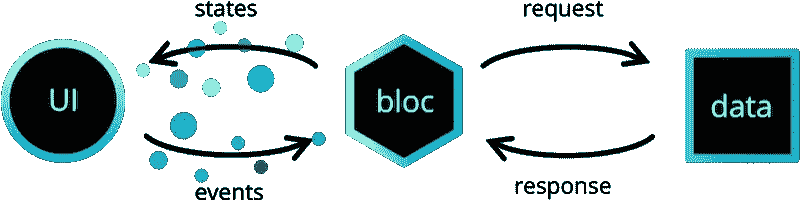
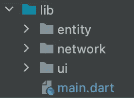
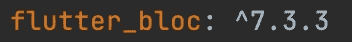
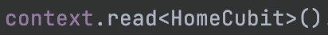

# 阻挡图案

> 原文：<https://medium.com/codex/bloc-pattern-9eb979bea4c4?source=collection_archive---------24----------------------->

Flutter 有强大的社区和文档，读起来很长。然而，阅读文档是开发人员最重要的事情。众所周知，文档阅读起来很长，软件工程的新手不喜欢阅读。我想直入主题，不要再让你厌烦了。今天，我将解释一下对于颤振来说最受欢迎的设计模式——块状模式。在你开始之前，我建议你阅读我的《MVVM 建筑》,因为这篇文章中提到了 MVVM 建筑。

 [## MVVM 架构的定制实施

### 大家好，今天我想谈谈 MVVM 建筑，这是最著名的建筑模式。这个…

medium.com](/@dogukangundogan5/customized-implementation-of-mvvm-architecture-aeccd57efcfe) 

让我们从样板设计开始。阻塞模式的头以 UI 开始。用户通过按下向其声明功能的 UI 组件的任何部分来触发动作。然后 UI 将该事件发送给 bloc。Bloc 是这个模式的核心，因为它可以通过模式名和 bloc 的相似性来理解。集团可以比作 MVVM 的观点模式。该架构组件从 UI 获取事件，并将其发送到存储库。存储库负责向 web 服务或本地数据库发送请求。当数据源返回响应时，它会被发送到存储库。因为存储库监听先前发送给数据源的请求的结果。在响应被解析为特定模型之后，它被发送到 bloc。知识库上的监听响应在后台线程上工作，因此用户可以同时使用 UI。接下来，bloc 得到响应。现在响应可以被状态修改或直接发送到 UI。因此，向用户显示响应。

图 1

稍后我将展示这种模式的一个例子。由于谷歌支持这两种架构，MVVM 和 Bloc 架构有相似的部分。Bloc 和 View 模型可以被认为是一样的，因为它们从 UI 获取事件并向业务逻辑发送请求。我认为唯一的区别是国家。在集团模式中需要州，但在 MVVM 不需要。如果你想看看它是如何使用的，你应该看看上面的文章。

# **阻塞示例**

让我们从文件夹层次结构开始。我的文件夹层次结构如图 2 所示。从文件夹的名称可以理解，网络文件夹包括关于网络请求的类。实体是保存数据模型的文件夹。最后，UI 文件夹包括关于 UI 的类。在开始编码之前，您必须在 pubspec.yaml 中添加如图 3 所示的依赖项。

图 2

图 3

数据模型类是根据您的数据存储创建的。我给你看一个食品公司的例子。假设您有一个 web 服务，一个获取所有可用食物的请求被发送到 web 服务。响应以 JSON 格式到达移动设备，因此这个响应应该被解析为一个类。显然，JSON 格式是可以使用的，但是很难用它做些什么，而且不常用。图 2 显示了食品类。

Cubit 类具有状态特性。Kotlin 开发人员使用 emit 关键字和 flow 向监听器发送值。如果你不用 Kotlin，也不用担心。下面的代码展示了一个 Cubit 类的例子。Cubit 的泛型参数是状态的类型。当响应来自数据库或网络时，它被发送到 UI。多亏了 Future 关键字，当结果来自数据所在的位置时，该数据将被发送到 UI，并立即显示在该 UI 上。

多亏了 Future 关键字，当结果来自数据所在的位置时，该数据将被发送到 UI，并立即显示在该 UI 上。

UI 类可以通过使用 context 或使用 BlocBuilder 来访问 cubit。这两种用法如下所示。

图 4

图 5

最后，我们来看看 Cubit 和 UI 类之间的连接是如何创建的。将在 main.dart 文件中创建连接。下面的图 3 解释了 Cubit 类的引入。

最后，架构是应用程序开发中最重要的东西。开发人员应该了解架构。我希望你喜欢它。