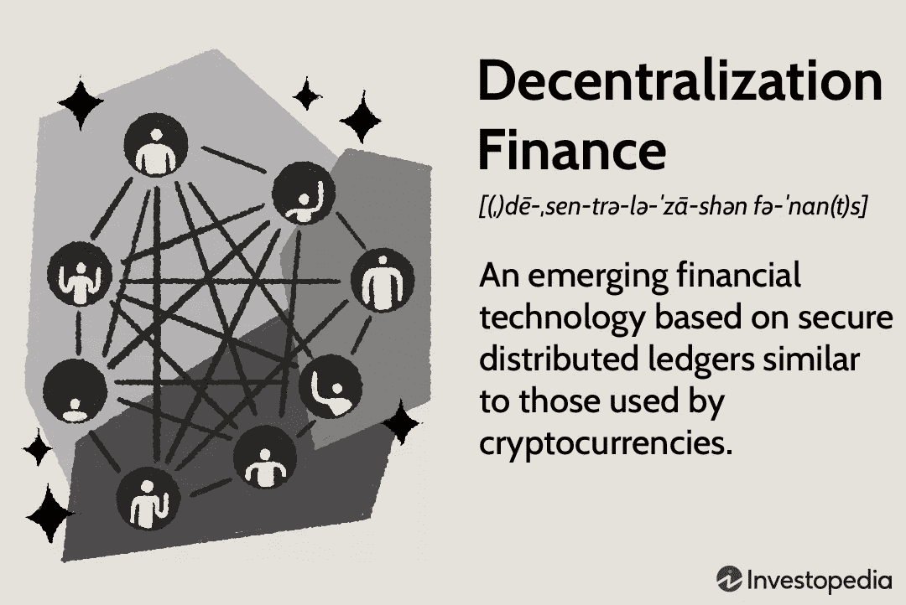

# 2023 年要抓住的潜在区块链商机

> 原文：<https://medium.com/codex/blockchain-business-opportunities-ideas-and-plans-aa78c15524f9?source=collection_archive---------9----------------------->

## **推动区块链业务发展需要知道的事情**

## Powrful 区块链想法今年开始。

2023 年要利用的区块链商业理念

区块链是一个不断发展的行业，并将在未来几年成为一个成熟的行业。谈到技术，这一切都是为了征服技术世界，它的实施可以在不同的领域看到。商业组织张开双臂欢迎这项技术，因为它在数字领域提供了巨大的区块链商机。这项引人注目的技术还有更多可以提供的，这可能是由于精确的区块链商业计划。

# 看到 2023 年可以利用的区块链商业想法很少

1.  使用数字身份保护贵重物品
2.  轻松获取医疗记录:
3.  不可替换的令牌:
4.  销售分散式云存储:
5.  保险智能合同:
6.  建议加密投资:
7.  视频流:
8.  认证雇佣员工的凭证:
9.  为自动驾驶车辆创建数字钱包:
10.  验证奢侈品的真实性:

# *这篇文章将带你了解稳健的区块链商业计划。*

## **区块链商业计划书**

商业计划只不过是一张路线图，包括从业务描述、[市场分析](https://www.businessnewsdaily.com/15751-conduct-market-analysis.html)、战略、销售需求和财务评估的所有内容。有一个包含一切可能的事情的具体计划。

## **选择合适的区块链商业模式**

商业模式的构建是为了简化各种规模的运营，无论规模大小。该布局旨在解决最终用户的问题。这份经过充分论证的蓝图结构严谨，没有任何漏洞，对所有人都有利。创建商业模式的最终目标是使工作模块无缝衔接，为所有人创造利润，无论是投资者、企业还是潜在客户。区块链的商业模式是 P2P ( [点对点](https://en.wikipedia.org/wiki/Peer-to-peer))、 [BaaS](https://www.cloudflare.com/learning/serverless/glossary/backend-as-a-service-baas/) (商业即服务)、实用令牌商业模式等等。根据需求，可以选择合适的商业模式。

## **起草运行计划**

如今存在着不同行业的各种公司。这不会就此停止。它将在每个领域扩展。人们热衷于拥抱区块链技术，大多数公司都准备好提供医疗保健、金融、能源、房地产等领域的解决方案。最终目的是提高整个过程和每个阶段的效率。有很多公司在没有分析需求的情况下就利用了区块链的技术。这让他们最近事与愿违。因此，无论行动计划是什么，都应该与相关业务完全兼容。知道了所有的先决条件，你就可以雇佣专家并据此做出利润预测。

## **营销策略**

这是商业计划中最重要的一步。在这里，整个行动计划/蓝图需要交付给客户。区块链正处于萌芽阶段，因此灌输好处、功能、投资回报等变得极其必要。，在客户心目中。它从企业和客户的角度有效地传达了策略和运营利润。到目前为止，区块链在特定人群中变得越来越受欢迎，因此要拓宽这个空间，正确的营销定位至关重要。

## **财务估算**

从业务角度来看，需要有一个维护良好的资产负债表，包括股权、资产、负债、现金流量表等的细分。有几个指标，如区块链公司借的钱，投入促销/广告的钱，以及开发和维护区块链平台的成本。它还包括在区块链项目工作的员工的费用，这是相当大的。收入估算在区块链商业计划中起着关键作用，并采取措施削减成本。

*区块链已被证明在几乎所有行业都具有优势，因此，有巨大的机会彻底改变创业精神。*

## **区块链商机**

区块链正在大多数行业中慢慢加快步伐，这在多个领域得到了证明。其中一些如下图所示；

## **金融部门**

传统的银行业务方式具有严重的局限性。使用的技术不是最新的。最常见的结果是黑客攻击，用户的数据和交易受到威胁。导致数据泄露的其他因素包括网络钓鱼、网络攻击、社会工程、基于恶意软件的攻击等。泄露客户的财务信息属于网络犯罪。在过去，人们的钱已经无意中转入黑客的账户，很难收回。区块链技术采用强大的技术栈，作为发达金融平台的支柱。此外，每笔金融交易的安全性、透明度和速度都得到了提高。

## **游戏场**

游戏是为人们提供大量机会的最受欢迎的行业。游戏爱好者一直存在，现在有了区块链，它已经达到了另一个水平。在线游戏已经存在好几年了，从一开始就有需求。游戏世界代表各种模式，即付费玩、玩赢、玩赚、免费玩、玩赚等。所有这些游戏模式在创造利润方面发挥着重要作用。不断的游戏模式被加入，专注于奖励玩家。总部位于区块链的游戏是最大的市场，需要挖掘其潜力。它带来了与交易 NFT、角色扮演游戏和元宇宙游戏相关的额外津贴。这绝对是惊人的享受玩和赚钱的同时。

## **零售商业**

[零售业](https://www.insiderintelligence.com/insights/biggest-retail-companies-united-states/)是一个巨大的市场。这个行业面临着许多问题，从供应链管理、实时产品跟踪、欺诈活动、管理用户数据、增强忠诚度计划等等。在区块链技术的帮助下，所有这些瓶颈都得到了缓解。当实心区块链执行所有手动操作，节省大量时间时，它的重要性就显现出来了。在专用网络上执行智能合同允许快速付款，并通过自动执行繁重的管理任务来减少杂项任务。人们更加关注数字化工作，最终，零售业基础设施变得更加稳固。区块链支持的零售部门在双方之间建立了极大的信任。有一个单一的共享分类账，有助于数据的可视性，并提供与制造、产品开发、物流、客户服务、采购等相关的每一分钟的细节。一切都处理得极其勤勉，这让客户体验棒极了。

## **区块链商业思路**

正如我们上面所讨论的，区块链是一项令人惊叹的技术，在相关领域发挥了它的作用。通过查看真实的案例场景，我们可以推断出区块链实现在任何地方都是可行的。但已经显示出积极影响的是医疗保健、电子商务、房地产、娱乐、银行、金融、游戏等。

将技术融入商业的想法已经成为一个福音。初创公司和中型企业已经尝到了它的甜头。随着几个问题通过广泛的区块链开发程序得到纠正，它已经开始进行改造。

## **NFT 市场发展**

这是一个允许 NFT 交易的虚拟市场。它们在最近变得非常受欢迎。它遵循一个方便的程序，用户首先需要创建自己的账户，然后上传可供出售/购买的数字资产(音乐、游戏、迷因)。这些令牌可用于拍卖，并且需要存储和交易密码的钱包，如 trustwallet、metamask 等。

## **建筑元宇宙**

企业正在走向虚拟世界。各行各业都在以数字双胞胎的形式复制自己。基本想法是简化工作过程，让人们探索看似不可能的网站。元宇宙以提供令人着迷的身临其境的视觉效果而闻名，并提供真实的生活体验。这个宏伟的[虚拟生态系统](https://www.analyticsinsight.net/a-day-in-metaverse-what-does-the-virtual-ecosystem-feel-like/)提供了无数的机会。它最有可能的应用是在远程工作场所和虚拟教育机构。

## **建立数字身份**

区块链的顶级商业理念是建立数字身份。身份是在线敏感信息的同义词。这是当今世界欺诈活动的需要。这些是计算机生成的代码，代表有关组织、个人或数字商品或服务的信息。这是为跨多个领域的不同产品指定特定虚拟身份的伟大举措。在数字身份的帮助下，所有者可以证明拥有任何基于独特代码的产品是正当的。此外，这些不能被修改，并提供优秀的安全系统。

## **创建虚拟停车位**

在今天的时代，停车是一项任务。停车位不足，人们真的很难找到空车位。甚至物价都在暴涨，这已经成为一个需要解决的问题。区块链为用户提供虚拟停车平台，这些平台与传感器相连。在一个专用的区块链网络中，每当在用户所在地附近发现一个空车位时，就提供实时警报。这有助于减少时间浪费，从而节省燃料费用。不经意间，它为低碳排放铺平了道路，从而使环境更加绿色。

## **启动 DeFi 平台**

[分散金融](https://www.investopedia.com/decentralized-finance-defi-5113835)平台通过向客户提供完美的解决方案，消除了复杂性。这降低了对集中式财务模型的需求。无论身处何地，个人都可以获得金融服务。它为投资者提供了巨大的机会，因为它为用户提供了先进的透明度、安全性和隐私性。客户可以链接他们的加密钱包，并通过令牌地址实现交换令牌。

## **分散式视频流媒体平台**

媒体为企业提供了一个绝佳的赚钱机会。随着权力下放，由于它所提供的一流特性，我们看到了显著的增长。获得如此多用户关注的主要目标是创收。在这里，内容创作者从他们的订户那里得到确切的报酬，模糊了创作者和他们的顾客之间的界限。采用了可靠的加密方法，确保视频存储安全。

## **底线！！**

区块链作为一项业务是一个蓬勃发展的行业。有各种各样的区块链商业理念和机会，可以提高企业的收入。它的重要性体现在几个领域。这项技术正在迅速发展，并为商业注入了活力。创新和现代化技术的接触使操作看起来更加方便。