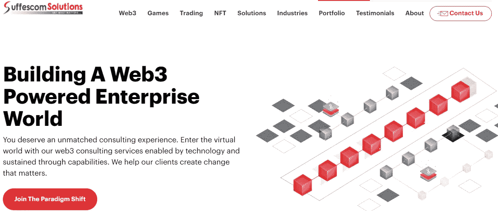
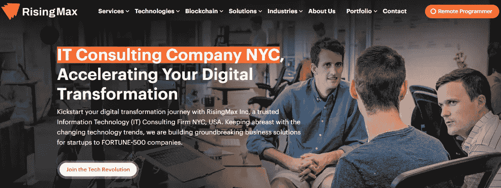
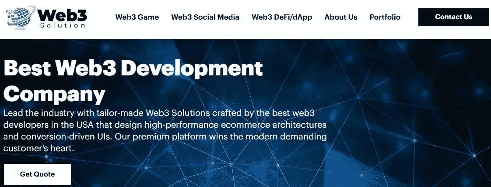
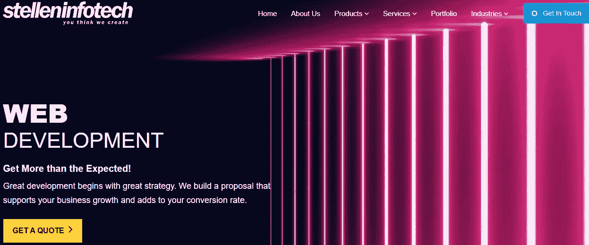
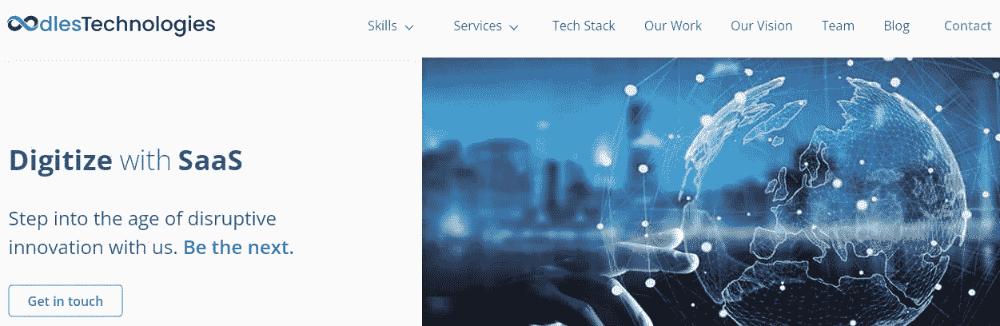

# 新加坡 2023 区块链公司和开发者

> 原文：<https://medium.com/codex/blockchain-companies-and-developers-in-singapore-2023-6354090a65cb?source=collection_archive---------18----------------------->

您正在寻找新加坡 2023 年的顶级区块链公司和开发商。你来对地方了。

我们收集了一份区块链行业中最优秀、最聪明的人的综合名单。从创业公司到企业，这些公司在创新和颠覆方面都处于领先地位。

那么，你还在等什么？看看我们的列表，为你的下一个项目找到完美的区块链公司或开发商。

## 什么是区块链技术？

简单地说，区块链技术是所有加密货币交易的数字账本。它是分散的，这意味着没有一个中央权力机构来控制它。由于它的加密功能，它是安全的。

这使得区块链成为跟踪加密货币交易的非常有用的工具，但该技术的应用范围要广得多。事实上，区块链正被广泛应用于各行各业，从金融到医疗保健再到零售。

## 区块链技术的优势

区块链技术仍处于早期阶段，但它已经为企业和开发者展示了很多前景。以下是区块链技术的一些优势:

*   透明性和不变性:区块链是一个防篡改的公共账本。这意味着区块链上的所有交易都是透明的，不能被更改或删除。
*   **安全性**:区块链是一个安全系统，使用加密技术来保护数据。
*   **效率**:区块链是一个分布式系统，不需要中央权威。这使得它比传统系统更有效。

## 如何选择新加坡最好的区块链开发者

当谈到在新加坡选择最好的区块链开发商，你需要做你的研究。区块链行业仍处于早期阶段，因此并非所有的开发人员都具有相同的专业水平。

**这里有一些提示可以帮助你为你的项目选择合适的开发人员:**

1.  做调研，求推荐。外面有很多开发人员，所以你需要找到一个非常适合你的项目的。
2.  寻找有良好记录的开发人员。他们过去是否参与过类似的项目？结果如何？
3.  不要只关注成本。虽然价格显然很重要，但这不是你选择开发商时应该考虑的唯一因素。
4.  与开发人员会面，感受一下他们的感受。他们看起来像是你可以一起工作的人吗？他们能在截止日期前完成吗？

通过遵循这些提示，你将能够为你的区块链项目找到完美的开发者。

## 新加坡 10 大区块链公司 2023

如果你想在新加坡与区块链技术公司做生意，了解谁是最适合这项工作的公司是很重要的。从 Suffescom 到 CodiGeeks，这些是 2023 年新加坡十大区块链公司和开发商。

## 1.****—区块链开发公司****

****

**图像信用:Suffescom 解决方案**

**Suffescom Solutions Inc .是一家总部位于美国的信息技术公司。该公司专注于区块链、Web3、元宇宙和趋势技术的开发。他们雇佣了 400 多名对该行业充满热情的员工。**

*   ****成立—** 2013 年**
*   ****员工人数—** 500 人以上**

## **2.[**rising max**](https://risingmax.com/)**—顶级区块链开发公司****

****

**图片来源:RisingMax**

**RisingMax 提供了一个私有的区块链协议，使开发人员能够构建具有性能、可伸缩性、安全性和隐私功能的企业级分布式应用程序。**

*   ****成立—** 2011 年**
*   ****员工人数—** 450 人以上**

## **3.[**bestweb 3 Development**](https://bestweb3development.com/)**—区块链 App 开发公司****

****

**图片来源:BestWeb3Development**

**BestWeb3Development 是一家通过 ISO 9001:2015 和 ISO 27001 标准认证的专业服务公司。他们的主要任务是帮助他们的客户将他们的业务活动转化为对他们有意义的体验。**

*   ****成立— 2011 年****
*   ****员工实力— 250****

## **4.[**Stellen Infotech**](https://www.stelleninfotech.com/)**—区块链开发公司****

****

**图片来源:Stellen Infotech**

**Stellen Infotech 拥有 7 年开发定制软件的经验。他们为 20 多个国家的中小型企业和财富 500 强公司提供软件咨询和开发服务。**

*   ****成立— 2010 年****
*   ****员工人数— 250****

## **5. [**不减当年的技术。Pvt Ltd**](https://www.oodlestechnologies.com/) **—定制区块链开发公司****

****

**图片来源:Oodles 技术公司**

**Oodles Technologies 成立于 2009 年，是 ISO 9001:2015 认证的应用和软件开发公司。**

*   ****成立— 2009 年****
*   ****员工人数— 1000 人****

## **6. [**赛博基础设施有限公司**](https://www.cisin.com/) **—区块链开发服务提供商****

**他们的使命是通过技术增强数十亿用户的能力。作为客户、合作伙伴和员工，他们邀请你大胆思考。**

*   ****成立— 2003 年****
*   ****员工人数—1000–9999 人****

## **7. [**Mobiloitte Pte。Ltd**](https://www.mobiloitte.com.sg/) **。—新加坡区块链开发公司****

**Mobiloitte 始终专注于采用基于不断发展的尖端技术的服务，以确保其客户在这个竞争激烈的技术领域始终保持领先地位，确保其客户在其移动|自动化战略中始终保持领先地位。**

*   ****成立— 2004 年****
*   ****员工人数—250–999 人****

## **8. [**Belfricsbt**](https://www.belfricsbt.com/) —区块链咨询解决方案提供商**

**Belfricsbt 是领先的 DLT 供应商。有企业经验的区块链专家。**

*   ****成立— 2015 年****
*   ****员工人数—50–249 人****

## **9. [**Ico App 工厂**](https://www.icoappfactory.com/) **—企业级区块链解决方案提供商****

**作为加密交换软件的老手，他们了解安全性。他们的软件的多层安全系统总是保护 exchange 合作伙伴。**

*   ****成立- 2017****
*   ****员工人数—50–249****

## **10.[**codi geeks LLP**](https://www.codigeeks.com/)—顶级加密货币开发公司**

**CodiGeeks 是一家企业移动应用程序开发公司。他们的开发者可以创建本地和混合应用。他们处理从概念到发布的所有事情。**

*   ****成立— 2012 年****
*   ****员工人数—50–249 人****

## **对新加坡区块链生态系统的未来有何期待**

**随着区块链行业的成熟和发展，及时了解行业的变化和更新至关重要。了解谁是新加坡 2023 的顶级区块链公司和开发商，以及他们目前在做什么非常重要。**

**预计新加坡将探索更多区块链技术的使用案例。这可能包括医疗保健、金融、物流、供应链管理、数字身份系统等应用。**

**新加坡已经有一些正在进行的项目展示了这个行业的创新性。例如，普华永道参与的一个项目正在寻找利用区块链技术改善公司治理的方法。此外，Flipside Crypto 已经启动了一个项目，研究如何通过一个名为 Flare Network 的分布式账本系统来保护和更好地利用数据。**

**有一点是明确的，随着新加坡区块链生态系统的成熟和发展，其潜力将继续增长。如果您有兴趣了解新加坡区块链领域的最新发展，关注上面列出的公司和开发商将大有裨益。**

## **结论**

**简而言之，新加坡区块链地区的企业和开发商将在 2023 年实现增长。所提供的列表对于那些希望探索区块链空间的人来说是一个很好的起点，所提供的见解将肯定有助于希望在这一令人兴奋的领域取得成功的企业和开发商。**