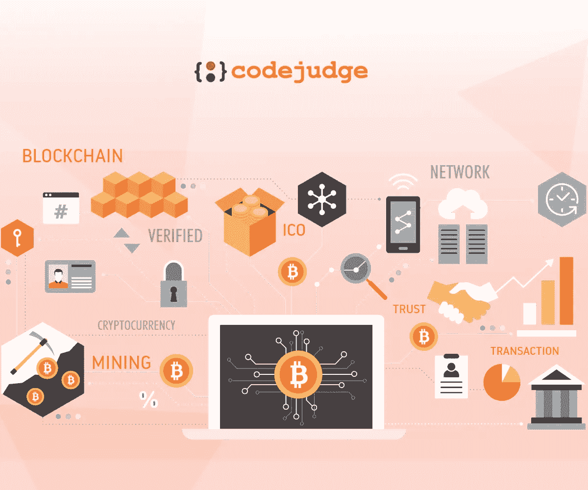

# 有抱负的 Web3 开发者应该学习的区块链概念和技能。

> 原文：<https://medium.com/codex/blockchain-concepts-skills-that-aspiring-web3-developers-should-learn-98151efa996a?source=collection_archive---------12----------------------->

区块链和 Web 3.0 的一切

> 新技术上市了，每个人都想分一杯羹——哦，等等！实际上是这样的——技术领域出现了一个新的板块，每个人都想成为这个链条的一部分:)

**TL；DR:** 技术界的每个人都想成为关于区块链讨论的一部分。区块链是未来吗？—它的特别之处在哪里？。区块链是一个去中心化的系统，它消除了数字资产的复制。区块链开发者创建智能合同、DApps 等。，让 web3 成为现实。区块链不仅仅是加密和非加密技术。

在这篇博客中，我们将关注以下几点:

*   **什么是区块链？**
*   **一个区块链开发者是做什么的？**
*   **智能合约。**
*   **区块链协议。**
*   **DApps。**
*   **道斯。**
*   **成就区块链开发者的六项活动。**

> 下面是**区块链& Web3 Devs** 的[全栈开发的先决条件。](/codex/crack-a-full-stack-developer-interview-in-5-simple-but-doable-steps-c4c3ec9ad57a)

# 什么是区块链？

区块链也称为分布式账本技术(Distributed Ledger Technology，DLT)，是一种去中心化的系统，通过加密哈希使任何数字资产的历史不可改变且透明。

这里有一个用更简单的语言来理解区块链技术概念的场景。

假设您在 MS word 上创建了一个文档，并希望与其他人共享。这样做时，会在不同的计算机上创建文档的多个副本。您系统上的原始文档将是中心副本，而其他文档只是副本。这是一个中央系统的例子。

现在想象一下同样的情况，但是使用谷歌文档。您创建了一个文档，当您与其他人共享该文档时，他们将能够访问同一文档，而无需制作更多副本。这是可能的，因为谷歌文档的分散性质。它是实时发布的，所有的修改都是完全透明的。

构思、设计和构建这种区块链系统的开发人员被称为区块链开发人员。要成为一名区块链开发人员，自然应该了解分布式计算系统。

# 一个区块链开发者做什么？

区块链开发人员应该能够完成以下一些任务:

*   智能合同开发。
*   承担不可替代的代币项目。
*   **精心打造网络架构。**
*   设计区块链协议。
*   **设计共识协议和安全模式。**
*   **为 DApps 开发交互式前端设计。**

这些是区块链开发商可能必须承担的一些主要责任。

> **想成为高级开发者？—下面是** [**一整套系统设计面试概念&题。**](/codex/10-system-design-interview-questions-you-should-know-a9843baddd9f)

## 什么是智能合约？

智能合同是协议条款系统。除了智能合约的条款是在区块链系统上用代码实现的以外，它们实际上与传统合约相似。

智能合约使开发人员能够构建应用程序，利用点对点功能利用区块链的安全性、可靠性和可访问性。

## 什么是区块链协议？

协议是代码的核心层，决定了某些东西应该如何工作。它们构成了某些网络中软件的基础程序。想象一下，协议是一组指令，机器内部的实体基于这些指令进行通信和传输信息。

区块链协议属于胖协议的范畴，不同于瘦的互联网协议。

例如，加密货币协议在建立价值时很少有应用程序在其上运行，而互联网允许多个应用程序。

## **区块链协议的一些例子**

***比特币、以太坊、Ripple、超级账本、开链、corda、共生体分布式账本。***

## 什么是 DApps？

DApps 是运行在区块链网络之上的分散式应用。DApps 具有一系列不同的用例，如游戏、金融、社交媒体等。

DApps 与常规应用程序的不同之处在于，DApps 的后端由分布式网络上的智能合同提供支持。

它们主要在对等网络上生存，并拥有某些灵活的品质，例如:

*   **dapp 是完全开源的** —公众将可以开放源代码，这使得任何人都可以查看、复制、修改代码，因为没有单一的权威。
*   **dapp 受到密码保护** —所有数据和信息将存储在区块链上，由多个节点处理，这些数据和信息受到密码保护，确保数据安全。
*   **DApps 访问本质上是令牌化的** —可以使用加密令牌访问 DApps。

区块链和 web3 开发者需要了解和学习的另一个主要概念是 Dao。

## 道是什么？

> DAOs 代表分散自治组织。

Dao 是由社区成员共同拥有和管理的互联网原生组织。

他们在没有任何中央领导的情况下运作，通过投票做出决定。

由于缺乏自上而下的分层管理，Dao 提供了一个有目的的活动范围。

然而，这些信息只是冰山一角，还有更多的探索。

# 做好这六件事，成为区块链开发者

*   在协议和功能方面对区块链技术有很好的理解。
*   精通高级编程，因为你需要精通 web2 编码，以擅长在区块链构建解决方案。
*   深入了解加密和安全系统的知识库
*   学习对等网络和分布式系统。
*   获得创建智能合同的高度流畅性。
*   为 DS 和算法的概念建立强大的能力。

为了开始使用区块链技术构建解决方案，开发人员必须对 web2 编码语言有一个基本的扎实的理解。它们构成了你 web3 技术能力的基础。

学习技能和提高技能的最佳方式是实践。 [**Codejudge 开发者平台**](https://develop.codejudge.io/practice) 让各个层次的开发者通过真实世界的微型项目和编码评估来强化技术技能。

最棒的是。—如果你能证明你的技能，你会被联系到高增长的大型科技公司&的 [**职位。**](https://develop.codejudge.io/contests?tab=0)

> [**今天开始！**](https://codejudge.io/developer/)