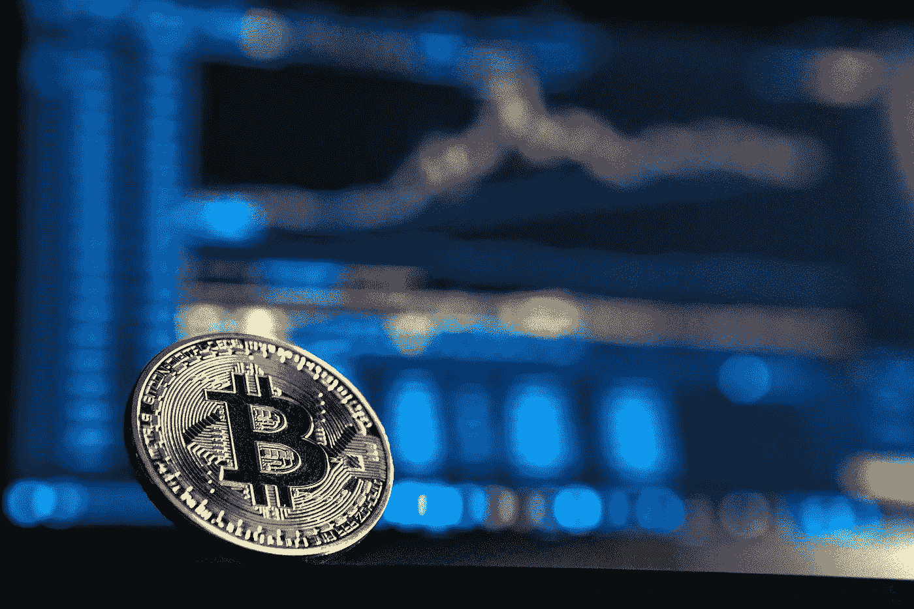

# 区块链——解释！

> 原文：<https://medium.com/codex/blockchain-explained-5a8b2ef88578?source=collection_archive---------12----------------------->

## 区块链怎么了？这是银弹吗？我试着在大多数人能理解的中等水平上解释什么是区块链。[中等复杂程度]

由 [Unsplash](https://unsplash.com/s/photos/blockchain?utm_source=unsplash&utm_medium=referral&utm_content=creditCopyText) 上的 [Launchpresso](https://unsplash.com/@launchpresso?utm_source=unsplash&utm_medium=referral&utm_content=creditCopyText) 拍摄的照片

区块链可能是最近最热门的词汇。从加密货币到数据存储，似乎你可以用它做任何事情。但是，有很多关于它的误解，它不是一个银弹。所以，我想我应该花些时间解释一下区块链是什么，在一个任何人都能理解的中等水平上。

# 区块链是一个数据库

重要的事情先来。区块链是一个数据库。就像你现在用来读这篇文章的一样，它是一本记录之书。但是，与你习惯的数据库不同，它是分布式的，并且以巨大的密码方程式存储数据。这意味着没有中央政府来管理它。任何能上网的人都可以连接并开始写东西。更重要的是，任何人都可以验证其他人添加到这个数据库中的条目。

# 这是如何工作的？

嗯…让我们回到过去一段时间！想想我们古代社会是怎么记账的。我们通常会有一个足够可信的人来跟踪每个人都有什么，并确保它不会被盗或篡改，同时确保没有人在他们的帐户上作弊或撒谎。这个“某人”被称为“银行家”,通常也是在社会中拥有高于他人的某种权力的人:足够的权力让其他人相信他不会偷他们的钱；但还没到自己成为暴君的地步！

有了区块链，这个“某人”就被连接到网络上的每一个人取代了！每个人都有保持一切真实的动机，每个人都同意什么是真实的，因为他们有这样做的动机:如果他们做得足够好，他们就会得到报酬(在加密货币中)，或者如果他们没有与他人适当合作，就会失去他们的钱(就像他们试图像两个不同的人一样)。如果你愿意，这是一种自我组织，自我调节的组织。正因为如此，我们称之为“去中心化”。

这意味着没有中央机构可以修改数据库中的数据。只有那些有足够能力这样做并连接到网络上的人才能对其进行写入。因此，如果你连接到一个网络，有人试图给你汇不属于他们的钱，其他所有连接的人将能够告诉你有什么不对劲，并拒绝这笔交易！

# 区块链是积木做的吗？

不要！数据库中的每个条目称为一个“块”。数据库跟踪在它之前创建的所有块。每个块包含前面块中的所有信息，并通过哈希函数连接到这些块。这就是为什么我们称它为区块链。一串积木。

这确保了没有人能够返回并改变数据库中过去的条目；因为他们必须同时修改所有过去的条目，这实际上是不可能的！这就是为什么你可以相信区块链是安全的，可以存放从钱到照片的任何东西。

# 什么是加密货币？

安德烈·弗朗索瓦·麦肯齐在 [Unsplash](https://unsplash.com/s/photos/bitcoin?utm_source=unsplash&utm_medium=referral&utm_content=creditCopyText) 上的照片

更长的解释请看我的帖子，[加密解释](/@AdaGIdell/crypto-explained-9c3c9b5c1742?source=user_profile---------5----------------------------)！但本质上，它存储了每个用户在区块链上拥有的一枚“硬币”的全部数量(同样，在巨大的数学公式中)。这将传统货币，如美元或欧元从等式中删除，并允许人们交易加密货币，例如用比特币购买热狗。

如果你想知道为什么这是有用的，看看我的[介绍加密哲学](/codex/intro-to-crypto-philosophy-93b5b5525a1f?source=user_profile---------2----------------------------)文章！

众所周知的加密货币包括比特币、以太币和 Dogecoin。

# 区块链的交易是如何进行的？

关于区块链，人们问我的另一件事是，人们如何把钱汇到上面？如果没有中央权威，他们如何进行交易？最简单的方法是直接付款。还有一种叫做智能合同的东西，但这比这篇文章需要的要复杂得多。

如果 Alice 想给 Bob 寄钱，她会把自己的新公钥发给他(记住公钥就像电子邮件地址一样)，Bob 也会把自己的新公钥发给她，这样她就知道把钱寄到哪里了。

然后，Alice 使用她的私钥(它像密码一样工作)在交易上签字，这样 Bob 就知道它确实来自于她，其他人不可能将该交易发送到网络上。

这个概念发生的情况是，每当有人进行交易时，他们会得到一部分余额作为输出返回给他们，其余的作为另一个人的余额的输入发送到其他地方。所以当爱丽丝想要发送 10 个比特币时。她将参与两项交易——一项是她收到了 5 个比特币(一个输入)，另一项是她发送了 15 个比特币。因此，她将从自己的账户中转出 10 枚硬币，这将显示在 Bob 的账户中。尽管交易中涉及了 15 个硬币，但最终结果将会如你所料。

比特币交易一启动，硬币就变得无法使用；就像把钞票送出你的账户会使它们在未来的交易中无法使用，因为它们现在是别人账户的一部分！

不要担心这部分是否有太多的意义；这真的很复杂，说实话有点费解。

# 你怎么能在区块链存储文件呢？

在区块链储存东西比给某人寄钱要复杂一些。但它仍然很简单，只需要你记住一件事:私钥就像你账户的密码。如果您丢失了它们，您的帐户将永远丢失！如果其他人得到了他们，他们将能够使用你的帐户，就像他们是你一样！所以，确保你保管好这些钥匙，只在真正需要的时候才拿出来。永远不要把你的私人钥匙给任何人，除非那个人控制着你存放在那里的钱——因为否则他们会拿走所有的钱，什么也不给你留下！

您使用一个附有私钥的地址(看起来像电子邮件地址)将文件发送到区块链上。您可以使用文件传输协议(如 FTP)将内容发送到该地址。一旦文件到达区块链，任何人都可以从那里下载；但是，只有当他们拥有与该文件的公钥相关联的私钥时，他们才能够解锁该文件的内容并查看里面的内容！

## 下降趋势

区块链真的不是银弹。虽然它非常适合存储小而重要的文件，以及只应由一个人拥有的文件(这就是 NFT！)，对于存储需要频繁引用和检索的内容来说，区块链是非常低效的。把区块链想象成一个内置欺诈保护的银行保险箱；它确实很安全，但进出东西会很麻烦。

# 当有人试图改变什么的时候会发生什么？

我听到有人问我:如果有人试图改变区块链的某些东西，会发生什么？大家注意到了吗？这是怎么发生的？好吧，首先:没有“重要人物”。在计算机上运行完整节点的人就是我们所说的“矿工”。他们负责运行网络并跟踪一切。他们因帮助运营这个网络而获得加密货币(例如比特币)的报酬！这些“矿工”整天关注网络上发生的一切，因为他们的业务依赖于此，所以请放心，没有人能够篡改任何东西而不被这些人立即注意到，他们有保持一切真实的动机！如果有人试图改变某些东西，其他矿工会立即注意到这种企图；因为存储在区块链上的数据很容易被任何想这么做的人验证——所以如果出了问题，他们会马上知道。然后，矿工们将停止接受任何新的交易，直到每个人都同意正在发生的事情——这意味着直到所有那些试图进行不正确改变的人都同意事情应该如何重新开始——否则这些矿工将简单地开始创建一个新的链，在那里一切又都是正确的(一旦超过一半的矿工这样做)。换句话说:他们将创造一个新的区块链，在那里一切都是正确的，每个人都必须同意使用它或继续使用旧的。

你有它！希望这比大多数解释更简单地解释了区块链。我将很快发布另一个帖子，一个更简单的解释，是我为我二年级的侄子写的。

如果你有兴趣了解更多关于区块链、哲学、人工智能或更多，请关注我！我很快会发布一个更简单的解释，所以今天鼓掌，明天再看！