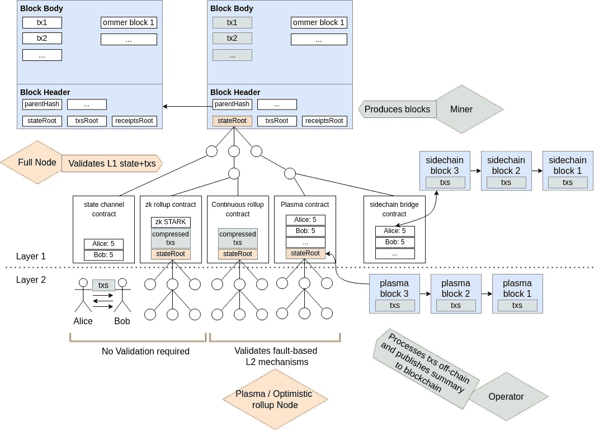

# 区块链第二层和扩展解决方案-以太坊

> 原文：<https://medium.com/codex/blockchain-layer-2s-and-scaling-solutions-ethereum-54a450db63c4?source=collection_archive---------17----------------------->

这篇文章将有助于开发各种扩展解决方案的不同之处和相似之处的抽象模型。

```
**Table of Content 
·** [**Acknowledging the existing monolithic blockchain challenge**](#1755) **·** [**Knowing Layer 2's and Scaling Solution**](#029c) **State & Payment channels
    Plasma Chain 
    Sidechain
    Optimistic rollups
    ZK-rollups
·** [**Final Thoughts**](#278d) **·** [**Miscellaneous**](#28c7) 
```

# **承认现有的单片区块链挑战**

大多数人现在都认为，扩展区块链最成功、最长期的方法是在多层方法的主链上堆叠其他协议，引入更高层的网络来提高功能或吞吐量，而不牺牲基础层的真实性。

**这类似于互联网的伸缩方式，HTTP 构建在 TCP/IP 之上，HTML 编写在 HTTP 之上，等等。**

> 下图解释——**英特尔**2019 年最快的 CPU 是至强白金，一个 28 核处理器**售价 10，000 美元**。 **AMD** 想出了一个挑战者，一个**售价 4000 美元**的 64 核 CPU，彻底摧毁了英特尔最好的**“模块化”**。半价，你可以得到双倍的性能。没错:在一个你预计最多在 18 个月内增长两倍的行业中，增长了四倍。AMD EPYC CPU 在几乎每个参数上都超越了竞争对手，包括性能、性能功耗比和效率性价比。


**把 2019 年之前的一款英特尔处理器当做一个单片区块链。这就是区块链目前的工作方式。他们自己处理所有的安全性、数据可用性和执行。**

还存在其他的先行者安排，比如合并挖掘链和提交链，尽管它们都属于 monolithic 类别。

本质的问题是，如果你的链 1 失败了，你能从另一个链 0 重建它的状态吗？如果答案是否定的，那么这个链条就是铁板一块。**简而言之，0 负责共识、数据可用性和执行。**

比特币、以太坊和多边形 PoS 就是几个例子。

我们有多链生态系统，比如单块类别下的 **Cosmos** ，其中许多单块链划分同一个验证器集。或者像**波尔卡多特**这样的分片生态系统，其中几个链使用相同的验证器集。更多信息可在[这里](https://www.linkedin.com/posts/mustafa-bedawala_blockchains-execution-security-activity-6920851373831901184-ao-l?utm_source=linkedin_share&utm_medium=member_desktop_web)和[这里](https://polynya.medium.com/processors-blockchains-modular-is-revolutionary-ded01824b603)找到。


来源— [区块](https://www.theblock.co/)

令人惊讶的是，在以太坊上，2021 年结算的总价值为 7.7 万亿美元，同比增长 500%。 **Stablecoins** ，有趣的是，代表了估计**4.2 万亿美元(54 %)** 的总结算价值。

在这种背景下，信用卡网络促进的总购买量，如**Visa(2020 年 8.9 万亿美元)和 master card(2020 年 4.7 万亿美元)。**它大大超过了金融科技支付服务商处理的总支付量，如**PayPal(2021 年为 1.3 万亿美元)**。最后占通过美联储 [**Fedwire 结算系统结算总额的 1%以上(2021 年 991 万亿美元)**](https://www.frbservices.org/financial-services/wires) **。**

以太坊任务的关键原则之一是它应该是一个向任何人开放的全球平台。其现有第 1 层设计中的扩展问题阻碍了其实现这一目标。由于平台高昂的交易费用，许多用户根本无法与之互动。

> Eth 最低的平均交易费 **$0.00072** 是在 2015 年 10 月 21 日星期三，Eth 最高的平均交易费 **$200.06** 是在 2022 年 5 月 1 日星期日


来源- [以太扫描](https://etherscan.io/chart/avg-txfee-usd)

**比特币区块平均每 10 分钟发布一次，而以太坊区块每 13 秒发布一次。**但是，转让结算时间在实践中会更长(因为大多数收款人在认为转让已经结算之前，会要求在包含转让的块的基础上建立几个确认或块。)

例如，比特币基地的 BTC 交易需要 3 次确认(30 分钟)，ETH 存款需要 35 次确认(7.5 分钟)。**因此，“结算时间”不同于“封锁时间”，必须同时考虑区块链的安全性和“速度”**

> Vitalik 写了关于更高的费用和不愉快的用户体验的问题

几个 [**以太坊改进提案(EIPs**](https://eips.ethereum.org/) **)** 正在开发中，以优化以太坊的基本第 1 层平台，供各种第 2 层网络使用。它们包括 [**EIP 4488**](https://eips.ethereum.org/) ，预计将把第二层交易放到以太坊上的成本降低 5 倍的**因子，以及 [**EIP 4844**](https://eips.ethereum.org/) ，这将引入一种新的交易格式，为数据分片做准备，有可能为汇总节省高达**100 倍的费用。****

> 下图描述了与以太坊主网相比，在特定 L2 上执行各种任务的成本有多低


因为有了 L2s，消费者在使用他们最喜欢的 web3 应用程序时，终于可以享受到**最低的费用，一个明显更好的 UX** 出现了，因为交易确认几乎是即时的(由于 L2 测序仪),而且区块链可以大幅度扩展。

这将使对不可变块空间的访问变得更加经济**,并通过提供简单直接的应用程序来帮助新用户实现网络的民主化，这些应用程序将所有的复杂问题抽象出来。**

**扩展不仅允许更多的用户，这**以指数方式增加了网络的价值**，而且它还允许在链上执行计算成本更高的操作，这将继续扩展应用设计空间，并且**使新的 web3 用例在经济上和技术上可行**。**

# **了解第 2 层和扩展解决方案**

**除了侧链和血浆链，这不应该被认为是纯粹的 L2，因为它自己的安全链，如多边形 POS。**L2(第二层)扩展解决方案有一个独特的执行层(代码运行的地方，即 EVM ),它继承了网络的安全保证和去中心化，在我们的例子中，它运行在以太坊之上**。**

**这意味着，如果 L2 由于错误、基础设施攻击或中断而崩溃，资金在智能契约桥下是安全的。**

> **下图描述了以太坊的可伸缩性是如何与各种替代方案联系在一起的，**主要是链上和链下选项。**由于研究人员仍在开发分片路线图，因为主要焦点仍在“合并”事件上，所以本文将讨论离线解决方案**

****

**来源-图片来源:u/emkoscp**

> **作为一个新人，可能很难形成一个**心智模型**来描述它们之间的区别和相似之处。下图有助于形象化各种缩放选项，如**状态通道、ZK 汇总、乐观汇总、等离子体和侧链如何与块标题(即状态根**)以及我们经常忽略的其他细节相关联**

****

**来源- [萨姆拉弗](https://twitter.com/samlafer)**

**目前吸引开发者兴趣的链外扩展框架可以分为五类:**:****

*   ****状态&支付渠道-****

**总之，**状态通道使参与者能够无限次数地处理链外事务，而当通道关闭时，只将初始和最终状态提交给主链。**支付渠道，如闪电网络，是国家渠道的一个子集，指的是更普遍、更智能的基于合同的交易。**

****闪电网络**，一种用于支付(包括小额支付和跨境汇款)的第二层国家通道协议，以及**流动网络**，一种由交易所和交易商用于更快结算的侧链，是比特币的两种规模替代方案，已得到大量使用。**

**Lightning 是最近流行的状态通道缩放协议的主要实现。最近的增长可归因于闪电网络硬件和软件解决方案的可用性，如 **Umbrel、Bluewallet 和 Strike** ，以及推动个人和国家采用闪电网络的举措。**

*   ****血浆链-****

**等离子体使用智能合同来实现“子链”的构建，这些子链实际上是以太坊区块链的较小克隆体，它们以链的层次结构排列。**

**每个链都有自己的防欺诈机制，如果节点运营商不诚实，用户可以切换到主链。在 2017 年推出之后，发布了等离子框架的多个变体，并被广泛认为是 2018 年大部分时间的事实上的扩展解决方案。**

**Plasma 包括**逃逸方法**允许用户将资产返回到主链，即使中心运营商是敌对的。这意味着，如果用户注意的话，他们将永远比等离子运营商更有优势，并且能够保证他们的令牌安全。**

**此外，**等离子体链的撤销持续时间为 7–14 天**(典型的基于防欺诈的缩放方法)，并且不支持通用计算。**

****

**来源— [等离子白皮书](http://plasma.io/plasma.pdf)**

**随着开发人员对等离子体兴趣的最初高涨，**大多数协议要么放弃了等离子体，转而支持 rollups** ，要么开发了包含其他扩展框架的混合技术。**

*   ****侧链-****

**总之，**侧链可以与基础层并行运行，但它们是独立的区块链，具有自己的一致方法和安全属性。****

**侧链是自治的区块链，通过嵌入式连接与基础层并行运行，但是**有自己的操作符、验证器和安全程序。**侧链的多功能性可实现快速安装，为用户提供高吞吐量和低延迟的交易。**

**一些批评者认为，因为侧链使用它们自己的共识模型，**它们不是真正的“第二层”，而是作为一个独特的、可扩展的 L1。**另一方面，侧链可以以多种方式设计，应该区分那些与基层正确对齐和互补的侧链，以及那些没有对齐和互补的侧链，但这种区分并不总是明显的。**

> **下图描绘了用于比较以太坊扩展解决方案的**框架****

****

**来源— [物质实验室](https://matter-labs.io/)**

*   ****乐观累计-****

**在将事务处理数据提交给区块链之前，累计会减少和压缩累计块中的事务处理数据。**在最好的情况下，乐观汇总假设默认提交的交易是真实的；只有当提交的内容受到质疑时，才会在主链上进行计算，以确定欺诈发生在哪里。****

**乐观汇总(oru)和 Plasma framework 一样，**依赖于欺诈证据**，这是一种安全模式，在这种模式下，除非证据有争议，否则交易验证的处理不会在 L1 主网上进行。**

**乐观汇总得名于这样一个事实，即定序器的一批事务被默认为**真实的**:只有在发生争议的情况下，汇总块中包含的每个事务的计算才会在主链上完成，以评估是否发生了欺诈。**

**参与者必须**等待一周**才能撤回存储在乐观汇总中的资产，以便验证或质疑提交的交易批次。**

****

**[来源](https://vitalik.ca/general/2021/01/05/rollup.html)**

*   ****ZK-上卷-****

**零知识密码学是近五十年来计算机科学中最值得注意的发展之一。zkp 具有独特的品质，使其成为几个区块链扩展和隐私解决方案的关键组件，如 StarkNet 等 ZK 汇总，Aztec 等私人 ZK 汇总，以及 Mina、Filecoin 和 Aleo 等第 1 层链。**

**与乐观汇总不同，零知识汇总**预先包括每个状态转换的证据，**使得操作员几乎很难提交不正确的状态。**

****中继者**(也称为证明者)充当 ZKRUs 的聚合者。汇总事务在传输到主链之前由中继站进行聚合。与序列器不同，中继器负责执行所有计算来构造**ZK–SNARK 证明(零知识简洁的非交互式知识论证)**，它只显示最终散列的一部分，而不是实际数据本身。**

**SNARK proof 比较交易前后区块链上的帐户值的快照。**然后，网络验证者可以只验证给定的证明，而不是所有嵌入的交易**(即，需要完整数据的“零知识”)。**

**由于大量昂贵的数学运算，zkp 制作起来既慢又昂贵。**但是，通过使用专用硬件，如现场可编程门阵列(FPGAs)和专用集成电路(ASICs ),它们可以加速 10-1000 倍。更多信息可以在** [**这里找到**](https://www.paradigm.xyz/2022/04/zk-hardware) **。****

# **最后的想法**

**根据以太坊的长期愿景，用户不会定期与以太坊 mainnet 进行交互，因为它将只作为 L2s 的**数据可用性层。**也就是说，模块化区块链是经济上和技术上最可行的长期扩展设计选项，而**以太坊目前是模块化领域中占主导地位的区块链，因为它具有非常高的安全性**，这将随着 PoS“合并”的转换而显著增强**

**此外，以太坊正在成长为一个 L1，拥有**数据分片、verkle 树、无状态和其他修改**，而 L2 正在努力建立一个共享的跨 L2 通信基础设施，这将允许他们拥有共享的流动性和智能合同组合能力。**

# **多方面的**

> **下图描绘了各种扩展解决方案的不同协议的各种 Miannet 发布，表明我们在研发方面都取得了长足的进步，随着以太坊通过数据分片和其他 EIP 在基础层上扩展，零知识汇总等也将随之发展**

****

**来源— [银河数码](https://www.galaxydigital.io/)**

> **下面两张图片来自“L2BEAT”，这是计算以太坊 L2s 中有多少 TVL 的主要仪表盘。L2beat 最棒的一点是，它展示了 L2 中使用的缩放技术以及它现在的用途**

****

**[L2BEAT](https://l2beat.com/)**

****

**[L2BEAT](https://l2beat.com/)**

****免责声明:**本文仅供参考。它不是投资建议，也不是购买或出售任何投资的建议或恳求，它不应用于评估做出任何投资决定的价值。它不应用于提供会计、法律或税务建议，或提出财务建议。本文表达的观点如有变更，恕不另行通知。**