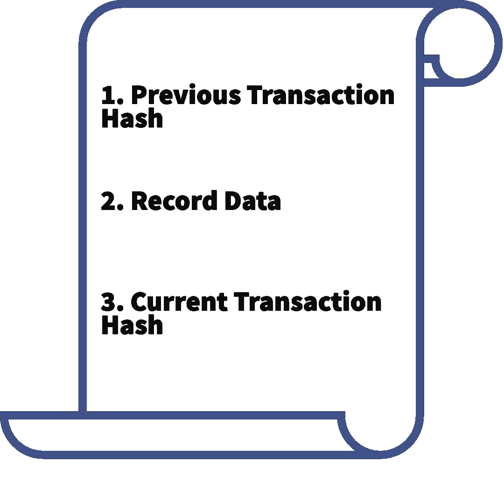
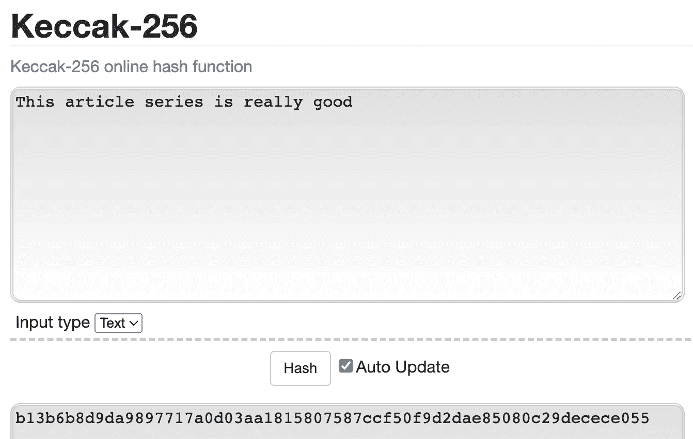
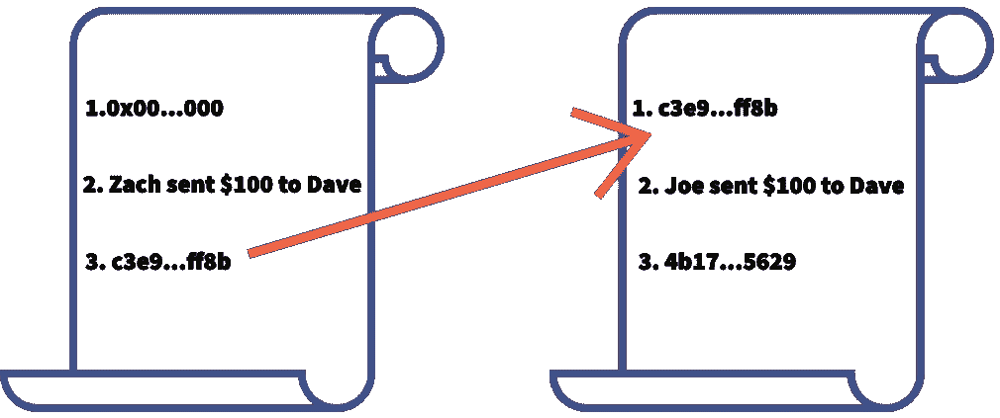

# 区块链| Web3 解释道

> 原文：<https://medium.com/codex/blockchains-web3-explained-cc1e8e5a2e20?source=collection_archive---------21----------------------->

在过去的 10 年里，区块链这个术语已经被用作实现许多目的的手段。初创公司将它融入到他们的使命声明中以筹集资金，大公司用它来推高股价，扶手椅交易员对以狗命名的资产进行专家价格预测。不管是好的时候还是坏的时候，Web3 技术都有突破，要么是新技术被创造出来，要么是现有技术找到了一个用例。我将在后面的帖子中详细介绍这些周期，但现在我们将了解所有好的、坏的和丑陋的基础技术都建立在:**区块链**之上。

# 什么是区块链？

最基本的，区块链是一系列记录一个接一个地拼接成一个不变的序列。不同项目的技术略有不同(我将在后面介绍这一点)，但通常一个记录由多个事务组成。每笔交易有三个基本组成部分:

这里我们看到一个“事务”的例子。这些交易是区块链的核心“那又怎样”。在这里，数据以不可变的方式存储，这意味着它不能被改变。

# 快速进入“散列”

在这个领域，你会经常听到“哈希”这个词，因为没有哈希，我们就没有 Web3。**那么，我们为什么要关心哈希呢？**散列和加密非常相似，除了**不可能解密已经被散列的东西**。这为我们如何将单个事务串成块，然后串成区块链奠定了基础。

哈希的关键在于它不是随机的。散列一个单词或句子将总是导致相同的散列。对此的术语是“决定性的”。以太坊区块链使用一种称为 Keccak-256 的哈希算法，该算法的细微差别并不重要，但重要的是它是确定性的。下面是一个免费演示的链接，你可以自己体验一下这个哈希算法。

试着输入“*这个文章系列真的很好*”和“*这个文章系列真的很好！*”

 [## 凯克-256

### Keccak-256 在线哈希函数

emn178.github.io](https://emn178.github.io/online-tools/keccak_256.html) 

Keccak-256 哈希算法的确定性的直观示例。

> *你得到了*“b 13 b 6 b 8d 9 da 9897717 a 0d 03 aa 1815807587 CCF 50 f 9 D2 da 85080 c 29 decese 055”*“6d 729172 f 9 e 86 D2 f 292928901 a 6424762 adbbababc 723 cfee 0 f 1 f 64072 a 883d 264”*

**你和我得到了相同的值，因为哈希算法是确定性的。非常有趣且同样有力的事实是,**没有办法将散列值**解码回原始文本。确定输入文本的唯一方法是通过猜测和检查**数字、字母和符号的每一种可能的组合**，直到你得到合适的散列。这样做需要大量的计算能力，而且非常昂贵。保持这个想法，我们会回来。**

# ****区块链，集合！****

**所以，让我们自己拼凑一个积木来真正理解所有的炒作是关于什么的。假设我和我的朋友今年夏天要去旅行，我们需要一种方法来协调我们所有的付款。在这个例子中，Zach 和 Joe 向 Dave 各发送了 100 美元，Dave 随后将这笔钱和另外 100 美元一起交给负责向 AirBnb 的主人付款的 Sally。**

****

**在这里，我们有 4 个朋友需要向对方发送资金。每笔交易的记录都将储存在我们的区块链上。**

**扎克首先给戴夫汇了 100 美元。这是我们要检查的第一笔交易，最简单的说，这只是一张收据，就像你从商店里得到的一样。不同之处在于，我们的交易将存在于区块链上，而不是一张纸或公司的数据库中。所以回到我们的事务组件，我们知道**记录**将是" *Zach 向 Dave* 发送$100 "，我们的**当前事务散列**将是该记录的散列值:"*c 3 e 9 fecca 5c 299 B4 e 9 ba 9496 c 974d 7d 28 aee 25 a 38 ab 200 D2 BC 3a 474 b 93 cef 8b "。*你可能想知道**以前的事务散列**是什么，这就是块如何变成区块链的。**我们当前的事务哈希成为下一个块的前一个事务哈希。****

**让我们回顾一下。每个记录都被散列。这个散列和前一个散列一起构成一个事务，这些事务通过散列匹配连接在一起。因此，下一个事务“ *Joe 向 Dave* 发送了 100 美元”被散列，现在我们的区块链上有以下事务链。**

****

**虽然这是一个非常简单例子，但这确实是区块链的工作方式。真正的复杂性来自于“记录”中可能包含的内容。**

# **结论**

**我们讨论了一些非常复杂的话题。我们探索了事务、块和区块链背后的核心技术。在下一篇文章中，我将介绍当事务被添加到块中时会发生什么，谁实际上在做所有这些事情，以及块最初是如何被创建的。我还将通过解释工作证明和它的后继者利益证明来触及 Web3 的环境影响。**

# **社会**

**推特:[https://twitter.com/altozachmo](https://twitter.com/altozachmo)**

**领英:【https://www.linkedin.com/in/zachary-bloss/ **

**ETH/BTC/DOGE/LTC/SOL—[block-ops . ETH](https://metamask.app.link/send/pay-block-ops.eth@1?value=5e16)**

**block-ops . XYZ:[https://block-ops . XYZ](https://block-ops.xyz)**

****