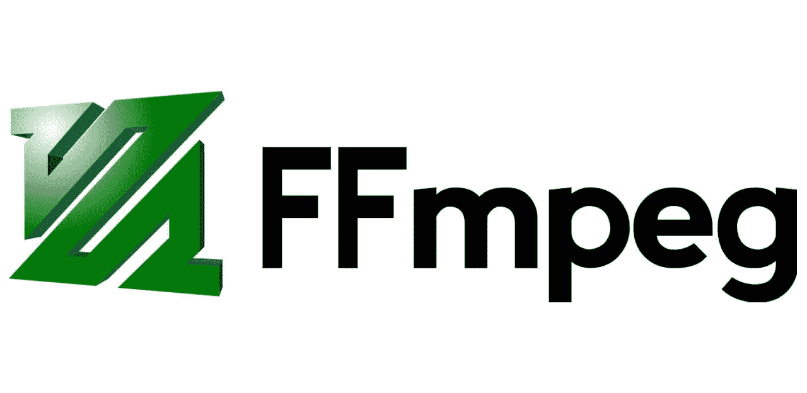

# 博客|通过 FFMPEG CLI 和 Python 实时传输到浏览器

> 原文：<https://medium.com/codex/blog-live-stream-to-the-browser-with-ffmpeg-cli-and-python-b84c33a9c7a6?source=collection_archive---------12----------------------->

让我们学习如何在 Mac 和 Python 上使用 FFMPEG 命令行界面进行实时流传输，然后用 Python 编写一个程序来为我们做所有的事情。对于摄像头和音频，我们将使用 Mac 的内置功能。如果你想的话，你可以连接另一个摄像头，这个教程应该也能帮助你弄清楚怎么做。我们建议先按原样试用本教程。