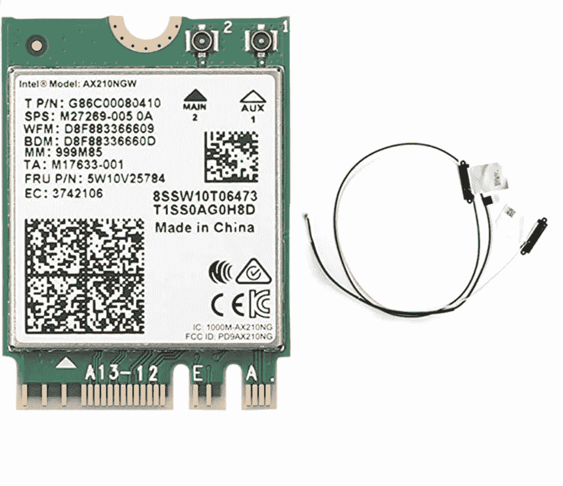
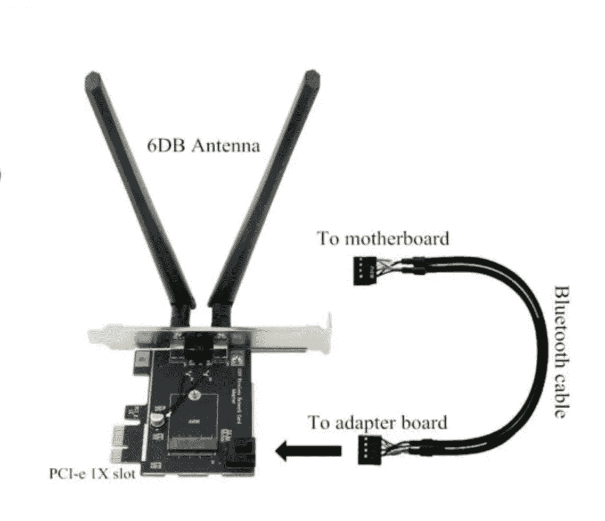
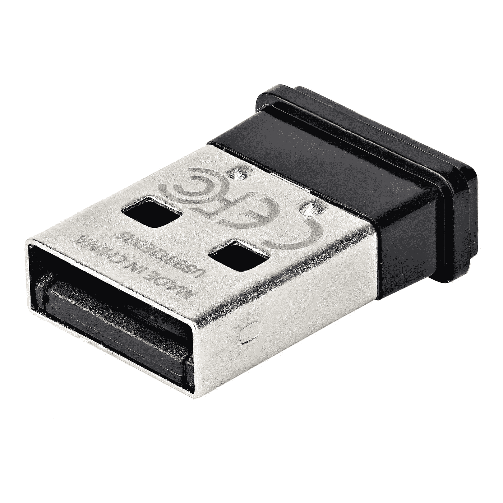

# Linux 上的 Wi-Fi 6E 和蓝牙 5.3:支持的加密狗和芯片组概述(M.2、PCIe 和 USB)

> 原文：<https://medium.com/codex/bluetooth-5-on-linux-overview-of-kernel-supported-dongles-and-chipsets-c6f2b632b236?source=collection_archive---------1----------------------->

蓝牙是一种短距离无线技术标准，有着生动的历史([参见维基百科文章了解背景信息](https://en.wikipedia.org/wiki/Bluetooth))。到 2021 年，已有超过 47 亿台配备蓝牙的设备出货，增长率预计为 9%，这使其成为与设备和外设交互的关键技术。

# 蓝牙具有向后兼容性

所有的蓝牙版本都是向后兼容的，可以使用较低的蓝牙协议。尽管如此，我还是建议你买一个体面的、最新的蓝牙 5.3 卡，这样你就可以享受该协议的所有现代功能。

## 蓝牙 5 和 5.1

蓝牙 5 已经在 2016 年发布，第一款设备是正式支持蓝牙 5 的*索尼 Xperia XZ Premium* 。蓝牙 5.1(2019 年推出)可能会支持固件更新，所以一些设备已经获得了 5.1 更新。一个例子是[英特尔 Wireless-AC 9260](https://www.intel.com/content/www/us/en/products/sku/99445/intel-wirelessac-9260/specifications.html) ，它在发布时只支持蓝牙 5.0，但最终通过固件更新获得了蓝牙 5.1。

## 蓝牙 5.2 和 5.3

蓝牙 5.2 于 2019 年 12 月推出，具有 LE 电源控制和 LE 音频等功能，建立在新的 5.2 功能之上。蓝牙低能耗音频和新的 LC3 编解码器意味着并非所有的硬件都可以升级，因此一些主机硬件仍停留在 5.1 版本。

**蓝牙 5.3**(2021 年 7 月正式发布)是对蓝牙 5.2 标准的小更新，有[以下变化](https://www.bluetooth.com/blog/new-core-specification-v5-3-feature-enhancements/)。大多数硬件都可以通过固件升级来更新，所以较新版本的 5.2 主机芯片组应该已经支持蓝牙 5.3——但你必须自己检查。与蓝牙 5.2 一起发布，然后更改为支持 5.3 的芯片组例如有[英特尔 AX411、AX211、AX201、AX200、9560、9462、9461、9260、8265 和 8260](https://www.itechtics.com/intel-wifi-bluetooth-drivers-may-2022/) 。

# **Tldr:获取这些设备用于** M.2、PCIe 和 USB 加密狗

## **M.2 NGFF**

[英特尔 AX210NGW (NGFF M2 2230 A/E key)带 WiFi (6GHz、5GHz 和 2.4GHz)和蓝牙 5.3](https://ebay.us/noiceB)

**m . 2 NVME**:[Intel ax 210 NGW(NGFF M2 2230 A/E key)带 WiFi (6GHz，5GHz，2.4GHz)和蓝牙 5.3](https://ebay.us/noiceB)

从内核 5.10 开始，Linux 支持英特尔 AX210 芯片组。如果你是 Ubuntu 用户，这意味着你可以从 Ubuntu 21.04 使用它。如果你遇到问题，[askubuntu 上有一个更长的线程可以帮助你](https://askubuntu.com/questions/1326386/ubuntu-20-04-lts-driver-intel-wi-fi-6e-ax210-160mhz)。在较老的内核上，[有办法用 backport-iwlwifi-dkms 让它运行在 18.04 LTS 上。](https://askubuntu.com/a/1342554/76157)

## **桌面使用(PCI Express)**

**对于桌面应用，购买一个 PCIe 到 NGFF 的适配器**并购买英特尔 AX210。[我可以推荐这款 NGFF (M.2)给 PCI-E 1X 适配器](https://ebay.us/rr6yDD)。

**对于 WiFi 6E 和蓝牙的桌面使用:购买 PCIe 至 NGFF 适配器**和英特尔 AX210。[我可以推荐这款 NGFF (M.2)给 PCI-E 1X 适配器](https://ebay.us/rr6yDD)。

# 支持 Linux 内核的蓝牙 5.0 USB 加密狗

[**StarTech USBA-蓝牙-V5-C2**](https://amzn.to/3WCEH96) 采用 RTL8761B 芯片组，Linux 上支持。

获得支持高于 5.0 的蓝牙的 USB 加密狗是一件碰运气的事，我已经测试了来自易贝和全球速卖通的各种不同的设备。对我来说，唯一可以稳定工作的 USB 加密狗是:

*   [**Edimax BT-8500**](https://www.edimax.com/edimax/merchandise/merchandise_detail/data/edimax/global/bluetooth/bt-8500/)**(**RTL 8761 b)是[从内核 5.8 开始工作，带 A2DP 和 HSP/HFP](https://www.reddit.com/r/linux/comments/qymjpl/edimax_bt8500_usb_blueooth_50_that_works/) 。
*   [**StarTech USBA-蓝牙-V5-C2**](https://amzn.to/3WCEH96)**(**RTL 8761 b**)**与 Edimax 的芯片组相同，同样值得推荐。
*   [**华硕 USB-BT500**](https://amzn.to/3UaP0Q6) (RTL8761BU)据报道是[从 2.6](https://www.reddit.com/r/linuxquestions/comments/hy5mx2/bluetooth_adapter_asus_usbbt500_not_working_or/) 开始使用 Linux 内核。其他人报告说[对 udev 规则的微小调整是让它们工作所需要的一切](https://www.gaunt.dev/blog/2022/linux-and-bluetooth-dongle/)。
*   [**EPP fun AK 3040 plus**](https://amzn.to/3T7QGJ8)高通 APTX-自适应 USB 蓝牙 5.2 音频发射器(仅限音频！)但似乎可以在 Linux 上工作。

# Linux 支持的蓝牙 5+芯片组列表

# 蓝牙 5.0 和 5.1

*   **Realtek RTL 8761 b**(0bda:8771 Realtek Semiconductor Corp)从 Linux 内核 5.8 开始工作[。它大多可以在便宜的适配器中找到，如](https://linuxreviews.org/Realtek_RTL8761B) [Deal4GO RTL8761B USB 蓝牙适配器](https://amzn.to/3NFU0db)(约 6 美元)和 [SOOMFON 蓝牙 5.0 USB 加密狗](https://amzn.to/3zPWBvA)。
*   **Realtek RTL 8761 bu:**华硕 USB-BT500
*   **Realtek RTL8852BE** 通过 [HRex39 获得实验支持——你可以在 GitHub](https://github.com/HRex39/rtl8852be) 上找到他的代码。
*   **Cypress CYW43455** 是 *Raspberry Pi 3+* 和 *Raspberry Pi 4 Model B* 主板中的 Wi-Fi/蓝牙芯片组。该芯片组支持蓝牙 5.0，2019 年起在 Linux 内核中支持[。你可以用一个 Raspberry Pi Zero W](https://lore.kernel.org/linux-bluetooth/?q=CYW43455) 来组装你的蓝牙 5 加密狗，或者用一个有这个芯片组的[罗技 Harmony Express (N-R0017)](https://ebay.us/M6eXlK) 设备。

# 蓝牙 5.2 和蓝牙 5.3

## **英特尔**

英特尔有一些很棒的 M.2 NGFF 卡，并作为 Linux 内核的一部分提供驱动程序。[这里列出了英特尔 Wi-Fi 6 和蓝牙 5 (5.3)以及它们的 Linux 内核支持](https://www.intel.com/content/www/us/en/support/articles/000005511/wireless.html)。

*   [**英特尔 AX210** **NGWG 无博锐**](https://ebay.us/noiceB) ( [你真的需要博锐](https://www.laptopmag.com/articles/intel-vpro-faq)？)、蓝牙 5.2 无线网卡 Wi-Fi 6E)。NGFF M2 2230。这是当前建议获取的卡。

**CNVio 和 CNVio2**

小心其他芯片组:一些芯片组如 9560 有 CNVio，AX201 有 CNVio2。 [CNVio](https://en.wikipedia.org/wiki/CNVi) (或 CNVi)表示 MAC 组件、内存、处理器和相关逻辑/固件已被移到 CPU 和芯片组内部。**问题来了:**这些芯片组只能与英特尔 CPU 一起工作。AX200 或 AX210 **可以与一些 CNVio 笔记本电脑一起工作，但这取决于制造商是否在插槽中包括 PCIe 支持。这是反复试验。您可以阅读此帖子，其中列出了支持定期升级的受支持笔记本电脑，标题为[将带 CNVio v1 Wi-Fi 适配器(例如 Wireless-AC 9560)的笔记本电脑升级到 Wi-Fi 6(英特尔 AX200/210)](https://linustechtips.com/topic/1086207-upgrading-laptops-with-cnvio-v1-wifi-adapters-eg-wireless-ac-9560-to-wifi-6-intel-ax200210/) 。**

> 虽然您可以将这些 CRF 插入标准的 M.2 Key E 插座，但它们只与为 CNVi 设计的系统兼容。([来源:英特尔](https://www.intel.com/content/www/us/en/support/articles/000026155/wireless.html))

这些芯片组是 CNVio 或 CNVio2，仅适用于某些笔记本电脑:

*   英特尔无线网络 6E AX411
*   英特尔无线网络 6E AX211
*   英特尔 Wi-Fi 6 AX203
*   英特尔 Wi-Fi 6 AX201
*   英特尔 Wi-Fi 6 AX101
*   英特尔无线-AC 9560
*   英特尔无线-AC 9462
*   英特尔无线-AC 9461

这里是英特尔 AX411 与 AX211 和 AX210 Wi-Fi 6E 的对比——检查“双连接功能”,遗憾的是目前仅限于 CNVio2。如果你有 CNVio2 插槽，就拿 [AX411 双连 Wi-Fi 6E CNVio2 Tri Band 2.4，5 & 6GHz DCT 卡](https://ebay.us/aPZDXM)。一个 AX410(没有 CNVio2 的 ax 411“double connect”)还不存在([来源](https://www.reddit.com/r/intel/comments/r96rk6/hi_what_is_xw_vs_is_killer_wifi_6_or_wifi_6e/))。

**英特尔黑仔**

杀手网卡是黑仔博彩公司的专用游戏卡。[英特尔于 2020 年收购了黑仔游戏公司(Rivet Networks)背后的公司](https://www.theverge.com/2020/5/20/21265297/intel-acquires-rivet-networks-killer-gaming-networking-cards-wifi)，并继续使用[英特尔黑仔产品](https://www.intel.com/content/www/us/en/products/docs/wireless/solutions.html#promotions_318273577)这一品牌。

黑仔 1650is 只是更名后的 AX201，而 1650xw 是更名后的 AX200。同样适用于 1675、AX210 和 AX211。1690 只是 i/s:是 AX411。虽然在黑仔 AX1650 中有微小的功能差异，但这些似乎只存在于固件中？(需要确认！有人对此有线索吗？)

这可能会令人困惑，所以我建议现在坚持使用普通(非品牌)卡。

## **高通**

高通有不同的蓝牙芯片组，但最值得注意的是最近的[高通 FastConnect 6900 Wi-Fi 6，6E，蓝牙 5.3](https://www.qualcomm.com/products/technology/wi-fi/fastconnect/fastconnect-6900) (最高 3.6 Gbps)。

*   惠普 EliteBook 845 G9 中有[关于高通快速连接 6900 (wcn6855 hw2.1)的报告，lore.kernel.org 线程](https://www.reddit.com/r/linuxhardware/comments/ynjj4k/hp_elitebook_845_g9_experience_with_linux_support/)中有[报告的问题。](https://lore.kernel.org/all/627e4f7d-4332-d46e-82e3-4f3f18d3b546@linaro.org/t/)

## 超微半导体公司

AMD 和联发科共同开发了 AMD RZ600 系列 Wi-Fi 6E 模块，该模块包含 WiFi 6E 和蓝牙的双芯片组([来源](https://corp.mediatek.com/news-events/press-releases/amd-and-mediatek-develop-amd-rz600-series-wi-fi-6e-modules-to-enhance-laptop-and-desktop-pc-connectivity-experiences))。这些芯片组可用于基于锐龙的新型个人电脑和笔记本电脑([来源](https://www.gsmarena.com/mediatek_and_amd_announce_rz600_series_wifi_6e_chips-news-51921.php))，如*华硕 ROG Strix* 。

该芯片组还提供 M.2 2230 和 1216 SKU([来源](https://www.notebookcheck.net/AMD-s-new-RZ600-Wi-Fi-6E-modules-are-based-on-MediaTek-silicon.580586.0.html))，但在撰写本文时尚未上市。你可以在这个文档中找到更多信息:[联发科 MT7922A12L 参考设计](http://en.techinfodepot.shoutwiki.com/wiki/MediaTek_MT7922A12L_Reference_Design)。

*   AMD RZ616 Wi-Fi 6E 模块 160MHz，2.4Gbps (M.2 2230 和 1216)
*   AMD RZ608 Wi-Fi 6E 模块 80MHz，1.2Gbps (M.2 2230)

## 其他芯片组

u-blox 有自己正在开发的芯片组:[u-blox M2-乔迪-W3 卡](https://www.u-blox.com/en/product/m2-jody-w3-card)**【m . 2】**(Wi-Fi 6 和蓝牙 5.3)。支持 Linux，关于 [cnx 软件](https://www.cnx-software.com/2021/07/08/u-blox-wifi-5-6-bluetooth-5-m2-cards/)的信息。[尚未上市](https://eu.mouser.com/ProductDetail/u-blox/M2-JODY-W377-00C?qs=By6Nw2ByBD1jN8jVCNji0A%3D%3D)！

请告诉我您在 Linux 上使用蓝牙加密狗和芯片组的体验！ [**这里是 Reddit 上关于我保持现状**](https://www.reddit.com/r/linuxhardware/comments/ynjvkx/bluetooth_53_linux_support/) **的讨论。**

## 继续读

*请* [*在 Twitter @audiores*](http://opengears.medium.com/subscribe) *上关注我的 medium**&*[*如果你对这篇文章有任何其他反馈或补充，请在评论中告诉我。你可以在我的列表*](https://twitter.com/audiores) [***上阅读更多我的硬件和装备建议，为游牧书呆子提供的工具和服务***](https://github.com/z3cko/digital-services/blob/main/README.md) *。*

本作品根据[知识共享署名-相似分享 4.0 国际许可协议](http://creativecommons.org/licenses/by-sa/4.0/)进行许可。你必须在你的衍生作品中保留我的原始链接，你必须链接到 medium.com 的这个网站，或者我的推特个人资料。