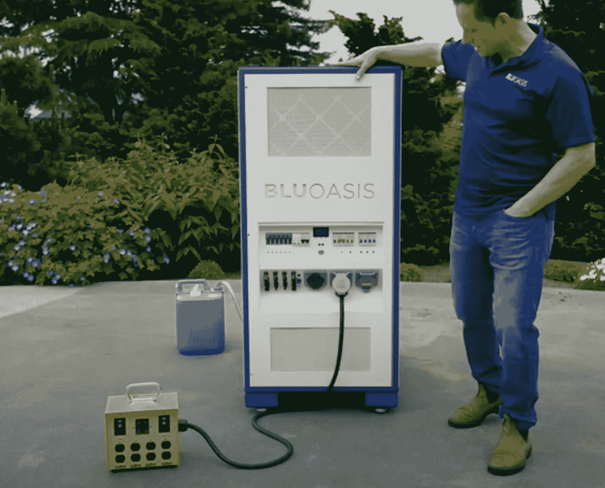
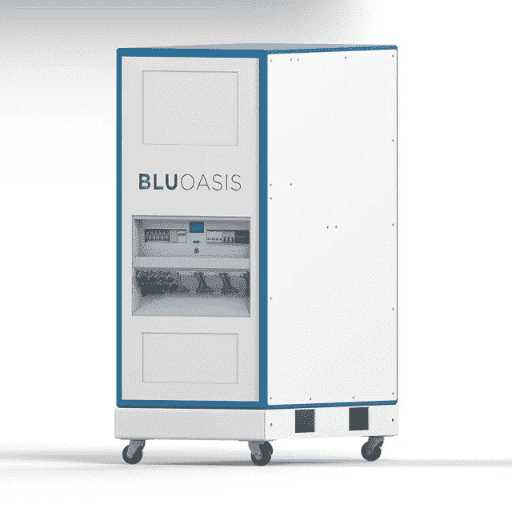
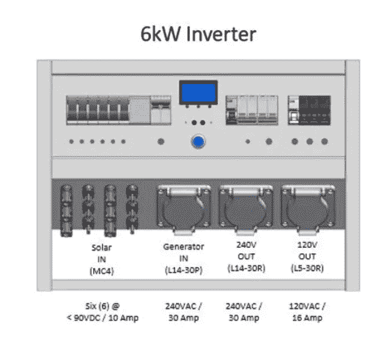

# 太阳能/水力发电机一体化解决方案

> 原文：<https://medium.com/codex/bluoasis-a-solar-water-generator-all-in-one-solution-e72a59b844ff?source=collection_archive---------11----------------------->

## 用 BLUOASIS 解决缺水缺电问题！

[blue Oasis(Blu Oasis Corporation 的媒体)](https://youtu.be/5hgywR2TqJ0)

人类最重要的日常问题之一是获得水和可靠电力的机会减少。我们多久会意识到一些灾难性的短缺甚至影响到美国西部的？像 [Blu Oasis Corporation](https://www.bluoasis.com/) 这样的公司正在开发创新的方法来解决这些短缺，使用多用途技术设备来产生和储存水和电力。

杰森·安德鲁斯于 2019 年在华盛顿州西雅图创立了 Blu Oasis Corporation。Jason 是一名连续技术和航天企业家，他有与东南亚社区合作的第一手经验，这些社区迫切需要更好地获得可再生电力和清洁饮用水。他的目标是为有需要的人带来一款一体化设备。

BluOasis 并不是市场上唯一的大气水生成器。在之前的一篇文章中，我写了 WaterGen 从空气中产生水的能力:

 [## 从稀薄或浓厚的空气中创造水！

### 想象一下可能性

medium.com](/codex/creating-water-out-of-thin-or-thick-air-ccb71cd211a2) 

旗舰产品 BLUOASIS 1506 的大小大致相当于一台普通冰箱，被视为固定式而非移动式冰箱。从大气水发生器开始，1506 每天可生产高达 10 加仑(44 升)的水。简单地说:这种装置利用制冷来捕捉空气中的湿度。然后它将空气中的水分凝结成水。它用紫外线(UV)光处理它，然后允许它通过重力从单元排入适当的储存容器。

将其与 15kW-hr 的 LiFePO4(磷酸铁锂)电池和 6kW 输出耦合；它是多种用途的理想选择。你想脱离电网吗？这将是一个为此服务的单位。也许是一个移动的工作场所或一个没有可靠电力或干净水的地区。1506 单位会检查所有这些框！

[Blu Oasis 1506(Blu Oasis 公司的媒体)](https://static.wixstatic.com/media/d74eea_05c1b660c5ad44048b5551858efdc4ff~mv2.png/v1/fill/w_504,h_616,al_c,lg_1,q_85,enc_auto/Product_1.png)

BLUOASIS 以提供即插即用的简单解决方案而自豪。目标是在开箱后一小时内将设备安装到位并连接好。最困难的决定之一是把这个单元放在哪里。幸运的是，它配备了轮子，因为它的重量为 785 磅。它不到 5 英尺，大约 58 英寸，宽 40 英寸，深 26 英寸。

BLUOASIS 是一种低维护机器，其特殊任务是更换滤水器。该装置配有两个水过滤器，应根据装置的位置进行更换。位置越脏，过滤器应该更换得越频繁。平均而言，预计每年更换一次过滤器。动力系统本身不需要维护。

如果不能从世界上任何地方的电脑或智能设备上进行控制，像这样的智能设备是不完整的。所有 BLUEOASIS 设备都与物联网云连接，可以通过移动设备访问和监控。

一个人能指望为这样一个单位付出什么？税前和交货前，价格为 24，500 美元起。这不包括太阳能电池板，因为该系统需要 4.5 千瓦的输入功率。如果我没有提到发电机也可以为 BLUOASIS 供电，那我就失职了。在联邦税收抵免之前，预计为太阳能电池板支付约 12，000 美元。这些可以直接挂在设备的前面(如下图)

[前面板(Blu Oasis Corporation 的媒体)](https://static.wixstatic.com/media/e8f441_44bc6aaee6e64c7aa6ed61ded00c1547~mv2.jpg/v1/fill/w_887,h_408,al_c,lg_1,q_85,enc_auto/Inverter%20Pic_JPG.jpg)

面板有太阳能或发电机输入和 240V 和 120V 输出。简约是 BLUOASIS 1506 整体设计的关键。如果这个尺寸对你的需求来说有点动力不足，也不用担心。Blu Oasis 拥有最高 45 千瓦小时的定制设备，可满足更大的工作需求！