# Bokeh:一个交互式数据可视化库

> 原文：<https://medium.com/codex/bokeh-an-interactive-data-visualization-library-6dfbfb1c596c?source=collection_archive---------6----------------------->

## **使用散景创建显示在 Jupyter 笔记本上的交互式可视化效果**


原文可以在[路孚特开发者社区](https://developers.refinitiv.com/en/article-catalog/article/bokeh--an-interactive-data-visualization-library-in-codebook)上找到。

# 散景概述

Bokeh 是一个 Python 库，用于为现代 web 浏览器创建交互式可视化，包括 Jupyter Notebook 和路孚特码本。它允许用户几乎不需要太多调整就可以创建现成的吸引人的图表。

散景从 2013 年就有了。它的目标是让现代网络浏览器呈现交互式可视化，而不是静态图像。Bokeh 提供了多种语言的库，比如 Python、R、Lua 和 Julia。这些库为 BokehJS(一个 Javascript 库)生成 JSON 数据，BokehJS 反过来创建在现代 web 浏览器上显示的交互式可视化。散景有很多好处，包括:

*   **从简单到复杂的可视化:**散景提供了不同的界面，面向不同技能水平的用户。用户可以使用基本界面实现快速简单的可视化，也可以使用高级界面实现更加复杂和高度可定制的可视化。
*   **易于与 Pandas 一起使用:** Bokeh 提供了 **ColumnDataSource** 类，这是 Bokeh 的基本数据结构。大多数图、数据表等。将由一个**列数据源**驱动。用户还可以将 Pandas 数据框指定为绘制图表的数据源。
*   **支持多种输出媒介:**散景的输出可以在包括 Jupyter Notebook 在内的现代网络浏览器上显示。输出也可以导出到 HTML 文件。此外，通过在散景服务器上运行，散景可以用于创建交互式 web 应用程序。

散景为用户提供了不同级别的界面，从具有很少可定制参数的基本绘图到完全控制其可视化的高级绘图。通常，接口分为两个级别:

*   **bokeh.plotting:** 堪比 Matplotlib 的中级接口。工作流是创建一个图形，然后用不同的元素来丰富这个图形，这些元素呈现图形中的数据点。
*   **bokeh.models** :为应用开发者提供最大灵活性的底层接口。该界面提供了对如何组合、配置和显示散景图的完全控制。

本文中的例子主要依赖于 **bokeh.plotting** 接口。您可以参考[散景图库](https://docs.bokeh.org/en/latest/docs/gallery.html)获取可用图表和示例列表。

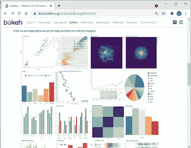

# 路孚特码本

CodeBook 是路孚特 Eikon 或 Workspace 中的一个应用程序，允许用户访问 Python 脚本的云托管开发环境，并利用路孚特 API 快速构建和部署符合工作流需求的模型、应用程序和分析。

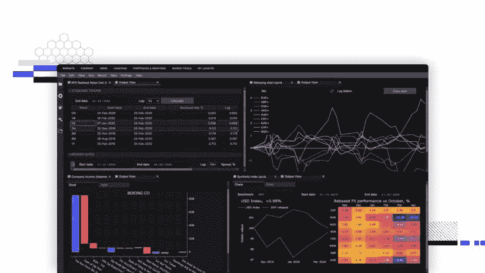

CodeBook 为开发人员或数据科学家提供了许多预装的 Python 库，以从路孚特的平台检索数据、处理数据、绘制图表、构建机器学习模型等。

Bokeh 是码本环境中预装的可视化 Python 库之一。除了 Bokeh，CodeBook 中还有其他可用的图表库，如 altair、bqplot、matplotlib、plotly 和 seaborn。

本文演示了如何使用散景来可视化从路孚特 API 中检索的财务数据。

# 示例用法

下面的示例演示了如何使用散景来绘制几个图表，以可视化从 Eikon 数据 API 检索的财务数据。这些示例还展示了如何创建布局以在笔记本单元格中显示图表。

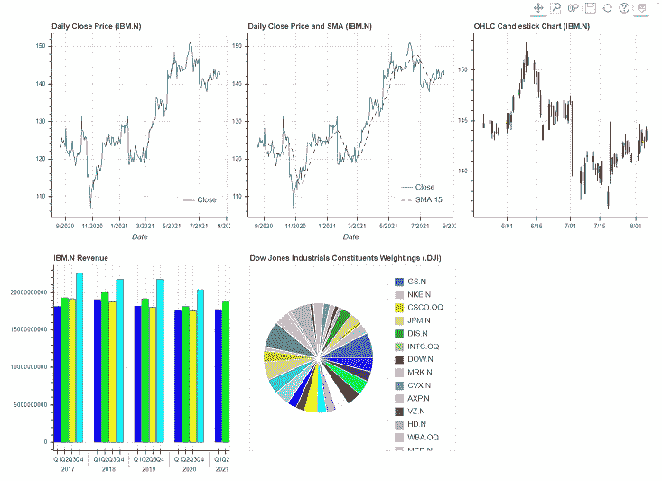

请按照下面的步骤运行示例。

# 先决条件

代码可以在安装了散景和 Eikon 数据 API 库的路孚特码本或 Jupyter 笔记本上运行。您可以从 Libraries&Extensions.md 文件中验证路孚特码本中安装的散景的版本。

# 导入所需的库

首先，导入 Python 库，如 Eikon 数据 API、Bokeh 和实用程序，以检索数据、处理数据和绘制图表。

```
import refinitiv.dataplatform.eikon as ek
from bokeh.plotting import figure, show
from bokeh.io import output_notebook
from bokeh.models import ColumnDataSource, CDSView, BooleanFilter, HoverTool, FactorRange
from bokeh.transform import factor_cmap, cumsum
from bokeh.layouts import row, column, gridplot
from bokeh.models.widgets import Tabs, Panel
import pandas as pd
from math import pi
import datetime
```

然后用 application key 初始化 Eikon 数据 API，调用 **output_notebook()** 方法，配置默认输出状态，在调用 **show()** 方法时，在笔记本单元格中生成输出。

```
ek.set_app_key('DEFAULT_CODE_BOOK_APP_KEY')
output_notebook()
```


# 折线图

此示例显示如何使用散景绘制折线图，显示从 Eikon 数据 API 检索的每日历史收盘价。

调用 Eikon 数据 API 的 **get_timeseries** 方法来检索 IBM.N 的每日历史收盘价。

```
df1 = ek.get_timeseries('IBM.N',
   fields=['CLOSE'],
   start_date=datetime.timedelta(days=-365),
   end_date=datetime.datetime.now(),
   interval='daily')
df1
```

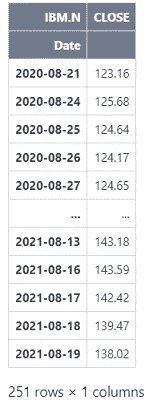

然后，它创建一个散景图并向该图添加一个折线图。它将从 **get_timeseires** 方法中检索的数据帧指定为折线图的数据源，以绘制来自 **Date** 和 **CLOSE** 列的数据。它还向图中添加了一个悬停工具，以便当光标悬停在折线图上时以交互方式显示数据。接下来，它调用 **show** 方法来显示图形。

```
figure1 = figure(title="Daily Close Price (IBM.N)",          
           x_axis_type="datetime",
           x_axis_label='Date')
figure1.line(x='Date', y='CLOSE', source=df1, legend_label="Close")
figure1.add_tools(HoverTool(
    tooltips=[
        ( "Date",  "$x{%F}"            ),
        ( "Price", "$y{"+f"0.00"+" a}" )
    ],
    formatters={
        '$x'      : 'datetime',
    },
))
figure1.legend.location = 'bottom_right'
show(figure1)
```

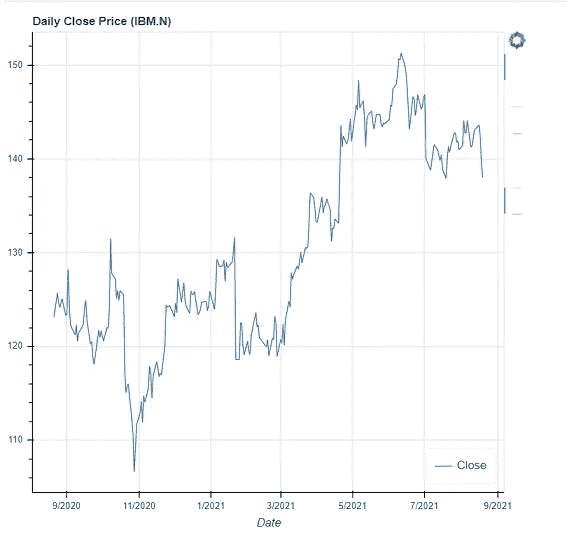

# 多线折线图

此示例通过添加另一条显示收盘价的 15 天简单移动平均线来增强前面的折线图。

它使用**滚动**和**平均**方法计算收盘价的 15 天简单移动平均线，并在数据框中创建一个包含计算值的新列( **SMA_15** )。

```
df1['SMA_15'] = df1.CLOSE.rolling(15).mean()
df1
```

然后，它使用类似于上一步的折线图创建了一个新的图形，并向该图形添加了另一条虚线来表示 **SMA_15** 列中的数据

```
figure2.line(x=’Date’, y=’SMA_15', source=df1, legend_label=”SMA 15", line_dash = ‘dashed’, color=”red”, name=”SMA 15")
```

接下来，它调用 **show** 方法来显示图形。

```
figure2 = figure(title="Daily Close Price and SMA (IBM.N)",          
           x_axis_type="datetime",
           x_axis_label='Date')

figure2.line(x='Date', y='CLOSE', source=df1, legend_label="Close", name="CLOSE")
figure2.line(x='Date', y='SMA_15', source=df1, legend_label="SMA 15", line_dash = 'dashed', color="red", name="SMA 15")

figure2.add_tools(HoverTool(
    tooltips=[
        ( "", "$name"),
        ( "Date",  "$x{%F}"            ),
        ( "Price", "$y{"+f"0.00"+" a}" )
    ],
    formatters={
        '$x'      : 'datetime', 
    },
))
figure2.legend.location = 'bottom_right'
show(figure2)
```

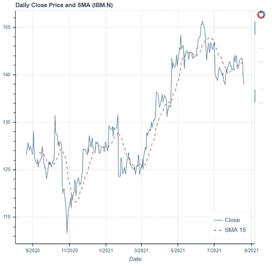

# 蜡烛图

此示例绘制了一个蜡烛图，显示从 Eikon 数据 API 检索的每日历史开盘价、最高价、最低价和收盘价。

首先，它调用 **get_timeseries** 方法来检索 IBM.N 的每日历史 OHLC 价格

```
df2 = ek.get_timeseries('IBM.N',                  
                  start_date=datetime.timedelta(days=-90), 
                  end_date=datetime.datetime.now(), 
                  interval='daily')
df2
```

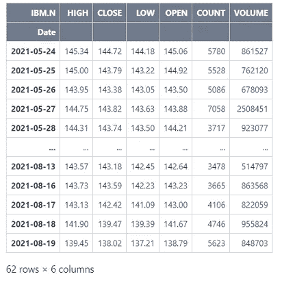

然后，它创建一个包含线段和竖线标志符号的新图形。分段图示符用于显示最低价和最高价，竖线图示符用于显示开盘价和收盘价。如果收盘价大于或等于开盘价，竖线符号的颜色将为绿色。否则，竖线标志符号的颜色将为红色。

它还在图表中添加了一个悬停工具，以便当光标悬停在图表上时以交互方式显示 OHLC 数据。接下来，它调用 **show** 方法来显示图形。

```
source = ColumnDataSource(data=df2)
hover = HoverTool(
    tooltips=[
        ('', '[@Date](http://twitter.com/Date){%F}'),
        ('O', '[@OPEN](http://twitter.com/OPEN){"+f"0.00"+" a}'),
        ('H', '[@HIGH](http://twitter.com/HIGH){"+f"0.00"+" a}'),
        ('L', '[@LOW](http://twitter.com/LOW){"+f"0.00"+" a}'),
        ('C', '[@CLOSE](http://twitter.com/CLOSE){"+f"0.00"+" a}'),
        ('V', '[@VOLUME](http://twitter.com/VOLUME){0}'),
    ],

    formatters={
        '[@Date](http://twitter.com/Date)': 'datetime'
    },
    mode='mouse'
)
inc_b = source.data['CLOSE'] >= source.data['OPEN']
inc = CDSView(source=source, filters=[BooleanFilter(inc_b)])
dec_b = source.data['OPEN'] > source.data['CLOSE']
dec = CDSView(source=source, filters=[BooleanFilter(dec_b)])
w = 12*60*60*1000 
figure3 = figure(title="OHLC Candlestick Chart (IBM.N)",
                 x_axis_type="datetime",
                 sizing_mode="stretch_width",
                 height=400,
                 x_axis_label='Date')
figure3.segment(source=source, x0='Date', x1='Date', y0='HIGH', y1='LOW', color="black")
figure3.vbar(source=source, view=inc, x='Date', width=w, top='OPEN', bottom='CLOSE', fill_color="green", line_color="green")
figure3.vbar(source=source, view=dec, x='Date', width=w, top='OPEN', bottom='CLOSE', fill_color="red", line_color="red")
figure3.add_tools(hover)

show(figure3)
```

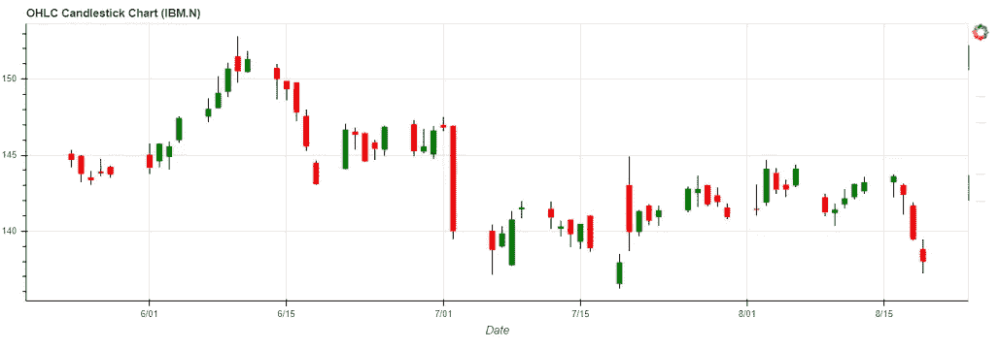

# 垂直条形图

此示例绘制了一个垂直条形图，显示了前几年的季度历史收入。

首先，它调用 **get_data** 方法来检索 IBM 的季度历史收入。n 回溯到四年，然后按日期升序对数据进行排序。

```
quarter = pd.Timestamp(datetime.date.today()).quarter
quarter = quarter + 14
quarter = quarter*-1
df3, err = ek.get_data(
    instruments = ['IBM.N'],
    fields = ['TR.Revenue.Date','TR.Revenue'],
    parameters={'SDate':0,'EDate':quarter,'Period':'FQ0','Frq':'FQ'}
)
df3 = df3[::-1].reset_index().drop('index', axis=1)
df3
```

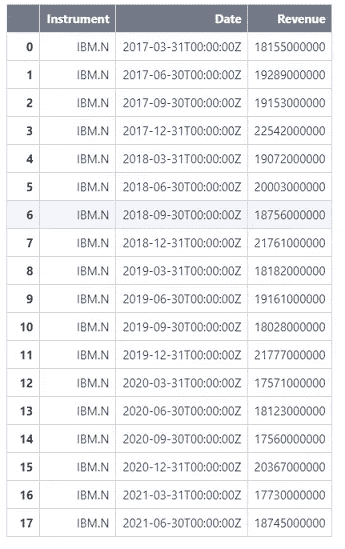

接下来，它将以下各列添加到数据框中。

*   **Q** :季度，如 Q1、Q2、Q3 或 Q4。
*   **年份**:年份，如 2021 年。
*   **QY** :季度和年份，如 2021Q1
*   **组**:年和 Q 的元组，例如(2021，Q2)

Bokeh 使用这些列来绘制嵌套的垂直条形图。

```
df3['Date'] = pd.to_datetime(df3['Date'], format='%Y-%m-%d')
df3['Q'] = ('Q' + df3['Date'].dt.quarter.astype(str))
df3['Year'] = df3['Date'].dt.to_period("Y").astype(str)
df3['QY'] = df3['Date'].dt.to_period("Q").astype(str)
df3['Group'] = df3[['Year', 'Q']].apply(lambda x: (x[0],str(x[1])), axis=1)
df3
```

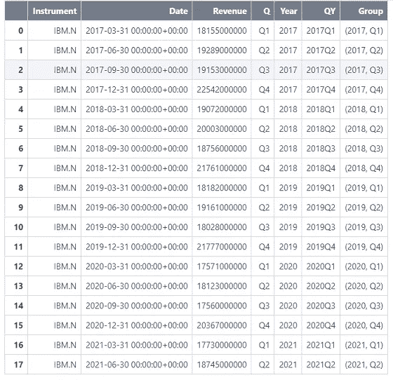

接下来，它创建一个新图形，然后将垂直图表添加到该图形中。它使用数据框中的**组**列作为竖条的 x 坐标来创建嵌套竖条图。

它还向图中添加了一个悬停工具，以便当光标悬停在图表上时交互显示收入。接下来，它调用 **show** 方法来显示图形。

```
palette = ['#0000ff', '#00ff00', '#ffff00', '#00ffff']
years = ['Q1','Q2','Q3','Q4']
figure4 = figure(
    x_range=FactorRange(*list(df3["Group"])),
    title="IBM.N Revenue",
    width=800
)
figure4.vbar(
    x="Group",
    top="Revenue",
    width=0.9,
    source=df3,
    fill_color=factor_cmap('Group', palette=palette, factors=years, start=1, end=3)
)
figure4.add_tools(HoverTool(
    tooltips=[
        ('', '[@QY](http://twitter.com/QY)'),
        ('', '[@Revenue](http://twitter.com/Revenue){0.00 a}')
    ],
    mode='mouse'
))
figure4.left[0].formatter.use_scientific = False
show(figure4)
```

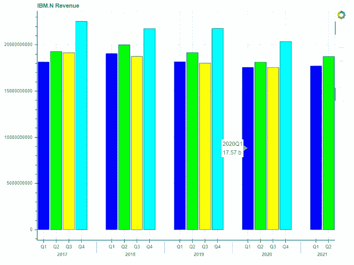

# 圆形分格统计图表

本示例绘制了一个饼图，显示道琼斯工业平均指数中各种成分的权重百分比。

首先，它调用 **get_data** 方法来检索道琼斯工业平均指数中的成分和成分的重量百分比。接下来，它重命名列名，这样散景就可以很容易地引用它们。

```
df4, err = ek.get_data('0#.DJI', ['TR.IndexConstituentWeightPercent','TR.CommonName'])
df4 = df4.rename(columns={"Weight percent": "Value", "Company Common Name":"Name"})
df4
```

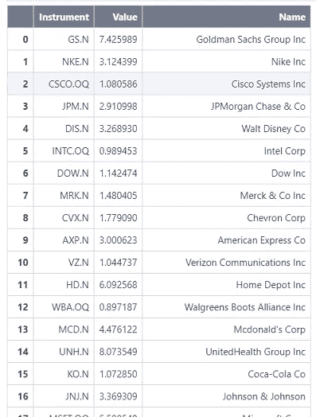

然后，它将下列添加到数据框中。

*   **角度**:饼图中每个扇区的角度。它是根据重量百分比计算的。
*   **颜色**:饼状图中每个扇区的颜色

散景使用这些列来绘制饼图。

```
df4['angle'] = df4['Value']/df4['Value'].sum() * 2*pi
df4['color']= ['#1f77b4', '#aec7e8', '#ff7f0e', '#ffbb78', '#2ca02c', '#98df8a', '#d62728', '#ff9896', '#9467bd', '#c5b0d5',
    '#8c564b', '#c49c94', '#e377c2', '#f7b6d2', '#7f7f7f', '#c7c7c7', '#bcbd22', '#dbdb8d', '#17becf', '#9edae5',
     '#0000ff', '#ff0000', '#ffff00', '#00ffff', '#ff00ff', '#F0F8FF', '#006B3C', '#00FF6F', '#392972', '#8F00FF']
df4
```

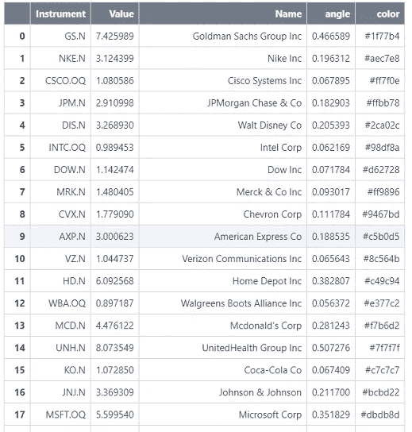

接下来，它创建一个新图形，然后将饼图添加到该图形中。它使用数据框中的**角度**和**颜色**列来确定饼图中使用的角度和颜色。

```
figure5 = figure(plot_height=800,plot_width=800, title="Dow Jones Industrials Constituents Weightings (.DJI)", toolbar_location=None,
           tools="hover",tooltips="[@Name](http://twitter.com/Name) ([@Instrument](http://twitter.com/Instrument)): [@Value](http://twitter.com/Value)", x_range=(-0.5, 1.0))
figure5.wedge(x=0, y=1, radius=0.4,
        start_angle=cumsum('angle', include_zero=True), end_angle=cumsum('angle'),
        line_color="white",fill_color='color', legend_field='Instrument', source=df4)
figure5.axis.axis_label=None
figure5.axis.visible=False
figure5.grid.grid_line_color = None

show(figure5)
```

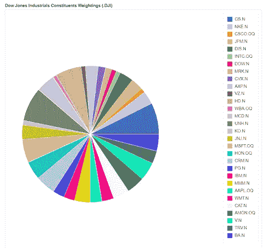

# 行和列布局

此示例使用散景中的行和列布局来排列和显示图表。 **column()** 方法用于垂直显示图表，而 **row()** 方法用于水平显示图表。

它在下面的布局中显示了图 1、图 2 和图 3。

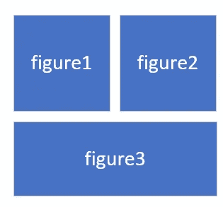

```
row_layout = column(row(children=[figure1,figure2]), figure3)
show(row_layout)
```

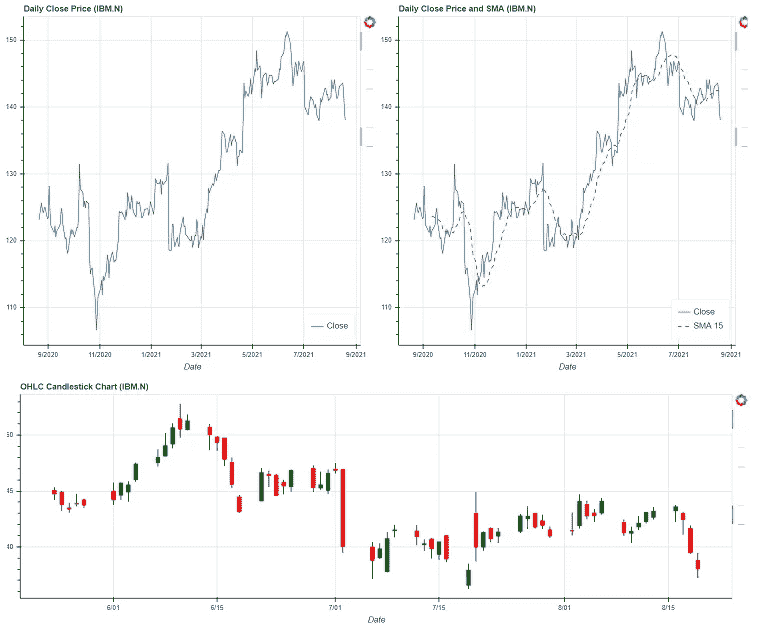

# 网格布局

本例使用 **gridplot()** 方法在网格中排列散景图。

它在下面的布局中显示了图 1、图 2、图 3 和图 4。

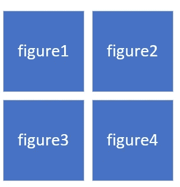

```
grid_layout = gridplot([[figure1, figure2], [figure3, figure4]], plot_width=500, plot_height=500)
show(grid_layout)
```

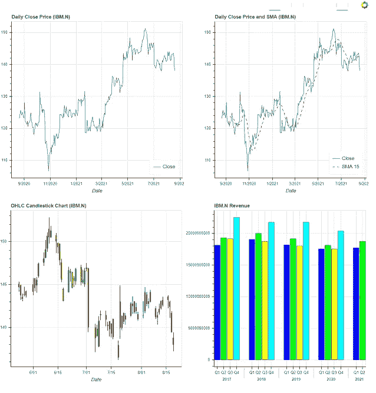

# 面板和选项卡

本示例使用 **Panel()** 和 **Tabs()** 方法在选项卡式布局中排列图表。它创建了两个选项卡。第一个选项卡包含网格布局中的图 1、图 2、图 3 和图 4，第二个选项卡包含图 5。

```
panel1 = Panel(child=grid_layout, title='IBM.N')
panel2 = Panel(child=figure5, title='DJI')
tabs_object = Tabs(tabs = [panel1, panel2])
show(tabs_object)
```

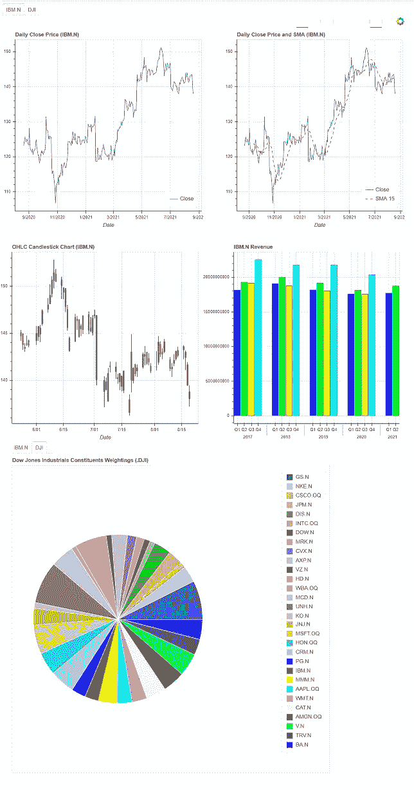

# 摘要

Bokeh 是一个 Python 库，用于为包括 Jupyter Notebook 在内的现代 web 浏览器创建交互式可视化。该库在路孚特码本中可用。因此，开发人员或数据科学家可以使用这个库来可视化从路孚特的 API 中检索到的财务数据。

本文提供了几个示例，演示如何使用路孚特码本中的散景根据 Eikon 数据 API 返回的数据帧绘制图表。此外，它还显示了如何使用散景行、列、网格和选项卡式布局来排列图表。

# 参考

1.  科克伦，南，2019。我喜欢用 Python 进行数据探索的 6 个理由。[在线]走向数据科学。可从以下网址获取:[https://towards data science . com/6-reasons-I-love-bokeh-for-data-exploration-with-python-a778a 2086 a95](https://towardsdatascience.com/6-reasons-i-love-bokeh-for-data-exploration-with-python-a778a2086a95)【2021 年 8 月 18 日获取】。
2.  m .多布勒和 t .格罗曼，2020 年。数据可视化研讨会。第一版。[S.l.]: Packt Publishing。
3.  Developers.refinitiv.com。n.d. Eikon 数据 API |路孚特开发者。[在线]可从以下网址获取:[https://developers . refinitiv . com/en/API-catalog/eikon/eikon-data-API](https://developers.refinitiv.com/en/api-catalog/eikon/eikon-data-api)[2021 年 8 月 18 日获取]。
4.  堆栈溢出。2020.如何让 Bokeh hovertool 为烛台图表工作？。[在线]见:[https://stack overflow . com/questions/61175554/how-to-get-bokeh-hover tool-work-for-candlesteds-chart](https://stackoverflow.com/questions/61175554/how-to-get-bokeh-hovertool-working-for-candlesticks-chart)[2021 年 8 月 18 日访问]。
5.  英国乔利，2018。用散景实现数据可视化。第一版。包装出版公司。
6.  雷，s，2015。使用散景的交互式数据可视化(Python 语言)。[在线]分析维迪亚。可在:[https://www . analyticsvidhya . com/blog/2015/08/interactive-data-visualization-library-python-bokeh/](https://www.analyticsvidhya.com/blog/2015/08/interactive-data-visualization-library-python-bokeh/)【2021 年 8 月 18 日访问】。
7.  Refinitiv.com 路孚特密码本。[在线]可在:[https://www.refinitiv.com/en/products/codebook](https://www.refinitiv.com/en/products/codebook)[2021 年 8 月 18 日访问]。
8.  Ven，学士，2021 年。散景。[在线]Bokeh.org。可在:[https://bokeh.org/](https://bokeh.org/)【2021 年 8 月 18 日获取】。
9.  Docs.bokeh.org 新画廊-散景 1.4.0 文档。[在线]可在:[https://docs.bokeh.org/en/1.4.0/docs/gallery.html](https://docs.bokeh.org/en/1.4.0/docs/gallery.html)[2021 年 8 月 18 日访问]。