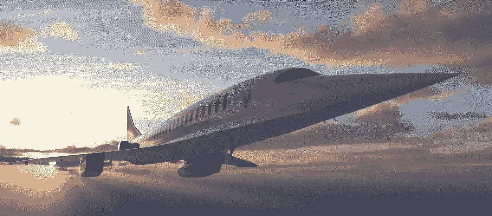

# Boom 超音速相信飞行应该用一半的时间！

> 原文：<https://medium.com/codex/boom-supersonic-believes-flights-should-take-half-the-time-9fee9fed8dee?source=collection_archive---------11----------------------->

## 介绍“序曲”超音速飞机

[序曲(媒体热潮)](https://boomsupersonic.com/static/images/press-media-overture-images@2x.jpg)

在早期的一篇文章中，我描述了一种被称为[观星器](/evolve/lets-do-away-with-long-flights-to-travel-destinations-1dfa73404094)的车辆，它设想以**高超音速**(9 马赫)速度行驶。我们离这个伟大的目标还差得很远。也许我们应该把目光放在一个更容易实现的目标上，这就是 Boom 的“序曲”的内容