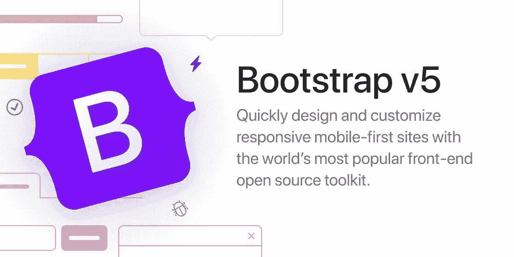

# Bootstrap 版本 5 现已发布，有哪些新功能和变化

> 原文：<https://medium.com/codex/bootstrap-version-5-is-live-whats-new-and-changed-40b534f0a8fb?source=collection_archive---------5----------------------->

## Bootstrap 版本 5 中的更改和新组件

[Bootstrap v5，推文截图。](https://twitter.com/getbootstrap/status/1390032190369505284)

# 概观

Bootstrap 版本 5 发布了，他们在 5 月 6 日发布了关于它的推文。像 Accordion 这样的新组件，新的实用程序和 API 以及其他一些东西被引入。

# 入门指南

1.  [**图标&文档**](https://blog.getbootstrap.com/#new-logo) …