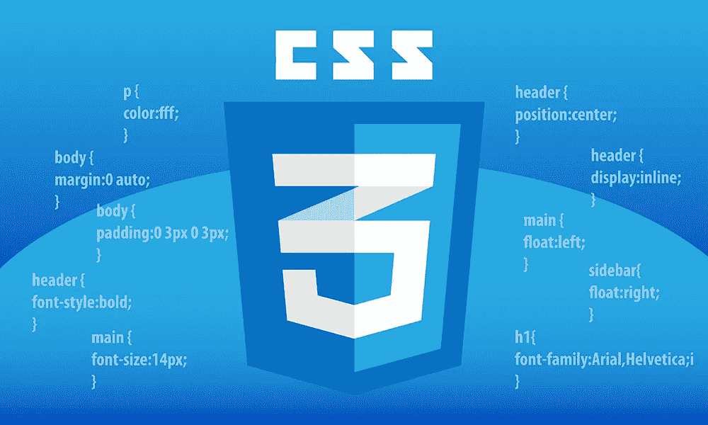

# Bootstrap vs Tailwind CSS |你需要哪个？

> 原文：<https://medium.com/codex/bootstrap-vs-tailwind-css-which-one-do-you-need-9dfb3ef26ac0?source=collection_archive---------0----------------------->

## CSS 框架在 web 开发中已经流行了 10 多年，并且不断有新的框架进入这个领域。当然，如果他们中有“最好的”，这是一个可以接受的问题。在本文中，我们将研究最流行的 CSS 框架，Bootstrap 和 Tailwind CSS。

# 为什么需要 CSS 框架？

96.2%的在线网站使用 CSS。然而，在一个新的网站或应用程序上从头开始编写 CSS 代码会感觉像是在重新发明轮子。程序员应该让生活更简单，所以，不应该每天做同样的事情，对吗？

如果你喜欢在每一个项目中使用普通的 CSS，这意味着你将花费大量的时间用 CSS 重写同样的东西。所以，人们有了这个问题，选择做一些简单的方法。这里我们开始使用 CSS 框架。有了 CSS 框架，我们可以更快地编写设计代码。在这里时间就是金钱。如果你能在可接受的性能下，用 70%的时间完成同样的设计，这难道不值得吗？

# 什么是自举？

[官方自举网站](https://getbootstrap.com/)

Bootstrap 是至今仍在使用的运行时间最长的 CSS 框架之一。它是由 Twitter 在 2011 年创建的。我们大多数人使用 Bootstrap，因为它为常见组件提供了基于 CSS 的模板和类。因此，您只需复制并粘贴 Bootstrap 的所有常用组件，并以响应速度和移动优先的设计来使用它们。

例如，我们几乎无法想象一个没有导航条的网站，对吗？有了 Bootstrap，我们就不需要从头开始写了。我们可以从模板中选择并使用它们。如果你愿意，你可以随意定制。

# 什么是顺风 CSS？

[顺风社官方网站](https://tailwindcss.com/)

另一方面，Tailwind CSS 是由 Adam Wathan 和 Steve Schoger 在 2017 年创建的。他们将 Tailwind CSS 描述为一个“实用优先的 CSS 框架，用类来构建任何设计”。与 Bootstrap 不同，Tailwind CSS 不提供任何一键使用的预构建组件。他们只是提供有用的工具和 CSS 类来尽快构建我们的设计。

此外，Tailwind CSS 还有一个额外的好处，它会观察你写了什么，并删除你没有使用的所有内容。因此，与 Bootstrap 不同，您的项目不会有任何未使用的 CSS 类，也不会因此降低性能。在这方面使用 Tailwind CSS 是没有坏处的。

最后，Tailwind 团队还创建了您可以使用的预构建组件和页面。他们中的大多数是付费的，但他们以可承受的价格提供完全可定制的现成组件。点击 [***此处***](https://tailwindui.com/templates) 查看顺风 UI。

# 顺风 CSS 和 Bootstrap 的相似之处

如果我们比较 Bootstrap 和 Tailwind CSS，我们必须知道它们的相似之处。这两个框架都可以帮助你编写大量的 CSS。因此，由于您不需要从头开始编写太多的 CSS，您可以将更多的精力放在构建 UI 及其功能上。

但有时，在 HTML 中编写所有这些预构建的 CSS 类可能很困难。因为 HTML 中太多的类可能看起来有点像忙碌的标记。无论如何，很难否认这样一个事实，即这些框架既简化又加速了构建 UI 的过程。

# 哪些公司使用 Bootstrap？

bootstrap 是一个开源工具，有 160K 的 GitHub stars 和 77.4K 的 GitHub forks。有了这个人气，就有那么多用 Bootstrap 创建的热门公司和网站。

万事达卡，Spotify，LinkedIn，Twitter，Lyft，Snapchat，Udemy，Upwork，Duolingo，Postman，事实上，彭博，以及更多更喜欢在他们的网站上使用 Bootstrap。

# 哪些公司使用 Tailwind CSS？

找不到和上面的自举图片一样的图片。:(

Tailwind 也是开源工具，有 61.5K 的 GitHub stars 和 3.1K 的 GitHub forks。当然没有 Bootstrap 流行，但是使用 Tailwind CSS 的公司和网站越来越多。

Solid by Buzzfeed，Shed by TED，Stripe，Medium，Meetup，Kickstarter，Twitch，Heroku，Starbucks，Pizza Hut，NBA 网站，Eurovision，Clubhouse，GitHub CoPilot，React Beta Documentation，网飞排名前 10 的网站，以及更多更喜欢在其网站和项目上使用 Tailwind CSS 的网站。

# 哪个更好？

好了，让我们开始真正的问题，你来这个帖子的问题。Tailwind CSS 的 Bootstrap 比另一个好吗？在我看来，两者都是项目的有效选择。所以，不存在“更好的框架”。此外，在这两者之外，根本没有“最好的 CSS 框架”。

如果你喜欢从零开始制作完全定制的组件和设计的自由，但你不想编写普通的 CSS 并担心小细节，那么 Tailwind 是你的最佳选择。

另一方面，如果设计不是你的强项，你宁愿不去想它，Bootstrap 是一个更好的选择，它有预构建的 UI 组件等等。

# 2023 年香草 CSS 怎么办？

当然有一个选项我应该提到，那就是根本不使用 CSS 框架。仅仅因为 CSS 框架现在很流行，并不意味着你必须使用其中的一个。CSS 本身仍然是一个有效的选择。

当然，根据项目的不同，你必须更喜欢使用你能使用的框架，或者甚至不使用它们中的任何一个。香草 CSS 仍然是一个强大的工具，如果你需要照顾你的项目毫秒级的性能，你不会有任何担心。

# 最后的想法

你可能已经猜到了这篇文章的结论，但是你使用哪个 CSS 框架，完全取决于你，你的经验，和你的项目。如果你不是一个设计师，只是想尽可能快地把东西放在一起，那么 Bootstrap 可能是你的选择。但是如果你想要完全自由的定制设计，那么 Tailwind CSS 可能是你更好的选择。

我个人更倾向于顺风 CSS 阵营。我绝对不是一个获奖的设计师，可能永远也不会。但是，由于 Tailwind CSS 的逻辑，我不需要考虑浏览器兼容性或其他任何问题。我可以完全自由地专注于设计我头上的东西，这是我感到舒服的。

那么，你呢，你属于哪个阵营？你使用 CSS 框架还是更喜欢普通版本？如果使用其中一种，你最喜欢哪一种？请在评论中告诉我！还有，如果你觉得内容有用，可以通过下面的提示支持我😇。