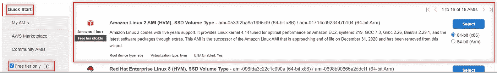

# 引导 AWS EC2 实例来更新包、安装和启动 Apache HTTP Server

> 原文：<https://medium.com/codex/bootstrapping-aws-ec2-instance-to-update-packages-install-and-start-apache-http-server-f68fe1fe33ba?source=collection_archive---------0----------------------->

## [法典](http://medium.com/codex)

AWS 中的 Bootstrapping 仅仅意味着向 **AWS EC2 的实例用户数据**部分添加命令或脚本，这些命令或脚本可以在实例启动时执行。采用这种方法来简化配置任务是一种很好的自动化实践。

# 教程目标

*   使用 AWS 管理控制台创建 AWS EC2 实例。
*   使用 Bash 命令引导 AWS EC2。
*   了解如何查看引导命令的结果。

下图描绘了完成本教程后我们将完成的任务。


引导代码和 AWS EC2 实例架构

# 这是你需要的东西

*   具有管理员访问权限的 AWS 帐户用户。如果您还没有帐户，请不要担心，请先注册一个 [AWS 自由层帐户](http://aws.amazon.com/free)，然后再继续。

# 使用 Bootstrap 命令启动 EC2 实例

在本节中，我们将使用 AWS 管理控制台创建一个 AWS EC2 实例，并在**用户数据**部分添加命令来更新所有包，安装并启动 Apache HTTP Server。

1.  登录 AWS 管理[控制台](https://console.aws.amazon.com/console)。
2.  在右侧的**顶部导航**中，选择您想要安装该实例的区域。我将使用 ***N. Virginia*** 地区。


选择正确的区域

3.有多种方法可以找到 **EC2 服务**:

*   选择**服务下拉箭头**
*   在**搜索栏中输入 EC2**
*   在**所有服务—计算**下，选择 **EC2**


4.点击**启动实例—启动实例**。


启动实例

5.按照以下步骤完成 AWS EC2 实例配置

*   **第一步:** **选择一个亚马逊机器镜像(AMI)** 。一个 ***64 位(x86)*******Amazon Linux 2am(HVM)，SSD 卷类型*** 将用于此练习并单击**选择。***

```
***Tip:** In the left-nav, in the **Quick Start** menu select **Free tier only** to filter the list to display free AMIs.*
```

**

*第一步:选择一个 AMI*

*   ***第二步:选择一个实例类型。*****T2 . micro(符合自由层条件)*** 应该已经选中，如果没有，请选中。该列表根据选定的区域而变化。点击**下一步:配置实例详情***

**

*步骤 2:选择实例类型*

*   ***步骤 3:配置实例详细信息。**确保**自动分配公共 IP** 设置为 ***使用子网设置(启用)*** 。我们将保留所有其他默认值。*
*   *向下滚动到 ***高级详细信息*** 部分。我们将在这里找到 ***用户数据*** 部分来输入我们的引导命令。*
*   *在 ***用户数据*** 部分确保 ***作为文本*** 被选中。*

**

*步骤 3:展开高级详细信息以查看用户数据部分*

*   *将下面的 Bash 命令复制粘贴到 ***用户数据*** 部分，点击**下一步:添加存储**。*

```
 *#!/bin/bash
yum update -y
yum install httpd -y
systemctl start httpd
systemctl enable httpd**Tip**:  Once the instance is launch and you may have to go back and modify this User Data section, stop the instance, click **Actions-Instance settings-Edit user data**.  See image below.*
```

**

*更改用户数据*

*   ***第四步:添加存储空间。**确保**卷类型**为 ***通用 SSD(gp2)*** ，点击**下一步:添加标签。***
*   ***第五步:添加标签。**点击**添加标签。**中**键**中**键入*名称*和**中**值**键入**和 *Web Server01*** 和点击**配置安全组。***

```
***Tip:**  Tag can be used to categorize AWS resource in different ways, for example creating key of Environment with a value of Production denotes that the resource is to be used for the Production environment.* 
```

**

*步骤 5:添加标签*

*   ***第六步:配置安全组。**确保选择了**创建新的安全组**。在**安全组名称**中键入**web server 01 SG。** 也在描述中添加相同的名称。*
*   *对 SSH 进行修改，然后单击**添加规则**来配置 HTTP 类型，如下图所示。*

```
***NOTE:**  SSH — change **Source** to ***Anywhere***. You will receive a warning because this is best practice to allow access from known IP addresses only. It is OK for now because this is a tutorial.*
```

**

*步骤 6:配置防火墙规则*

*   *点击**查看并启动。第七步:复习。**花点时间查看配置并点击**启动。***
*   *选择**旁边的下拉箭头选择一个现有的密钥对**并选择**创建一个新的密钥对。***

*6.为了安全地 SSH 到我们新创建的 Linux 实例，我们需要创建一个新的密钥对。*

*   *给它一个名称，点击**立即下载密钥对**并点击**启动实例。**记住您保存密钥对的位置，因为将在下一节中使用它。*

*7.点击**查看实例**，我们的 WebServer01 实例出现在列表中，状态为**运行**。*

# *让我们确认我们的工作*

*在本节中，使用 AWS EC2 WebServer01 的公共 IP，我们将通过访问测试页面来确认 Apache 已启动并运行。我们还将使用上面创建的密钥登录到服务器，以查看我们的引导命令的结果。*

1.  *在实例列表中，选择 WebServer01 以查看有关服务器的详细信息。我们正在寻找公共 IPv4 地址。*
2.  *打开 Web 浏览器，键入公共 IPv4 地址，应该会显示 Apache HTTP Server 测试页面。*

**

*Apache 测试页面*

*如果没有显示测试页面，这意味着引导命令出现了问题。如果在 Mac 上，我们可以使用终端登录服务器。按照下面步骤 **3** 和 **4** 中显示的连接到实例屏幕的 SSH 客户端选项卡中的步骤进行操作。*

*我使用的是 Windows 机器，因此下面的步骤将使用 PuTTY 来访问服务器。油灰不支持。perm 文件，所以按照这些[步骤](https://docs.aws.amazon.com/AWSEC2/latest/UserGuide/putty.html)来转换。pem 我们将密钥文件下载到. ppk 文件中并连接到服务器。*

*3.回到 AWS 管理控制台，我们可以通过在列表中选择 WebSever01 并在右上角菜单中单击 **Connect** 来获取连接说明。*

**

*有关服务器连接的说明，请单击“连接”*

*4.在连接到实例屏幕上，选择 **SSH 客户端**选项卡。此外，在 **EC2 实例的**选项卡上，在**用户名**中，我们将使用该用户名进行连接。*

*5.连接后，键入以下命令:*

```
***sudo yum history*** 
```

**

*sudo yum history 命令的结果*

```
****Tip***: sudo yum history info httpd will provide details specific to Apache HTTP Server(httpd).*
```

# *恭喜你！！！！您已经成功完成了本教程。*

*请返回 AWS 管理控制台，删除我们在上面创建的资源，这样我们就不会产生任何意外费用。*

*请发表反馈。再次祝贺你成功完成本教程。*