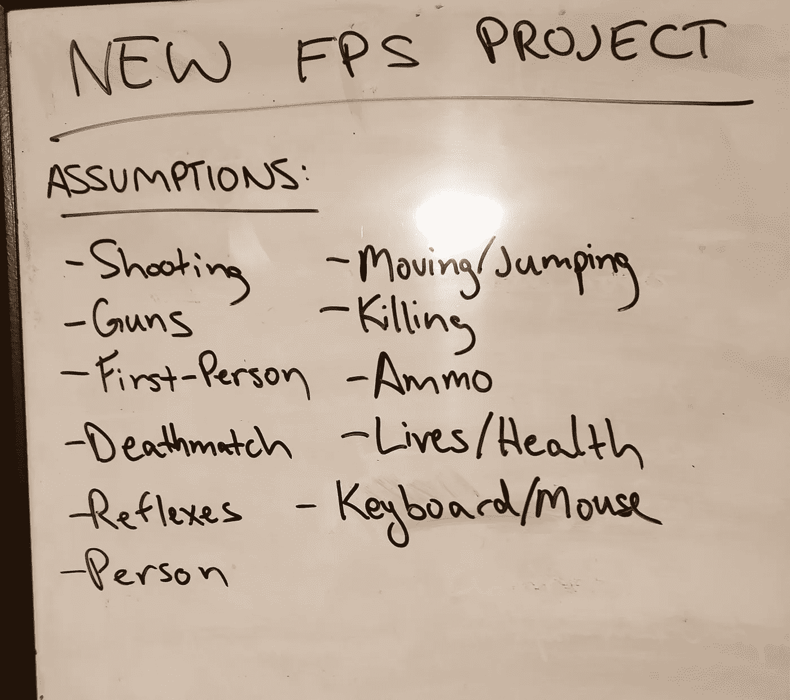

# 头脑风暴技术——反转

> 原文：<https://medium.com/codex/brainstorming-technique-reversal-6ed024881f7?source=collection_archive---------5----------------------->

## 用这种简单易用的技术想出点子，让你自己和你的观众大吃一惊！

Daria Nepriakhina 在 [Unsplash](https://unsplash.com/s/photos/brainstorming?utm_source=unsplash&utm_medium=referral&utm_content=creditCopyText) 上拍摄的照片

头脑风暴作为一种活动，对参与者的要求很低。没有任何正式的规则或处罚，你可以随心所欲地随心所欲。一些幸运的人似乎有一条直通宇宙的线路:宇宙赐予他们永无止境的应用程序、歌曲甚至是食物的好主意。

照片由[格雷格·拉科齐](https://unsplash.com/@grakozy?utm_source=unsplash&utm_medium=referral&utm_content=creditCopyText)在 [Unsplash](https://unsplash.com/s/photos/universe?utm_source=unsplash&utm_medium=referral&utm_content=creditCopyText) 上拍摄

我们其余的人也许能够收听，但是经常有太多的噪音。即使我们能够列出一长串想法，结果也可能是大多数都是陈词滥调，甚至与我们的头脑风暴目标无关。头脑风暴的自由形式本质可能太不稳定，无法在有趣的想法上获得立足点。

# 当每个方向都有效时，你怎么知道你在朝着正确的方向前进呢？

我发现头脑风暴技术不仅有趣，而且通过产生更有针对性的想法来提高会议的质量和效率。

在我的第一篇头脑风暴技术文章中，我想介绍一个弥天大谎:**反转**。逆转就是挑战你的假设。这是一个简单的两步过程:

1.  写下你对问题解决方案的设想。
2.  ***逐一写出每个假设的反面。***

不难看出这种技术在现实世界中的成功之处。广受欢迎的媒体令人兴奋，因为它们挑战了我们对它们能做什么和不能做什么的假设。 *Memento* 逆向讲述故事， *DotA* 采取即时战略游戏，只允许你控制一个角色。

举个例子，让我们尝试使用反转技术来头脑风暴一个新的视频游戏:

# 问题

首先，我们需要解决一个问题。“制作一个电子游戏”这个问题有点模糊，我们先缩小流派，说要“制作一个新的 FPS”(第一人称射击游戏)。

# 假设

接下来，我们需要写下当我们想到 FPS 时的任何假设。将你的假设写在纸上或白板上是至关重要的！当你写作时，你把假设从你的头脑中拉出，进入现实，在那里探索和扭转它们变得容易得多。以下是我在考虑 FPS 时做出的一些假设:

在你自己的假设列表中可能有一些这样的假设，但是我想从我的列表中指出一个假设:“第一人称”。

你可能会忍不住翻白眼。当然，我们假设游戏是第一人称的，那么为什么要写下来呢？“原因在于，为了充分利用这项技术，我们必须

# 写下我们的每一个假设，不管它有多小或多明显。

我们在这一步写下的每一个假设都是一个发现新的令人兴奋的东西的机会！

# 逆转

最后，是时候颠覆我们所做的每个假设了。当你写下反转时，你可以是有逻辑的，也可以是愚蠢的:

对于我的一些假设，我做了逻辑上的颠倒:“如果你是**而不是**一个人呢？”"如果是第一人称游戏中的**而不是**呢？"但对于其他人，我对我的反转有点创意:“如果你想被枪杀呢？”“如果你不能移动呢？”你的每一个假设都是一个改变事物的机会，所以享受这一步吧。

在这一点上，我们有各种各样的途径可以让我们的 FPS 脱颖而出。可能在我们的游戏里，玩家拉东西而不是开枪！事实上，我可能会自己留着那个…

在你自己的想法中，你很可能会看到对其他人有效的逆转。你可能会质疑约会应用程序应该深刻而浪漫的假设，但 Tinder 已经探索了这一领域。所以再深入一点！

# 如果你不断寻找你正在做的假设，我保证你总会有材料来推翻。

当我必须提出软件项目时，我总是使用这种头脑风暴技术。我发现从中产生的想法往往更有创意，更令人惊讶，更令人愉快。用你面临的问题试一试，希望它会成为你常规头脑风暴工具箱的一部分。如果你发现什么奇怪的事情，告诉我！我喜欢听疯狂的新想法！