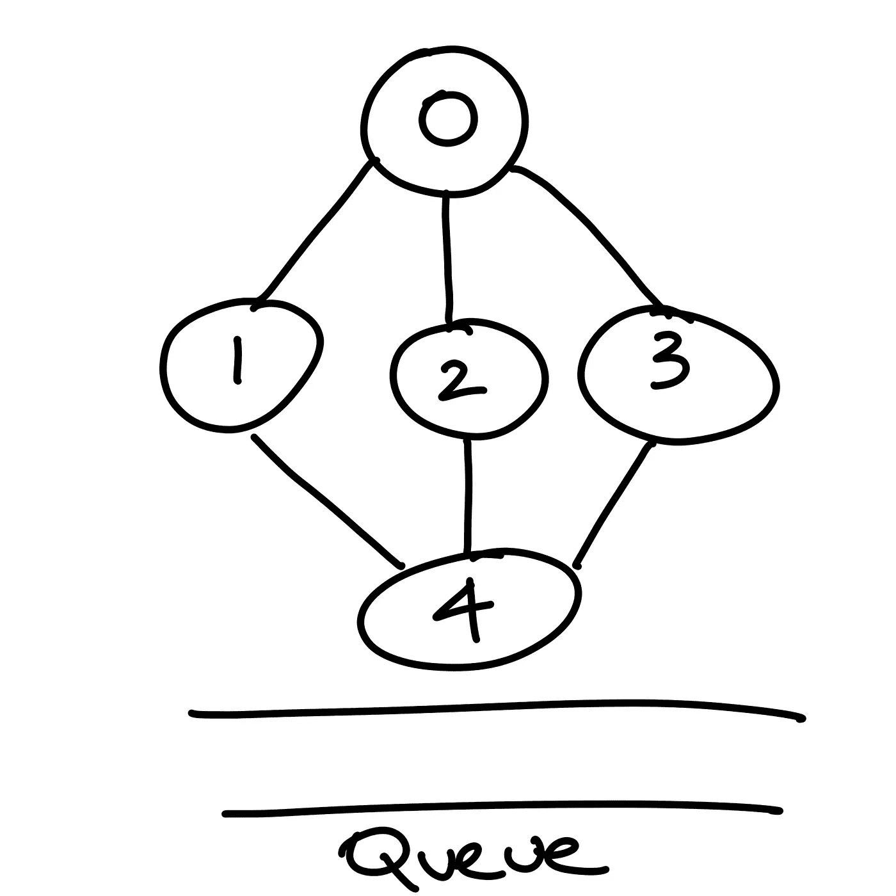
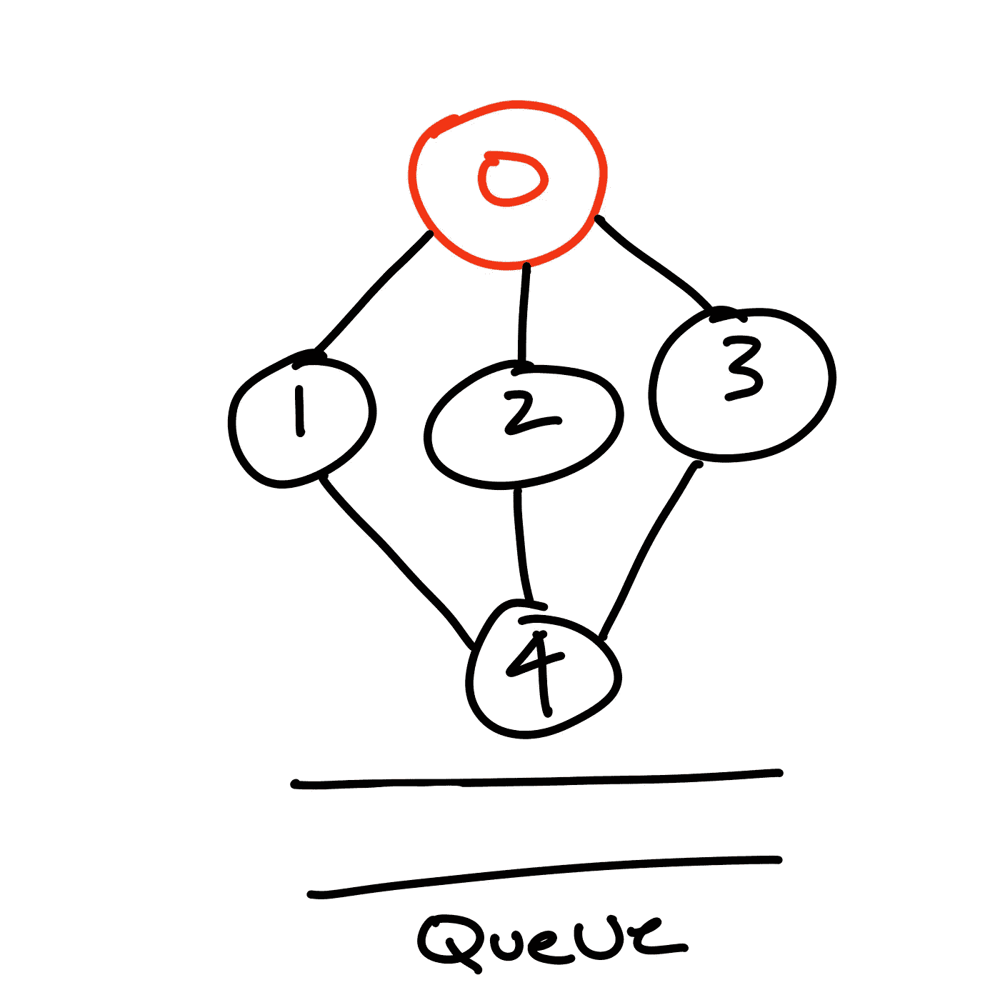
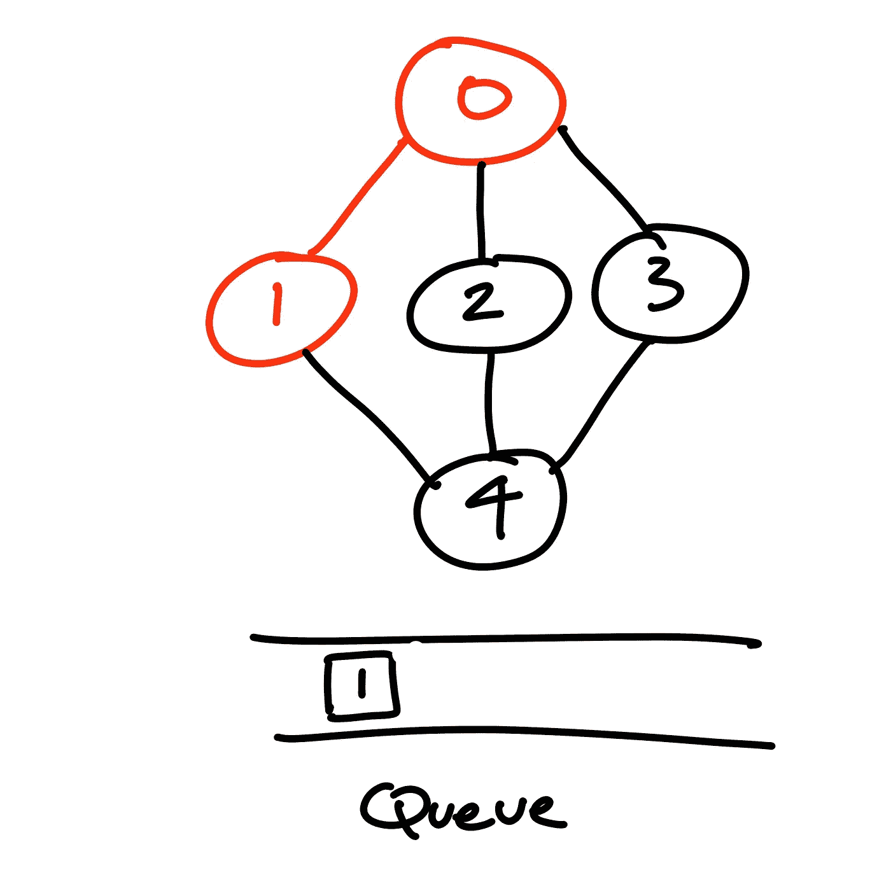
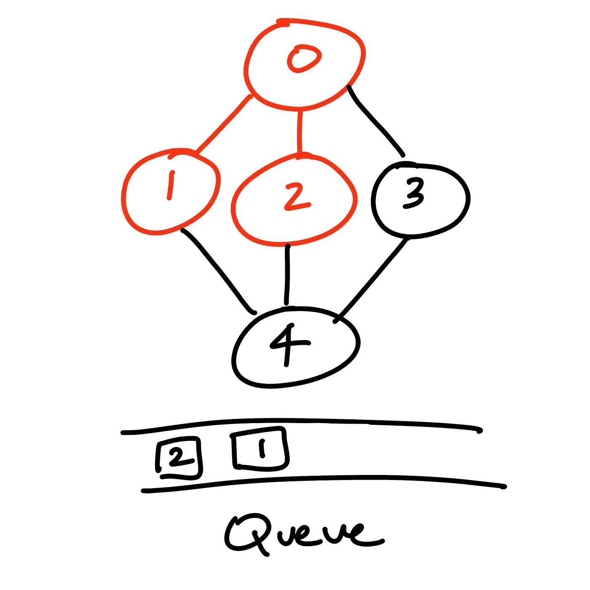
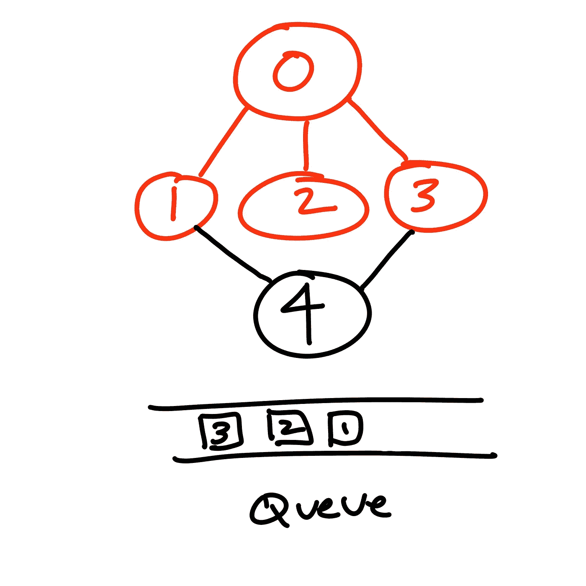
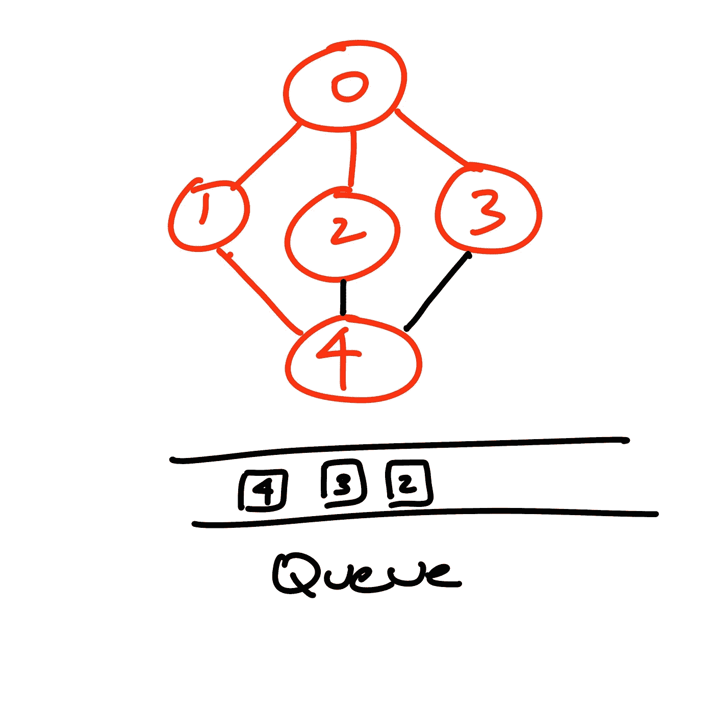

# 广度优先搜索算法

> 原文：<https://medium.com/codex/breadth-first-search-algorithm-a2377f1e55c0?source=collection_archive---------12----------------------->

在学习广度优先搜索(BFS)中需要掌握的一个重要概念是图遍历。首先，如果不熟悉的话，*图*是一种非线性数据结构，由有限的顶点(也称为节点)和连接图的顶点的边(视觉上表示为线)组成。

*图遍历*是按照定义的顺序访问每个顶点和边一次的过程。顶点和边的一次性访问以及它们的访问顺序都很重要，这取决于解决问题的算法。同样，跟踪哪些顶点被访问过也很重要，通常通过标记它们来完成。

BFS 是遍历图的最常见的方法，主要用于查找图中的最短路径。BFS 是一种遍历算法，在这种算法中，您从选定的节点(通常称为起始节点或源节点)开始遍历，并逐层遍历图表，在移动到下一级节点之前，访问与源节点相邻的所有节点。换句话说，水平地*探索图的节点*，访问当前层的所有节点，然后移动到下一层。

## 功能

BFS 通过合并队列来工作。首先将源节点添加到队列中，随后是该节点的未访问的相邻节点。一旦源节点不再有任何未访问的邻居，它就被从队列中删除。从第一层开始的队列中的下一个被用来代替源节点，并且该节点的所有未被访问的相邻节点被放置在队列中。一旦该节点不再有任何未访问的邻居，就将其从队列中移除，并且该过程对队列中的下一个节点继续，直到不再有未访问的节点。

加入这个队列数据结构是为了跟踪接下来要访问哪个节点，并指示从源节点到终点通过图的最短路径。BFS 遵循三条规则—

*   **规则 1:** 访问相邻的未访问顶点，标记为已访问，显示，插入队列。
*   **规则 2:** 如果没有相邻顶点，从队列中删除第一个顶点。
*   **规则 3:** 重复**规则 1** 和**规则 2** 直到队列清空。

## 视觉示例

第一步

我们首先初始化图表的队列。

第二步

接下来，选择源节点，在本例中是 0。

第三步

我们的 BFS 算法通过访问相邻节点(具有一条分离边的节点)开始遍历。在我们的示例图中，我们首先访问节点 1，并将该节点放入队列中。

第四步

接下来，相邻的未被访问的节点 2 被访问，并被放置在节点 1 之后的队列中。

第五步

正如您可能已经预料到的，下一步是访问源节点的最后一个未访问的邻居节点 3，并将它放在节点 2 之后的队列中。

第六步

由于源节点(本例中的节点 0)不再有任何未被访问的相邻节点，队列中的下一个节点(节点 1)被出队并用于代替源节点进行遍历的下一步。节点 4 是节点 1 的唯一未被访问的邻居节点，因此被访问并放置在队列中。尽管现在已经访问了该图中的所有节点，但是为了让 BFS 算法进行解析，它需要将所有节点从队列中出列，以确认该图中没有其他未被访问的节点。

## 结论

BFS 算法是大多数需要快速搜索图结构的人的首选。这种算法有利于分析图中的节点并找到从一个节点到另一个节点的最短路径。BFS 有一个简单但健壮的架构，允许以最少的迭代次数遍历图形。与其他算法相比，BFS 算法具有很高的精确度，不会陷入无限循环。