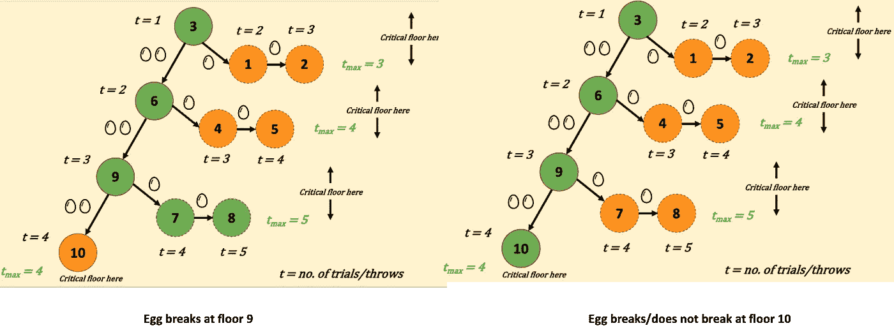

# 打破一个鸡蛋！

> 原文：<https://medium.com/codex/break-an-egg-64f97e476712?source=collection_archive---------4----------------------->

k 个鸡蛋和一栋 n 层楼的建筑

# 问题陈述

这是一个非常流行的数学难题( [Leetcode](https://leetcode.com/problems/super-egg-drop/) )。给你“k”个相同的鸡蛋，你可以进入一个有“n”层的建筑。你可以爬上这栋大楼的每一层，然后丢下一个鸡蛋。如果鸡蛋在当前楼层“x”打破，那么它将在“x”以上的所有楼层打破。如果鸡蛋破了，你必须扔掉它。如果鸡蛋没有在当前楼层“x”打破，那么它也不会在“x”以下的任何楼层打破。我们称“x”为临界楼层。你需要确定地确定‘x’***，通过采取最少数量的移动*** 。

网上有许多博客文章描述了解决这个问题的方法。在这篇文章中，我想深入了解这个问题解决方案背后的数学直觉。之后，我将深入研究编程方法，分析递归关系试图完成什么。有点冗长！但是，读完这篇文章后，你会更清楚为什么这种方法有效，为什么它很棒。所以，让我们开始吧！

# 对问题的数学直觉

如果我们只有一个鸡蛋，这个问题就没那么有趣了。这是因为移动的最小次数将是“n”——我们需要在从 1 到“n”的每一层放下鸡蛋，以确定临界层。这是因为我们需要能够确定地确定临界底线*，我们不能丢了鸡蛋去投机。*

*假设我们有两个鸡蛋，我们还有一个多余的鸡蛋！所以，我们不必采取 1 对 n 的方法。我们需要弄清楚两件事:*

*a)我们应该从哪一层开始？*

*b)如果鸡蛋没有打破，我们应该去哪一层？*

*为了回答这个问题，让我们假设“n”和“k”的简单值。考虑一个有 10 层楼的建筑(‘n’)，我们有 2 个蛋(‘k’)。比方说，我随机决定从第 3 层开始，以 3 为增量移动，即第 3 层->第 6 层->第 9 层->第 10 层。下图描述了这种配置下可能的不同移动。每个节点代表一个楼层号。“t”是指试验次数(当我们打破一个鸡蛋时)，而“tmax”是指我们可以采取的每种配置的最大移动次数。箭头上的图片显示了我们的鸡蛋数量。*

**

*图一。向 3 楼、6 楼、9 楼和 10 楼扔鸡蛋的后果*

*图二。下面重点介绍了鸡蛋在 3 楼和 6 楼打破时会发生什么。在每个节点，我们有两种可能性—如果鸡蛋打破，我们探索较低的楼层(显示在节点的右侧)，如果鸡蛋没有打破，我们探索较高的楼层(显示在当前节点的下方)。绿色突出显示的节点对应于鸡蛋打破后，我们下一步应该移动的楼层。*

**

*图二。当鸡蛋被扔在第 3 层和第 6 层时，可视化最大试验次数(基于图 1)*

*同理，图 3。下面重点介绍了鸡蛋在第 9 层和第 10 层破裂时的事件顺序。*

**

*图三。当鸡蛋被扔向第 9 层和第 10 层时，可视化最大试验次数(基于图 1)*

*我们从图 1-3 中得到的是:*

**

*我们需要走的步数取决于我们有多少个鸡蛋。当然，我们可以选择最小为 3 的配置。 ***但这并不能帮助我们确定这是否是关键楼层*** 。我们应该寻求这样一种设置:*

**

****这将帮助我们确定临界楼层*** 。为了做到这一点，我们需要考虑的是，每次我们丢下一个鸡蛋，我们最终都会耗尽一次额外的尝试。所以，像以前那样等间隔是行不通的。*

*我们再从三楼开始。但是，这一次，后续试验的间隔不是均匀间隔的，如图 4 所示。*

**

*图 4。向 3 楼、5 楼和 6 楼扔鸡蛋的后果*

*这绝对是比以前进步了。如果鸡蛋掉落在第 3 层或第 5 层，我们需要进行的最大尝试次数是 3 次。但是我们有一个问题。一旦我们把鸡蛋扔在第 6 层，我们已经尝试了最多 3 次，我们至少需要再做一次，以确定临界楼层。这种方法违背了我们想要的——使所有动作的最大尝试次数相等。所以，从三楼开始不是正确的选择。我们怎么挑一楼？*

*我们在图 4 中所做的。我们根据以下逻辑选择了后续楼层:*

**

*如果我们从楼层“x”开始，并且我们总共有“n”个楼层，那么，我们需要解下面的方程来确定开始的最佳楼层:*

**

*这是前 x 个自然数的和，我们知道如何求这个和。如果我们将“n”的值代入 10 来解这个方程，我们得到 x = 4——这将是我们的临界下限，如下所示。*

**

*图五。向 4 楼、7 楼、9 楼和 10 楼扔鸡蛋后果*

*临界下限是 4，我们需要进行的最大试验次数也是 4。这个问题的另一个很酷的方面是，我们可以预测用 4 次尝试和 2 个鸡蛋可以探索的最大楼层数[2][3]:*

**

*这应该被理解为选择分别具有 0 个卵滴、1 个卵滴和 2 个卵滴的 4 次试验的方式的数量。*

# *编写通用解决方案*

*现在是时候戴上你的程序员帽子了！让我们来看看如何通过编程来解决 2 个鸡蛋的问题。*

*首先，我们有两个变量——楼层数和鸡蛋数。从概念上讲，我们可以想到一个函数“F ”,它接受这两个输入并返回临界下限:*

**

*图六。接受蛋数和楼层数作为输入的函数的签名*

*总的想法是从 1-n 楼层开始迭代所有楼层，对于每一层，我们丢下鸡蛋并进行一次尝试。这给我们留下了两种可能性——鸡蛋破了，我们去探索较低的楼层，或者鸡蛋没破，我们去探索较高的楼层。因此，这产生了一个递归关系[4]:*

**

*图 7。用递推关系解决一般的落蛋问题*

*好，那么为什么我们有一个最小和最大项？这是为了 ***最小化最大遗憾***【1】。让我们通过一个例子来理解我们为什么这样做。*

*为了简单和易于可视化，让我们考虑一种情况，其中我们有 2 个鸡蛋和 4 层楼。为上面的递归关系画递归树会得到类似这样的结果:*

**

*图 8。2 个鸡蛋和 4 层的递归树*

*例如，如果我们能找到 F(2，3)的最优解，那么结果可以外推得到 F(2，4)的最优解。这表明这个问题有一个最优子结构，其中较小子问题的最优解可以产生较大问题的最优解[5]。*

*我们还看到，我们最终重新计算子问题的解，如 F(2，1)，F(1，1)等。，一次又一次。这意味着存在重叠的子问题，函数‘F’多次解决相同的子问题[6]。*

*这两个观察使它成为动态规划的理想候选，我们可以记忆子问题的结果来处理递归树的指数复杂性。*

*好，现在回到树，我们实际上知道树中许多节点的解决方案，如下所示:*

**

*图九。彩色节点(右下方的图例)有快速解决方案*

*因此，我们只需要继续递归橙色的节点。让我们评估这些值的函数，并可视化该树:*

**

*图 10。在所有节点上计算的函数*

*从树根到树叶遍历树的任何一个分支表明这个实验的一个可能的结果:*

**

*图 11。有 2 个蛋和 4 层楼的示例结果*

*我们在图 11 中看到的是(蓝色节点突出显示的路径)，我们从 1 楼开始并放下鸡蛋。它没有打破，所以我们移动到第二层，把鸡蛋放下。它不会破裂。现在，我们从二楼跳到四楼，然后把鸡蛋扔下去，鸡蛋就碎了。这是两个鸡蛋和四层楼可能出现的不同结果之一。*

*图 7 中的最大化术语是确保一旦我们决定在给定的地板上扔鸡蛋，我们选择最坏的可能情况。这样做了之后，如果我们可以通过从当前楼层跳到不同的楼层来找到具有较少尝试的临界楼层，我们就不必坚持这个楼层。这就是最小化项帮助我们完成的。这也是确保我们不会试图从 1-n 开始在每一层扔鸡蛋，而是根据最小化鸡蛋打破次数的方法跳过楼层。*

*让我们看最后一个例子来理解最大遗憾的最小化。*

**

*图 12。最大遗憾最小化方法*

*聚焦绿色节点，从上到下阅读:*

*   *我们选了一楼，鸡蛋没有破，所以我们搬到了二楼*
*   *鸡蛋没有在二楼打破。现在，我们可以选择搬到 3 楼或 4 楼。*
*   *左下角的绿色树对应于第 3 层，我们在这里有 2 个结果——如果鸡蛋破裂，我们已经找到了我们的关键层(3 ),如果它没有破裂，我们需要探索 3 (4)以上的一层。所以，额外投掷的最坏情况数是 1。*
*   *我们使用相同的逻辑来理解将鸡蛋扔向 4 楼的后果，最坏情况下的额外投掷次数也是 1。*
*   *最后，在第 2 层，我们可以选择第 3 层或第 4 层，我们将选择最小的一层(在这种情况下也是一样)。*

*您可以在我的 GitHub 资源库中找到这个问题的自顶向下的记忆解决方案:*

* [## madhu 90/CodeExamplesForBlogPosts

### 在 GitHub 上创建一个帐户，为 madhu 90/CodeExamplesForBlogPosts 开发做贡献。

github.com](https://github.com/madhu90/CodeExamplesForBlogPosts/blob/main/EggDropProblem.cpp) 

**参考**

[1]https://datagenetics.com/blog/july22012/index.html

[2][https://code . our sky . com/namely-egg-dropping-puzzle-in-combinatorics/](https://code.oursky.com/famous-egg-dropping-puzzle-in-combinatorics/)

[3][https://math . stack exchange . com/questions/2012 591/eggs-and-floors-puzzle-extended-generalized #:~:text = 2% 20 answers&text = For % 20 three % 20 eggs % 20 and % 20100，可疑% 20 floors % 20 at % 20 our % 20 disposal](https://math.stackexchange.com/questions/2012591/eggs-and-floors-puzzle-extended-generalized#:~:text=2%20Answers&text=For%20three%20eggs%20and%20100,suspicious%20floors%20at%20our%20disposal)。

【4】[https://medium . com/@ parv 51199/egg-drop-problem-using-dynamic-programming-e 22 f 67 a 1 a 7 c 3](/@parv51199/egg-drop-problem-using-dynamic-programming-e22f67a1a7c3)

【5】[https://en . Wikipedia . org/wiki/Optimal _ substructure #:~:text = In % 20 计算机% 20 科学% 2C % 20a %问题，贪婪% 20 算法% 20for % 20a %问题](https://en.wikipedia.org/wiki/Optimal_substructure#:~:text=In%20computer%20science%2C%20a%20problem,greedy%20algorithms%20for%20a%20problem)。

[6][https://en.wikipedia.org/wiki/Overlapping_subproblems](https://en.wikipedia.org/wiki/Overlapping_subproblems)

[https://spencermortensen.com/articles/egg-problem/](https://spencermortensen.com/articles/egg-problem/)*