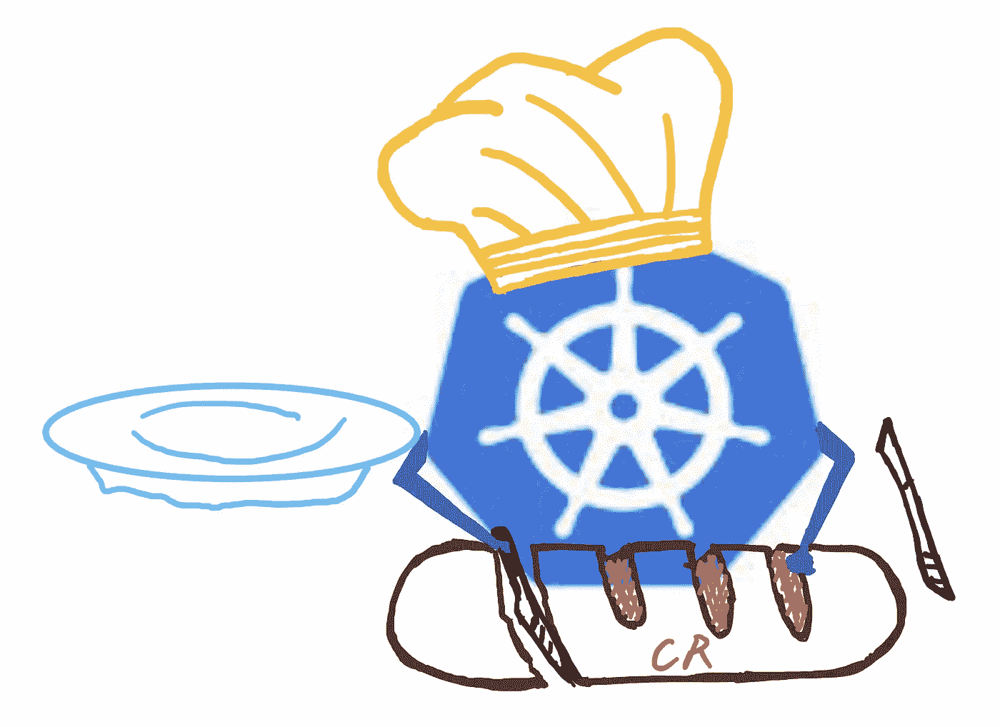

# 分解 Kubernetes 容器运行时

> 原文：<https://medium.com/codex/breakdown-kubernetes-container-runtime-2e52bdea5e6?source=collection_archive---------0----------------------->

## OCI？CRI？什么是高级和低级容器运行时？

不断的一点一点的学习 Kubernetes，对它的优势有了更深的理解，我对它的快速发展和普及不再感到震惊。

虽然谷歌这样的大公司的支持无疑是推动，它的设计，功能和便利性是…