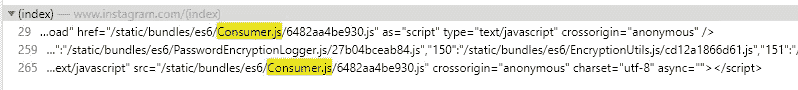
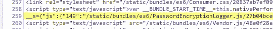

# 打破 insta gram——自动化页面增长:第 1 部分

> 原文：<https://medium.com/codex/breaking-instagram-automating-page-growth-part-1-a487c471db69?source=collection_archive---------5----------------------->

亚历山大·沙托夫在 [Unsplash](https://unsplash.com?utm_source=medium&utm_medium=referral) 上拍摄的照片

这个故事开始于大约两年前。我在 YouTube 上偶然发现了一个视频，它推广了 follow-for-follow 技术，以获得 Instagram 上的粉丝。这种技术通常应用于增长主题页面的上下文中。通常，网页的所有者会策划适合某个特定领域的内容，可以是任何内容，从滑雪、宠物、婚礼到迷因。在 Instagram 上运行这些页面的任何人的目标通常只是尽可能获得更多的关注者，然后要么出售账户以盈利，要么通过在帖子中向任何以这种方式购买付费广告的人显示付费广告来赚钱。

这就是跟进跟进的由来。简单地发布内容通常不足以快速增长，除非你已经很有名或者在其他地方有追随者。因此，人们使用像跟随这样的技术来从零开始获得追随者。根据过去在 Instagram 页面上增长的人的说法，一旦你的粉丝达到 2000 到 5000 人，你的帖子很有可能会像病毒一样传播，页面也会爆炸，到那时，就不再需要一个接一个的关注了。这是跑腿工作，是需要得到一个网页离开地面，并在它的方式张贴病毒内容。

所以，最紧迫的问题是，你是如何做到的？这真的很简单，作为页面所有者，你将在你的领域搜索其他更大的页面，寻找好的**参与**。参与度是一个非常重要的衡量标准，基于以下几个原因:

*   找到高参与度的内容意味着你可以将它重新发布到你的页面上(当然，要给原作者荣誉)，你的观众可能会更多地参与到这些内容中。
*   你可以培养喜欢和/或评论特定内容的用户，只需关注他们，并希望他们也关注你。
*   Instagram 真正关心的是让人们尽可能多地观看它，如果你能提供引人入胜的内容，Instagram 更有可能通过探索页面和其他推荐渠道向更多用户推广你的内容，因此，你更有可能快速增长。
*   引人入胜的内容通常会让人们与他们的朋友分享你的内容，给你的页面带来自然的追随者。

后续跟进的最后一部分是清理。一旦你关注了很多人，有些人又关注了你，你需要等待一段时间，然后取消那些没有关注你的账户。

这就是事情的全部。这很简单，如果你知道自己在做什么，完全有可能自动化一些，如果不是全部的话，让你的生活更轻松。

**免责声明:**不要在家里尝试，Instagram 的政策规定，使用软件来帮助你获得粉丝是违反服务条款的。虽然本文中概述的技术是可行的，但是它们不应该在任何情况下使用。Instagram 也采取措施确保这很难执行，但我们稍后会谈到这一点。

在这个过程中，我发现手动操作最重复、最无聊的部分是向下滚动喜欢某个帖子的用户列表，并逐个关注他们。Instagram 对这种基于垃圾邮件的活动设置了非常严格的限制，所以在行动被阻止之前，你在任何给定的时间内只能关注大约 50 个人。

Instagram“动作被阻止”消息

这通常会让你在几个小时内无法在应用上做任何事情，根据 Instagram 判断你的垃圾邮件的严重程度，这可能会增加到 24 小时，甚至长达一周，最终导致永久禁令(我还没有测试过这一限制，但在我的自动化测试早期，我的一个测试账户上的垃圾邮件被禁止了一周)。

凭借我对基本过程的了解，我开始尝试寻找一种方法来自动化这个过程。我想我最好的选择是 Instagram 的网络应用。如果我能写一些 JS 来点击 follow 按钮并自动向下滚动列表，我就能轻松地关注大量用户。

让我们来讨论一下该解决方案的实现。我尝试的第一件事是构建一个可以在 Instagram 页面上运行的 Chrome 浏览器扩展。我过去已经构建过一些这样的程序，所以我认为这是直接在页面中运行代码而不被 CORS 拒绝的最简单的方法。我是对的。

代码本身非常简单，我从在页面上放置一个按钮开始，这样我可以让页面进入正确的状态。我只是需要一个有喜欢这个帖子的人的列表的模型。在那里，我设置了一个计时器，所以当按钮被点击时，它会使用 CSS 选择器在模态上找到 Follow 按钮。然后，计时器会每分钟单击一次这些跟随按钮，一旦它到达列表的底部，它会滚动模式以加载下一组追随者，并单击下一个跟随按钮。下面是该脚本的快速 GIF 图片:

自动跟随脚本

虽然这种快速和肮脏的 MVP 解决方案工作正常，但它只是刚刚好。它仍然需要经常维护，有时它无法滚动足够远来加载更多的人来关注，或者它只是滚动经过一群人，错过了列表中的一些人。对我来说，它不够自动化，也不够一致。这种方法带来的另一个问题是，我必须找到一种方法，在跟随一段时间后，取消跟随所有没有跟随我的人。没有真正的方法来跟踪我何时关注了某人，所以如果我使用这里类似的方法编写一个脚本来自动取消关注，我将冒着关注某人然后立即取消关注的风险。这将导致较低的整体跟进率。

最终，我需要一种不同的方法。浏览器扩展是在页面上执行 JavaScript 的一种非常好的方式，所以我决定坚持使用它，但是除了给脚本添加我所寻求的可靠性之外，我还需要一些东西。我决定放弃我最后的方法，去做一些更有条理的事情。

我首先检查当我点击 follow 或 unfollow 按钮时会发生什么，起初我试图调试混乱的 JS，看看我是否能找到一个简单的函数来挂钩，但这变得非常繁琐，进展缓慢，所以我决定自己编写。我认为，当用户点击关注来更新用户关注的人的列表时，Instagram 必须发送某种网络请求。我查看了网络选项卡，这是我的发现:

Instagram 跟随请求

这是当你跟随某人时得到的请求，这是一个非常基本的格式。

有了这些知识，我们现在可以把用户 ID 列表放在一起，然后通过点击这个端点并把 ID 替换到 URL 中来跟踪每个用户 ID。在这一点上，我唯一缺少的是一种获取用户 id 列表的可靠方法。

思考了一段时间后，我发现我最适合像以前一样找到最近有良好参与度的帖子，并想出如何收集所有关注该帖子的用户的 id。

事实证明，这比解码跟踪某人的方法要稍微困难一些。当您调出一个喜欢某个帖子的所有人的列表时，请求看起来是这样的:

Instagram 帖子喜欢 GraphQL 请求

这是一个 GraphQL 请求，考虑到 Instagram 归脸书所有，这并不奇怪。对此进行分析，有两个参数:

*   `query_hash`
*   `variables`

Instagram 帖子喜欢 GraphQL 请求参数

在这一点上，我不知道`query_hash`的意义是什么，但是`variables`更容易解码。我不得不假设，`shortcode`是文章 ID，这一点通过快速浏览 URL 栏得到了确认，那里有确切的`shortcode`值，很容易找到。

你还会注意到，`variables`、`include_reel`中的另外两个键/值对，据我所知，对我们要实现的目标没有任何实际意义，我们可以忽略那个。根据我过去使用 GraphQL 的经验，`first`只是我们请求的最大结果数，检查从这个查询返回的数据证实了:

Instagram 帖子喜欢回复

正如您所看到的，我们得到了一个 24 个用户的列表，其中有许多有用的详细信息，更好的是，用户对象中的第一个键是`id`，这正是我们正在寻找的。

我们现在面临的问题是，我们如何获得其余的用户。Instagram 有一个“无限滚动”功能，当你到达下一页数值的某个触发滚动点时，它会发送一个请求。为了触发此操作，我只需向下滚动关注者列表，此时会发送以下请求:

Instagram 帖子喜欢分页请求

参数的可读性更强，如下所示:

Instagram Post 喜欢分页请求参数

`shortcode`是相同的，这进一步证实了我们的理论，即这是用来识别帖子的。`include_reel`对我们来说显然是微不足道的。`first`现在已经更改为`12`，这对于避免垃圾邮件检测可能很重要，因此我们将在以后记住这一点。最后，`after`是一个新参数，这就是分页的工作方式。通过传递`first: 12`和`after: <page_cursor_hash>`,我们请求得到页面指针散列后的前 12 个结果。

你可以在这里阅读更多关于这是如何运作的:[https://graphql.org/learn/pagination/](https://graphql.org/learn/pagination/)

这个难题的另一个关键在于我们在查询这个端点时收到的以前的响应，它们都包括这个属性:

页面信息属性

`end_cursor`告诉我们，如果我们想要下一页，我们可以使用这个值来发出相同的请求，但是只需更改`after`值。可以说，这就是我们如何“翻页”的方式。

剩下的唯一要弄清楚的事情是，如果我们到达最后，请求看起来像什么？

没有下一页信息属性

现在，我们只需要编写一个脚本来一次抓取一个页面，挑选出用户 id 并将其存储在某个地方。然后，我们可以编写一个脚本，接受其中的每一个，并发送一个请求来跟随它们。简单对吗？不对！稍后我们将讨论原因，但是现在，让我们集中于实现这些脚本:

让我们来看看这是如何工作的:

`getPage`和`getPageRequest`互相调用，这是我们用来获取每个页面的机制

`write`和`getGraphqlUrl`都是我们在`getPageRequest`中使用的辅助函数

当我们第一次调用`getPage`时，它为从现在起 2 秒内调用`getPageRequest`设置了一个超时，它需要一个`queryHash`、一个`shortcode`和一个`end_cursor`。`shortcode`是文章 id，但是`queryHash`稍微复杂一点。看起来 Instagram 在这些问题上也有一些混淆，使其更难解决。

在我们继续讨论我如何找到一种自动获取查询散列的方法之前，让我们再谈一谈这些函数实际上是如何一起工作的。`getPage`最终负责发送请求，然后将响应传递给`getPageRequest`。一旦我们完成了响应，我们检查在`getPageRequest`中是否有另一个页面，如果有，我们跳回到`getPage`，如果没有，我们就结束递归。这样，我们可以遍历每一页并为自己存储所有的结果。

我认为尝试找到这些查询散列来自哪里不会有什么坏处，起初我认为这可能是页面加载上的某种形式的 XHR 请求，但是我似乎找不到任何与`queryHash`匹配的内容。

然后，我决定尝试搜索源代码，我从我的一个帖子请求中复制了一个`queryHash`，然后切换到 Chrome 开发者工具中的`Sources`选项卡，并按 CTRL+SHIFT+F 进行搜索。然后我简单地粘贴了我的`queryHash`,并点击回车键，这就是我看到的:

查询哈希搜索

现在我们到了某个地方，我的`queryHash`就在那里，接下来我必须弄清楚如何自动提取它，这样我就不必发送一个请求，然后每当我想开始这个过程时就把它取出来，尤其是在我测试它的时候。

我还注意到，在浏览网站时，每当从不同地方查询内容时，就会发送一堆网络请求，这些请求也有查询哈希，但它们是不同的。然而，它似乎对每个终点都是一致的。事实证明，这对于理解我需要哪个查询散列来发出我想要的请求非常重要。

最终，我可以实现自动化。查看这里提供给我们的信息，我们可以看到该值来自的脚本:

`www.instagram.com/static/bundles/es6/Consumer.js/6482aa4be930.js`

我认为`Consumer.js`看起来是一个不错的开始，所以我在我的开发工具中又做了一次 CTRL+SHIFT+F，搜索`Consumer.js`，这产生了 3 个结果:

Consumer.js 的搜索结果

对我帮助最大的是中间的结果，点击之后，它为我突出显示了这行代码:

有用的搜索结果

这很棒，看起来在`window`对象上只有一个全局对象，包含每个脚本的所有 URL 的索引:

脚本 URL 索引

这就是我们所能要求的，现在我们有办法在这个对象中寻找我们的`Consumer.js` url，用它来请求那个文件，然后我们可以解析我们的`queryHash`的响应。我写了这一小段代码来首先找到`Consumer.js`的路径:

获取 Consumer.js 文件路径

然后我写了这个来获取数据:

Consumer.js 哈希

现在我们已经得到了所有散列的列表，我注意到获得赞的散列在这个数组的第 5 个索引处。我愿意打赌每次都是相同的索引，所以函数最终看起来像这样:

这将可靠地获取用于获取帖子上的赞的`queryHash`,然后我们可以使用它来调用我们编写的函数，以实际获取之前的用户。

现在我们已经有了`queryHash`，我们可以自动收集用户 ID 号，并编写一个函数将它们通过管道传输进来，这样我们就可以自动跟踪用户。

实际跟踪用户的功能要简单得多:

我们只是向之前在分析请求时发现的 URL 发送一个 XHR。这有点复杂，因为我们需要在这个请求上设置一些特定的头，但是从 Chrome 扩展在同一个域上发送请求来看，这是完全可能的。

可以在任何以前的 follow 请求的详细信息中的 Network 选项卡中找到隐藏的请求头，这使得处理起来非常容易。

`x-ig-app-id`、`x-ig-www-claim`和`x-instagram-ajax`在会话之间都保持一致，但`x-csrftoken`没有。我不得不写一个小函数来为我们自动抓取:

我在这里有了一个坚实的开端，我可以从一个帖子中抓取所有的关注者，并将该数组输入一个函数，然后该函数会以随机的间隔关注他们:

就这么简单，所有繁重的工作都在别处完成。我们现在可以自动关注大量的人，只需要从一个帖子中抓取他们，然后把这些值插入这里。这也是我之前提到做到这一点并不容易的原因。这可能看起来像是一个完整的解决方案，但它还有更多内容，包括:

*   取消关注用户
*   避免垃圾邮件检测措施(即使这样也骗不了 Instagram)
*   跟踪你关注的人和时间，这样你就可以在不影响你的回头率的情况下记录取消关注的时间

除此之外，你还应该发布内容。我还开始编写一些脚本，通过抓取 reddit 来自动生成内容，然后给你一个漂亮的 UI 来过滤你想发布的内容和标题，这样你就可以为你的页面设置每个内容的格式，然后点击一个按钮就可以发布了。我还希望能够安排它应该发布的时间，这样你就可以在一个小时内完成一堆内容，并有几天的内容排队并准备好，让你可以在页面运行时轻松休息。我相信这将在未来证明这些脚本的价值，因为我认为它可以让你在不做太多工作的情况下将一个页面扩展到成千上万的追随者。

在我的测试中，我设法将一个页面扩展到 1500 名粉丝，我知道这不是一个很大的数字，但这个页面以每天 10%左右的惊人速度增长，Instagram 上的一些垃圾邮件检测措施抓住了我，让我的速度慢了不少。

我确实也有解决这些问题的计划，但是我将把它们留到第 2 部分的文章中，这将暂时结束我们的讨论。除了对我自己来说是一次很好的学习经历之外，这是一次非常有趣的逆向工程。我很清楚这个网站是如何在比我所希望的更深的层次上整合在一起的，我肯定会继续努力，看看我能走多远。希望您也喜欢这篇文章，并关注即将发布的第 2 部分