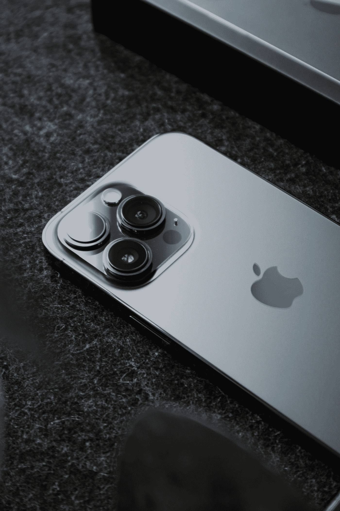

# 突发新闻:新 iPhone 将没有 Sim 卡托盘！—苹果是不是太穷了，买不起一台？！

> 原文：<https://medium.com/codex/breaking-news-new-iphone-wont-have-a-sim-tray-is-apple-too-broke-to-afford-one-b7a187498333?source=collection_archive---------9----------------------->

W 离发布还有整整两个月，据报道即将到来的 **iPhone 14** 根本不会配备 **Sim-tray** ，这对**苹果**以及更重要的**你**(消费者)来说意味着什么，这就是我们今天文章要讨论的内容:

照片由[努贝尔森·费尔南德斯](https://unsplash.com/@nublson?utm_source=medium&utm_medium=referral)在 [Unsplash](https://unsplash.com?utm_source=medium&utm_medium=referral) 拍摄

单词 **SIM** 代表**用户识别模块**，用于完成大多数任务…