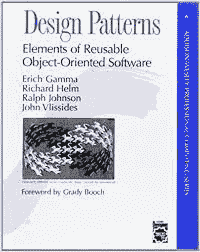
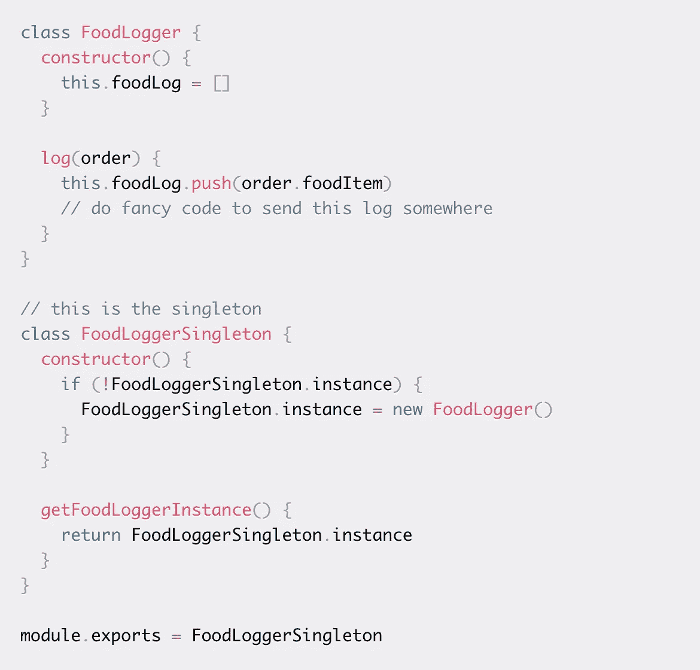

# 简单看一下设计模式:单例&装饰

> 原文：<https://medium.com/codex/brief-look-into-design-patterns-singleton-decorator-8249094b669f?source=collection_archive---------12----------------------->

## [法典](http://medium.com/codex)

HalGatewood.com 在 [Unsplash](https://unsplash.com?utm_source=medium&utm_medium=referral) 上[的照片](https://unsplash.com/@halacious?utm_source=medium&utm_medium=referral)

在我最近找工作之初，我和一位刚刚获得一份令人惊叹的实习工作的同事聊了聊他获得这一机会的过程。我们都学习了 React，他正在熟悉另一个框架，为新的实习做准备。我只在 React 中做过几个项目，并从一开始就解释了我在尝试组织所有组件时遇到的挑战，以便我可以更流畅地构建应用程序。

当我开始的时候，我会起草一个组件树，但是之后我会添加越来越多的东西，为所有这些东西创建越来越多的文件夹。最终，我需要从混乱中抽身出来，用纸和笔画出一张“地图”,看看一切是如何联系在一起的。然后可能会做一些重组。

> 我喜欢文件和文件夹有条理，我想写好的、干净的代码。

他简要地提到，一旦我掌握了设计模式以及如何组织事物，一切都会井井有条，而且会容易得多。

几周过去了，一个两小时的免费研讨会出现了，叫做“React 中的设计模式”完美！

# 车间

嗯，事情进行得不太顺利。不幸的是，到了晚上的那个时候，我已经非常累了，因此只坚持了 1 个小时就下线了。我试图做笔记，但我完全处于劣势，因为我不太熟悉 React 的所有错综复杂之处，我不知道我应该寻找什么样的“设计模式”，我疲惫的大脑无法跟上正在发生的事情。

现在，我将后退一步，研究一些基本的设计模式。显然，在 1994 年首次出版的《设计模式——可重用面向对象软件的元素》一书中概括了 23 种设计模式。

设计模式书籍

 [## 设计模式-维基百科

### 设计模式:可重用面向对象软件的元素(1994)是一本软件工程书籍，描述了…

en.wikipedia.org](https://en.wikipedia.org/wiki/Design_Patterns) 

在这 23 个中，我将深入其中两个更受欢迎的:Singleton & Decorator。

# 设计模式

> 设计模式就像是项目的模板。它使用某些约定，你可以从它那里期待一种特定的行为。这些模式由许多开发人员的经验组成，因此它们实际上就像不同的最佳实践集。-米莉西娅·麦格雷戈

一个 upGrad 的博客强调设计模式允许灵活性。由于增加了新的功能，项目的早期特征可能不会一直保持不变。设计模式可以使这种增长更容易，因为它设定了代码应该做什么的预期。

# 一个

单一设计模式的主要目的是只允许一个类或对象创建一个**单一目的的实例。**

所以，程序创建了一个类的实例。

然后，它使用一个全局变量来存储该实例。

通过一次只有一个实例活动，它可以防止奇怪的错误。

大多数时候，单例设计诱导一个私有构造函数来创建一个实例。

对于“日志记录、线程池、驱动程序对象和缓存”非常有用。

对于像 React 或 Angular 这样的前端框架，处理多个组件的日志会变得很棘手。单例设计可以让 logger 对象只有一个实例。

我研究了 Milecia McGregor 在[自由代码营](https://www.freecodecamp.org/news/4-design-patterns-to-use-in-web-development/)上的一个例子，以获得所有这些背后的基本想法。

Milecia McGregor 的单例类示例

然后，她继续展示如何在几个文件和/或组件中使用 FoodLogger 实例。

 [## Web 开发中你应该知道的 4 种设计模式:观察者、单例、策略和装饰者

### 你有没有在一个团队中需要从头开始一个项目？很多初创企业通常都是这样…

www.freecodecamp.org](https://www.freecodecamp.org/news/4-design-patterns-to-use-in-web-development#the-singleton-design-pattern) 

# 装饰者

这种设计模式最适合添加到类或子类中。随着程序的增长，子类的数量也会增长。装饰模式通过抽象创建子类的组件来减少子类的数量。

McGregor 强调“当你用一个基类创建一个新的对象时，这个基类的方法和属性就会出现。”然后，该基类的一些实例“需要不是来自基类的方法或属性”

装饰器模式将新属性直接添加到特定的对象实例，而不会影响基类的其他实例。

麦格雷戈举了一个给三明治添加特殊配料的例子。这些特殊的配料并不会添加到每一份订单中(三明治的例子)。它们仅被添加到三明治的一个实例中。

我建议看一看她关于顾客阶层和三明治阶层的例子，以获得更好的想法。

 [## Web 开发中你应该知道的 4 种设计模式:观察者、单例、策略和装饰者

### 你有没有在一个团队中需要从头开始一个项目？很多初创企业通常都是这样…

www.freecodecamp.org](https://www.freecodecamp.org/news/4-design-patterns-to-use-in-web-development#the-decorator-design-pattern) 

# 结论

我有一种隐约的感觉，我以前使用过装饰设计模式，可能几乎是单例设计。我仍在考虑如何以及何时使用它们。我想，下次我在编写项目代码或查看代码时，我需要留意这些模式是否开始凸显出来。

另外，我将在下一次讨论其他 21 种设计模式。