# 使用 Real ESRGAN 让旧图像重现生机

> 原文：<https://medium.com/codex/bring-noisy-old-images-back-to-life-using-real-esrgan-fd3c57ca94f3?source=collection_archive---------4----------------------->

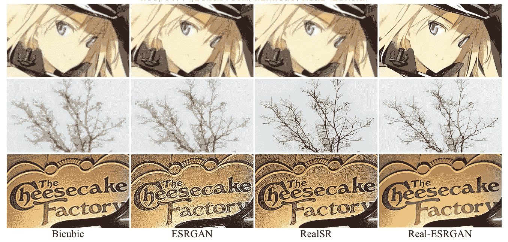

使用 Real-ESRGAN 合成的图像示例

真实世界的图像在其一生中通常会经历各种退化。例如，使用旧设备拍摄的图像包含各种噪声和伪像。当图像经历多次编辑和压缩，同时使用互联网多次共享和传输时，也会添加伪像。

然而，从这种退化中恢复并使这些图像恢复生机是非常具有挑战性的，主要是因为退化过程是未知的，并且对于每个图像都是不同的。我们如何学习一个未定义退化映射的逆？让我们简要回顾一下以前解决这个问题的方法:

*   显式退化预测:结合经典操作(例如模糊、缩减采样、噪声、JPEG 压缩)来模拟退化过程，并通过应用显式退化来创建数据集。

问题:现实世界的退化可能太复杂，无法用如此简单的退化程度来建模。

*   利用真实世界的退化处理数据集，例如使用旧相机和现代相机拍摄的成对图像，或者不成对的退化高质量图像。
*   退化预测:使用 GANs 单独或与恢复网络联合估计上述数据集的退化图。

*问题*:限于网络训练数据集的退化，无法推广到非分布图像。

正如我们所看到的，建模退化映射对于盲 SR 至关重要:从有噪声的低分辨率真实世界图像合成高分辨率图像的问题。尽管这个问题很重要，但以前作品的结果无法与真正的高质量图像相比。Real-ESRGAN 的作者解决了这个问题，并展示了惊人的结果。他们建议解决退化建模问题，并改善综合网络的多个方面。

特别是，该文件建议:

*   更好地模拟真实世界的退化。
*   *sinc* 滤波器解决退化造成的振铃和过冲现象。
*   使用 U-Net 架构和频谱标准化正则化(SN)的更强大的鉴别器。

[*原文:Real-ESRGAN:用纯合成数据训练真实世界盲超分辨率*](https://arxiv.org/pdf/2107.10833.pdf)

## 降级操作

我们将首先查看如何典型地模拟每种退化效应的细节。请随意跳过这一部分。

**模糊**

模糊被模拟为与模糊滤镜的卷积，在大多数情况下是高斯核(也称为高斯模糊核)。它被计算为 2D 空间中的高斯分布。为了使效果更加真实，本文采用了*广义*高斯模糊核。根据提出广义高斯(GG)函数的论文摘要，该函数对于模拟离焦模糊退化在理论上和实践上都是精确的，并且可以简化为单参数模型。

M *关于广义高斯模糊核的核心:* [*估计用于散焦图像去模糊的广义高斯模糊核*](https://ieeexplore.ieee.org/document/9079550) *。*

**噪音**

通过添加高斯噪声或泊松噪声来应用噪声。在加性高斯噪声中，噪声从高斯分布中采样，噪声的强度由标准偏差控制。泊松噪声从泊松分布中采样，并且它近似模拟由统计量子涨落引起的传感器噪声。泊松噪声的强度与图像成比例。

当噪声的每个通道都独立时，噪声可以表示为“彩色噪声”;当三个通道具有相同的噪声时，噪声可以表示为“灰度噪声”。

*一个* [*关于泊松分布性质的大解说*](https://www.youtube.com/watch?v=jmqZG6roVqU) *。*

**下采样**

有几种具有独特特征的调整大小方法。考虑了区域大小调整、双线性插值和双三次插值。

**JPEG 压缩**

JPEG 压缩是一种有损压缩方法，通常在保存和传输数字图像时使用。我们可以使用范围从 0 到 100 的质量因子在压缩图像的质量和更高的压缩率之间进行权衡。

## sinc 滤波器

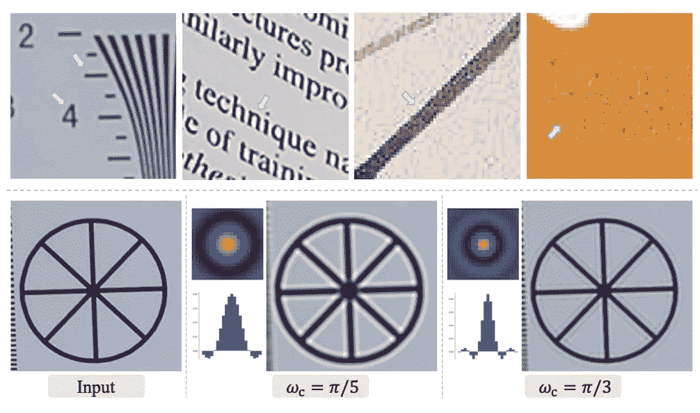

用 sinc 滤波器模拟环路和过冲伪像

环状伪像是出现在图像中急剧转变附近的伪像。它们通常伴随着过冲伪像，被描述为边沿跃迁处的跳跃增加(例如右下图中的黑色环)。它们是图像中非常常见的伪像，需要模拟这种伪像。

*sinc* 滤波器是一个模拟这些伪像的内核，用下面的公式表示。 *(i，j)* 为核坐标，J₁为第一类一阶贝塞尔函数，ω_c 为截止频率。绘制时，这些内核看起来像上图中每个示例左侧的图。

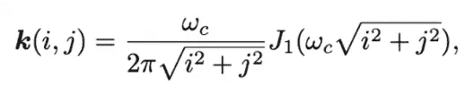

## 高阶退化

典型的退化模型将涉及多个退化操作，用于合成类似于真实世界样本的低分辨率图像。例如，给定地面实况图像 y，退化过程 D 可以是模糊核 k、具有比例因子 r 的下采样、添加噪声 n 和 JPEG 压缩的组合。我们可以用下面的等式来表达这个过程。

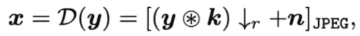

这些经典的退化模型可以在某种程度上生成合成的训练对。然而，具有基本退化的模型——本文称之为“一阶建模”——不能模拟复杂的真实世界退化，这种退化是多样的，并且通常包括一系列多个程序。下图描述了这两种情况的示例。

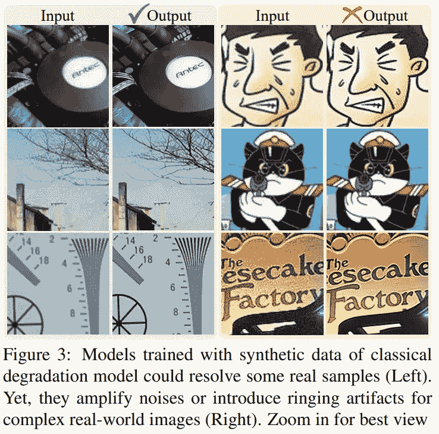

> 具体来说，原始图像可能是多年前用手机拍摄的，其中不可避免地包含相机模糊、传感器噪声、低分辨率和 JPEG 压缩等退化。然后对图像进行了锐化和尺寸调整操作，带来了过冲和模糊的伪影。之后，它被上传到一些社交媒体应用程序，这引入了进一步的压缩和不可预测的噪声。(来自 Real-ESRGAN 的示例)

一个简单的解决方案是多次重复随机退化。n 阶模型是指将经典退化模型重复 n 次的过程。

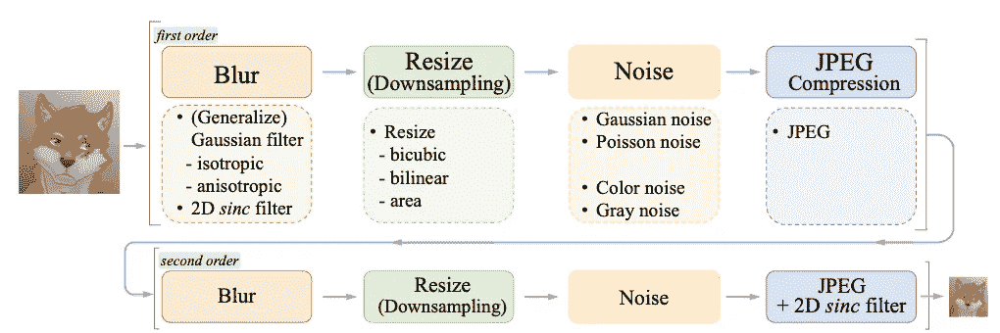

real-ESRGAN 的数据生成流水线

上图展示了退化模拟过程的整个流程。详细来说，

*   每个操作都是从一组可用选项中随机选择的。
*   该论文提出一个*二阶*退化过程足以模拟真实世界的退化。
*   缩减像素采样被替换为随机调整大小，以控制图像分辨率。
*   *sinc* 滤波器应用于初始模糊处理和最终阶段。JPEG 压缩和最终 *sinc* 滤波器的顺序是随机的。
*   文中提供了降解操作的细节和超参数。

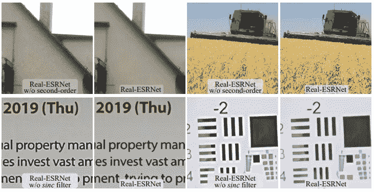

上图展示了 sinc 滤波器和二阶退化建模的有效性。我们观察到，当应用 *sinc* 滤波器时，环形伪像如预期的那样被消除。

## 网络

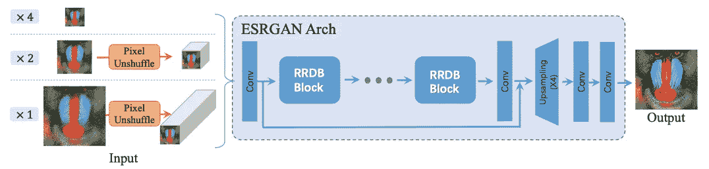

作者还建议对合成网络进行多方面的改进。具有残余中残余致密嵌段(RRDB)的发生器骨架与原始 ESRGAN 相同。然而，通过应用像素去混洗(像素混洗的逆)来减小空间大小并增加通道数量以提高效率，输入层被调整为多个分辨率的输入图像。

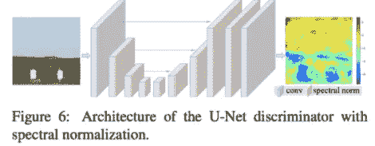

作者认为，Real-ESRGAN 的鉴别器需要对复杂的训练输出有更大的鉴别能力，因为 Real-ESRGAN 旨在解决比 ESRGAN 大得多的退化空间。

我同意 GANs 通常受益于强大的歧视者，并且论文的建议是有效的。然而，我不明白为什么作者认为 Real-ESRGAN 的判别空间比 ESRGAN 大。我相信生成器的问题复杂度会增加，因为它必须学习退化过程的逆过程以及原始的上采样问题，但是鉴别器的任务似乎是相同的:对合成图像和高分辨率图像进行分类。我想知道你的想法，🧐.

作者将原来的 VGG 式鉴别器改进为 U 网结构。为了稳定训练，作者还应用了谱归一化正则化。这种修改是对合成图像的惊人改进。

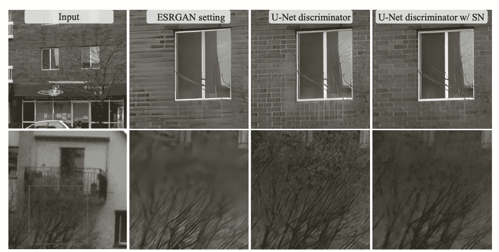

*关于谱归一化的更多内容:* [*用于生成性对抗网络的谱归一化*](https://arxiv.org/abs/1802.05957)

作者还评估了后处理算法的效果，尤其是反锐化掩模作为 Real-ESRGAN+。作者在使用该算法时发现了过冲伪像，并提出了一种在训练期间锐化地面真实图像并平衡锐度和过冲伪像的技巧。

就每次损失的权重而言，训练超参数有微小的变化。

## 讨论

我们清楚地观察到 Real-ESRGAN 的视觉质量优于以前的方法。Real-ESRGAN 有效地消除了图像中的伪像，并生成照片级的高分辨率纹理。

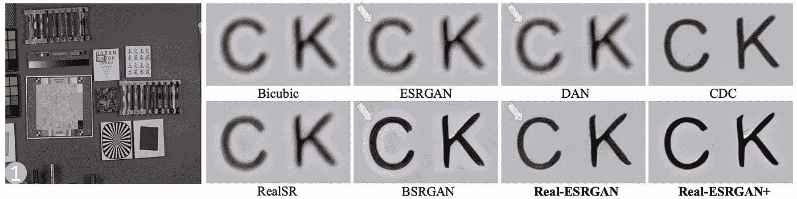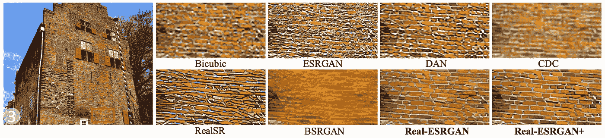

然而，作者也发现了 Real-ESRGAN 的局限性。虽然提出的高阶退化模型能够模拟更复杂的退化，但它并不完美。作者发现它的模型在合成扭曲线和非分布退化以及 GAN 伪影时有一些限制。

## 结论

我们研究了对真实世界图像合成的退化过程建模的挑战。作者提出了 *sinc* 滤波器来消除振铃和过冲伪像，以及高阶退化模型来更好地表达复杂的真实世界退化。作者还对网络体系结构提出了改进建议。

然而，我相信除了作者建议的样本之外，还必须进行更多的调查，以确定该管道是否能够真正推广到其他真实世界的退化。然而，在如何表现未知的退化过程方面的贡献是非常有趣的。本文讨论的策略可以应用于其他图像合成问题，甚至有监督的视觉问题。涉及所述管道的数据扩充可以提高网络的鲁棒性。