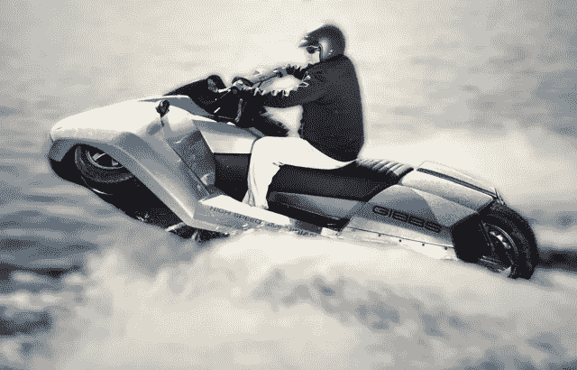

# 给陆地和水带来额外的刺激(短时间)！

> 原文：<https://medium.com/codex/bringing-additional-excitement-to-land-and-water-for-a-short-time-cfc4f070ca32?source=collection_archive---------21----------------------->

## 陆地和海上的速度:Quadski

吉布斯·夸斯基

我在之前的几篇文章中写过几个水上交通工具，包括号称世界上最快的水陆两栖交通工具[水车](/codex/experience-these-expensive-watertoys-part-3-2b5f68c54525)。在我对其他类似交通工具的研究中，我偶然发现了这张照片上的飞船，它有一段有点“混乱”的历史。第一，谁知道有…