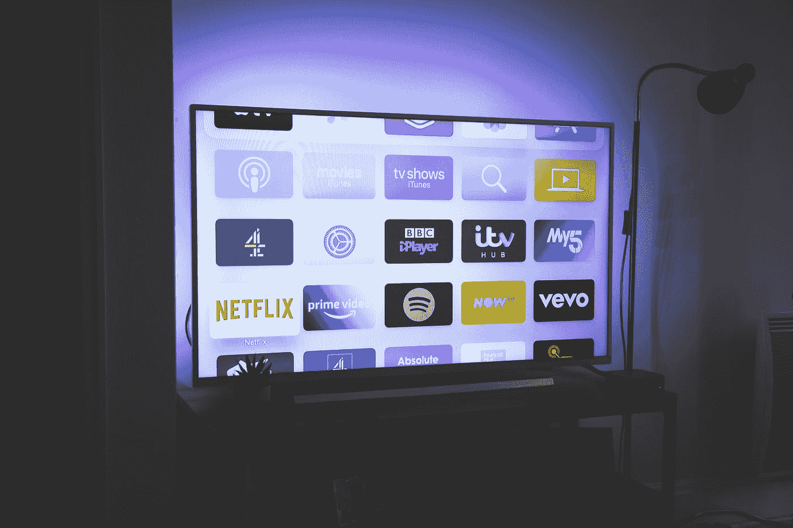

# 给我的电视带来环境光线！

> 原文：<https://medium.com/codex/bringing-ambient-light-to-my-tv-29a23a26f069?source=collection_archive---------4----------------------->

## 为我的电视添加灯光。

尼古拉斯·J·勒克莱尔在 [Unsplash](https://unsplash.com?utm_source=medium&utm_medium=referral) 上的照片

几年前，我欣然接受了给我的电视装背景灯的想法。飞利浦是第一个突出这一特点的公司之一，他们推出了[流光溢彩电视](https://www.philips.com.my/c-m-so/tv/p/ambilight)。这是一个简单的想法；你会买一台能够模仿你在屏幕上看到的相同颜色的电视机。这种颜色…