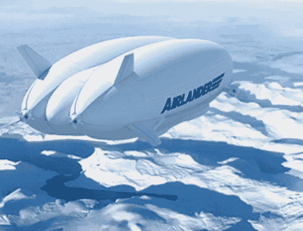

# 把飞艇带回来！

> 原文：<https://medium.com/codex/bringing-back-the-blimp-80e9c70f6e48?source=collection_archive---------8----------------------->

## 现在是一个完美的时间！

[空中登陆者(HAV 媒体)](https://www.hybridairvehicles.com/our-aircraft/airlander-10/)

在一个零碳排放是每个环保公司的目标的时代，软式飞艇(或非刚性飞艇)正在回归。HAV，或混合动力汽车，是一家著名的英国公司，致力于在不牺牲安全性和效率的情况下，通过可持续发展实现我们星球的长远未来。2012 年，他们推出了 Airlander 飞机，很快……