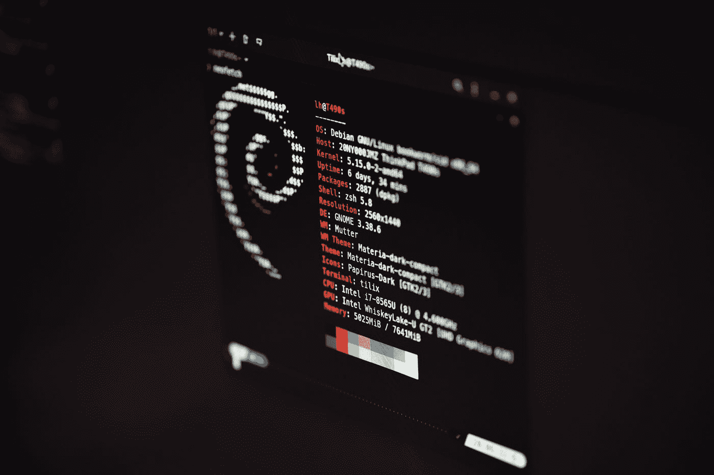

# 顺便说一句，你应该使用拱门

> 原文：<https://medium.com/codex/btw-you-should-use-arch-74f542c02f90?source=collection_archive---------0----------------------->

## 以及为什么您通常应该考虑使用 Linux。

由 [Lukas](https://unsplash.com/@lukash?utm_source=medium&utm_medium=referral) 在 [Unsplash](https://unsplash.com?utm_source=medium&utm_medium=referral) 拍摄的照片

如果您对 Linux 发行版感兴趣，您可能会注意到上图显示了流行的 neofetch 工具的运行情况。然而，有些东西不对劲——它与文章的标题不符。左边的 logo 不是 Arch 的 logo，是 Debian 的。如果你注意到了，很好，你可能以前用过 Linux 的一些发行版。如果你有…