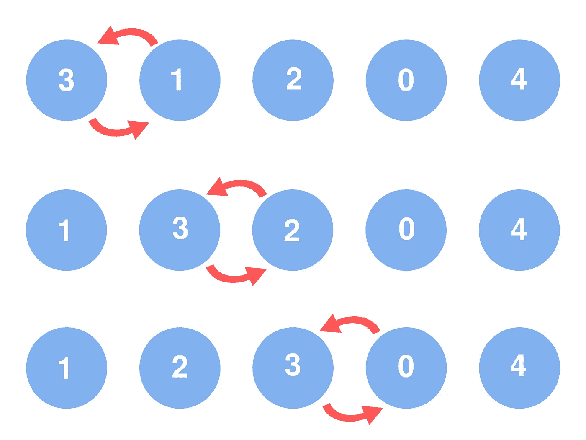

# 冒泡排序——工作原理、伪代码和 C++ & Python 实现

> 原文：<https://medium.com/codex/bubble-sort-how-it-works-psuedocode-and-c-python-implementation-c45306d44827?source=collection_archive---------8----------------------->

在本文中，我们将通过研究 psudeocode 和它的实际实现来了解冒泡排序是如何工作的。

Eliana Lopez 的冒泡排序示例插图

冒泡排序是众多解决**排序问题**的算法之一。

# 排序问题: