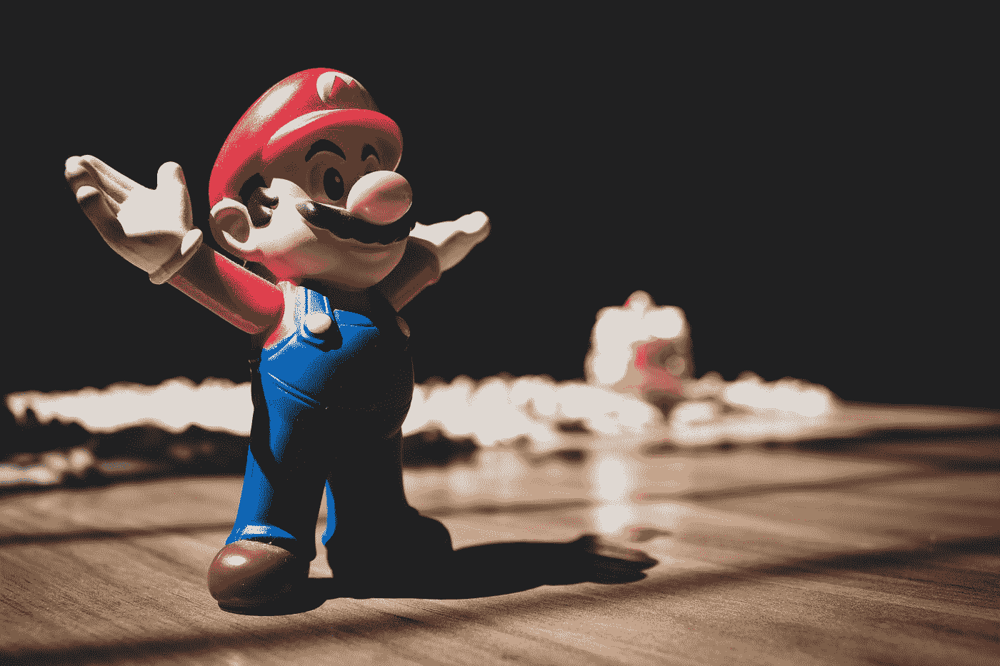

# 泡泡 Vs 网络流——没有编码的现实

> 原文：<https://medium.com/codex/bubble-vs-webflow-reality-without-coding-d25687d7a48d?source=collection_archive---------1----------------------->

## 选择适合你未来发展的！

Cláudio Luiz Castro 在 [Unsplash](https://unsplash.com?utm_source=medium&utm_medium=referral) 上拍摄的照片

您正在寻找一个新的 CMS 来构建您的网站或应用程序，您可能想知道 Bubble.io 和 Webflow 之间有什么区别？本文将帮助您理解这两种工具之间的差异，以及它们的优缺点。查看我们的 Bubble 与 Webflow —哪一个更好…