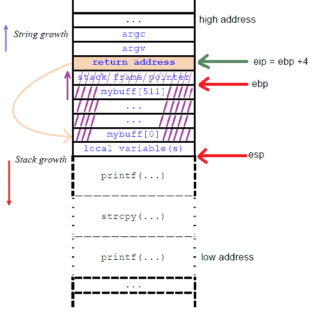

# 缓冲区溢出、外壳代码和内存损坏

> 原文：<https://medium.com/codex/buffer-overflows-shellcode-and-memory-corruption-51f546ab00ab?source=collection_archive---------7----------------------->

撰稿人:[杰克·梅利查普](https://www.linkedin.com/in/jake-mellichamp/)，[史蒂文·格里芬](https://www.linkedin.com/in/zackary-griffin/)，[韦斯·贝利](https://www.linkedin.com/in/wes-b-34216817/)

# 一.导言

缓冲区溢出和内存损坏利用是最早的计算机安全问题之一，从攻击和防御的角度来看，这个主题已经花费了无数的时间。

缓冲区溢出攻击的第一次描述记录在 142 页的 1972 年美国空军出版物*“计算机安全技术规划研究*”中。[1]在标题为“恶意用户威胁”的第 3.2 节中，该文档断言:*“事实上* ***操作系统没有被设计为安全的*** *为恶意用户提供了许多破坏操作系统本身的机会”。*

报告接着讨论了一个处理指针的易受攻击的程序，指出: *"* ***通过向用户程序提供分配给*** *的空间之外的地址，* ***通常可以让监视器获取该用户的未授权数据*** *，或者至少……**系统崩溃*

对于缓冲区溢出攻击，很难找到更简洁、更规范的描述。**显然，早期的重点是让系统*工作*，而不是让系统*安全*。那会改变的。**

虽然大多数早期攻击只能通过显式解除默认对策才能在现代操作系统上重现，但了解这些攻击的历史仍然很有意义。网络安全领域中没有任何东西是在真空中创造出来的，通常情况下，现代系统的方法看似武断，但却直接植根于过去。了解历史可以更好地揭示和理解当前平台的现状和原因以及它们的漏洞。

# 二。（从）历史的视角

1988 年秋天，康奈尔大学一位名叫罗伯特·塔潘·莫里斯的研究生写了一段恶意代码，后来成为臭名昭著的“**莫里斯蠕虫**”。[2]它利用了 Unix 体系结构中的几个弱点，包括“fingerd”网络服务中的缓冲区溢出。这种蠕虫通过连接到新生互联网的机器迅速传播，造成了严重的破坏。

罗伯特·塔潘·莫里斯

莫里斯坚持说，他只是“利用他发现的安全缺陷来证明当前计算机网络安全措施的不足。”他的辩解被置若罔闻，莫里斯成为第一个根据“计算机欺诈和滥用法案”被起诉的人。他后来被判有罪，判处 3 年缓刑和 10，500 美元罚款。不过，他能够很好地东山再起，后来在哈佛大学完成了博士学位，并与人合伙创办了几家科技公司，包括非常成功的孵化器*[**y combinator**](https://www.ycombinator.com/)。他目前的净资产估计为 49 亿美元。*

**

*缓冲区溢出的历史可视化*

*在过去的三十年里，已经做了大量的工作来解决这种类型的脆弱性。1997 年，StackGuard 宣布，实现了一个[**栈金丝雀**](https://en.wikipedia.org/wiki/Stack_buffer_overflow#Stack_canaries) 的概念。同年，一个名为“Solar Designer”的黑客演示了 [**return-2-libc 攻击**](https://en.wikipedia.org/wiki/Return-to-libc_attack) ，有效地绕过了不可执行的堆栈对策。有了这一发现，堆溢出、指针覆盖、格式字符串攻击和许多其他极具创造性的漏洞被开发出来。[3]同时，以****斯塔克豪思****帕克斯**等形式不断加强防御措施。无论一方做什么，另一方似乎就在前面或在后面；猫捉老鼠的游戏永远不会结束。[4]***

# ***三。堆栈缓冲区溢出概念***

***也就是说，在我们的实验中，我们将成为抓老鼠的猫(攻击者)(现代堆栈保护)。这里概述了什么是堆栈缓冲区溢出的背景:**堆栈缓冲区溢出(SBOF)在很长一段时间里都是 ELF 二进制文件中的一个基本漏洞。** **成功的攻击者可以覆盖本地变量数据或执行恶意代码。这显然不理想，通常是由于程序员不知道堆栈框架是如何工作的。*****

***将源代码编译成可执行二进制文件的过程是一个复杂的过程。源代码在最终加载到内存(用加载器)之前，必须经过预处理、汇编并链接到库函数(用链接器)。**当该过程完成时，文本、数据、堆和堆栈分段被加载到存储器中并用于程序执行。*****

******

***图 3.1 —程序布局。***

***程序布局将有助于理解 SBOF 攻击的本质，但真正的**漏洞存在于堆栈框架**内部。***

***堆栈帧是每次调用函数时创建的内存段。它包含*(`EBP`/`RBP` —一个标记堆栈基址的常量地址) ***堆栈指针*** ( `ESP` / `RSP` —在函数执行过程中，当值被压入或弹出堆栈时可能会改变)、一个 ***返回地址*** ( `EIP`，以及传入的**函数参数**。堆栈缓冲区溢出漏洞描述如下。****

********

****图 1.2 漏洞。****

****为了利用这种情况，攻击者必须结合使用`NOP` 命令和外壳代码来溢出缓冲区的内存。溢出应该继续，直到基帧指针`EBP`被成功覆盖。**漏洞利用的最后一步是在外壳代码开始之前，将堆栈的*返回地址覆盖回缓冲区。如果这些条件都能满足，那么这个二进制数就是一个负债。*******

# ****四。Linux 32 位 x86 系统上的漏洞利用演示****

********

****图 4.1 —易受攻击的程序****

****在我们的 SBOF 漏洞利用中，用于输入的**缓冲区的大小为 500 字节**。首先，我们必须发现:****

*   ****从缓冲区的**开始到**返回地址**的距离，这样我们就可以在`EIP` 寄存器中放置一个恶意返回地址。******

****为此，我们的团队使用了 GDB 的**。我们从随机选择一个小的缓冲区溢出开始，在这个例子中，缓冲区溢出了 8 个字节(图 4.2)。******

******出现 segfault！通过使用命令`(gdb) info registers`，用户可以看到哪些寄存器受到了影响。从下图中我们可以看到，我们成功地覆盖了`EBP` 寄存器，但没有覆盖`EIP`。`EIP` 是返回地址。从图 4.1 中，我们还知道`EIP` 总是比`EBP` 寄存器多 4 个字节。所以我们只需要在 508 的基础上加 4，使之成为 512。******

************

******4.2 堆栈溢出******

## ******成功覆盖寄信人地址******

******使用 512 个“A”字符启动程序会导致以下结果:******

************

******4.3 成功覆盖回邮地址******

## ******精心制作恶意负载******

******使用 [GDB](https://www.geeksforgeeks.org/gdb-step-by-step-introduction/) 我们发现缓冲区末端和 EIP 寄存器之间的距离正好是 12 个字节。知道了这些信息，我们就可以制造一个恶意的有效载荷。那么，从哪里开始呢？******

*   ********外壳代码**:使用[https://shell-storm.org/](https://shell-storm.org/)我们的团队能够找到一段外壳代码来使用 43 个字节执行系统调用`execve(/bin/sh)`。该外壳代码将使用当前进程权限启动终端。******
*   ********返回地址:**我们需要覆盖`EIP`寄存器以指向我们的外壳代码。使用[命令](https://visualgdb.com/gdbreference/commands/x) `(gdb) x/200wx $esp-550`我们能够读取堆栈基址附近 200 字节的虚拟内存地址。我们将把外壳代码上传到溢出堆栈*中的某个地方(它不必是一个精确的值，只要在堆栈*中的某个地方)，并使用 ***返回地址指向外壳代码的开始。*********

************

******图 4.4 —可能的返回地址位置******

*   ********NOP Slide:** 有效载荷需要 512 字节长(图 4.3)。我们有外壳代码(43 字节)和返回地址(40 字节*，返回地址是 40 字节的原因是为了创建一种缓冲空间，以确保它有更大的成功机会落在我们正确的返回地址上，即使有些东西在内存中稍微移动)。*经过快速计算(512–40–43 = 429 ),我们知道我们需要用`NOP` 命令填充剩余的 429 字节缓冲数据。******

************

******图 4.5 —恶意负载******

## ******执行代码******

******一旦创建了 python 脚本，我们就像任何典型用户一样运行 ELF 二进制文件，除了我们的缓冲区输入是`NOPs`、`Shellcode`和`Return addresses`的组合。执行之后，您应该有一个打开的外壳/终端，并准备使用！******

************

******图 4.6 —成功的 PWN******

# ******动词 （verb 的缩写）高级利用******

******虽然这是一个有启发性和指导性的练习，但事实是，如果不至少部分解除操作系统和/或编译器中的对策，这种攻击是不可能的。**不可执行堆栈功能(DEP)** 是一种基于硬件的安全功能，可防止恶意代码执行。StackGuard 特性实现了一个堆栈金丝雀，如果被这个简单的溢出攻击覆盖，它也会停止执行。由于相对较小的可用地址空间，地址空间布局随机化在 32 位机器中可以被强力击败。64 位机器实际上对蛮力 vs**ASLR**是无敌的，但是技术上仍然不能免疫。******

# ******不及物动词结论******

******堆栈溢出漏洞已经存在很长时间了，它们仍然是一个现存的和可行的威胁载体。尽管操作系统和编译器工程已经发展了三十多年，但这些漏洞并没有被完全消除。这就引出了一个问题，**缓冲区溢出能够完全从软件中“设计出来”吗？********

******开放 Web 应用程序安全项目(OWASP)是一个致力于提高软件安全性的非营利组织，它提供了与该主题相关的教育内容。其关于缓冲区溢出的在线白皮书指出:******

*******“这个问题一部分是由于缓冲区溢出可能以各种各样的方式发生，另一部分是由于经常用来防止缓冲区溢出的容易出错的技术。”*******

********该论文还指出，一些语言，如 C、C++、Fortran 和汇编，比其他语言更容易发生溢出**。解释语言要安全得多，如果不是完全不受这种技术的影响的话。所有的操作系统在某种程度上都存在漏洞。[5]******

******看起来，最好的防御是一个精心计划的、警惕的“深度防御”，**解决软件设计**并在所有阶段构建最佳实践，以及**维护最新的操作系统补丁**以解决当前发现的漏洞。******

*******最后提示:没有我的同事史蒂文·格里芬和韦斯·贝利令人难以置信的合作，这篇文章是不可能完成的。*******

*******敬请关注……我们将很快尝试进行一次没有安全措施的现代堆栈溢出利用。*******

# ******七。参考******

******[1]詹姆斯·安德森。1972.计算机安全技术规划研究。总部电子系统部(AFSC)指挥及管理系统代表。******

******[https://CSRC . NIST . gov/CSRC/media/publications/conference-paper/1998/10/08/proceedings-of-the-21-nissc-1998/documents/early-cs-papers/and e72a . pdf](https://csrc.nist.gov/csrc/media/publications/conference-paper/1998/10/08/proceedings-of-the-21st-nissc-1998/documents/early-cs-papers/ande72a.pdf)******

******[2]维基百科贡献者。罗伯特·塔潘·莫里斯。维基百科，免费的百科全书。2020 年 9 月 21 日，【https://en.wikipedia.org/w/index.php? title = Robert _ Tappan _ Morris&oldid = 979630920。2020 年 10 月 21 日接入。******

******[3] Aleph One。砸栈取乐牟利。Underground.org。v7，第 49 期。一九九六年十一月。[https://seclists.org/bugtraq/1996/Nov/17](https://seclists.org/bugtraq/1996/Nov/17)******

******[4]哈龙·米尔。内存损坏攻击(几乎)完整的历史。 *BlackHat 2010*******

******[https://thinkst . com/resources/papers/black hat-USA-2010-Meer-History-of-Memory-Corruption-Attacks-WP . pdf](https://thinkst.com/resources/papers/BlackHat-USA-2010-Meer-History-of-Memory-Corruption-Attacks-wp.pdf)******

******[5]缓冲区溢出。OWASP 网站。2020 年 4 月。[https://owasp . org/www-community/vulnerabilities/Buffer _ Overflow #](https://owasp.org/www-community/vulnerabilities/Buffer_Overflow#)******