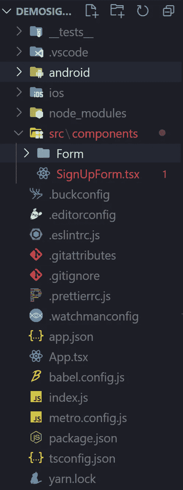
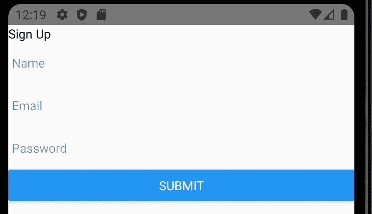
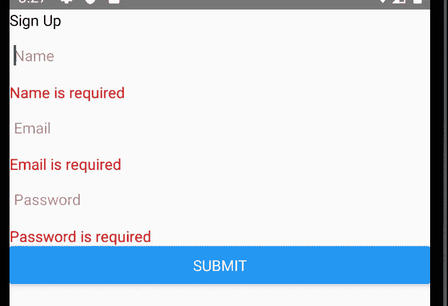
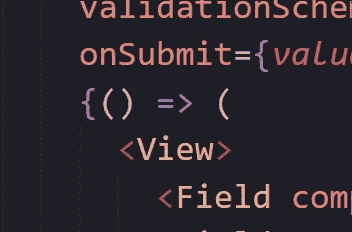

# 用 Formik 和 Yup 构建一个更好的反应原生形态

> 原文：<https://medium.com/codex/build-a-better-react-native-form-with-formik-and-yup-6ffcd6136dc?source=collection_archive---------5----------------------->


"在《无泪反应》中塑造形象."考虑到在每个表单变量的所有独立状态中输入会带来的所有眼泪，Formik 没有用他们的标语撒谎。本文将介绍如何在 React Native 和 Yup 中以更具反应性的方式构建 Formik 表单以进行验证。

到本文结束时，您将拥有一个使用最佳代码实践的基本的可重用注册表单。为了实现这一目标，我们将经历以下步骤:

1.  创建新的 react-native 项目
2.  安装 Formik 和 Yup 依赖项
3.  构建注册表单
4.  向文本输入添加验证和传递属性
5.  重构字段组件
6.  重构表单组件

***项目设置*** 我们将使用 Typescript 模板为本文创建一个新的 react-native 项目。

```
**Example**
npx react-native init MyApp --template react-native-template-typescript
**MyCode** npx react-native init DemoSignUpForm --template react-native-template-typescript
```

完成之后，您可以简单地将 cd 放入项目文件夹，或者直接从 VsCode(或者您正在使用的任何代码编辑器)中打开该文件夹。

```
cd DemoSignUpForm 
**OR**
cd .\DemoSignUpForm\
```

在一个终端中点击 yarn start，在 Android 或 iOS 上启动应用程序。

```
**Terminal 1** yarn start
**Terminal 2 *(for running on virtual android emulator)*** npx react-native run-android
```

酷，我们已经完成了基本的 react 本地项目。

***安装 Formik 和 Yup***

现在，我们需要安装两个依赖项:

```
**Formik** yarn add formik
**Yup** yarn add yup
```

轻松点。现在，让我们开始构建表单。

***构建注册表单*** 我们将从一些功能性的东西开始，没有你想在项目演示中展示的东西，但我们也将达到目的。

首先创建一个 src 文件夹(如果还没有),然后在 src 中创建一个 components 文件夹。这将包含我们的 SignUpForm.tsx，以及稍后重构的表单组件。



在图中，我们还可以看到组件内部的一个表单文件夹。我们稍后将回到这一点。

现在，将以下代码添加到 SignUpForm.tsx 中。

```
import React from 'react';import {Button, Text, TextInput, View} from 'react-native';import {Formik} from 'formik';const SignUpForm = () => {return (<><Text>Sign Up</Text><FormikinitialValues={{name: '', email: '', password: ''}}onSubmit={*values* => console.log(values)}>{({handleChange,handleBlur,handleSubmit,values,errors,touched,})=> (<View><TextInputplaceholder="Name"onChangeText={handleChange('name')}onBlur={handleBlur('name')}value={values.name}/><TextInputplaceholder="Email"onChangeText={handleChange('email')}onBlur={handleBlur('email')}value={values.email}/><TextInputplaceholder="Password"onChangeText={handleChange('password')}onBlur={handleBlur('password')}value={values.password}/><Button onPress={handleSubmit} title="Submit" /></View>)}</Formik></>);};export default SignUpForm;
```

此外，我们将删减 App.tsx，只显示注册表单。

```
import React from 'react';import {SafeAreaView} from 'react-native';import SignUpForm from './src/components/SignUpForm';const App = () => {return (<SafeAreaView><SignUpForm /></SafeAreaView>);};export default App;
```



嘣！我们有表格。现在让我们添加一些验证。

***添加验证和文本输入属性*** 我们现在添加了一些字段，所以让我们为每个字段设置一些验证逻辑。

从导入 Yep 开始。

```
import * as Yup from 'yup';
```

我们将在 SignUpForm 函数之外编写一个验证模式。

```
const validationSchema = Yup.object().shape({name: Yup.string().required('Name is required').label('Name'),email: Yup.string().email('Please enter valid email').required('Email is required').label('Email'),password: Yup.string().matches(/\w*[a-z]\w*/, 'Password must have a small letter').matches(/\w*[A-Z]\w*/, 'Password must have a capital letter').matches(/\d/, 'Password must have a number').min(8, ({*min*}) => `Password must be at least ${min} characters`).required('Password is required').label('Password'),});
```

yup docs([https://www.npmjs.com/package/yup](https://www.npmjs.com/package/yup))将有助于更好地理解上面的代码块。简而言之，yup 的优点是让我们编写一个规则和一条消息，如果不符合规则，就显示给用户。

现在，我们继续将 Yup 与 Formik 结合使用。首先，将 validationSchema 传递给 Formik 的 validationSchema prop。

```
<FormikinitialValues={{name: '', email: '', password: ''}}validationSchema={validationSchema}onSubmit={*values* => console.log(values)}>
```

然后，我们将使用“错误”属性显示错误消息。现在，让我们在每个字段后添加一个<text>组件。</text>

```
<TextInputplaceholder="Name"onChangeText={handleChange('name')}onBlur={handleBlur('name')}value={values.name}/><Text style={{color: 'red'}}>{errors.name}</Text>
```

对每个领域都这样做，我们应该有这样的东西。



但是，我们不希望每次都显示这些错误，只有在出现错误和字段被触及时才会显示。我们将使用一些 ES6 代码包装我们的文本组件，并且仅在满足前面提到的条件时才呈现它。

```
{errors.name && touched.name && (<Text style={{color: 'red'}}>{errors.name}</Text>)}
```

验证已经完成。现在，你可能会注意到，密码并没有像我们预期的那样隐藏起来。为此，我们需要将 secureTextEntry 属性传递给 TextInput。我们还将传递一些其他的道具，以便我们的 TextInput 能够正确地运行。

SignUpForm.tsx 最后会是这样的。

```
import React from 'react';import {Button, Text, TextInput, View} from 'react-native';import {Formik, Field} from 'formik';import * as Yup from 'yup';const validationSchema = Yup.object().shape({name: Yup.string().required('Name is required').label('Name'),email: Yup.string().email('Please enter valid email').required('Email is required').label('Email'),password: Yup.string().matches(/\w*[a-z]\w*/, 'Password must have a small letter').matches(/\w*[A-Z]\w*/, 'Password must have a capital letter').matches(/\d/, 'Password must have a number').min(8, ({*min*}) => `Password must be at least ${min} characters`).required('Password is required').label('Password'),});const SignUpForm = () => {return (<><Text>Sign Up</Text><FormikinitialValues={{name: '', email: '', password: ''}}validationSchema={validationSchema}onSubmit={*values* => console.log(values)}>{({handleChange,handleBlur,handleSubmit,values,errors,touched,}) => (<View><TextInputplaceholder="Name"onChangeText={handleChange('name')}onBlur={handleBlur('name')}value={values.name}autoCorrect={false}/>{errors.name && touched.name && (<Text style={{color: 'red'}}>{errors.name}</Text>)}<TextInputplaceholder="Email"onChangeText={handleChange('email')}onBlur={handleBlur('email')}autoCapitalize="none"autoCompleteType="email"autoCorrect={false}keyboardType="email-address"textContentType="emailAddress"value={values.email}/>{errors.email && touched.email && (<Text style={{color: 'red'}}>{errors.email}</Text>)}<TextInputplaceholder="Password"onChangeText={handleChange('password')}onBlur={handleBlur('password')}autoCapitalize="none"secureTextEntrytextContentType="password"value={values.password}/>{errors.password && touched.password && (<Text style={{color: 'red'}}>{errors.password}</Text>)}<Button onPress={handleSubmit} title="Submit" /></View>)}</Formik></>);};export default SignUpForm;
```

我们有一个全功能的表单，但是代码仍然不符合标准。

***重构字段组件*** 我们将使用一些 React magic 和 Formik 的字段组件来删除任何重复的代码并对其进行修整。

让我们从前面的表单文件夹中创建一个新的 AppFormField 组件开始。我们将从一个字段组件中复制所有内容并粘贴到那里。

```
import React from 'react';import {Text, TextInput} from 'react-native';const AppFormField = (*props*: any) => {const {placeholder,field: {name, onBlur, onChange, value},form: {errors, touched, setFieldTouched},...inputProps} = props;const hasError = errors[name] && touched[name];return (<><TextInputplaceholder={placeholder}onChangeText={*text* => onChange(name)(text)}onBlur={() => {setFieldTouched(name);onBlur(name);}}autoCapitalize="none"autoCorrect={false}value={value}{...inputProps}/>{hasError && <Text style={{color: 'red'}}>{errors[name]}</Text>}</>);};export default AppFormField;
```

好吧，我要解释一下。您看到的道具是由 Formik 的 Field 组件提供的，稍后我们将添加该组件。它允许我们使用之前使用的 formik 功能(详细信息，参见[https://formik.org/docs/api/field](https://formik.org/docs/api/field))。您会注意到我们有 inputProps，它包含了我们之前添加到 TextInput 的属性，现在我们将把它传递给 Field 组件。

将此添加到 formik 导入中。

```
import {Formik, Field} from 'formik';
```

我们将把我们的自定义 AppFormField 组件传递给 Field 组件，得到类似这样的结果。

```
import React from 'react';import {Button, Text, TextInput, View} from 'react-native';import {Formik, Field} from 'formik';import * as Yup from 'yup';import AppFormField from './Form/AppFormField';const validationSchema = Yup.object().shape({name: Yup.string().required('Name is required').label('Name'),email: Yup.string().email('Please enter valid email').required('Email is required').label('Email'),password: Yup.string().matches(/\w*[a-z]\w*/, 'Password must have a small letter').matches(/\w*[A-Z]\w*/, 'Password must have a capital letter').matches(/\d/, 'Password must have a number').min(8, ({*min*}) => `Password must be at least ${min} characters`).required('Password is required').label('Password'),});const SignUpForm = () => {return (<><Text>Sign Up</Text><FormikinitialValues={{name: '', email: '', password: ''}}validationSchema={validationSchema}onSubmit={*values* => console.log(values)}>{({handleChange,handleBlur,handleSubmit,values,errors,touched,}) => (<View><Field component={AppFormField} name="name" placeholder="Name" /><Fieldcomponent={AppFormField}name="email"placeholder="Email"autoCompleteType="email"keyboardType="email-address"textContentType="emailAddress"/><Fieldcomponent={AppFormField}name="password"placeholder="Password"secureTextEntrytextContentType="password"/><Button onPress={handleSubmit} title="Submit" /></View>)}</Formik></>);};export default SignUpForm;
```

看，好多了。这也消除了对福米克道具的需求。你会看到除了 handleSubmit 以外的所有道具都是灰显的。我们也可以摆脱它。

请在 Form 文件夹中创建一个新文件，并将其命名为 AppFormSubmitButton.tsx。我们将把组件复制到该文件中，我们还将使用 Formik hook 来访问 handleSubmit 函数。

```
import React from 'react';import {Button} from 'react-native';import {useFormikContext} from 'formik';interface AppFormSubmitButtonProps {title: string;}const AppFormSubmitButton = ({*title*}: AppFormSubmitButtonProps) => {const {handleSubmit, isValid} = useFormikContext();return <Button onPress={handleSubmit} title={title} disabled={!isValid} />;};export default AppFormSubmitButton;
```

让我们甚至使用 isValid 属性禁用按钮，直到所有用户输入都有效，并使标题动态化。用我们新的 AppFormSubmitButton 替换以前的按钮组件，我们将不再需要任何 Formik 道具！

***重构表单*** 现在让我们开始移除怪异的 Formik 语法。

这就是我所说的。



我们可以很容易地移除它，因为我们不使用任何 Formik 道具。

让我们在表单文件夹中创建另一个文件，并将其命名为 AppForm。

```
import React from 'react';import {Formik} from 'formik';const AppForm = ({initialValues,onSubmit,validationSchema,children,}: any) => {return (<FormikinitialValues={initialValues}onSubmit={onSubmit}validationSchema={validationSchema}>{() => <>{children}</>}</Formik>);};export default AppForm;
```

这样做的好处是，下次我们需要制作表单时，我们需要向这个包装器提供 initialValues、onSubmit 函数和验证逻辑作为道具，然后在其中添加任何字段。

让我们添加一个新的字段 Confirm Password，看看我们的新表单组件有多简单和简洁。

我们新的 SignUpForm.tsx 现在将是这样的。

```
import React from 'react';import {Text} from 'react-native';import {Field} from 'formik';import * as Yup from 'yup';import AppFormField from './Form/AppFormField';import AppFormSubmitButton from './Form/AppFormSubmitButton';import AppForm from './Form/AppForm';const validationSchema = Yup.object().shape({name: Yup.string().required('Name is required').label('Name'),email: Yup.string().email('Please enter valid email').required('Email is required').label('Email'),password: Yup.string().matches(/\w*[a-z]\w*/, 'Password must have a small letter').matches(/\w*[A-Z]\w*/, 'Password must have a capital letter').matches(/\d/, 'Password must have a number').min(8, ({*min*}) => `Password must be at least ${min} characters`).required('Password is required').label('Password'),confirmPassword: Yup.string().oneOf([Yup.ref('password')], 'Passwords do not match').required('Confirm password is required').label('Confirm Password'),});const SignUpForm = () => {return (<><Text>Sign Up</Text><AppForminitialValues={{name: '', email: '', password: '', confirmPassword: ''}}validationSchema={validationSchema}onSubmit={(*values*: any) => console.log(values)}><Field component={AppFormField} name="name" placeholder="Name" /><Fieldcomponent={AppFormField}name="email"placeholder="Email"autoCompleteType="email"keyboardType="email-address"textContentType="emailAddress"/><Fieldcomponent={AppFormField}name="password"placeholder="Password"secureTextEntrytextContentType="password"/><Fieldcomponent={AppFormField}name="confirmPassword"placeholder="Confirm Password"secureTextEntrytextContentType="password"/><AppFormSubmitButton title="Submit" /></AppForm></>);};export default SignUpForm;
```

我们现在有了函数形式和简洁的代码。现在，您可以轻松自定义表单的外观。

你可以在这里找到迄今为止的所有代码= >[https://github.com/shresthaprince/rnsignupdemo](https://github.com/shresthaprince/rnsignupdemo)(在主分支)

***让我知道你是如何找到这个教程的，如果你想让我就某个特定的主题再做一个。***