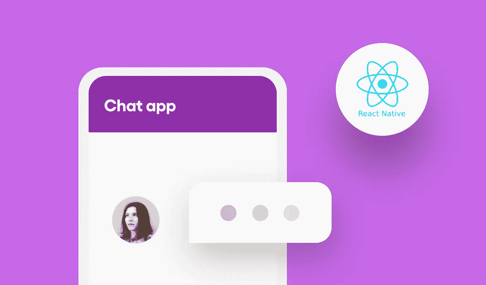
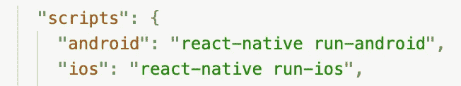
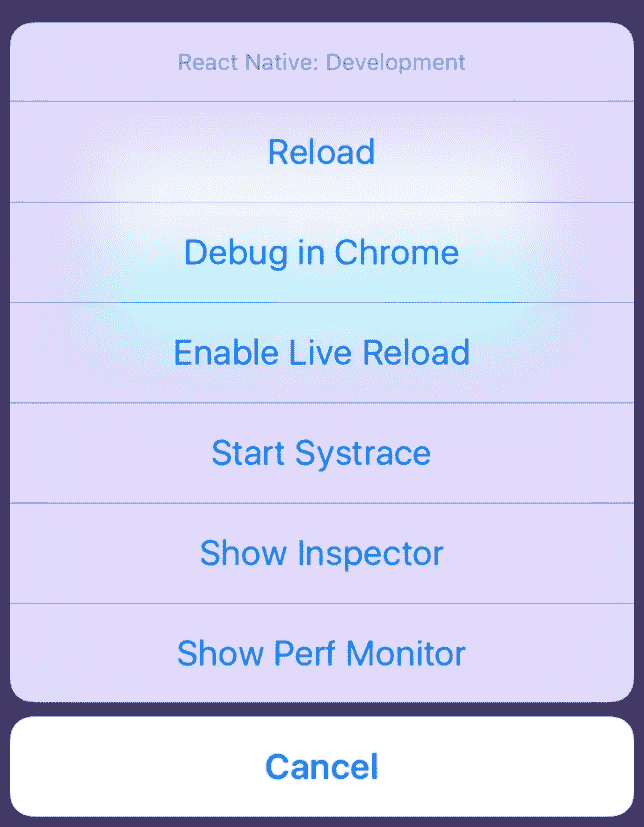
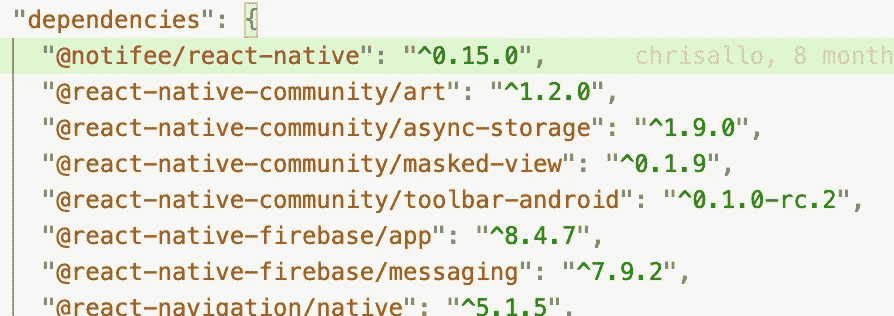
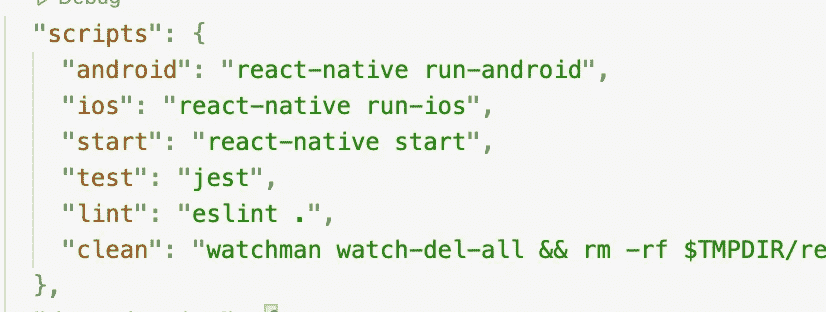
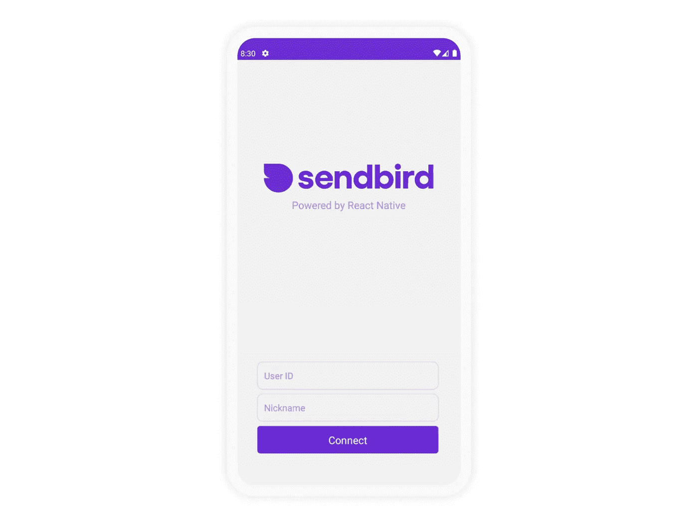
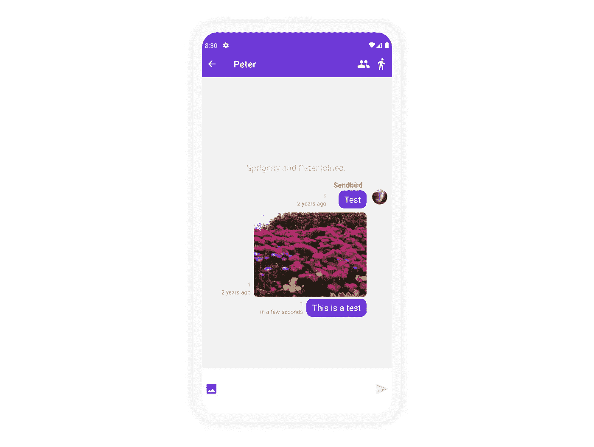
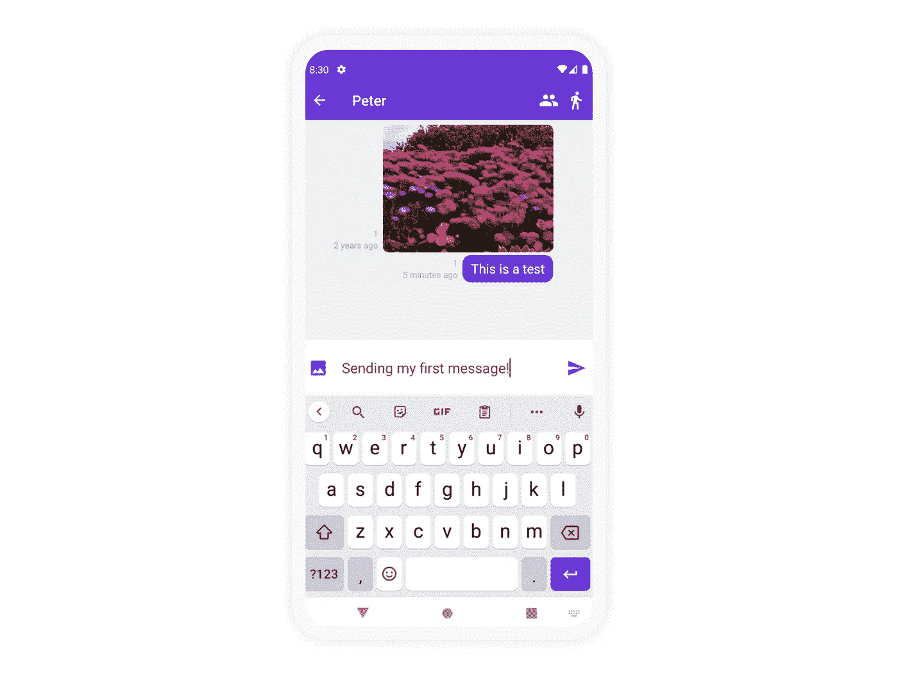
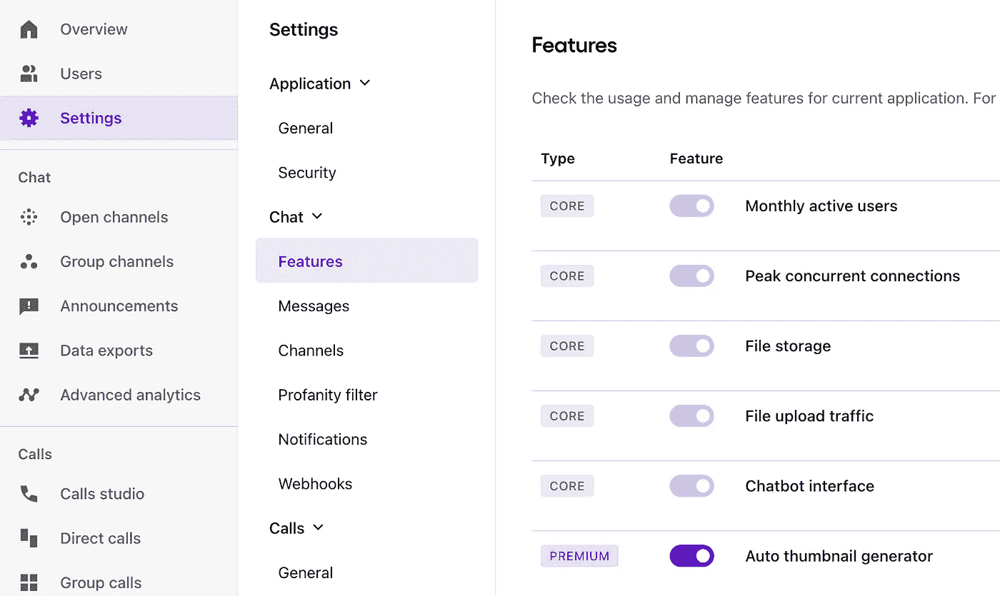
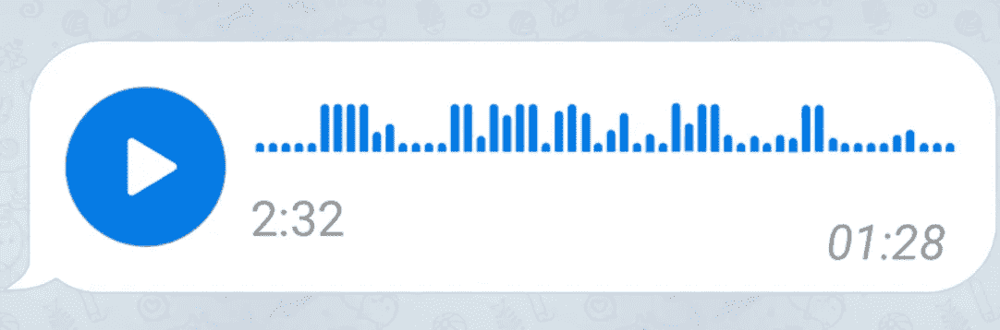

# 如何使用 React Native 和 Hooks 构建聊天应用

> 原文：<https://medium.com/codex/build-a-chat-app-using-react-native-and-hooks-bfc565f8166a?source=collection_archive---------0----------------------->



作者 Walter Rodriguez
解决方案工程师| Sendbird

*如果你正在寻找关于 Swift、Kotlin、React、Flutter 等更多的教程，请查看我们的* [*开发者门户*](https://sendbird.com/developer/tutorials) ***。***

*   在 GitHub 上下载 React Native Hook [示例](https://github.com/sendbird/sendbird-javascript-samples/tree/master/react-native/react-native-hook)
*   查看 JavaScript [文档](https://sendbird.com/docs/chat/v3/javascript/quickstart/send-first-message#2-get-started)
*   查看 Sendbrid 聊天[演示](https://sendbird.com/demos/in-app-chat)

# 介绍

本教程将向您展示如何使用 React Native 构建一个消息应用程序。首先，我们将通过理解为什么首先应该使用 React Native 来为本教程做准备。然后我们将解释 React Native Hooks 函数，然后深入讨论如何用 Sendbird 和 React Native 构建聊天应用程序的实现细节。

请注意，本教程假设您对 React Native 有基本的了解。

有关其他有用的资源，请参见我们的 [React 本地聊天示例](https://github.com/sendbird/SendBird-JavaScript/tree/master/react-native-hook-sample)、 [Javascript Sendbird 文档](https://sendbird.com/docs/chat/v3/javascript/quickstart/send-first-message#2-get-started)和 [Sendbird 聊天演示](https://sendbird.com/demos/in-app-chat)。

我们开始吧！

# 为什么反应原生？

如今，大多数应用程序都是本地构建的，但也有使用 Webviews 开发的混合应用程序。然而，与它们的本地对应物相比，Webviews 的属性和特征引入了对应用的限制。使用 Webviews 的应用程序也比本地应用程序相对较慢。React Native 允许应用程序访问本机功能和属性，从而弥补了这一缺陷。

React Native 通过将 JavaScript 代码和本机代码分离到不同的线程中来实现这一点。它还支持两者之间的异步通信，从而提升应用程序的整体性能。此外，由于 React Native 使用 JavaScript，不熟悉本机应用程序的开发人员可以利用他们现有的知识和经验来减少编码时间。

# 谁在使用 React Native？

由于 React Native 在代码可重用性、可靠性、健壮性以及有用社区的存在等方面的优势，许多公司，从老牌的财富 500 强公司到高速发展的初创公司，都使用 React Native 开发应用程序。一些使用 React Native 的知名组织包括 Instagram、Shopify、Tableau、Tesla、UberEats 和 Skype。

现在我们已经理解了基础知识，让我们继续反应本地钩子函数。

# 什么是 React 原生钩子函数？

挂钩是让您从功能组件“挂钩”到反应状态和生命周期特性的功能。钩子在类内部不起作用——它们让你在没有类的情况下使用 React。(我们不建议一夜之间重写现有的组件，但是如果你愿意，你可以在新的组件中使用钩子。)

React 提供了一些内置的钩子，比如 **useState** 。您还可以创建自己的挂钩，以便在不同组件之间重用有状态行为。我们先来看看内置挂钩。

更多关于钩子的信息，请查看 [**react 站点**](https://reactjs.org/docs/hooks-overview.html) 。

现在让我们来了解一下如何在您的聊天应用程序中使用 Sendbird 和 Hooks。本教程由另外九个部分组成:

1.  安装 React Native
2.  下载 Sendbird 示例
3.  排除故障
4.  了解文件夹结构
5.  构建登录组件
6.  构建频道列表组件
7.  构建消息组件
8.  发送和接收消息
9.  Sendbird 的其他功能

# 第一步。安装 React Native 以构建聊天

您需要让 **React Native CLI** 来处理这个例子。请全局安装:

```
npm install -g react-native-cli
```

通过显示版本号，您可以快速检查安装是否正确完成:

```
react-native --version
```

# 第二步。下载 Sendbird 示例

一旦安装了 **React Native CLI** ，就可以下载示例代码了。首先克隆存储库:

```
git clone [https://github.com/sendbird/SendBird-JavaScript.git](https://github.com/sendbird/SendBird-JavaScript.git)
```

然后，使用您喜欢的 IDE 打开以下文件夹:

```
./SendBird-JavaScript/react-native-hook-sample/Sendbird
```

下一步，让我们安装所有的依赖项。运行以下命令:(下载所有包需要一些时间)

```
npm i
```

你可以在 Android 或者 iOS 上运行这个。打开 package.json 文件，检查我们为您准备的脚本:



图 1:运行 Android 和 iOS 版本的脚本

要运行 Android，只需输入:

```
npm run android
```

## Android 故障排除

如果您在运行 Android 版本时遇到问题，可以尝试以下方法:

*   如果你在一个真实的设备上运行，检查是否安装了所有的东西——尤其是 Android studio。
*   检查 adb 设备是否可以看到您的设备；有时，它可能不工作或有滞后。在这种情况下，调用 adb kill-server，然后调用 adb start-server。
*   您可能希望使用 react-native run-android 构建项目。如果失败，您可能需要使用 Android studio 运行它。
*   确保您的 ANDROID_HOME 在路径中。类似于:

```
export ANDROID_HOME=/Users/[your user]/Library/Android/sdk
```

对于 iOS，您需要安装一次 Pods:

```
cd ios
pod install
pod update
```

这将安装所有库来运行 iOS 版本。

## iOS 故障排除

如果您在运行 iOS 版本时遇到问题，可以尝试以下方法:

*   进行 pod 更新，然后从 **ios/文件夹**中进行 pod 安装。
*   删除 **ios/build 文件夹。**
*   最好不要更改 XCode 中的任何构建阶段、规则或设置，因为这可能会导致进一步的问题。
*   最好不要更新 **package.json** 文件中列出的包或者 **ios/Pods** 里面的包。这是因为这些是我们测试中使用的版本。

## 两个平台的故障排除

*   确保您没有运行任何 VPN。有时这会产生问题。
*   如果您正在运行 React 本机终端窗口，请尝试关闭它，然后再次运行上面的命令。
*   您可以从根目录运行 npm run clean。这将清理旧版本。
*   您可以删除文件 **package-lock.json** ，并尝试再次运行 npm i，但是由于兼容性问题，我们不建议这样做。

运行此示例之前，请检查先决条件列表。你可以在这里找到它们 [**。**](https://facebook.github.io/react-native/docs/getting-started)

# 第三步。调试 React 本地聊天应用程序

从你的 iOS 模拟器，你可以调试应用程序，并看到控制台输出到 Chrome。按下 **Command + D** 可以看到如下画面:



图 2:从 iOS 调试

当你点击 Chrome 中的 Debug 时，一个 Chrome 窗口将会打开。使用 Chrome 开发工具来监控由 **console.log()** 编写的输出。

# 第四步。了解文件夹结构

以下是对该示例应用程序中最重要的文件和文件夹的描述。

## package.json

该文件包含该项目将使用的所有包。由于兼容性问题，我们建议不要更改这些软件包的版本。



图 3:这个示例应用程序的依赖关系

该文件还包含您可以运行的脚本:



图 4:您可以运行的脚本

运行 npm 运行 android 启动 Android 版本。

运行 npm 运行 ios 以启动 iOS 版本。

运行 npm run clean 以清除任何以前的生成。

## 节点 _ 模块

此文件夹包含此项目将使用的所有下载的库。每次运行 npm i 时都会创建该文件夹。

## 机器人

这个文件夹包含一个 Android 项目的所有文件。您可以使用 Visual Studio 打开并运行该项目。

## ios

该文件夹包含 iOS 项目的所有文件。可以用 Xcode 打开。

## 科学研究委员会

该文件夹包含我们的演示应用程序的所有 Javascript 文件。

## 索引. js

这是 React Native 执行的第一个文件。

对于 Android 设备，我们定义当我们收到推送消息时哪个函数将处理信息。在这个例子中，函数 **onRemoteMessage** 将完成这项工作。它就在**里面。/src/utils utils.js** 文件。

## App.js

这个文件是从文件 **index.js.** 中调用的，它显示了用户运行我们的应用程序时看到的第一个屏幕。

您将看到您的 Sendbird 应用程序 ID(您可以从您的 [**Sendbird 仪表板**](https://dashboard.sendbird.com/) )的定义位置:

我们现在准备初始化 Sendbird SDK。在这一点上，我们没有联系。

我们将使用第一个钩子来请求接收通知的许可。

如果我们已经有了一个来自 Firebase 的令牌，我们使用 Sendbird 函数**registerAPNSPushtokenForCurrentUser**为一个 **iOS** 设备注册它，为一个 **Android** 设备注册**registergmpushtokenforcurrentuser**。

关于 React Native 实现 Firebase 的详细教程可以在 [**这里**](https://sendbird.com/docs/chat/v3/javascript/guides/push-notifications#1-push-notifications) 获得。

下一步是定义堆栈导航器。堆栈导航器为您的应用程序提供了一种在屏幕之间切换的方式。每个新屏幕都可以放在堆栈的顶部。

默认情况下，堆栈导航器提供了熟悉的 iOS 和 Android 外观。在 iOS 上，新的屏幕从右边滑入，在 Android 上使用默认的操作系统动画。您可以自定义动画来满足您的需求。

# 第五步。为 React 本地聊天应用程序构建登录组件



图 5:登录窗口

堆栈导航器将首先对**进行游说。这个文件在**里。/src/page/lobby.js** 。**

这里应用了很多钩子，主角是 **currentUser** 。因为这取决于用户先前的登录，我们将显示一个登录屏幕或 [**聊天频道列表**](https://sendbird.com/docs/chat/v3/javascript/guides/channel-types) 。

该示例使用 **AsyncStorage** 来读取(并保存)之前签名的用户的值。如果有一个值，我们读取它并定义用户为已初始化。

我们相应地构建屏幕。如果我们有一个注册用户，我们显示**通道**组件。否则，我们显示**登录**屏幕。

一旦**登录**组件做出响应，登录功能就会执行。我们将这个值保存在 **AsyncStorage** 中，并运行 iOS 和/或 Android 的令牌注册来接收 [**推送通知**](https://sendbird.com/docs/chat/v3/javascript/guides/push-notifications#1-push-notifications) 。

登录屏幕将描绘我们上面看到的屏幕，并等待用户点击**连接**按钮。

点击后，按钮调用**连接**功能。

## 正在连接到 Sendbird

如您所见，sendbird.connect(…)函数调用通过 Websockets 将设备与 sendbird 服务器连接起来。如果您在这里看到任何错误，这是因为所选的用户 id 无效，您的 Sendbird 应用程序 ID 不正确，函数未定义，或者因为您没有连接到互联网。

我们建议您检查任何错误代码并通知您的用户。

## 前景和背景

您必须检查您的应用程序是否转到后台，用于以下屏幕(频道、消息等。).如果发生这种情况，您应该调用 setBackgroundState。对于其他用户，您将显示为断开连接。一旦应用程序返回到前端，就调用 setForegroundState。这将使 Websockets 再次连接，登录的用户再次在线。

成功连接后，我们存储该用户的昵称(来自输入屏幕)并将其返回给**大厅**组件。一旦用户设置完毕，将出现**频道**屏幕。

# 第六步。构建频道列表组件


图 6:频道列表

Sendbird 使用公共**开放频道**和**群组频道**。你不需要邀请，任何用户都可以输入消息，为**打开渠道**。**组通道**则相反。您需要邀请才能加入频道并发送消息。

要了解更多有关频道类型的信息，请参见本页 或本 [**教程**](https://sendbird.com/developer/tutorials/understanding-channels) 。

现在，打开**。/src/page/channels.js** 文件，并查看所有应该在那里的必要部分。

*   添加一个**连接处理器**来接收 Websocket 断开连接通知。

客户必须知道 SDK 何时未连接，因为在建立连接之前，您的应用程序应该停止所有请求。否则，您的用户会认为您的应用程序没有工作。

*   添加一个**通道处理程序**来接收来自 Sendbird 的关于任何事件的更新。您将能够对频道修改、新消息、频道中添加或删除的用户等做出反应。

通道处理程序帮助您的应用程序进行可视化更新，并通知客户其他用户所做的任何更改。

在这里阅读更多关于连接和通道处理程序[](https://sendbird.com/docs/chat/v3/javascript/guides/event-handler#1-event-handler)**。**

## **列出您的频道**

**列出频道时，您可以从服务器接收的最大记录数是 100。如果需要更多，您必须使用 **next(…)** 再次调用服务器:**

**一旦用户选择了一个频道，我们的应用程序将导航到聊天，传递选择的频道和当前注册的用户。**

**这将引导我们进入消息屏幕。**

# **第七步。构建消息组件**

**选择频道后，应用程序将只显示该频道的消息列表:**

****

**图 7:消息**

**这个屏幕的代码在**里。/src/page/chat.js** 。**

**自然，消息列表是这个屏幕最重要的部分。但是，让我们看看必须包括的其他部分:**

*   **一个**连接处理程序**，用于管理连接断开并阻止客户发送消息。**
*   **一个**通道处理器**，用于接收与通道相关的任何变化(包括消息的添加、删除等)。)，通过 Websockets。**

**当该视图对用户不再有效时，您需要删除这些处理程序。**

**在这个示例应用程序中，我们将对以下事件采取行动:**

****onMessageReceived** :通过 Websocket 接收到一条新消息。仅当事件通知的频道 URL 与您在此视图中激活的频道相同时，才将此新消息添加到消息列表中。**

****onMessageUpdated** :消息已更新。如果此通知消息属于此活动频道，您必须从列表中更新其内容。**

****on messaged deleted**:消息已被删除。如果此通知消息属于此活动频道，您必须将其从列表中删除。**

**您还可以接收关于该用户和频道的事件。例如:**

****onUserLeft** :如果用户离开了频道，你应该检查签名的用户 ID 是否与通知的用户 ID 匹配。如果两者相同，则意味着您决定从另一台设备退出该频道。您的操作应该类似于返回到主频道列表(channels.js)。**

****onChannelDeleted** :另一个关键的检查是包含你正在显示的消息的频道是否存在。如果该频道因任何原因丢失，您还应返回主屏幕，显示剩余频道列表(channels.js)。**

## **将频道标记为已读**

**当您进入查看频道中的消息时，您应该将所有消息标记为已读。**

## **列出您的邮件**

**我们将向 Sendbird 请求这个活动通道中的消息列表。为此，我们使用**createPreviousMessageListQuery**。**

**查看更多信息，请参见 [**本页**](https://sendbird.com/docs/chat/v3/javascript/guides/group-channel#2-load-previous-messages) 。你也可以看看这篇关于消息对象的 [**教程**](https://sendbird.com/developer/tutorials/designing-message-objects) 。**

**对于这个例子，我们列出了最后 50 条消息。如果有更多的消息可以显示，您应该调用 **next()** 来获得更多的数据。**

## **根据时间戳获取消息**

**您还可以根据特定的时间戳请求消息列表。使用类似于 **new** **Date()的东西。getTime()** 并定义您想要显示多少条以前的消息。**

**如果用户向上滚动以获得很长的消息历史，这种技术将帮助您加载以前的消息。您只需要不断发送消息的时间戳，并要求显示以前的记录，直到您到达发送到通道的第一条消息。**

**要了解更多信息，请查看我们的 [**文档**](https://sendbird.com/docs/chat/v3/javascript/guides/group-channel#2-list-messages-along-with-their-replies-3-by-timestamp) 。**

# **第八步。发送和接收消息**

****

**图 8:发送消息**

**使用 Sendbird，您可以发送文本或文件消息。**

**注意，Sendbird 的消息不仅仅是文本或文件；我们还有其他的属性来将机密信息发送到您的服务器或其他连接的用户。**

## **自定义类型**

**该属性是消息对象的一部分，它为消息分组指定一个自定义消息类型。长度限制为 128 个字符。**

**Sendbird [**高级分析**](https://sendbird.com/docs/chat/v3/platform-api/guides/advanced-analytics) 也使用自定义类型来划分指标。它们支持数据视图的子分类。**

## **数据**

**数据是可以用于内部逻辑的另一个属性。它指定了额外的消息信息，比如定制的字体大小、字体类型，或者您想要用一个 **JSON** 格式的字符串处理的任何数据。**

**要查找消息的属性列表，请单击此处的[](https://sendbird.com/docs/chat/v3/platform-api/guides/messages#4-list-of-properties-for-text-message)**。****

****要了解更多关于通过 SDK 和 Javascript 发送消息的信息，请参见 [**本页**](https://sendbird.com/docs/chat/v3/javascript/guides/group-channel#2-send-a-message) 。****

****下面是发送消息的代码。****

## ****文件消息****

****使用 Sendbird，您还可以发送文件消息。在这个应用程序中，我们允许用户从设备中选择文件，然后发送它。****

****记得请求许可。****

****当使用 Android 和 iOS 时，您必须在使用文件选择器之前请求用户的许可。****

******重要** : Sendbird 需要一个 Javascript **File** 对象作为上传的文件。如果尝试发送另一种格式，您可能会收到错误或上传失败。有时，从公共存储库中使用的定制文件选择器不能提供正确的对象类型。****

****请记住，发送文件消息时，不能同时发送文本。但是，您可以使用其他消息对象属性来发送文本并将其显示在聊天列表中。查看文件消息的可用属性列表:****

****更多信息在 [**文档**](https://sendbird.com/docs/chat/v3/javascript/guides/group-channel#2-send-a-message) 中。****

## ****图像文件的缩略图****

****上传图像文件时，可以让 Sendbird 自动生成缩略图。从您的 [**仪表盘**](https://dashboard.sendbird.com/) 中启用此功能:****

********

****图 9:启用自动缩略图生成器****

## ******语音信息******

****您可以通过文件消息发送语音消息。您的前端应用程序应该实现一个语音记录功能，并将结果保存为一个文件。然后，您只需上传该文件，以及我们为消息对象提供的任何自定义属性，表明这是一个语音消息文件。在通道中绘制此消息时，分析信息并正确显示。****

********

****图 10:将文件消息格式化为语音消息****

## ******回复消息******

****Sendbird 支持消息线程，因此您可以回复消息。****

****为此，您必须在发送响应时指明父消息 ID。****

****您可以回复一条短信:****

****或者使用文件消息:****

****要了解关于 [**消息**](https://sendbird.com/docs/chat/v3/javascript/guides/group-channel#2-reply-to-a-message) 的更多信息，请查看文档和本 [**教程**](https://sendbird.com/developer/tutorials/designing-message-objects) 。****

# ****第九步。Sendbird 的其他功能****

****Sendbird 为您的聊天体验提供了多种功能。****

## ****打字指示器****

****在这个示例中，您可以看到使用 startTyping()和 endTyping()向通道中的所有成员发送事件。****

****该事件触发 [**通道处理程序**](https://sendbird.com/docs/chat/v3/javascript/guides/event-handler#4-list-of-open-channel-events) 的 onTypingStatusUpdated 函数。****

****剩下的就是显示一个标签，说用户 XXX 正在输入消息。****

## ****适度****

****Sendbird 提供了强大的调节工具。您可以使用 Sendbird [**仪表盘**](https://dashboard.sendbird.com/) 来调节消息和用户。您也可以 [**注册**](https://sendbird.com/docs/chat/v3/javascript/guides/group-channel#2-register-operators) 或 [**注销**](https://sendbird.com/docs/chat/v3/javascript/guides/group-channel#2-cancel-the-registration-of-operators) 通道成员为 [**操作员**](https://sendbird.com/docs/chat/v3/javascript/guides/user-types#2-operator) ，这样他们就可以 [**冻结**](https://sendbird.com/docs/chat/v3/javascript/guides/group-channel#2-freeze-and-unfreeze-a-channel) 通道、 [**阻塞、**](https://sendbird.com/docs/chat/v3/javascript/guides/group-channel#2-ban-and-unban-a-user) 或 [**静音**](https://sendbird.com/docs/chat/v3/javascript/guides/group-channel#2-mute-and-unmute-a-user) 用户。****

****要查看 Sendbird 提供的所有功能，请查看我们的 JavaScript [**文档**](https://sendbird.com/docs/chat/v3/javascript/quickstart/send-first-message) 和这篇关于 [**适度最佳实践**](https://sendbird.com/developer/tutorials/reporting-api-best-practice) 的教程。****

# ****结论****

****所以这是一个总结！JavaScript SDK 中还有更多的特性，所以一定要查看文档 中的 [**来构建一个更高级的消息应用程序。**](https://sendbird.gitbooks.io/sendbird-javascript-sdk/content/)****

****本教程让您体验了使用[**send bird JavaScript SDK**](https://sendbird.com/docs/chat/v3/javascript/quickstart/send-first-message)构建 React 原生聊天应用的过程。要了解 React Native 的更多信息，请参考 [**官方文档。**](http://facebook.github.io/react-native/docs/getting-started.html)****

****如果您对本教程或使用 Sendbird 有任何疑问，请在我们的社区页面 [**这里**](https://community.sendbird.com/) 给我们留言。****

****感谢和快乐反应本地聊天建设！💻****