# 为在线商店销售构建数据管道深度分析— elasticsearch — logstash

> 原文：<https://medium.com/codex/build-a-data-pipeline-for-online-store-sales-deep-analysis-elasticsearch-logstash-680a7c8e3097?source=collection_archive---------8----------------------->

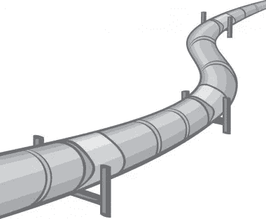

# 那么，用例是什么呢？

我们是一家网上商店，我们希望有效地了解我们的销售行为、退货率，并根据每个产品预测我们的销售额。我们希望获得这种可见性的原因(我需要强调的不是一次性视图或批处理视图，而是这些关键指标的持续实时视图)，是因为我们想知道:

*   哪种产品销售最多，销售速度如何，影响销售的因素是什么。
*   我们的回报是什么
*   哪些产品将在未来几周销售

最后，我们希望最大化利润，尽我们所能降低 T2 的损失。

好，既然我们已经解决了这个问题——让我们开始工作吧。我们从哪里开始？🤔 …

我们的在线商店有一个 API，我们可以从中提取数据，下面是 json 有效载荷。

源 json 格式

当我们把这个有效载荷按原样载入 **elasticsearch** 时，下面是它的样子。这对于使用数据☹️进行任何工作都不理想😭

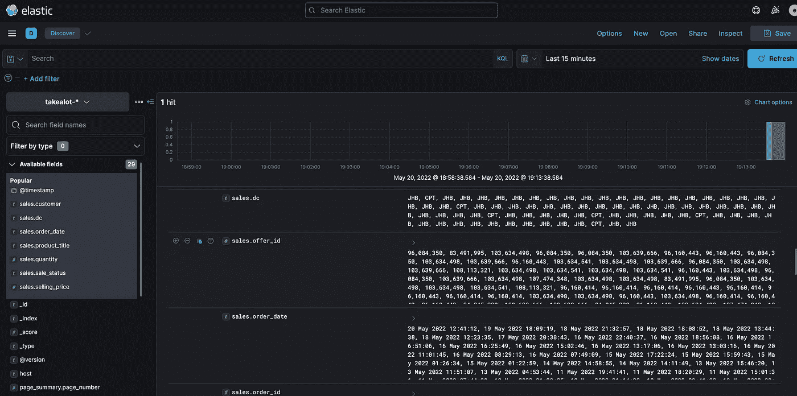

elasticsearch 之所以这样显示，是因为[ **sales** ]字段是一个对象数组，所以我们需要做的是在我们的 ETL 工具( **logstash** )中设置一个“ **split** ”过滤器，在包含对象的字段上拆分事件，如下所示。除此之外，我们需要我们的时间序列数据是基于订单日期。为此，我们使用“**日期**”过滤器来匹配 ***订单日期*** 格式，并将其用作摄取时间戳，一旦处理完毕，我们就不再需要消息字段，因此我们将其删除。最后一件重要的事情是，我们需要将我们的 ***文档 id*** 设置为一个唯一的标识符——这将确保我们不会重复进入的事件，为此我们使用 **order_id** 。

一旦管道开始运行，下面是现在弹性如何吸收它:

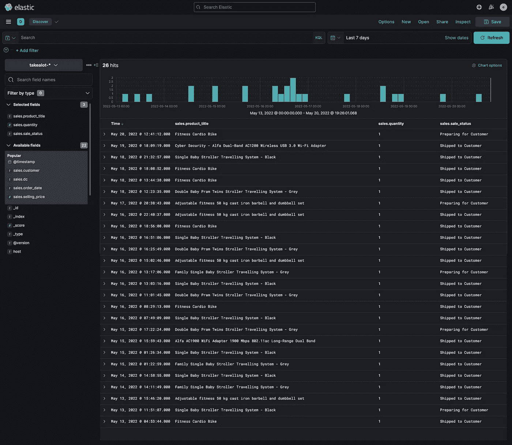

干得好的👏🏿—你把数据输入我们的**分析平台**。现在，真正的工作开始了。让我们建立可视化和仪表板来回答我们的问题。

## **第一个问题** —到目前为止，我们在一段时间内的总销售额是多少:

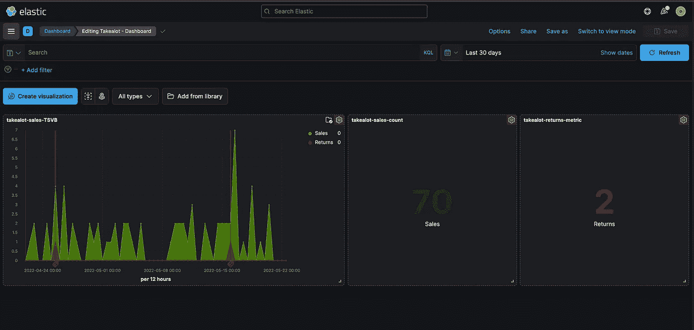

销售与退货

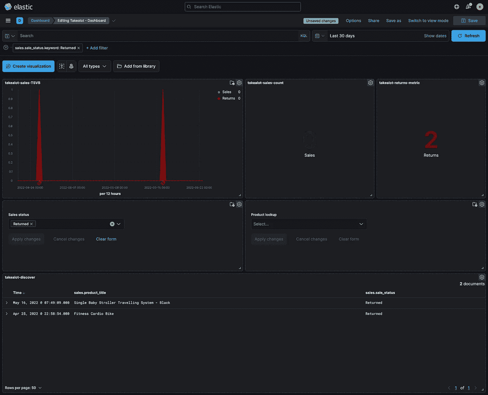

退回的项目

## 第二个问题—销售在我们产品中的分布是怎样的:

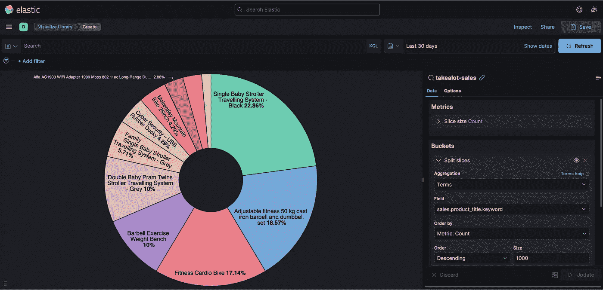

销售额分成一个馅饼

## 第三个问题——在我们产品的生命周期中，我们会根据季节、特价和其他情况改变价格。一种产品每种价格的销售额是多少？这很重要，因为我们想知道高销售额的因素是什么。价格有影响吗？

例如，在这里，我们的“健身有氧自行车”以 2 种不同的价格出售，尽管价格很高，但最高的价格似乎卖得最多。这是什么意思？较低的价格不是影响销售的因素，而是产品和时间的可见性(这些销售是何时发生的)

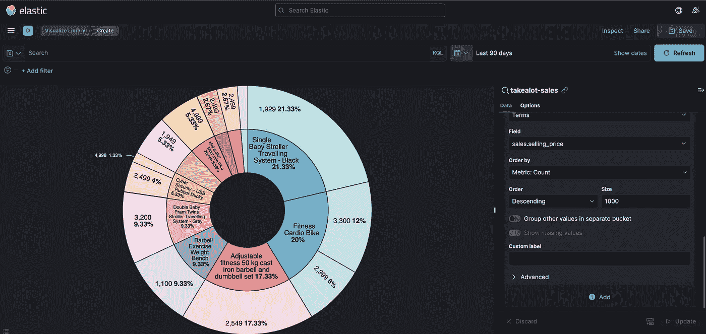

## 4 日——我们每天的最低、平均和最高销售额是多少？

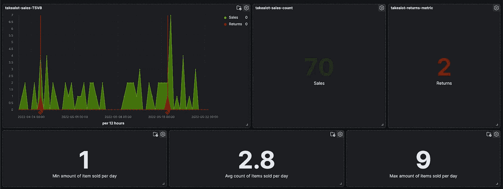

## 第五，有了足够的数据，我们可以建立一个异常检测作业，它将从我们的销售模式中学习，并能够预测每种产品的销售或退货😎

这是我们销售模式的异常检测作业的配置。这是按产品细分的 ***事件率*** 计数。我们从产品在我们的时间序列日志中出现的频率来看，一次出现就是一次销售。选择你的影响者领域— **非常重要的**，这里你要定义是什么让异常成为异常。在我们的例子中，它是产品的标题，因为我们的工作是基于按产品标题分解的事件率。

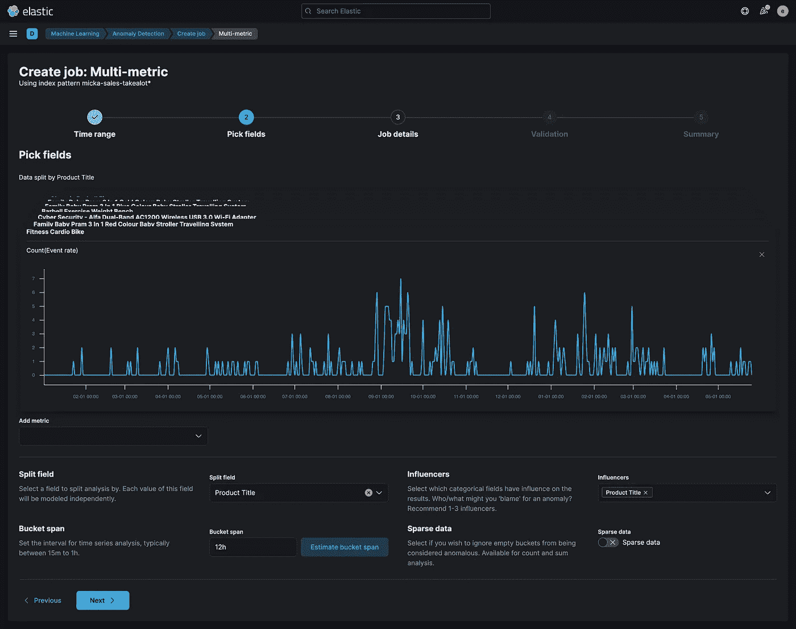

这项工作已经过分析，可以开始工作了。灰色区域是 ***下层*** 和 ***上层*** 学习模型。它越接近行数，模型就越好，越精确。它越宽，模型越不精确。我们还没有一个非常好的模型…但是我们至少在这个练习中有了一个。我将用这个数据集解释红色异常背后的原因。

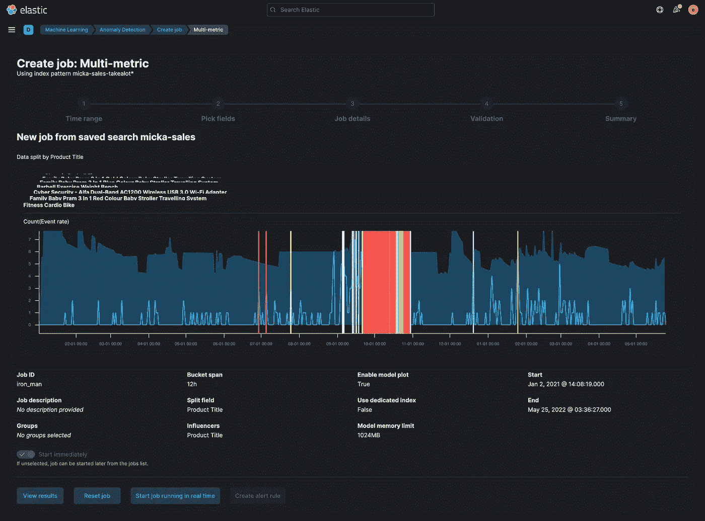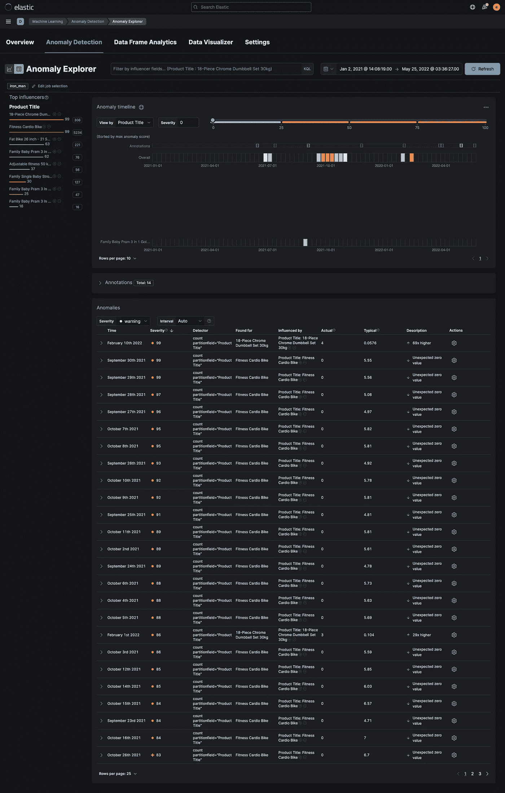

我们的模型检测到“健身有氧健身车”这款产品的 ***销售额异常低*** ，原因是在此期间，该产品因产品图像增强而被禁用，因此无法销售。

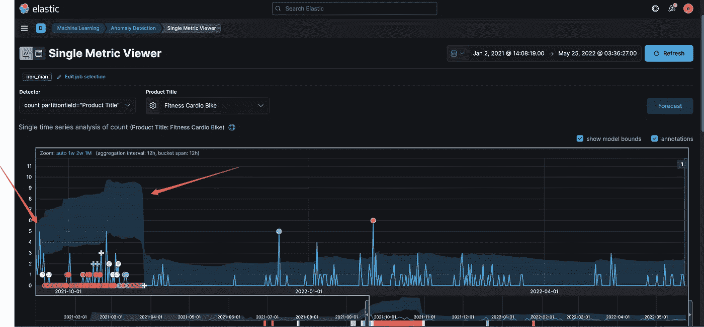

检测到异常—销售数量减少

我们可以清楚地看到，我们的模型预期销售额在 3 到 9 之间，但收到的远低于这个数字。

现在，让我们预测未来 7 天(一周)每件产品的销售额

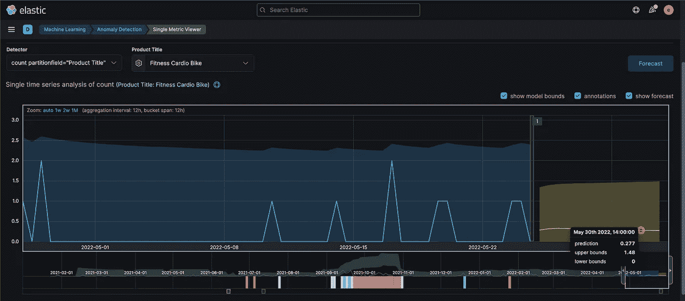

据此，我们有 0.277 (27%)的几率在 2022 年 5 月 30 日至少卖出一辆“健身车”，在 5 月 31 日卖出 75%，如下所示:

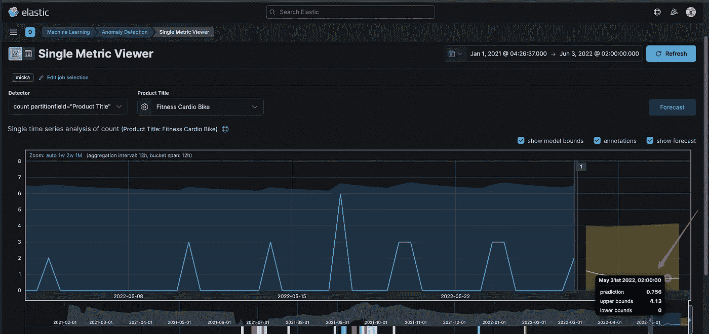

2022 年 5 月 30 日和 31 日的销售数字显示了预测产品“健身有氧健身车”的两项销售记录:

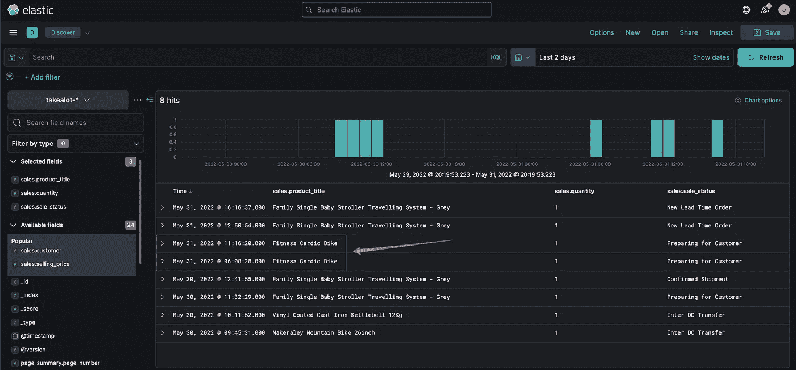

2022 年 5 月 30 日至 31 日销售

这是一种不同的产品，预计在未来 7 天内销售，5 月 30 日的销售概率为 91%:

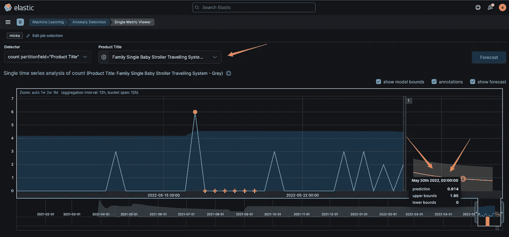

这些日期的销售结果:

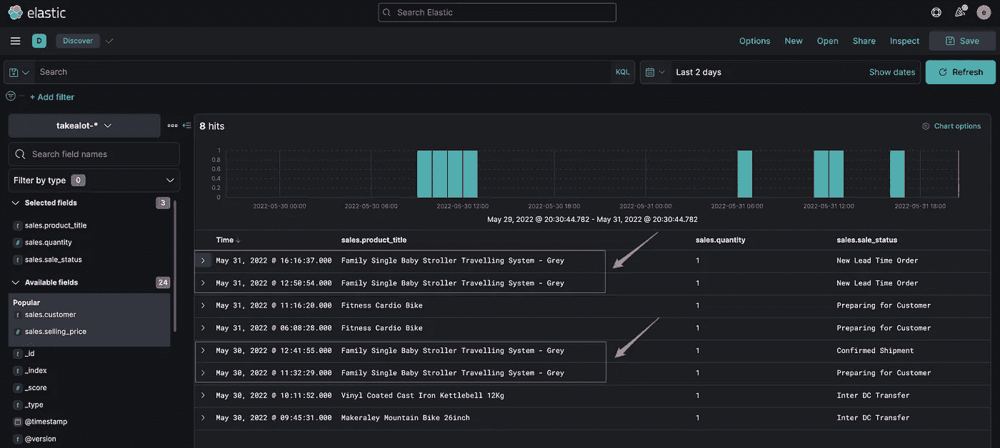

那么为什么这很重要呢？如果我们能够在一定程度上准确预测哪种商品将在何时出售，那么我们就知道应该储备哪些产品，投资哪些产品，从而使我们的业务更加有利可图。

# 结论:

我们已经建立了一个近乎实时的分析平台，该平台不断地从我们的数据源中提取数据，以动态地回答我们的问题，而不是作为一些批处理作业或任何手动干预—该工作流是自动化的，我们所做的只是随意可视化我们的仪表盘和模型。

米卡·卢博亚