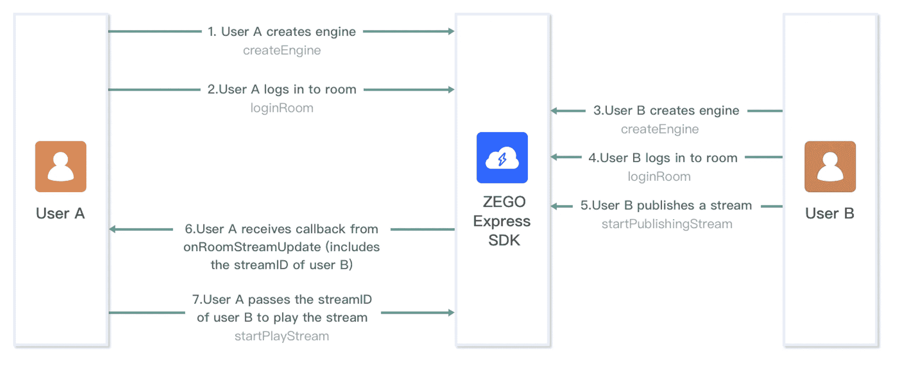
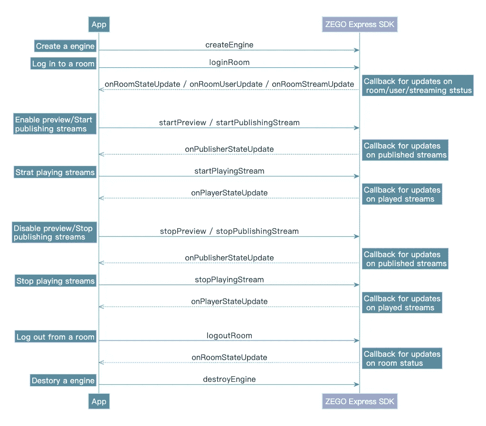

# 如何搭建流媒体直播 app？

> 原文：<https://medium.com/codex/build-a-live-streaming-app-91de942d266e?source=collection_archive---------12----------------------->

## 本文解释了不同领域的直播应用程序的功能，以及如何使用 SDK 构建直播应用程序


## 什么是流媒体直播 App？

直播技术允许您实时广播、观看、创建和共享视频。你只需要一个支持互联网的设备，如智能手机或平板电脑，以及一个直播平台(如网站或应用程序)就可以进行直播。

鉴于这一趋势在许多领域带来的巨大机遇，直播应用正在快速发展。根据不同的领域，构建直播应用程序的基本要求有如下不同:

1.  **游戏直播 app** —画面必须清晰流畅才能构造一个游戏直播 app。
2.  **娱乐直播应用** —构建一个娱乐应用需要各种互动功能，如礼物、弹幕和小游戏。
3.  **购物直播 app** —必须提供购物车、直播回放等功能。
4.  **体育直播 app** —需要保证画面清晰流畅，并提供多种分辨率供用户选择。
5.  **教育直播应用** —交互式白板、文件共享、屏幕共享和其他功能对于向学生提供最佳教学体验至关重要。

## 直播应用程序的必备功能

尽管存在差异，但所有直播应用都应该具备一些标准功能，例如:

*   **客户端加入/登录** —一个简单的注册结构，供客户端记录并使用认证登录到应用程序。
*   **搜索** —一个搜索框，允许用户按主题、受欢迎程度、趋势、频道、位置或兴趣搜索内容。
*   **客户资料** —向同伴和订阅者展示客户的数据和资料图片。
*   **实时流媒体** —该应用的核心允许客户端录制实时流媒体，并与订阅其频道的个人或公众进行交流。
*   **聊天** —增加聊天功能，帮助主持人与观众实时交流。

构建不同领域的直播应用程序需要集成一些独特的功能。相关的例子有:

*   **屏幕分享** —对于一个游戏直播 app 来说，你必须通过屏幕分享功能将游戏屏幕分享给观众。
*   **主持人 PK** —娱乐直播应用所需。通过主播之间的 PK，可以丰富直播 app 的内容，通过送礼物提升观众的热情。
*   **购物车** —直播购物流媒体应用程序为观众提供了一个购物入口，观众可以直接在直播房间下单和购买产品。
*   **共享白板或文件** —教育直播 app 必须共享各种教学课件，所以提供共享白板、传输文件等功能来丰富教学形式是很有必要的。

## 什么是直播流 SDK？

流媒体直播应用程序很复杂，尤其是如果每个功能都是自开发的。它需要庞大的技术团队，消耗大量的人力和财力。

许多公司将直播应用的标准功能封装到 SDK 中，因此，开发直播应用只需专注于业务交互开发。

这些功能包括:

*   [**Express SDK**](https://www.zegocloud.com/product/live-streaming?_source=medium&article=26) —音视频传输服务 SDK 封装了音视频采集、预处理、编码、传输、解码、渲染等。
*   [**ZIM SDK**](https://www.zegocloud.com/product/in-app-chat?_source=medium&article=26) —消息通信 SDK，封装了文本消息、图片消息、视频消息等消息的传输和广播，通知能力。
*   [**SuperBoard SDK**](https://www.zegocloud.com/product/super-board?_source=medium&article=26)—封装交互式白板、文件管理、文件渲染等功能。
*   [**RoomKit SDK**](https://www.zegocloud.com/solutions/education?_source=medium&article=26) —封装了一个完整的教育场景，包括音视频通话、弹幕消息、共享白板、共享文件、设备管理、学生管理等教学场景逻辑。

## 构建直播应用程序的步骤

## 先决条件

开始之前，请确保完成以下步骤:

*   在 [ZEGOCLOUD 控制台](https://console.zegocloud.com?_source=medium&article=26)中创建一个项目，并获取项目的 AppID。
*   ZEGO Express SDK 已经集成到项目中。详见[集成](https://docs.zegocloud.com/article/7942?_source=medium&article=26)。

## 实现进程

下图是用户 A 播放用户 B 发布的流的基本过程:



以下部分将更详细地解释该过程的每个步骤。

## 创建 ZegoExpressEngine 实例

要创建`ZegoExpressEngine`类的单例实例，用项目的 **AppID** 调用`createEngine`方法。

## 登录到房间

要登录到一个房间，调用`loginRoom`方法。

然后，为了侦听和处理登录到房间后可能发生的各种事件，您可以根据需要实现事件处理程序的相应事件回调方法。以下是一些与房间用户和流相关的常见事件回调:

## 开始本地视频预览

要开始本地视频预览，调用`startPreview`方法，将用于呈现本地视频的视图传递给`canvas`参数。

您可以使用`SurfaceView`、`TextureView`或`SurfaceTexture`来渲染视频。

## 发布流

要开始向远程用户发布本地音频或视频流，调用`startPublishingStream`方法，并将相应的流 ID 传递给`streamID`参数。

然后，为了侦听和处理流发布开始后可能发生的各种事件，您可以根据需要实现事件处理程序的相应事件回调方法。以下是与流发布相关的常见事件回调:

## 播放流

要开始播放远程音频或视频流，调用`startPlayingStream`方法，将相应的流 ID 传递给`streamID`参数，并将用于呈现视频的视图传递给`canvas`参数。

您可以通过回调`onRoomStreamUpdate`获得房间内其他用户发布的流的流 id。

您可以使用`SurfaceView`、`TextureView`或`SurfaceTexture`来渲染视频。

## 停止发布和播放流

要停止向远程用户发布本地音频或视频流，请调用`stopPublishingStream`方法。

如果启动了本地视频预览，根据需要调用`stopPreview`方法将其停止。

要停止播放远程音频或视频流，调用`stopPlayingStream`方法，将相应的流 ID 传递给`streamID`参数。

## 注销房间

要退出一个房间，调用`logoutRoom`方法，将相应的房间 ID 传递给`roomID`参数。

## 销毁`ZegoExpressEngine`实例

要销毁`ZegoExpressEngine`实例并释放它所占用的资源，调用`destroyEngine`方法。

## API 调用序列图

下图显示了流发布和播放过程的 API 调用顺序:



[在 ZEGOCLOUD 注册](https://console.zegocloud.com/account/signup?_source=medium&article=26)，每月免费获得**10000 分钟**。

# 你知道吗？👏

```
You can give up to **50 Claps** for an article?**Tap and hold the clap button** for a few seconds.**Follow me** to learn more technical knowledge.Thank you for reading :)
```

## 了解更多信息

这是现场技术文章之一。欢迎阅读其他文章:

[](https://faun.pub/how-to-build-an-android-video-call-app-with-firebase-realtime-database-af76c2b202d9) [## 如何使用 firebase 实时数据库构建 Android 视频通话应用程序

### 本文将帮助您快速构建一个视频/音频通话应用程序

faun.pub](https://faun.pub/how-to-build-an-android-video-call-app-with-firebase-realtime-database-af76c2b202d9) [](https://faun.pub/how-to-build-a-clubhouse-clone-app-with-android-and-zegocloud-a-social-audio-app-development-cb4059e361b0) [## 如何用 Android 和 ZEGOCLOUD 构建一个俱乐部会所克隆应用——一个社交音频应用开发

### 本文解释了如何使用 ZEGOCLOUD ZEGOLiveAudioRoom SDK 快速克隆一个俱乐部应用程序

faun.pub](https://faun.pub/how-to-build-a-clubhouse-clone-app-with-android-and-zegocloud-a-social-audio-app-development-cb4059e361b0) [](https://faun.pub/using-ios-callkit-7ffd260e80d4) [## 如何用 iOS CallKit 和 ZEGOCLOUD 实现一个视频通话 app

faun.pub](https://faun.pub/using-ios-callkit-7ffd260e80d4) [](https://faun.pub/super-live-chat-136dfa19f96f) [## 如何实现超级实时聊天:你应该知道的 3 种方法

faun.pub](https://faun.pub/super-live-chat-136dfa19f96f)