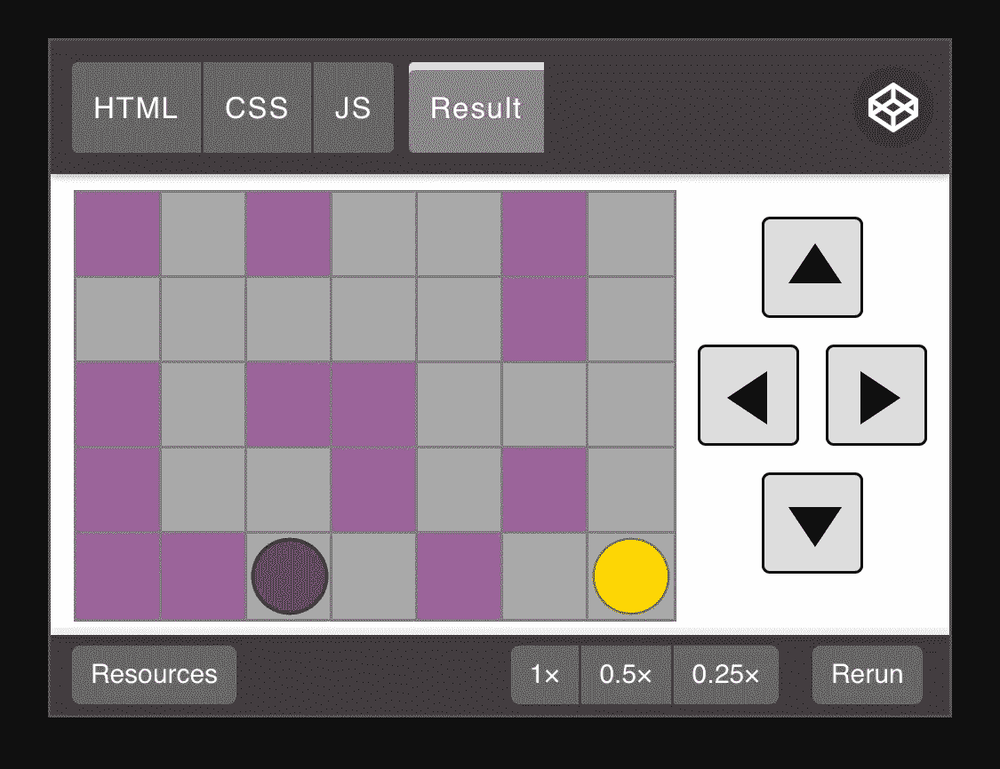

# 用普通 JavaScript 构建一个迷宫游戏，第 2 部分

> 原文：<https://medium.com/codex/build-a-maze-game-with-vanilla-javascript-part-2-of-2-41f44a040f45?source=collection_archive---------2----------------------->

欢迎来到本教程系列的第 2 部分，用 JavaScript、HTML 和 CSS 构建迷宫游戏！

如果您还没有尝试过[第 1 部分](/codex/build-a-maze-game-with-vanilla-javascript-part-1-of-2-ddfd35e84e93?source=friends_link&sk=74dd69bb6ed61fa4156fb29795824620)，您可以先尝试一下，或者从 [Github](https://github.com/nevkatz/js-maze-game-1) 下载教程代码，然后从`mg1-one-level-keyboard`开始浏览教程目录，其中包含了第 1 部分的最终版本。