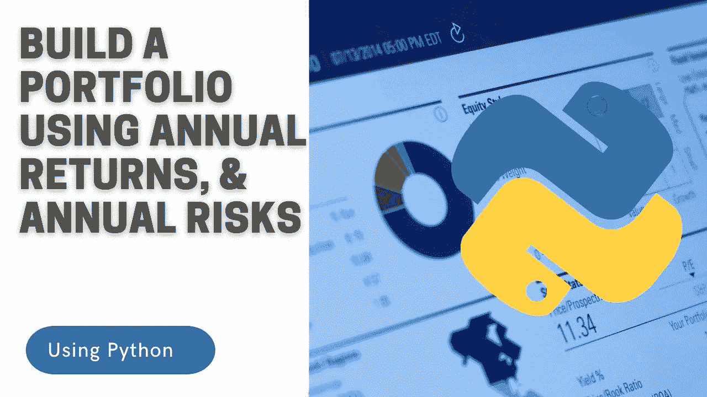

# 使用年度回报、年度风险和 Python 构建投资组合

> 原文：<https://medium.com/codex/build-a-portfolio-using-annual-returns-annual-risks-python-e4726b9bf2af?source=collection_archive---------6----------------------->

使用 python，使用风险和年化回报来构建您的投资组合

***免责声明:*** *本文材料纯属教育性质，不应作为专业投资建议。自行决定投资。本帖部分外部链接为附属链接。*