# 用 Sendbird UIKit 构建 React 聊天应用程序

> 原文：<https://medium.com/codex/build-a-react-chat-app-with-sendbird-uikit-af380eb07c49?source=collection_archive---------9----------------------->

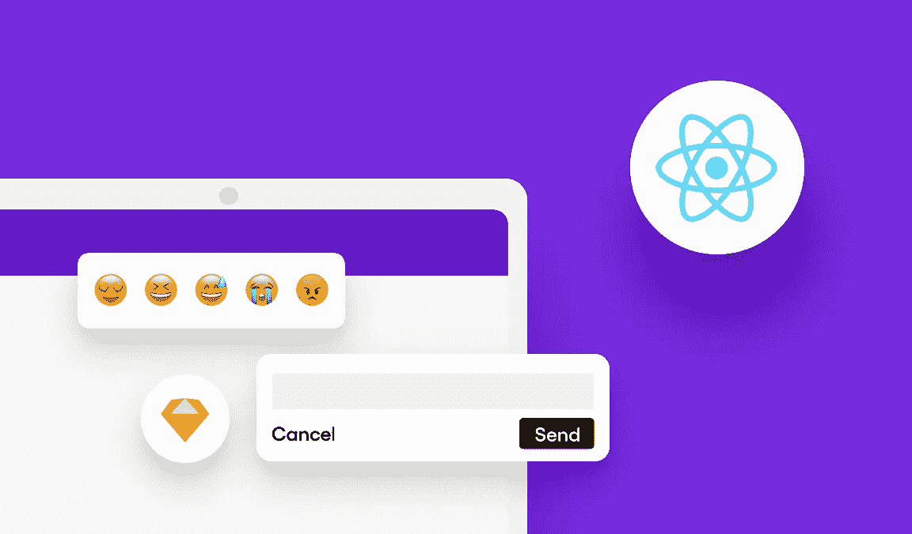

埃里克·金
解决方案工程师| [仙鸟](https://www.sendbird.com)

*你可能会发现查看 React 聊天工具包* [*样本代码*](https://github.com/sendbird/sendbird-uikit-react) *很有用。如果您需要其他指导，请参见应用内聊天的* [*文档*](https://sendbird.com/docs/uikit/v1/react/quickstart/send-first-message) *或* [*演示*](https://sendbird.com/demos/in-app-chat) *。在本页* *找到更多关于 UIKit* [*的细节。*](https://sendbird.com/features/chat-messaging/uikit)

*我们的* [*开发者门户*](https://sendbird.com/developer) *拥有丰富的教程、示例代码、演示和其他资源，可以帮助您踏上编码之旅。一定要去看看！*

# 介绍

本入门指南使用了[**Sendbird UIKit**](https://sendbird.com/blog/introducing-sendbird-uikit-get-chat-running-in-minutes)，这是一套丰富的预建 UI 组件，您可以使用它在 10 分钟内在您的应用程序中创建现代 messenger 体验。你也可以使用[**send bird Chat SDK**](https://sendbird.com/docs/chat)和你自己定制的 UI。

要发送您的第一封邮件，您需要:

1.  创建一个 Sendbird 帐户，并在 Sendbird 环境中添加聊天用户
2.  导入 Sendbird UIKit 依赖项，并将 Sendbird UIKit 组件集成到您的应用程序中

本指南将详细介绍这两个步骤，适用于任何熟练程度的开发人员，以便他们可以轻松地在应用程序中发送第一条消息。在本教程中，我们将介绍如何:

*   创建一个 Sendbird 帐户
*   在 Sendbird 仪表板中创建用户
*   添加 UIKit 依赖项
*   将 UIKit 连接到您的应用程序
*   测试集成

我们开始吧！

# 第一步。创建 Sendbird 帐户

1.1 注册一个免费的 [**Sendbird 账号。**](https://dashboard.sendbird.com/auth/signup)

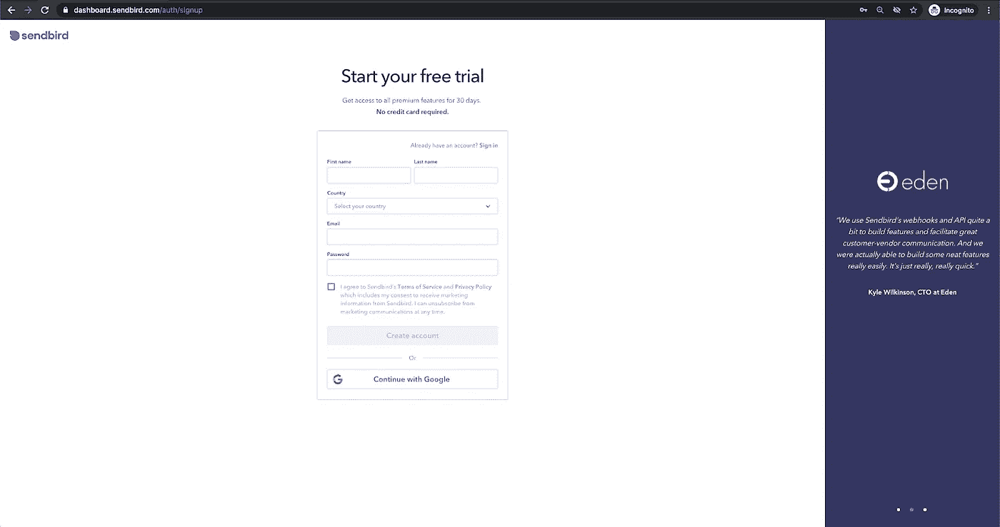

Sendbird 的注册屏幕

1.2.使用您的电子邮件地址创建一个帐户，或者单击**继续使用 Google** 。

1.3.通过填写**组织名称**和**电话号码**字段来建立您的组织。

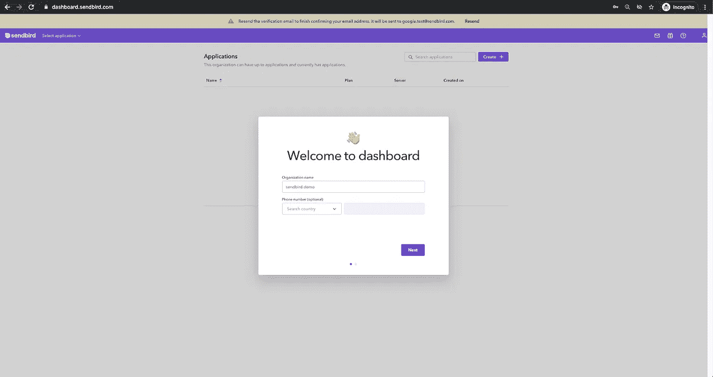

设置您的组织

1.4.选择**产品类型**并输入**应用程序名称**、**区域**后，创建您的 Sendbird 应用程序。

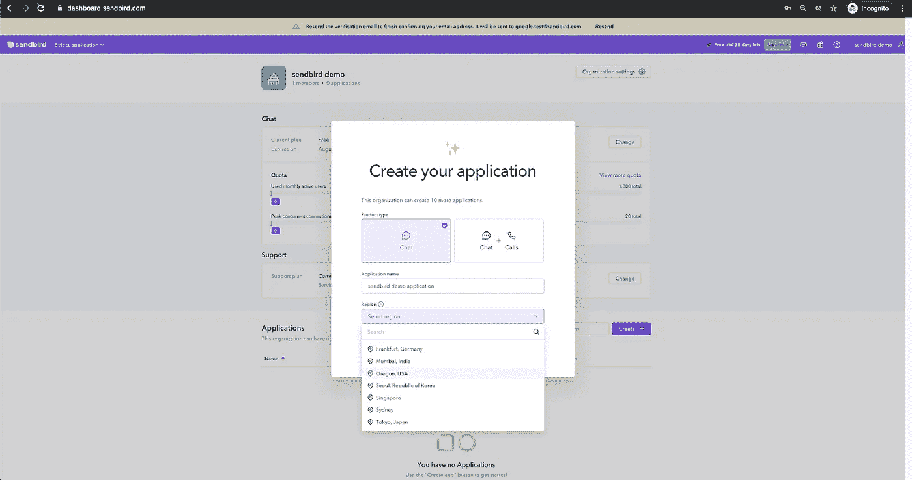

创建您的 Sendbird 应用程序

1.5.您将被引导到 Sendbird 仪表板的主页，开始在您的产品中实现 Sendbird Chat SDK 和 API。

1.6.从应用程序部分复制您唯一的**应用程序 ID** ，并将其粘贴到您的剪贴板中。

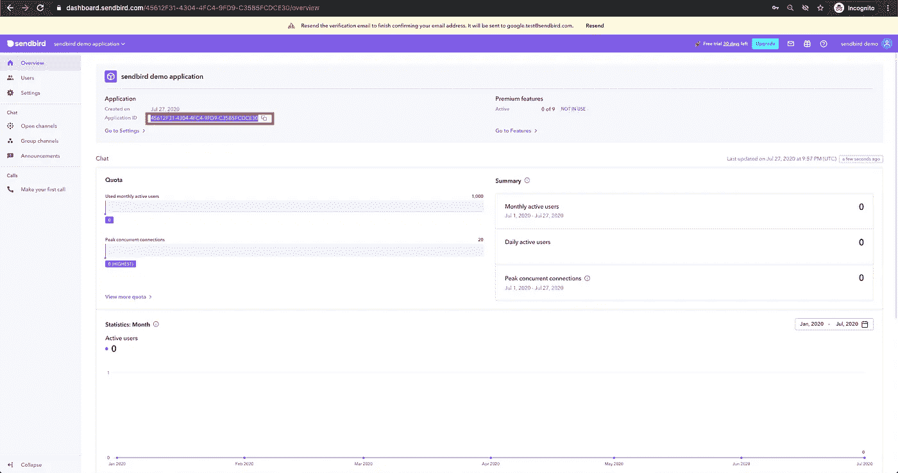

复制您的 Sendbird 应用程序 ID

# 第二步。在 Sendbird 仪表板中创建用户

2.1.导航到仪表板左侧导航中的用户部分。

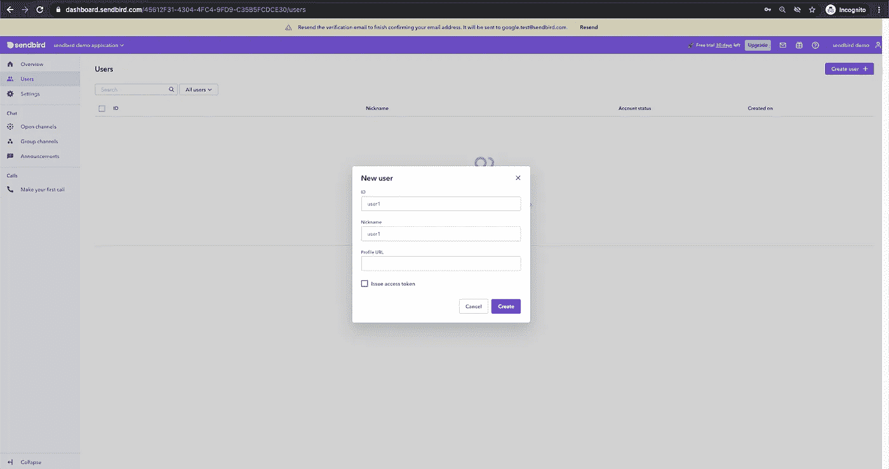

在 Sendbird 仪表板中创建用户

2.2.点击右上角的**创建用户+** 图标。

2.3.通过填写以下字段来创建新用户:

*   **ID**
*   **昵称**
*   **个人资料网址** —可选
*   **发布访问令牌** —可选

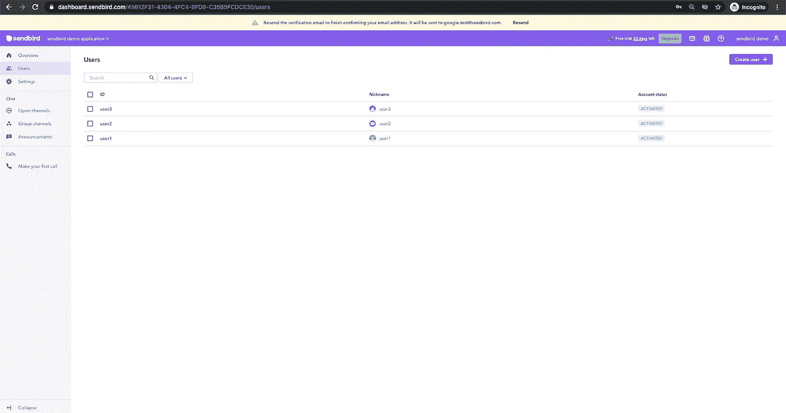

Sendbird 仪表板中的用户

在您的应用程序中至少创建两个用户，以便他们可以互相聊天。

# 第三步。添加 Sendbird UIKit 依赖项

我们将使用一个名为[**code sandbox . io**](http://codesandbox.io/)**的在线集成开发环境(IDE)来模拟您的开发环境，但是您可以随意开始直接向您的应用程序添加 Sendbird UIKit 依赖项。**

**3.1.设置环境。**

**3.1.1.你也可以进入[**code sandbox . io**](http://codesandbox.io/)**>点击**创建沙箱** >选择**反应**。****

****运筹学****

****如果您在应用程序中构建聊天，请运行以下代码来安装 sendbird-uikit。****

****`npm install sendbird-uikit --save`****

****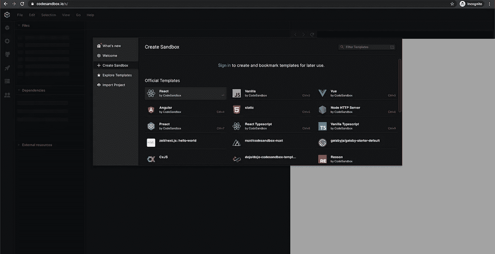****

****3.1.2.您将看到 3 个默认文件: **App.js** 、 **index.css** 和 **style.css** 。****

****App.js****

****索引. js****

****Style.css****

****3.2.导入 sendbird-uikit 依赖项。****

****3.2.1.点击**添加依赖关系**。****

****3.3.2.搜索 **sendbird-uikit** 。****

****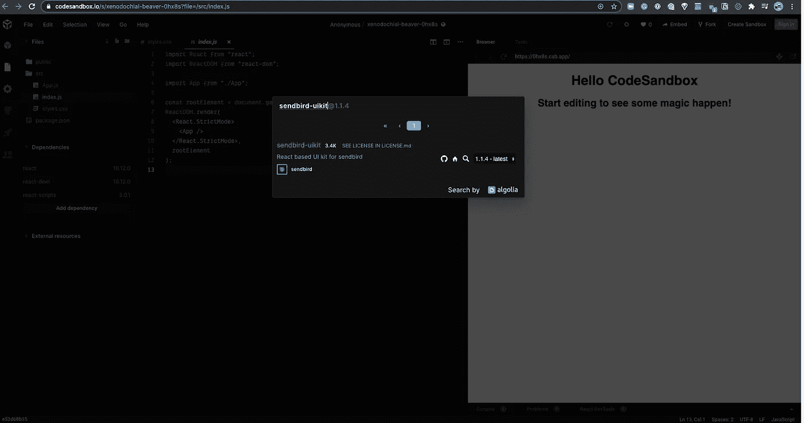****

****添加 Sendbird UIKit 依赖项****

****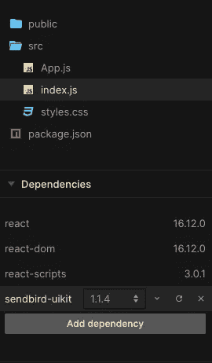****

****Sendbird UIKit 依赖项已连接****

****3.3.导入 sendbird-uikit 组件。****

****3.3.1.在 **App.js** 中，添加以下代码:****

****`import { App as SendbirdApp } from 'sendbird-uikit'
import "sendbird-uikit/dist/index.css";`****

# ****第四步。将 Sendbird UIKit 连接到您的应用程序并创建一个用户****

****4.1.在 **App.js** 文件中添加以下代码。****

****这将为 **applicationID** 和 **userID** 创建变量，并传递给 sendbird-uikit 组件。****

*   ****在仪表板中传递您之前创建的 Sendbird 应用程序的 **applicationID** ，以初始化 Sendbird Chat SDK。****
*   ****注意—您的**应用程序 ID** 看起来将与此类似:45612 f31–4304–4fc 4–9fd 9-c 35 b5 fcd ce 30****

****`const APP_ID = "Your APP ID"
const USER_ID = "Any User ID"`****

****4.2.填充频道列表和频道视图。****

*   ****将以下代码添加到 **App.js** 中。****

*   ****对于样式，在 **style.css** 中添加以下代码。****

****`height: 100vh;`****

# ****第五步。测试您的集成****

*   ****如果您在[**code sandbox . io**](http://codesandbox.io/)环境中工作，您的代码应该会自动编译并为您运行。****
*   ****如果您在本地应用程序中工作，您将需要运行 npm 命令。****

****`npm start run`****

****5.1.创建一个渠道。****

****您现在可以在您的应用程序中创建一个供用户聊天的频道。****

*   ****单击视图左侧的“+”按钮创建群组频道。****
*   ****邀请用户加入频道。****

****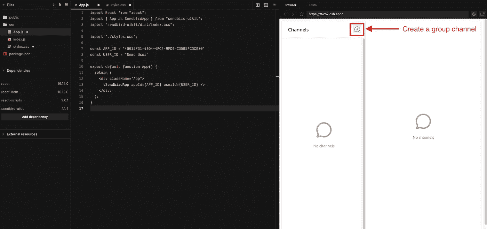****

****创建一个频道****

****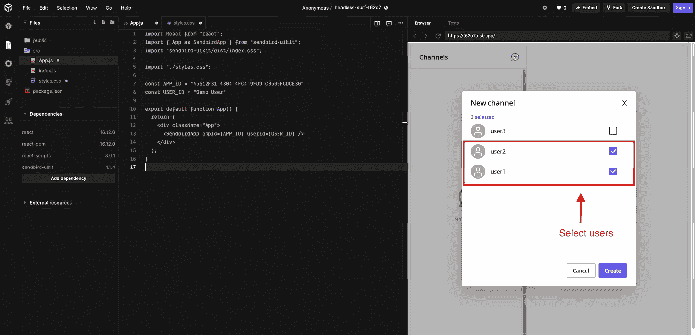****

****将用户添加到频道****

********

****打开频道****

****5.2.发送您的第一条消息。****

****试着输入一条信息，然后点击发送。您应该能够在应用程序中新建的聊天中成功发送您的第一条消息。****

****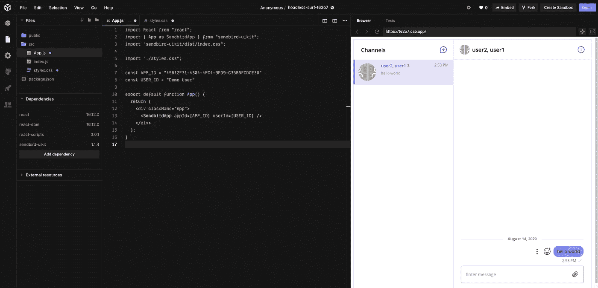****

****发送您的第一条消息****

# ****恭喜你！****

****您已经准备好使用 Sendbird UIKit 在您的应用程序中发送和接收消息了。****

****关于 UIKit、JavaScript SDK 和特性的更多信息，请查看我们的 [**文档**](https://docs.sendbird.com/javascript/ui_kit_getting_started) 。****

****这就是在您的应用程序中启动和运行聊天是多么容易。如果你也在为移动设备开发，用 Sendbird UIKit 为安卓系统发送你的第一条消息。****

****我们支持你，因为你创造了伟大的东西。****

****开心聊楼！💻****